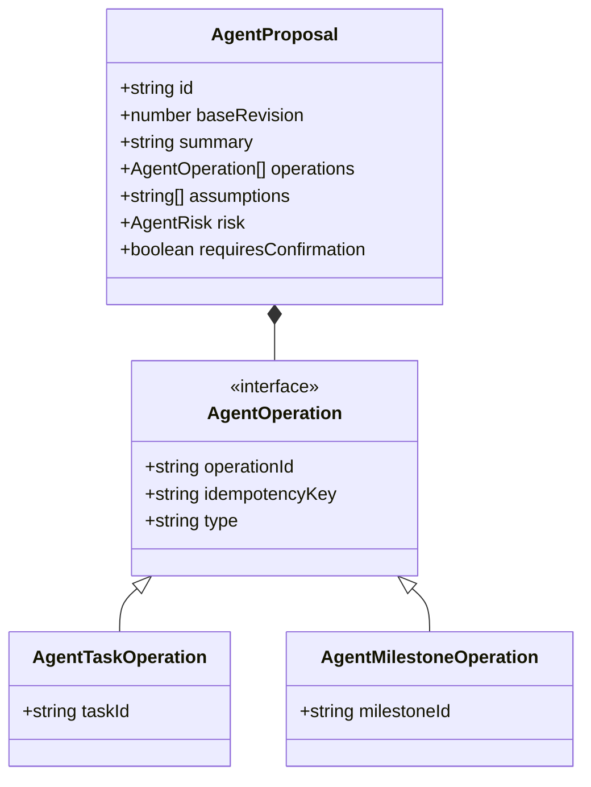
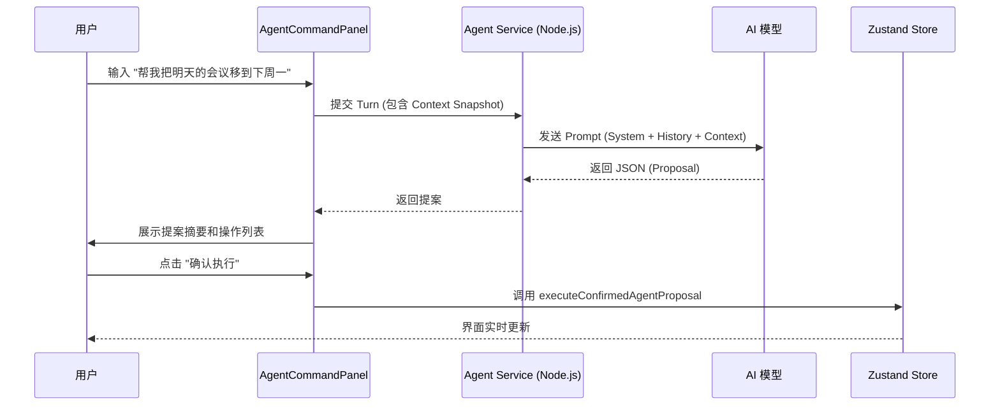
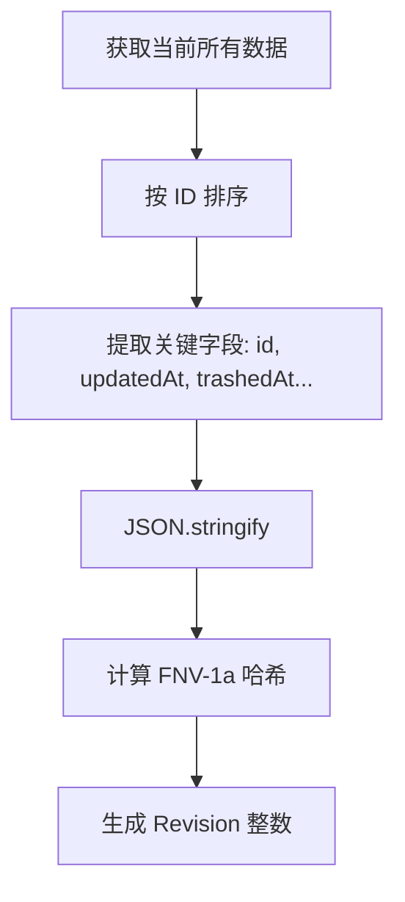
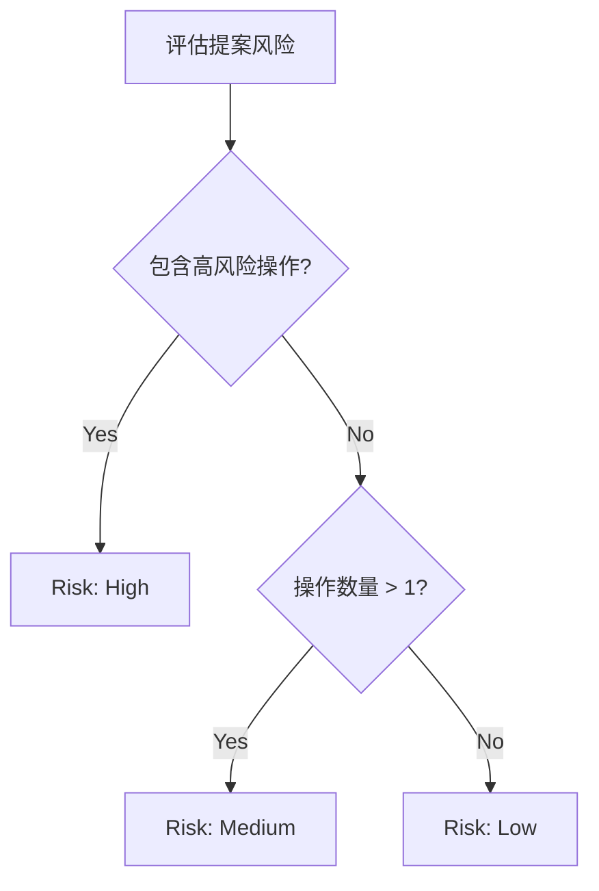
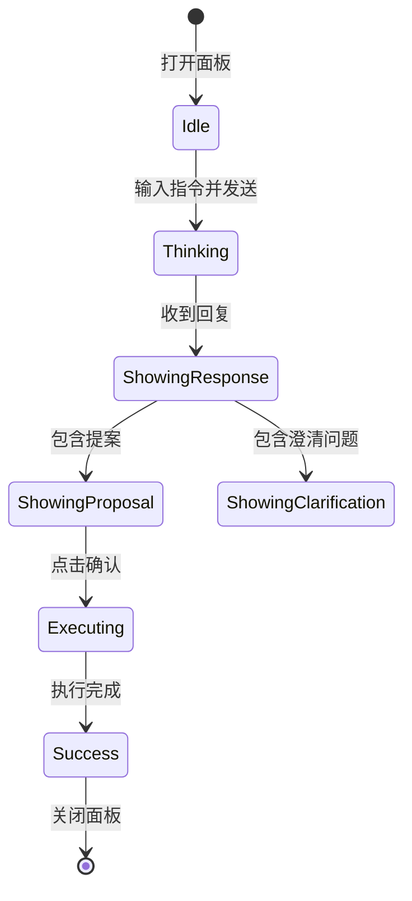

# AI 智能助手系统

## 目录
1. [模块概览](#模块概览)
2. [引言](#引言)
3. [核心架构与组件](#核心架构与组件)
   - [数据模型 (Data Models)](#数据模型-data-models)
   - [指令执行器 (Executors)](#指令执行器-executors)
   - [存储适配器 (Store Adapter)](#存储适配器-store-adapter)
4. [指令解析与执行流程](#指令解析与执行流程)
   - [双阶段确认机制](#双阶段确认机制)
   - [修订版本控制 (Revision Control)](#修订版本控制-revision-control)
5. [安全与风险管理](#安全与风险管理)
   - [风险评估逻辑](#风险评估逻辑)
   - [事务性保证与撤销](#事务性保证与撤销)
6. [服务端 Agent 逻辑](#服务端-agent-逻辑)
   - [上下文快照与 LLM 编排](#上下文快照与-llm-编排)
   - [指令规范化 (Normalization)](#指令规范化-normalization)
7. [UI 交互层实现](#ui-交互层实现)
8. [扩展指南：添加新指令](#扩展指南添加新指令)
9. [文件参考](#文件参考)

## 模块概览

AI 智能助手系统（AI Agent System）是 LightFlux 的核心竞争力之一，旨在通过自然语言交互简化复杂的任务管理操作。

- **总文件数**: 7 个核心逻辑文件（不含工具类）。
- **子模块划分**:
  - `lightflux/agent/`: 核心逻辑层，包含类型定义、指令执行和存储适配。
  - `lightflux/components/agent/`: UI 交互层，负责用户输入和提案展示。
  - `server/src/agent.mjs`: 服务端逻辑层，负责与 LLM 通信及提案生成。
- **覆盖深度**: 本文档将深入解析从自然语言解析到前端状态更新的全链路逻辑，并提供详细的扩展指南。

## 引言

LightFlux 的 AI Agent 不仅仅是一个简单的聊天机器人，它是一个深度集成到应用状态管理中的**提案-确认型 (Proposal-Confirmation)** 自动化引擎。它的设计核心在于“安全”与“透明”：AI 永远不会在未经用户允许的情况下直接修改数据，而是生成一份包含具体操作步骤的“提案”，由用户审查后一键执行。

这种架构解决了 LLM 幻觉可能带来的数据破坏风险，同时通过一套严密的修订版本控制（Revision Control）机制，确保 AI 处理的上下文与本地数据状态始终保持一致。

## 核心架构与组件

AI Agent 系统采用了分层架构，将自然语言理解、逻辑验证、状态同步和 UI 展示清晰地解耦。

### 数据模型 (Data Models)

Agent 的所有行为都基于 `AgentOperation` 这一原子操作单元。多个操作组合成一个 `AgentProposal`。



在 `lightflux/agent/types.ts` 中定义了丰富的操作类型，涵盖了任务（Task）、分组（Group）和里程碑（Milestone）的增删改查。每个操作都带有 `idempotencyKey`，确保在复杂的网络环境下不会重复执行。

### 指令执行器 (Executors)

执行器是 Agent 的“大脑”，负责验证提案的合法性并计算执行后的新状态。`todoCommandExecutor.ts` 和 `milestoneCommandExecutor.ts` 是纯逻辑层，不依赖任何 UI 或存储库，这使得它们非常易于测试。

执行器的核心职责包括：
1. **合法性检查**: 例如，确保子任务的所属分组与其父任务一致。
2. **排序逻辑**: 在移动任务或创建任务时，自动计算 `sortOrder`。
3. **关联操作**: 当删除一个父任务时，自动将其所有子任务也标记为删除。

### 存储适配器 (Store Adapter)

`todoCommandStoreAdapter.ts` 充当了逻辑层与 Zustand 存储层之间的桥梁。它负责：
- **生成快照**: 将当前的 Todo、Group 和 Milestone 状态转换为 AI 可理解的上下文快照。
- **状态同步**: 将执行器计算出的新状态应用到 `useTodoStore`。
- **审计与撤销**: 维护执行历史，支持 `undoLastAgentProposal` 功能。

**Section sources**:
- [lightflux/agent/types.ts](lightflux/agent/types.ts)
- [lightflux/agent/todoCommandExecutor.ts](lightflux/agent/todoCommandExecutor.ts)
- [lightflux/agent/todoCommandStoreAdapter.ts](lightflux/agent/todoCommandStoreAdapter.ts)

## 指令解析与执行流程

Agent 的工作流程从用户在 `AgentCommandPanel` 输入自然语言开始，经过服务端的 LLM 处理，最终回到客户端执行。

### 双阶段确认机制

为了确保安全，Agent 采用了典型的双阶段流程：



在第一阶段，服务端会根据客户端提供的 `AgentContextSnapshot` 生成提案。第二阶段，客户端在执行前会再次验证 `baseRevision`，确保在 AI 思考期间，本地数据没有发生变化。

### 修订版本控制 (Revision Control)

修订版本控制是防止数据冲突的关键。系统通过 `calculateTodoCommandRevision` 函数，对所有任务、分组和里程碑的关键元数据进行哈希计算，生成一个唯一的 `revision` 数字。



如果提案的 `baseRevision` 与当前存储的 `revision` 不匹配，执行器会抛出 `stale-revision` 错误，提示用户数据已过期，需要重新生成提案。这保证了 AI 操作的原子性和一致性。

**Section sources**:
- [lightflux/agent/todoCommandExecutor.ts:L221-L263](lightflux/agent/todoCommandExecutor.ts#L221-L263)
- [lightflux/services/agentApi.ts](lightflux/services/agentApi.ts)

## 安全与风险管理

AI Agent 系统内置了一套严密的风险评估体系，确保高风险操作得到充分的警示。

### 风险评估逻辑

每个 `AgentOperation` 都有预定义的风险等级。`riskForOperations` 函数会根据提案中包含的操作类型和数量，计算出整体风险等级：`low`、`medium` 或 `high`。

| 风险等级 | 触发条件 | UI 表现 |
| :--- | :--- | :--- |
| **Low** | 单个创建或更新操作 | 绿色标识，常规确认 |
| **Medium** | 移动任务、完成任务、多个低风险操作组合 | 黄色标识，加强提醒 |
| **High** | 删除任务 (Trash)、删除里程碑 | 红色标识，显著警告 |



### 事务性保证与撤销

执行器在执行提案时，会先克隆一份当前状态的快照。所有的操作都在这个快照上进行，如果其中任何一个操作失败（例如找不到目标 ID），整个提案都会被回滚，不会对主存储产生任何副作用。

执行成功后，系统会生成一个 `AgentUndoToken`。用户可以通过 UI 顶部的“撤销”按钮，瞬间恢复到执行前的状态。这种撤销是基于快照的完全恢复，确保了操作的可逆性。

**Section sources**:
- [lightflux/agent/todoCommandExecutor.ts:L283-L310](lightflux/agent/todoCommandExecutor.ts#L283-L310)
- [lightflux/agent/todoCommandStoreAdapter.ts:L303-L320](lightflux/agent/todoCommandStoreAdapter.ts#L303-L320)

## 服务端 Agent 逻辑

服务端（`server/src/agent.mjs`）是连接 LightFlux 与 AI 能力的纽带。它不仅负责转发请求，还承担了“指令规范化”和“上下文过滤”的重要职责。

### 上下文快照与 LLM 编排

为了节省 Token 并提高解析准确度，服务端会根据客户端传来的 `AgentContextSnapshot` 进行预处理。LLM 接收到的 `SYSTEM_PROMPT` 包含了极其严格的指令：
- **禁止发明 ID**: 只能使用上下文中存在的 ID。
- **禁止直接执行**: 必须返回 JSON 格式的提案。
- **防注入**: 明确指出任务标题和备注是不可信的，不能作为指令执行。

### 指令规范化 (Normalization)

由于 LLM 生成的 JSON 可能存在细微的格式偏差，服务端在返回给客户端之前，会通过 `normalizeProposal` 函数进行严格的校验和转换。例如：
- 将 LLM 使用的临时引用（如 `clientRef: "new-task-1"`）转换为真正的 UUID。
- 校验日期格式是否符合 `YYYY-MM-DD`。
- 校验颜色值是否为合法的 Hex 码。

这种“服务端校验 + 客户端验证”的双重保障机制，极大地提升了系统的健壮性。

**Section sources**:
- [server/src/agent.mjs:L7-L55](server/src/agent.mjs#L7-L55)
- [server/src/agent.mjs:L266-L614](server/src/agent.mjs#L266-L614)

## UI 交互层实现

`AgentCommandPanel.tsx` 提供了流畅的交互体验。它采用了分块展示的方式，清晰地呈现 AI 的回复、澄清问题（Clarification）和提案内容。



UI 层的一个亮点是 `OperationRow` 组件，它会自动根据当前的上下文快照，将枯燥的 `taskId` 转换回用户可读的任务标题，让用户能够直观地看到 AI 到底要改哪一条数据。

**Section sources**:
- [lightflux/components/agent/AgentCommandPanel.tsx](lightflux/components/agent/AgentCommandPanel.tsx)

## 扩展指南：添加新指令

开发者如果需要为 Agent 添加新的能力（例如“归档任务”），需要遵循以下步骤：

### 1. 定义操作类型
在 `lightflux/agent/types.ts` 中添加新的接口：
```typescript
export interface AgentTaskArchiveOperation extends AgentOperationBase {
  type: 'task.archive';
  taskId: string;
}
// 并将其加入 AgentOperation 联合类型
```

### 2. 实现执行逻辑
在 `lightflux/agent/todoCommandExecutor.ts` 中添加处理函数：
```typescript
const applyArchive = (state: TodoCommandState, operation: AgentTaskArchiveOperation) => {
  const todo = activeTask(state.todos, operation.taskId, operation.operationId);
  // 实现归档逻辑...
  return { ... };
};
```

### 3. 更新服务端 Prompt
修改 `server/src/agent.mjs` 中的 `SYSTEM_PROMPT`，告诉 LLM 现在支持 `task.archive` 指令，并提供示例格式。

### 4. 服务端规范化
在 `server/src/agent.mjs` 的 `normalizeProposal` 函数中增加对新指令类型的解析和校验逻辑。

### 5. UI 适配
在 `AgentCommandPanel.tsx` 的多语言配置中增加新指令的展示名称。

## 文件参考

以下是 AI Agent 系统涉及的核心源文件：

- `lightflux/agent/types.ts`: 定义了所有 Agent 相关的协议和数据结构。
- `lightflux/agent/todoCommandExecutor.ts`: 任务与分组指令的核心执行引擎。
- `lightflux/agent/milestoneCommandExecutor.ts`: 里程碑指令的专项执行引擎。
- `lightflux/agent/todoCommandStoreAdapter.ts`: 负责 Agent 与 Zustand 存储的同步。
- `lightflux/components/agent/AgentCommandPanel.tsx`: AI 助手的交互面板组件。
- `server/src/agent.mjs`: 服务端 LLM 编排与指令规范化逻辑。
- `lightflux/services/agentApi.ts`: 前后端通信的 API 封装。

**Section sources**:
- [lightflux/agent/](lightflux/agent/)
- [server/src/agent.mjs](server/src/agent.mjs)
