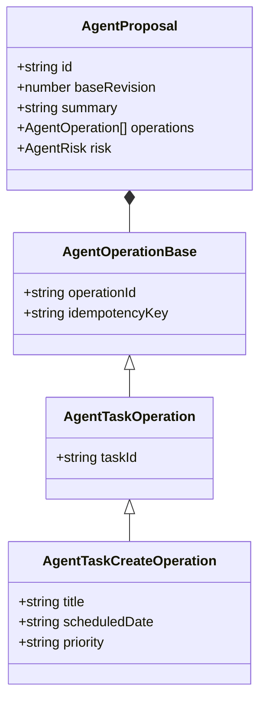
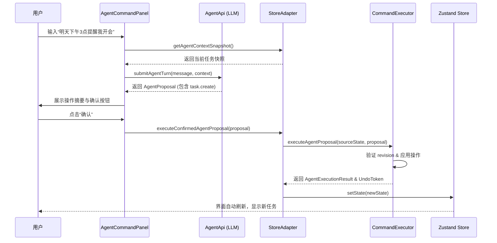
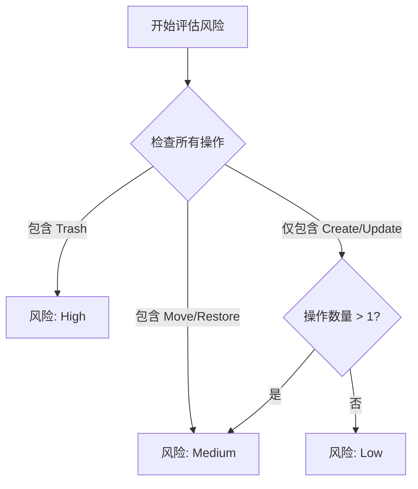
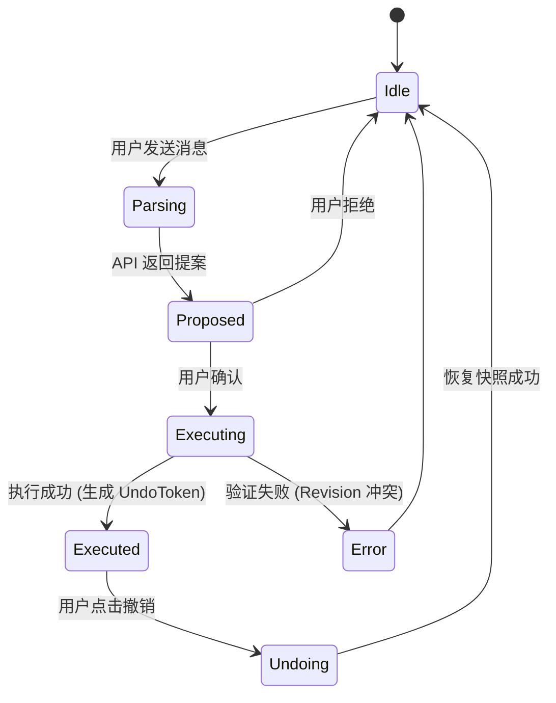

# Agent 核心原理与指令解析

## 目录
1. [模块概览](#模块概览)
2. [引言](#引言)
3. [指令模型 (Command Model)](#指令模型-command-model)
   - [AgentProposal：提案结构](#agentproposal提案结构)
   - [AgentOperation：原子操作定义](#agentoperation原子操作定义)
4. [核心组件](#核心组件)
   - [AgentCommandPanel：交互入口](#agentcommandpanel交互入口)
   - [TodoCommandExecutor：指令执行器](#todocommandexecutor指令执行器)
   - [TodoCommandStoreAdapter：状态适配层](#todocommandstoreadapter状态适配层)
5. [指令解析与执行全链路流程](#指令解析与执行全链路流程)
6. [风险控制与版本校验机制](#风险控制与版本校验机制)
   - [风险评估 (AgentRisk)](#风险评估-agentrisk)
   - [版本校验 (Revision Validation)](#版本校验-revision-validation)
7. [执行流控制与撤销机制](#执行流控制与撤销机制)
8. [文件参考](#文件参考)

## 模块概览

LightFlux AI Agent 模块是整个应用中智能化程度最高的部分，负责将用户的自然语言意图转化为精确的待办事项（Todo）和里程碑（Milestone）管理操作。该模块位于 `lightflux/agent` 目录下，并与 UI 层（`lightflux/components/agent`）和数据层（`lightflux/store`）紧密集成。

在本次探索中，我们识别并分析了以下核心文件：
- **总文件数**: 4 个核心逻辑文件 + 1 个 UI 组件文件 + 1 个 API 服务文件。
- **子模块**:
  - `lightflux/agent/`: 包含指令定义、执行逻辑和 Store 适配器。
  - `lightflux/components/agent/`: 包含用户交互面板。
  - `lightflux/services/`: 包含与远程 LLM 解析服务的通信逻辑。

我们将深入探讨指令从输入到执行的每一个环节，确保开发者能够理解这一复杂系统的运作原理。

## 引言

在现代任务管理应用中，用户往往希望通过自然语言（如“帮我把明天的会议移到下周五”）来快速调整日程，而不是手动点击多个菜单。LightFlux 的 AI Agent 正是为了解决这一需求而设计的。

Agent 的核心任务是**语义解析**与**状态变更**。它并不直接修改数据库或本地 Store，而是通过一种“提案-确认-执行”的模式来确保操作的准确性和安全性。这种设计模式类似于数据库的事务处理，但增加了人类确认的环节，以应对 LLM 可能产生的幻觉或误解。

Agent 系统的生命周期从用户在 `AgentCommandPanel` 输入文字开始，经过服务端 LLM 的语义建模，生成结构化的 `AgentProposal`，最后由客户端的 `TodoCommandExecutor` 在本地环境中验证并应用这些变更。

## 指令模型 (Command Model)

指令模型是 Agent 系统的骨架，定义了系统能够理解和执行的所有操作类型。

### AgentProposal：提案结构

`AgentProposal` 是服务端返回的结构化对象，它代表了一组逻辑上相关的操作序列。

```typescript
export interface AgentProposal {
  id: string;               // 提案唯一标识
  baseRevision: number;     // 提案生成时的数据版本号
  summary: string;          // 对用户可见的操作摘要
  operations: AgentOperation[]; // 具体的原子操作列表
  assumptions: string[];    // Agent 在解析时所做的假设
  risk: AgentRisk;          // 提案的风险等级（low/medium/high）
  requiresConfirmation: boolean; // 是否需要用户手动确认
}
```

**Section sources**:
- [lightflux/agent/types.ts](lightflux/agent/types.ts)

### AgentOperation：原子操作定义

每个提案包含一个或多个 `AgentOperation`。这些操作被设计为原子性的，涵盖了任务、分组和里程碑的增删改查。

- **任务操作**: `task.create`, `task.update`, `task.move`, `task.trash`, `task.restore`, `task.set_completion`
- **分组操作**: `group.create`, `group.update`
- **里程碑操作**: `milestone.create`, `milestone.update`, `milestone.archive`, `milestone.trash` 等。

每个操作都包含 `operationId` 和 `idempotencyKey`，确保在重试或并发场景下的幂等性。

下图展示了指令模型的类层次结构：



该类图描述了 `AgentOperation` 的继承关系。所有操作都继承自 `AgentOperationBase`，确保拥有唯一的标识符和幂等键。`AgentProposal` 则作为一个容器，聚合了多个操作，形成一个完整的业务逻辑单元。

## 核心组件

### AgentCommandPanel：交互入口

`AgentCommandPanel` 是用户与 Agent 交流的唯一窗口。它负责：
1. **输入采集**: 提供多行文本输入框供用户描述意图。
2. **状态显示**: 展示 Agent 的“思考”过程（Loading 状态）和返回的响应。
3. **提案交互**: 将 `AgentProposal` 渲染为用户可读的摘要、操作列表和风险提示。
4. **执行触发**: 用户点击“确认”后，调用适配器层执行指令。

**Section sources**:
- [lightflux/components/agent/AgentCommandPanel.tsx](lightflux/components/agent/AgentCommandPanel.tsx)

### TodoCommandExecutor：指令执行器

这是 Agent 的大脑，负责在本地模拟和应用状态变更。其核心函数 `executeAgentProposal` 遵循以下逻辑：
- **克隆状态**: 为了保证原子性，执行器首先深度克隆当前的 `TodoCommandState`。
- **逐条应用**: 遍历提案中的 `operations`，调用对应的 `applyOperation` 函数。
- **计算新版本**: 所有操作完成后，重新计算状态的哈希值作为新的 `revision`。
- **生成撤销令牌**: 返回包含执行结果和 `AgentUndoToken` 的对象，以便后续回滚。

### TodoCommandStoreAdapter：状态适配层

适配器层充当了 Agent 逻辑与全局 `Zustand` Store 之间的桥梁。它负责：
- **上下文快照**: 在向 API 发送请求前，提取当前所有任务、分组和里程碑的精简信息（`AgentContextSnapshot`）。
- **同步 Store**: 执行成功后，将执行器返回的新状态写回 `useTodoStore`。
- **审计记录**: 维护 `auditRecords`，记录每一次 Agent 操作的历史，用于 UI 展示和调试。

**Section sources**:
- [lightflux/agent/todoCommandExecutor.ts](lightflux/agent/todoCommandExecutor.ts)
- [lightflux/agent/todoCommandStoreAdapter.ts](lightflux/agent/todoCommandStoreAdapter.ts)

## 指令解析与执行全链路流程

理解从用户输入到界面更新的完整链路对于调试 Agent 系统至关重要。



这个序列图展示了典型的“异步解析-同步执行”流程。关键点在于，昂贵的语义解析是在服务端完成的，而精确的状态变更和验证是在客户端本地执行的。这保证了用户界面的即时响应性，同时利用了 LLM 的自然语言处理能力。

## 风险控制与版本校验机制

由于 Agent 操作涉及批量数据变更，系统引入了两套保护机制：风险评估和版本校验。

### 风险评估 (AgentRisk)

每个操作都有预定义的风险等级：
- **Low**: 创建任务、更新标题等非破坏性操作。
- **Medium**: 移动任务位置、设置完成状态、恢复已删除项。
- **High**: 删除任务（Trash）、删除里程碑等不可逆或大幅度变更。

`riskForOperations` 函数会根据提案中包含的操作类型和数量，自动提升整个提案的风险等级。例如，如果一个提案包含超过 1 个操作，即使都是 Low 风险，也会被提升为 Medium。



该流程图描述了风险等级的判定逻辑。系统通过启发式规则确保用户在执行可能导致数据丢失或混乱的操作前，得到充分的警示。

### 版本校验 (Revision Validation)

为了防止在 Agent 解析期间用户手动修改了数据导致状态冲突，系统使用了 `revision`（修订版本号）机制。

1. **快照版本**: Agent 发起请求时，携带当前的 `revision`。
2. **提案绑定**: 服务端生成的 `AgentProposal` 会绑定这个 `baseRevision`。
3. **执行前校验**: `validateProposal` 函数会对比当前的 Store 版本与提案的 `baseRevision`。如果两者不一致，说明数据已发生变更，执行将失败并抛出 `stale-revision` 错误。

**Diagram sources**:
- [lightflux/agent/todoCommandExecutor.ts:L283-L310](lightflux/agent/todoCommandExecutor.ts#L283-L310)
- [lightflux/agent/todoCommandExecutor.ts:L828-L891](lightflux/agent/todoCommandExecutor.ts#L828-L891)

## 执行流控制与撤销机制

Agent 的执行被设计为**全有或全无**（All-or-Nothing）。

在 `executeAgentProposal` 中，所有变更首先应用在一个克隆的状态副本上。只有当所有操作都成功且通过验证后，才会生成最终的结果。如果在执行过程中任何一步抛出异常（如 `target-not-found`），整个提案都会被废弃，原始数据不受影响。

**撤销（Undo）机制**的工作原理如下：
1. **快照捕获**: 在执行提案前，`todoCommandExecutor` 会保存一份当前状态的完整快照。
2. **令牌发放**: 执行成功后，返回一个 `AgentUndoToken`，其中包含执行前的快照和版本号。
3. **回滚应用**: 当用户点击“撤销”时，`undoAgentExecution` 会验证当前版本是否仍为执行后的版本（防止中间有其他修改）。如果验证通过，直接将快照覆盖回 Store。



状态图展示了 Agent 提案的生命周期。通过引入 `UndoToken`，LightFlux 为用户提供了一层安全网，允许他们在大胆尝试 Agent 功能的同时，随时能够找回之前的状态。

## 文件参考

以下是实现 Agent 核心原理的关键源文件：

- `lightflux/agent/types.ts`: 定义了所有的指令类型、提案结构和错误码。
- `lightflux/agent/todoCommandExecutor.ts`: 包含任务和分组指令的执行逻辑、风险评估和版本校验。
- `lightflux/agent/milestoneCommandExecutor.ts`: 专门处理里程碑相关的指令执行。
- `lightflux/agent/todoCommandStoreAdapter.ts`: 处理 Store 同步、上下文快照生成和审计日志。
- `lightflux/components/agent/AgentCommandPanel.tsx`: Agent 的 UI 交互核心组件。
- `lightflux/services/agentApi.ts`: 封装了与服务端 LLM 交互的 REST API。

**Section sources**:
- [lightflux/agent/types.ts](lightflux/agent/types.ts)
- [lightflux/agent/todoCommandExecutor.ts](lightflux/agent/todoCommandExecutor.ts)
- [lightflux/agent/todoCommandStoreAdapter.ts](lightflux/agent/todoCommandStoreAdapter.ts)
