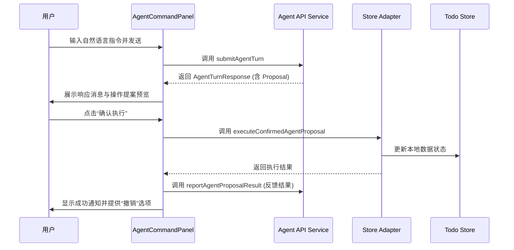
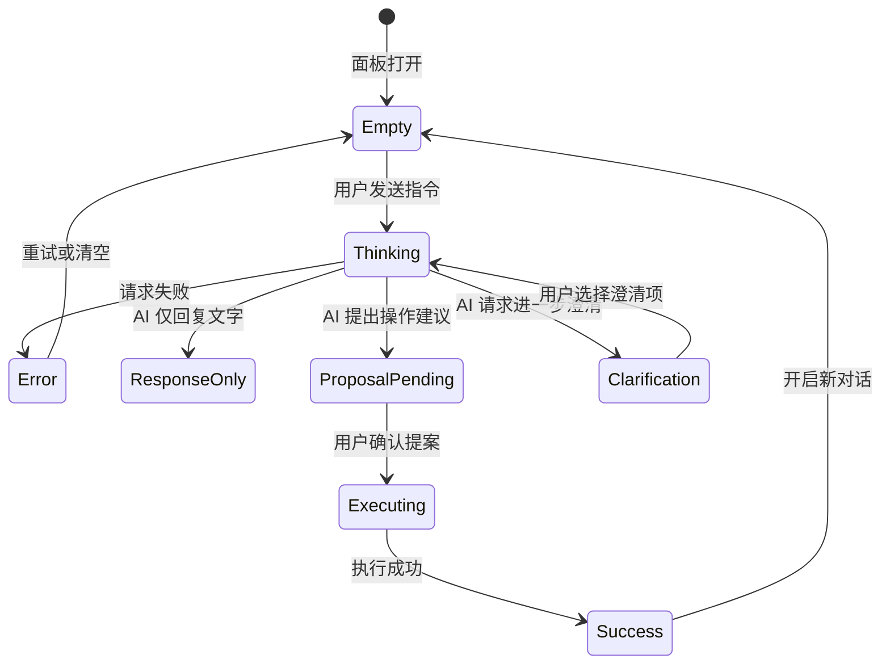
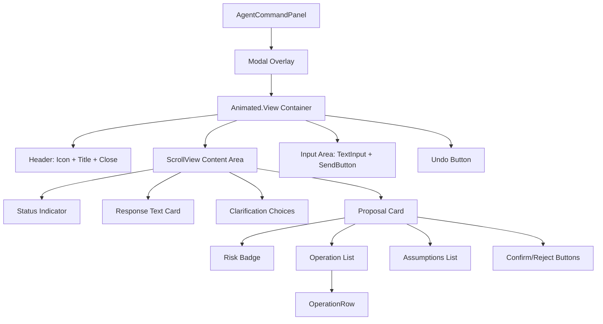

# UI 交互层：智能指令面板实现

## Table of Contents
1. [模块概览](#模块概览)
2. [引言](#引言)
3. [核心组件分析](#核心组件分析)
   - [AgentCommandPanel 属性定义](#agentcommandpanel-属性定义)
   - [内部状态管理](#内部状态管理)
4. [架构设计与数据流](#架构设计与数据流)
   - [交互时序](#交互时序)
   - [状态转换逻辑](#状态转换逻辑)
   - [组件层级结构](#组件层级结构)
5. [关键交互逻辑实现](#关键交互逻辑实现)
   - [输入处理与发送机制](#输入处理与发送机制)
   - [执行状态与反馈展示](#执行状态与反馈展示)
   - [提案确认与撤销流程](#提案确认与撤销流程)
6. [子组件解析：OperationRow](#子组件解析operationrow)
7. [跨平台适配与 UI 特性](#跨平台适配与-ui-特性)
   - [响应式布局适配](#响应式布局适配)
   - [交互动画处理](#交互动画处理)
8. [UI 视觉与样式设计](#ui-视觉与样式设计)
9. [集成点与外部依赖](#集成点与外部依赖)
10. [文件参考](#文件参考)

## 模块概览

本模块负责 LightFlux 系统中 AI Agent 的前端交互层实现。它提供了一个智能指令面板，允许用户通过自然语言与系统进行交互，执行复杂的任务管理和里程碑操作。

- **总文件数**: 1 个主要 UI 组件文件，以及相关的类型定义和适配器文件。
- **主要目录**: `lightflux/components/agent/`
- **覆盖范围**: 本文档重点解析 `AgentCommandPanel.tsx` 的实现细节，并涵盖其与 `lightflux/agent/` 目录下的引擎适配器的对接方式。

## 引言

`AgentCommandPanel` 是用户与 AI Agent 沟通的核心桥梁。不同于传统的表单输入，该面板采用了基于“对话-提案-确认”的交互模型。用户输入自然语言指令后，AI Agent 会解析意图并生成一系列拟执行的操作（Proposal），用户预览并确认后，这些操作才会真正应用到本地存储中。

该组件的设计目标是：
- **直观性**：提供实时的输入反馈和清晰的执行状态展示。
- **安全性**：通过“提案预览”机制，让用户在操作执行前了解风险和具体变更。
- **一致性**：支持 Web 和 Native 双端，确保在不同设备上都有良好的交互体验。

## 核心组件分析

### AgentCommandPanel 属性定义

`AgentCommandPanel` 作为一个功能完备的模态组件，其接口设计简洁且职责明确。它通过 `visible` 属性受控，并通过 `onClose` 和 `onNotify` 与父组件通信。

```typescript
interface AgentCommandPanelProps {
  onClose: () => void; // 关闭面板的回调，处理模态框隐藏逻辑
  onNotify: (message: string, variant?: 'error' | 'success') => void; // 触发全局通知的回调，用于展示操作结果
  visible: boolean; // 控制面板显示隐藏的开关
}
```

**代码来源**: [AgentCommandPanel.tsx:L34-L38](lightflux/components/agent/AgentCommandPanel.tsx#L34-L38)

### 内部状态管理

组件内部使用了多个 `useState` 和 `useRef` 来管理复杂的交互状态。为了保证在快速连续操作下的稳定性，组件引入了 `AbortController` 来管理请求生命周期。

| 状态变量 | 类型 | 用途描述 |
| :--- | :--- | :--- |
| `conversationId` | `string` | 追踪当前的 AI 会话 ID。若为空，则视为开启新会话；若存在，则维持上下文。 |
| `draft` | `string` | 实时存储用户在输入框中输入的文本，作为指令草稿。 |
| `response` | `AgentTurnResponse` | 存储 AI 返回的结构化响应，包含回复文本、澄清选项或操作提案。 |
| `proposal` | `AgentProposal` | 专门提取出的操作提案，包含具体的变更列表和风险评估。 |
| `loading` | `boolean` | 标识网络请求或本地处理是否正在进行，驱动 UI 的 Loading 状态。 |
| `error` | `string` | 捕获并展示交互过程中的各类异常信息。 |
| `undoAvailable` | `boolean` | 依赖于 `canUndoLastAgentProposal()`，决定撤销按钮的可见性。 |

**代码来源**: [AgentCommandPanel.tsx:L51-L59](lightflux/components/agent/AgentCommandPanel.tsx#L51-L59)

## 架构设计与数据流

### 交互时序

用户从输入指令到最终执行操作的完整流程涉及前端 UI、AI 服务接口以及本地存储适配器。



上述时序图展示了典型的“请求-响应-确认-执行”链路。关键点在于 `submitAgentTurn` 并不直接修改数据，而是返回一个 `proposal`。真正的写操作发生在用户点击确认后调用的 `executeConfirmedAgentProposal` 中。这种设计有效地防止了 AI 误操作导致的数据损坏。

**图表来源**: 逻辑参考自 `AgentCommandPanel.tsx` 的 `send` 与 `confirmProposal` 函数。

### 状态转换逻辑

指令面板的 UI 状态会随着交互的深入而迁移。



状态转换图清晰地描述了面板在不同阶段的表现。例如，当 AI 需要更多信息时，会进入 `Clarification` 状态，此时 UI 会渲染一组可点击的选项供用户快速回复。

**图表来源**: 逻辑参考自 `AgentCommandPanel.tsx` 的渲染逻辑分支出落。

### 组件层级结构

`AgentCommandPanel` 内部由多个功能区块组成，采用了典型的插槽式布局。



该层级结构展示了组件的组合方式。`ScrollView` 作为核心内容承载区，根据当前的状态动态渲染不同的子卡片。`OperationRow` 作为一个独立的子组件，负责将复杂的 `AgentOperation` 对象转化为用户可理解的文字描述。

**图表来源**: 根据 `AgentCommandPanel.tsx` 的 JSX 结构整理。

## 关键交互逻辑实现

### 输入处理与发送机制

用户输入的指令通过 `TextInput` 捕获，并在按下发送按钮或点击澄清选项时触发 `send` 函数。

```typescript
const send = async (message = draft) => {
  const normalizedMessage = message.trim();
  if (!normalizedMessage || loading) return;
  
  setDraft(''); // 发送后立即清空输入框，提升反馈感
  setError('');
  setProposal(null);
  setLoading(true);
  
  const controller = new AbortController();
  requestController.current = controller;
  
  try {
    const result = await submitAgentTurn({
      conversationId,
      message: normalizedMessage,
      signal: controller.signal,
    });
    setConversationId(result.conversationId);
    setResponse(result);
    setProposal(result.proposal ?? null);
  } catch (nextError) {
    if (!controller.signal.aborted) {
      setError(nextError instanceof Error ? nextError.message : labels.requestFailed);
    }
  } finally {
    if (requestController.current === controller) {
      requestController.current = null;
      setLoading(false);
    }
  }
};
```

**实现要点**:
1. **取消机制**: 使用 `AbortController` 确保在面板关闭或新请求发起时，旧的请求能被及时中止，避免竞态条件。
2. **状态重置**: 发送前清空草稿和旧的提案，进入加载状态。
3. **澄清支持**: `send` 函数接受可选的 `message` 参数，这使得点击 AI 提供的澄清选项（Clarification Choices）可以直接复用发送逻辑。

**代码来源**: [AgentCommandPanel.tsx:L83-L115](lightflux/components/agent/AgentCommandPanel.tsx#L83-L115)

### 执行状态与反馈展示

面板通过 `ScrollView` 渲染不同类型的卡片来展示 AI 的反馈：
- **状态行 (`statusRow`)**: 展示“AI 正在思考...”的 Loading 动画，利用 `accessibilityLiveRegion="polite"` 增强无障碍体验。
- **响应卡片 (`responseCard`)**: 展示 AI 的自然语言回复，采用浅灰色背景以区别于操作提案。
- **澄清卡片 (`clarificationCard`)**: 展示问题及一组操作选项，选项采用 `Pressable` 实现，具有明显的点击态反馈。
- **提案卡片 (`proposalCard`)**: 最复杂的展示区域，通过深色边框强调其重要性。

### 提案确认与撤销流程

确认提案是交互的终点，也是数据变更的起点。

```typescript
const confirmProposal = () => {
  if (!proposal) return;
  try {
    const result = executeConfirmedAgentProposal(proposal);
    setProposal(null);
    setUndoAvailable(true);
    onNotify(labels.applied);
    // 异步报告结果给 AI 以优化后续建议
    void reportAgentProposalResult(result).catch(() => {
      setError(labels.resultReportFailed);
    });
  } catch (nextError) {
    setError(nextError instanceof Error ? nextError.message : labels.requestFailed);
  }
};
```

**代码来源**: [AgentCommandPanel.tsx:L117-L134](lightflux/components/agent/AgentCommandPanel.tsx#L117-L134)

为了增强用户体验，系统提供了**撤销（Undo）**功能。当提案执行成功后，UI 会显示一个撤销按钮，调用 `undoLastAgentProposal()` 来回滚本地存储的状态。这为用户提供了“后悔药”，极大地降低了使用 AI 自动执行任务的心理负担。

## 子组件解析：OperationRow

`OperationRow` 是一个专门用于展示单个操作详情的内部组件。它需要将抽象的 `AgentOperation` 映射为具体的任务或里程碑标题。

```typescript
const OperationRow = ({ labels, operation }) => {
  const context = getAgentContextSnapshot();
  // 根据操作类型提取关联的实体标题
  const detail = operation.type === 'task.create' || operation.type === 'milestone.create'
      ? operation.title
      : // ...从 context 中查找已有实体的标题
  
  return (
    <View style={styles.operationRow}>
      <View style={styles.operationDot} />
      <View style={styles.operationText}>
        <Text style={styles.operationType}>{labels[operation.type]}</Text>
        {detail ? <Text style={styles.operationDetail}>{detail}</Text> : null}
      </View>
    </View>
  );
};
```

**核心逻辑**:
- **上下文感知**: 通过 `getAgentContextSnapshot()` 获取当前的 Store 快照，以便在更新或删除操作中查找实体的原始标题。
- **多类型适配**: 处理了 `task`、`group` 和 `milestone` 三大类实体的创建、更新、移动和删除操作。

**代码来源**: [AgentCommandPanel.tsx:L366-L411](lightflux/components/agent/AgentCommandPanel.tsx#L366-L411)

## 跨平台适配与 UI 特性

### 响应式布局适配

组件利用 `useWindowDimensions` 获取屏幕宽度，并在 `compact` 模式（宽度 < 700px，通常为移动端）和 `wide` 模式（桌面端）之间切换。

- **移动端 (Compact)**: 面板以 Bottom Sheet 形式呈现，贴合屏幕底部，宽度占满，顶部带有圆角。
- **桌面端 (Wide)**: 面板以居中的 Modal 形式呈现，有最大宽度限制（620px），并带有较重的阴影效果和全圆角。

```typescript
const { width } = useWindowDimensions();
const compact = width < 700;

// 样式应用示例
style={[
  styles.panel,
  compact ? styles.panelCompact : styles.panelWide,
  // ...动画样式
]}
```

**代码来源**: [AgentCommandPanel.tsx:L47-L48, L169](lightflux/components/agent/AgentCommandPanel.tsx#L47-L48)

### 交互动画处理

面板的出现和消失伴随着平滑的动画。动画使用了 `Animated` 库实现，并针对 Web 平台做了特殊处理：在 Web 上禁用 `useNativeDriver` 以保证兼容性，而在 Native 平台上启用以获得更高性能。

动画参数包括：
- **透明度 (`opacity`)**: 从 0 到 1 的淡入效果。
- **位移 (`translateY`)**: 从下方轻微弹入。
- **缩放 (`scale`)**: 从 0.985 到 1 的微小缩放，营造出“弹出”的质感。

**代码来源**: [AgentCommandPanel.tsx:L69-L74, L170-L186](lightflux/components/agent/AgentCommandPanel.tsx#L69-L74)

## UI 视觉与样式设计

为了体现“智能”和“轻盈”的设计语言，`AgentCommandPanel` 在视觉上做了精细处理：

1. **色彩运用**:
   - **品牌色**: 使用 `#6759E8`（紫色）作为 Agent 的代表色，出现在图标、进度点和确认按钮中。
   - **风险提示**: 针对不同风险等级，分别使用绿色（低）、黄色（中）、红色（高）的浅色背景填充。
2. **层次感**:
   - 通过 `shadowOpacity: 0.2` 和 `shadowRadius: 32` 营造出悬浮于主界面之上的深度感。
   - 内部卡片使用微弱的边框（`#DCD8F3`）或浅背景色（`#F6F5F9`）进行区分，避免界面过于拥挤。
3. **输入体验**:
   - `TextInput` 采用了多行模式（`multiline`），并设置了 `maxHeight: 110`，确保长指令输入时不会遮挡上方内容。
   - 发送按钮在输入为空或加载中时会自动禁用，并改变透明度。

**代码来源**: [AgentCommandPanel.tsx:L413-L700](lightflux/components/agent/AgentCommandPanel.tsx#L413-L700)

## 集成点与外部依赖

`AgentCommandPanel` 作为一个高级 UI 组件，依赖于多个底层服务：

1. **Agent API (`services/agentApi.ts`)**: 处理与远端 AI 服务的 HTTP 通信，支持流式响应（虽然目前 UI 采用整体交付）。
2. **Store Adapter (`agent/todoCommandStoreAdapter.ts`)**: 将 AI 提案转化为具体的 Store 操作，并管理撤销历史。
3. **Todo Store (`store/todoStore.ts`)**: 获取当前的任务上下文（任务列表、里程碑等），作为 AI 决策的输入。
4. **I18n (`i18n/translations.ts`)**: 提供多语言支持，确保面板文字能根据系统语言切换。

## 文件参考

本章节涉及的核心源文件如下：

- [lightflux/components/agent/AgentCommandPanel.tsx](lightflux/components/agent/AgentCommandPanel.tsx): 指令面板的主要实现文件。
- [lightflux/agent/types.ts](lightflux/agent/types.ts): 定义了 Agent 交互涉及的所有核心数据结构。
- [lightflux/agent/todoCommandStoreAdapter.ts](lightflux/agent/todoCommandStoreAdapter.ts): 负责 UI 与本地存储之间的逻辑适配。
- [lightflux/agent/todoCommandExecutor.ts](lightflux/agent/todoCommandExecutor.ts): 包含具体的指令执行引擎逻辑。
