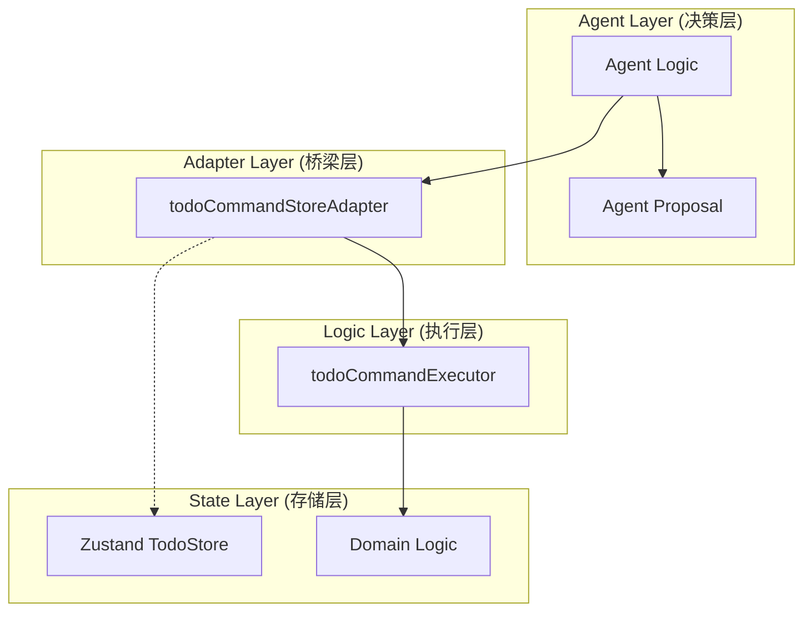
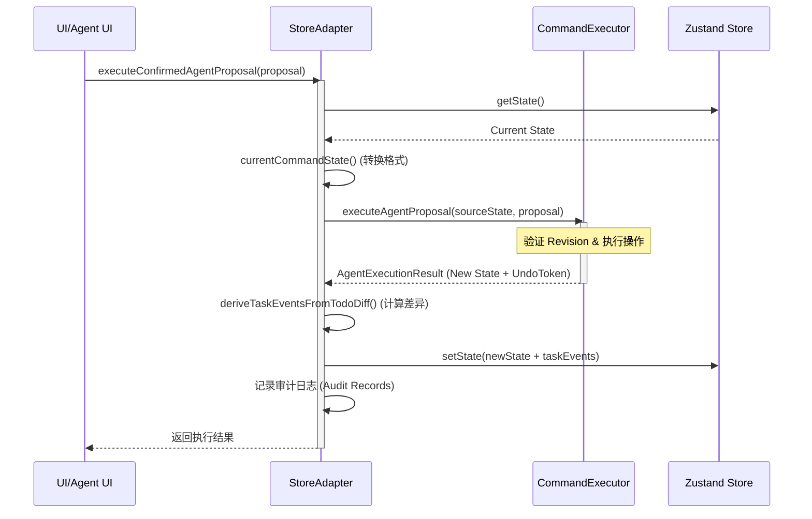

# 存储适配器：Agent 与状态库的交互桥梁

## 目录
1. [模块概览](#模块概览)
2. [引言](#引言)
3. [适配器模式的应用价值](#适配器模式的应用价值)
4. [核心架构与交互流程](#核心架构与交互流程)
5. [状态映射与同步机制](#状态映射与同步机制)
6. [副作用处理与审计追踪](#副作用处理与审计追踪)
7. [核心组件与接口](#核心组件与接口)
8. [文件参考](#文件参考)

## 模块概览

在 LightFlux 项目中，Agent 与状态库的交互主要集中在 `lightflux/agent` 和 `lightflux/store` 两个目录中。通过对这些目录的探索，我们确定了该模块的规模和范围：

- **文件总数**：共涉及 8 个核心源文件。
- **子模块识别**：
    - `lightflux/agent/`：包含指令执行器（Executor）、适配器（Adapter）以及类型定义（Types）。
    - `lightflux/store/`：包含 Zustand 状态存储（Store）以及各个领域的业务逻辑（Domain）。
- **覆盖深度**：
    - **重点覆盖**：`todoCommandStoreAdapter.ts`（适配器实现）、`todoStore.tsx`（底层存储）、`todoCommandExecutor.ts`（指令执行逻辑）。
    - **简要提及**：`todoDomain.ts`、`milestoneDomain.ts`、`taskEventDomain.ts` 等领域逻辑文件。

该模块作为 Agent 智能层与 UI 状态层之间的“粘合剂”，确保了业务逻辑的纯净性与状态更新的可靠性。

## 引言

`StoreAdapter`（存储适配器）是 LightFlux 架构中的关键组件，它充当了 Agent 决策层与应用状态管理层（基于 Zustand）之间的交互桥梁。

在复杂的 AI 驱动应用中，Agent 需要读取当前的应用状态作为上下文（Context），并根据用户意图生成一系列操作提案（Proposals）。如果让 Agent 直接操作 UI 状态库，会导致以下问题：
1. **耦合度过高**：Agent 的逻辑将深度依赖于特定的状态库实现（如 Zustand）。
2. **难以测试**：Agent 的决策逻辑与 UI 副作用交织在一起，难以进行纯函数式的单元测试。
3. **一致性风险**：并发操作或异步更新可能导致状态不一致。

`StoreAdapter` 通过实现适配器模式，将 Agent 关心的“指令执行”逻辑与 UI 关心的“状态响应”逻辑进行了解耦。它负责将 Store 中的原始数据映射为 Agent 可理解的快照，并将 Agent 生成的执行结果安全地同步回 Store 中。

## 适配器模式的应用价值

在 `lightflux/agent/todoCommandStoreAdapter.ts` 中，适配器模式的引入解决了 Agent 与 Store 之间的通信协议不匹配问题。

### 为什么不直接操作 Store？

直接操作 Store 虽然简单，但在 Agent 场景下存在明显劣势。下表对比了两种模式的区别：

| 维度 | 直接操作 Store | 使用 StoreAdapter |
| :--- | :--- | :--- |
| **逻辑纯粹性** | 业务逻辑与状态管理混杂 | 业务逻辑（Executor）是纯函数 |
| **可撤销性** | 难以实现通用的撤销逻辑 | 通过 `UndoToken` 轻松实现原子级撤销 |
| **版本控制** | 缺乏版本校验，易发生冲突 | 基于 `Revision` 的冲突检测机制 |
| **副作用管理** | 副作用散落在各处 | 适配器统一处理审计日志、事件触发 |

通过适配器，Agent 的核心逻辑（`todoCommandExecutor`）只需要处理简单的 `TodoCommandState` 对象，而不需要关心 Zustand 的 `set` 或 `get` 方法。这种设计使得 Executor 可以轻松地在 Node.js 环境或 Web Worker 中运行，而无需模拟复杂的浏览器环境。

## 核心架构与交互流程

LightFlux 采用了分层架构来处理 Agent 的指令执行。`StoreAdapter` 位于中间层，负责协调上下游的调用。

下面的架构图展示了各组件之间的依赖关系：



当用户通过 Agent 发出一个指令（例如“将明天的任务全部移到下周一”）时，系统会经历以下典型的交互流程：

1. **上下文提取**：Adapter 调用 `getAgentContextSnapshot` 从 Store 中提取当前任务、分组和里程碑的快照。
2. **提案生成**：Agent 根据快照生成 `AgentProposal`。
3. **执行与校验**：Adapter 将当前状态和提案传递给 `executeAgentProposal`（Executor）。
4. **状态同步**：Executor 返回新的状态快照，Adapter 调用 `applyCommandState` 将其写回 Zustand Store。
5. **副作用触发**：Adapter 计算状态差异（Diff），生成审计记录并更新任务事件流。

下面的序列图详细描述了这一过程：



**图表解析**：
此序列图展示了 `StoreAdapter` 如何作为一个协调者，在保持 `CommandExecutor` 纯净性的同时，完成了从 Store 读取数据、执行业务逻辑、写回数据以及处理副作用（如任务事件）的全过程。特别注意 `currentCommandState` 的转换步骤，它是连接两个不同数据模型的关键。

**图表来源**: 
- [todoCommandStoreAdapter.ts:L259-L301](lightflux/agent/todoCommandStoreAdapter.ts#L259-L301)
- [todoCommandExecutor.ts:L893-L926](lightflux/agent/todoCommandExecutor.ts#L893-L926)

## 状态映射与同步机制

`StoreAdapter` 的核心任务之一是在 Zustand 的扁平化状态模型与 Executor 所需的结构化模型之间进行映射。

### 状态转换逻辑

在 `todoCommandStoreAdapter.ts` 中，`currentCommandState` 函数负责将 Zustand Store 的状态转换为 `TodoCommandState` 接口定义的格式：

```typescript
// lightflux/agent/todoCommandStoreAdapter.ts

const currentCommandState = () => {
  const state = useTodoStore.getState();
  return createTodoCommandState(
    state.allTodos,
    state.groups,
    state.ungroupedName,
    state.allMilestones,
  );
};
```

而 `applyCommandState` 则负责反向同步。它不仅更新原始数据，还利用领域逻辑（Domain Logic）重新计算派生状态（如已过滤的任务列表、归档的里程碑等）：

```typescript
// lightflux/agent/todoCommandStoreAdapter.ts

const applyCommandState = (
  state: ReturnType<typeof currentCommandState>,
  taskEvents?: TaskEvent[],
) => {
  useTodoStore.setState({
    ...deriveTodoCommandCollections(state.todos), // 派生 todos 和 trashedTodos
    groups: state.groups,
    ...milestoneState(state.milestones), // 派生里程碑的各种状态
    ...(taskEvents ? { taskEvents } : {}),
    ungroupedName: state.ungroupedName,
  });
};
```

### 版本控制（Revision）

为了防止 Agent 在过时的数据上进行操作，系统引入了基于哈希的 `Revision` 机制。

```mermaid
stateDiagram-v2
    [*] --> Revision_A: 初始状态
    Revision_A --> Revision_B: 执行 Proposal 1
    Revision_B --> Revision_C: 执行 Proposal 2
    Revision_C --> Revision_B: Undo Last Proposal
    
    note right of Revision_A
      Revision 是基于 todos, groups, 
      milestones 的内容计算的 FNV-1a 哈希值
    end
```

在执行提案前，Executor 会校验 `proposal.baseRevision` 是否与当前状态的 `revision` 一致。如果不一致，会抛出 `stale-revision` 错误，阻止非法的状态更新。

**状态映射相关源码**:
- [todoCommandStoreAdapter.ts:L103-L124](lightflux/agent/todoCommandStoreAdapter.ts#L103-L124)
- [todoCommandExecutor.ts:L221-L263](lightflux/agent/todoCommandExecutor.ts#L221-L263)

## 副作用处理与审计追踪

除了基础的状态同步，`StoreAdapter` 还承担了处理“非纯”逻辑的职责，主要包括任务事件生成和审计日志维护。

### 任务事件生成（Task Events）

当 Agent 执行批量操作（如“删除所有已完成任务”）时，UI 需要知道具体发生了哪些变化以展示动效或更新统计信息。Adapter 通过对比执行前后的状态差异来生成 `TaskEvent`：

```typescript
// lightflux/agent/todoCommandStoreAdapter.ts

const taskEvents = [
  ...previousTaskEvents,
  ...deriveTaskEventsFromTodoDiff(
    sourceState.todos,
    result.state.todos,
    now,
  ),
];
```

### 审计日志（Audit Records）

为了让用户了解 Agent 到底做了什么，Adapter 维护了一个运行时的审计记录列表。每条记录包含了提案的摘要、风险等级、受影响的 ID 以及执行时间。

```typescript
export interface AgentAuditRecord {
  proposalId: string;
  summary: string;
  risk: AgentRisk;
  executedAt: number;
  beforeRevision: number;
  afterRevision: number;
  operations: AgentOperationResult[];
  undoneAt: number | null;
}
```

这些审计记录会被存储在内存中（限制最大 100 条），并可以通过 `getAgentAuditRecords` 接口供 UI 渲染“Agent 活动历史”面板。

### 撤销机制（Undo Logic）

由于 `StoreAdapter` 在执行时保存了 `AgentUndoToken`（包含操作前的状态快照），因此可以实现极低成本的撤销功能：

1.  **保存 Token**：在 `executeConfirmedAgentProposal` 成功后，将 `result.undoToken` 存入 `lastUndoToken`。
2.  **触发撤销**：用户点击撤销时，调用 `undoLastAgentProposal`。
3.  **状态回滚**：Adapter 将 Token 传给 Executor 的 `undoAgentExecution` 函数，获取备份的状态快照，并再次调用 `applyCommandState` 覆盖当前 Store。

**审计与撤销源码**:
- [todoCommandStoreAdapter.ts:L284-L300](lightflux/agent/todoCommandStoreAdapter.ts#L284-L300)
- [todoCommandStoreAdapter.ts:L303-L320](lightflux/agent/todoCommandStoreAdapter.ts#L303-L320)

## 核心组件与接口

本节列出了适配器层涉及的关键接口和函数，供开发者参考。

### AgentContextSnapshot
这是 Agent 获取外界信息的唯一窗口，包含了所有必要的数据维度。

```typescript
export interface AgentContextSnapshot {
  revision: number;
  language: 'zh' | 'en';
  ungroupedName: string | null;
  tasks: AgentTaskContext[];
  groups: AgentGroupContext[];
  milestones: AgentMilestoneContext[];
}
```

### 关键导出函数

- `getAgentContextSnapshot()`: 获取当前状态的完整快照。
- `searchAgentTasks(input)`: 提供高性能的任务搜索过滤逻辑，供 Agent 快速定位目标。
- `executeConfirmedAgentProposal(proposal)`: 执行提案的唯一入口，处理事务一致性。
- `undoLastAgentProposal()`: 撤销上一次操作。
- `getAgentAuditRecords()`: 获取审计日志列表。

## 文件参考

以下是实现本模块功能的核心文件路径：

- [lightflux/agent/todoCommandStoreAdapter.ts](lightflux/agent/todoCommandStoreAdapter.ts): 适配器核心实现，处理 Store 交互与副作用。
- [lightflux/agent/todoCommandExecutor.ts](lightflux/agent/todoCommandExecutor.ts): 纯逻辑执行器，负责指令的验证与状态计算。
- [lightflux/agent/types.ts](lightflux/agent/types.ts): 定义了 Agent 操作、提案、快照等核心数据结构。
- [lightflux/store/todoStore.tsx](lightflux/store/todoStore.tsx): 基于 Zustand 的全局状态存储。
- [lightflux/store/todoDomain.ts](lightflux/store/todoDomain.ts): 任务领域的业务逻辑工具函数。
- [lightflux/store/milestoneDomain.ts](lightflux/store/milestoneDomain.ts): 里程碑领域的业务逻辑工具函数。
- [lightflux/store/taskEventDomain.ts](lightflux/store/taskEventDomain.ts): 负责计算状态差异并生成任务事件。
