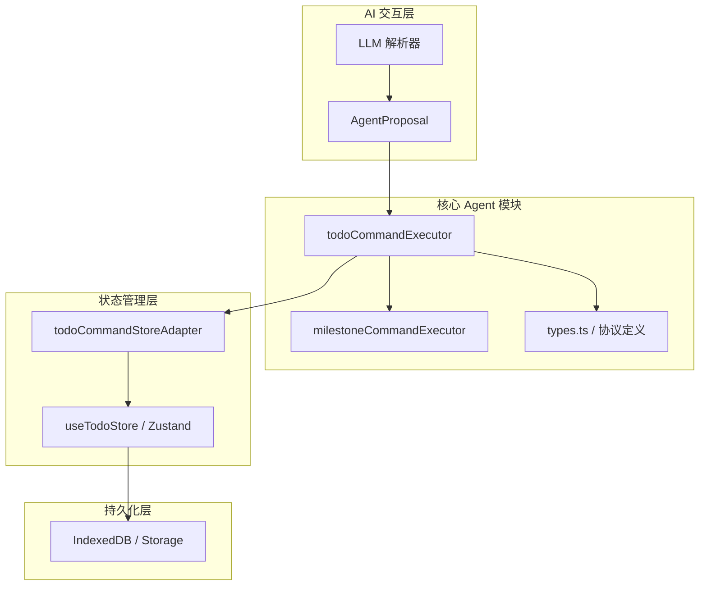
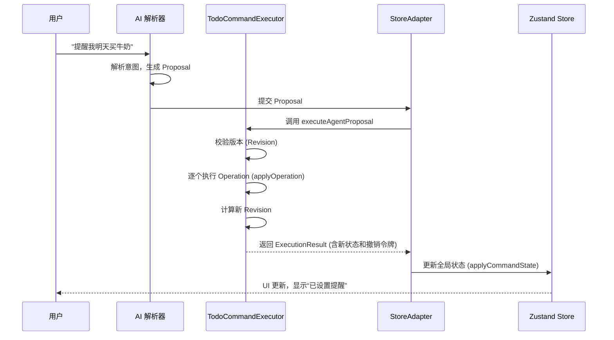
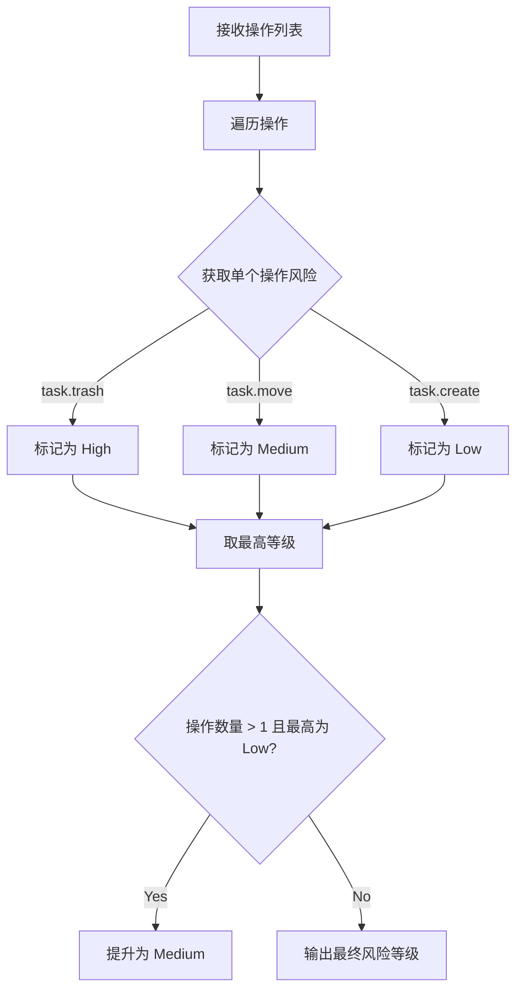

# 扩展指南：如何添加新的 AI 指令

## 目录
1. [模块概览](#模块概览)
2. [简介](#简介)
3. [核心架构与设计哲学](#核心架构与设计哲学)
4. [需求分析：以“任务提醒”指令为例](#需求分析以任务提醒指令为例)
5. [实战演练：添加新的 AI 指令](#实战演练添加新的-ai-指令)
   - [第一步：在 types.ts 中定义 Action 类型](#第一步在-typests-中定义-action-类型)
   - [第二步：在 Executor 中实现执行逻辑](#第二步在-executor-中实现执行逻辑)
   - [第三步：在 StoreAdapter 中同步状态](#第三步在-storeadapter-中同步状态)
6. [数据流与生命周期](#数据流与生命周期)
7. [错误处理与风险控制机制](#错误处理与风险控制机制)
8. [测试与验证](#测试与验证)
9. [最佳实践与扩展建议](#最佳实践与扩展建议)
10. [文件引用](#文件引用)

## 模块概览

在开始深入了解如何扩展 AI 指令之前，我们首先对 `lightflux/agent` 模块的规模和结构进行初步评估。该模块是 LightFlux 智能化的核心，负责将自然语言解析后的意图转化为具体的系统操作。

**模块统计数据**：
- **总文件数**：4 个核心 TypeScript 文件。
- **子模块分布**：
  - `types.ts`: 定义了所有 AI 操作的协议接口。
  - `todoCommandExecutor.ts`: 任务（Todo）相关指令的核心执行器。
  - `milestoneCommandExecutor.ts`: 里程碑（Milestone）相关指令的核心执行器。
  - `todoCommandStoreAdapter.ts`: 将执行结果与前端状态管理库（Store）连接的适配器。

本指南将深度覆盖 `lightflux/agent` 目录下的所有文件，并重点讲解如何通过修改这些文件来实现功能的横向扩展。

## 简介

LightFlux 的 AI 能力并非直接操作数据库或状态树，而是通过一套严密的“提案-执行”机制实现的。当用户输入如“提醒我明天买牛奶”这样的自然语言时，后端的 LLM 解析器会生成一个 `AgentProposal`（代理提案）。这个提案包含了一系列原子操作（`AgentOperation`），由前端的 Agent 模块负责验证、执行以及提供撤销支持。

这种设计的核心目的是**安全性**和**确定性**。通过将 AI 的意图转化为具体的指令集，我们可以：
1. **预校验**：在执行前检查参数合法性。
2. **风险评估**：根据操作类型自动判断风险等级（低、中、高）。
3. **原子性保证**：一组操作要么全部成功，要么全部回滚。
4. **版本控制**：通过 `revision` 机制防止在过时的数据状态上进行操作。

## 核心架构与设计哲学

在深入代码之前，理解 LightFlux Agent 的分层架构至关重要。它采用了典型的“解析-分发-执行-适配”模式。

以下图表展示了 Agent 模块的整体架构及其与系统其他部分的交互：



**架构说明**：
- **AI 交互层**：负责自然语言的理解。它不属于本指南的修改范围，但它是指令的源头。它生成的 `AgentProposal` 必须严格遵守 `types.ts` 中定义的协议。
- **核心 Agent 模块**：这是逻辑处理的中枢。`Executor` 负责解析提案中的每一个 `Operation`，并调用相应的处理函数。它是一个纯函数式的执行器，接收当前状态并返回新状态，不直接产生副作用。
- **状态管理层**：`Adapter` 是副作用的发生地。它将 `Executor` 计算出的新状态应用到 Zustand Store 中，并处理撤销令牌（Undo Token）的存储和审计日志的记录。

这种解耦确保了逻辑的可测试性。我们可以轻松地为 `Executor` 编写单元测试，而无需模拟复杂的 UI 环境或数据库连接。

## 需求分析：以“任务提醒”指令为例

假设我们要为 LightFlux 增加一个新的 AI 自动化能力：**设置任务提醒**。

**用户场景**：
用户输入：“提醒我明天买牛奶”。
解析结果：
1. 创建一个标题为“买牛奶”、日期为“明天”的任务。
2. 为该任务设置一个提醒时间。

虽然现有的 `task.create` 已经支持创建任务，但它目前没有专门的 `reminder` 字段。为了演示完整的扩展流程，我们将添加一个新的操作类型 `task.set_reminder`。

**预期行为**：
- 如果任务已存在，为其添加提醒。
- 如果是新任务，在创建后立即关联提醒。
- 提醒信息需要包含偏移量（例如提前 15 分钟）或绝对时间。

## 实战演练：添加新的 AI 指令

我们将按照“定义协议 -> 实现逻辑 -> 适配状态”的顺序进行修改。

### 第一步：在 types.ts 中定义 Action 类型

所有的指令都必须在 `lightflux/agent/types.ts` 中声明。这是 LLM 和前端之间的“契约”。

我们需要定义一个新的接口 `AgentTaskReminderOperation`，并将其加入到 `AgentOperation` 联合类型中。

```typescript
// lightflux/agent/types.ts

// 1. 定义新的操作接口
export interface AgentTaskReminderOperation extends AgentOperationBase {
  type: 'task.set_reminder';
  taskId: string;
  reminderMinutes: number; // 提前多少分钟提醒
}

// 2. 将新接口加入联合类型
export type AgentOperation =
  | AgentTaskCreateOperation
  | AgentTaskUpdateOperation
  // ... 其他操作
  | AgentTaskReminderOperation // 新增
  | AgentMilestoneCreateOperation;
  // ...
```

**设计要点**：
- `operationId`: 每个操作必须有唯一的 ID，用于错误追踪。
- `idempotencyKey`: 幂等键，防止 AI 重复发送相同的指令导致重复操作。
- `type`: 必须是唯一的字符串字面量，用于在 Executor 中进行分发。

### 第二步：在 Executor 中实现执行逻辑

接下来，我们需要在 `lightflux/agent/todoCommandExecutor.ts` 中实现如何处理这个新指令。

首先，我们需要在 `applyOperation` 函数中增加分发逻辑，然后编写具体的处理函数 `applyReminder`。

```typescript
// lightflux/agent/todoCommandExecutor.ts

// 1. 实现具体的处理逻辑
const applyReminder = (
  state: TodoCommandState,
  operation: Extract<AgentOperation, { type: 'task.set_reminder' }>,
  timestamp: number,
): AgentOperationResult => {
  // 验证任务是否存在且未被删除
  const todo = activeTask(state.todos, operation.taskId, operation.operationId);
  
  // 验证提醒参数是否合法
  if (operation.reminderMinutes < 0 || operation.reminderMinutes > 10080) { // 最多一周
    return fail('invalid-operation', '提醒时间必须在 0 到 10080 分钟之间。', operation.operationId);
  }

  // 更新状态树中的任务信息（假设 Todo 类型增加了 reminderMinutes 字段）
  state.todos = state.todos.map((item) =>
    item.id === todo.id 
      ? { ...item, reminderMinutes: operation.reminderMinutes, updatedAt: timestamp } 
      : item,
  );

  // 返回操作结果
  return {
    operationId: operation.operationId,
    idempotencyKey: operation.idempotencyKey,
    type: operation.type,
    affectedIds: [todo.id],
  };
};

// 2. 在主分发器中注册
const applyOperation = (
  state: TodoCommandState,
  operation: AgentOperation,
  timestamp: number,
): AgentOperationResult => {
  if (isMilestoneOperation(operation)) {
    return applyMilestoneOperation(state, operation, timestamp);
  }
  switch (operation.type) {
    case 'task.create':
      return applyCreate(state, operation, timestamp);
    // ... 其他 case
    case 'task.set_reminder': // 新增
      return applyReminder(state, operation, timestamp);
    default:
      return fail('invalid-operation', '不支持的代理操作。');
  }
};
```

**关键细节解释**：
- **状态克隆**：`Executor` 内部操作的是传入状态的副本或直接修改（因为 `executeAgentProposal` 已经做了深拷贝）。这保证了操作的原子性。如果中间某个操作失败抛出异常，整个提案的修改都会被舍弃。
- **辅助函数**：使用 `activeTask` 辅助函数可以自动处理“任务不存在”或“任务已进入回收站”的错误情况，并统一抛出 `AgentCommandError`。
- **风险评估**：别忘了在 `operationRisk` 函数中为新指令分配风险等级。设置提醒通常被视为 `low` 风险。

### 第三步：在 StoreAdapter 中同步状态

`lightflux/agent/todoCommandStoreAdapter.ts` 负责将 Agent 的纯逻辑运行结果同步到 UI 层的 Zustand Store 中。

由于 `executeConfirmedAgentProposal` 已经封装了通用的状态同步逻辑，如果你的新指令只是修改了现有的 `Todo` 属性，通常**不需要**在这里修改代码。

但是，如果你需要触发额外的副作用（如调用原生平台的推送通知 API），你需要在执行后进行处理：

```typescript
// lightflux/agent/todoCommandStoreAdapter.ts

export const executeConfirmedAgentProposal = (
  proposal: AgentProposal,
  now = Date.now(),
): AgentExecutionResult => {
  // ... 现有的执行逻辑
  const result = executeAgentProposal(sourceState, proposal, { confirmed: true, now });
  
  // 检查是否有提醒相关的操作，并触发副作用
  result.operations.forEach(op => {
    if (op.type === 'task.set_reminder') {
      // 调用通知服务
      // NotificationService.schedule(op.affectedIds[0], ...);
    }
  });

  // ... 应用状态到 Store
  applyCommandState(result.state, taskEvents);
  return result;
};
```

## 数据流与生命周期

理解一个 AI 指令从诞生到落地的全生命周期，有助于我们在开发时定位问题。



**生命周期阶段说明**：
1. **意图解析**：这是指令的起点。AI 需要识别出任务的标题、日期以及提醒的需求。
2. **提案生成**：AI 生成符合 `AgentProposal` 格式的 JSON。此时操作尚未生效。
3. **版本校验**：Agent 模块会检查 `baseRevision`。如果用户在 AI 解析期间手动修改了任务，版本号将不匹配，系统会拒绝执行以防止冲突。
4. **原子执行**：`Executor` 像事务一样处理所有操作。如果其中一个失败（例如任务 ID 冲突），整个过程终止。
5. **持久化与通知**：状态更新后，Store 会触发 UI 重新渲染，并可能触发持久化存储（IndexedDB）。

## 错误处理与风险控制机制

在扩展 AI 指令时，必须考虑到 AI 可能会犯错。LightFlux 提供了一套完整的错误处理框架。

### 错误类型 (AgentCommandErrorCode)
- `invalid-operation`: 参数不合法（如提醒时间为负数）。
- `target-not-found`: 操作的目标（任务或组）不存在。
- `stale-revision`: 并发冲突，数据已过期。
- `risk-understated`: AI 报告的风险等级低于系统计算的等级。

### 风险等级评估
每个操作都有一个 `AgentRisk` 等级：
- **Low**: 不会丢失数据的操作（创建任务、设置提醒）。
- **Medium**: 改变结构的操作（移动任务、归档里程碑）。
- **High**: 可能导致数据丢失的操作（删除任务、清空回收站）。

在 `todoCommandExecutor.ts` 中，`riskForOperations` 函数会计算整组操作的最高风险。如果 AI 试图悄悄执行一个高风险操作而将其标记为低风险，系统会拦截并报错。



## 测试与验证

为新指令编写单元测试是确保稳定性的关键。LightFlux 使用 Vitest 进行测试。

在 `lightflux/tests/todoCommandExecutor.test.ts` 中添加测试用例：

```typescript
// lightflux/tests/todoCommandExecutor.test.ts

it('能够为任务设置提醒时间', () => {
  // 1. 准备初始状态
  const source = createTodoCommandState([todo('task-1')], [], null);
  
  // 2. 构造提案
  const myProposal = proposal(
    [
      {
        idempotencyKey: 'key-1',
        operationId: 'op-1',
        type: 'task.set_reminder',
        taskId: 'task-1',
        reminderMinutes: 30,
      },
    ],
    source.revision,
  );

  // 3. 执行提案
  const result = executeAgentProposal(source, myProposal, { confirmed: true });

  // 4. 断言结果
  expect(result.state.todos[0].reminderMinutes).toBe(30);
  expect(result.operations[0].affectedIds).toContain('task-1');
  
  // 5. 验证撤销功能
  const undoneState = undoAgentExecution(result.state, result.undoToken);
  expect(undoneState.todos[0].reminderMinutes).toBeUndefined();
});
```

**测试要点**：
- **正向路径**：验证参数合法时，状态是否正确更新。
- **逆向路径**：验证参数非法（如 `reminderMinutes` 过大）时，是否抛出预期的 `AgentCommandError`。
- **撤销验证**：确保执行后的 `undoToken` 能够完美恢复到初始状态。

## 最佳实践与扩展建议

在为 LightFlux 增加 AI 能力时，请遵循以下原则：

1. **保持原子性**：如果一个自然语言指令对应多个系统动作，请确保它们在一个 `AgentProposal` 中提交。
2. **严格校验**：不要信任 AI 生成的任何参数。在 `Executor` 中进行详尽的边界检查。
3. **幂等设计**：利用 `idempotencyKey`。如果用户重复点击“执行”，系统应该能够识别并跳过已执行的操作。
4. **语义一致性**：新指令的命名应遵循 `领域.动作` 的规范，例如 `task.archive` 或 `group.rename`。
5. **文档同步**：修改 `types.ts` 后，记得更新相关的 AI Prompt 文档（通常在后端或配置中心），以便 LLM 知道如何使用新接口。

通过这套严谨的流程，你可以安全地为 LightFlux 引入各种复杂的自动化能力，从简单的任务管理到复杂的跨模块协作。

## 文件引用

以下是本指南涉及的核心源码文件，建议在开发前详细阅读：

**核心逻辑**:
- [lightflux/agent/types.ts](lightflux/agent/types.ts): 操作协议与数据模型定义。
- [lightflux/agent/todoCommandExecutor.ts](lightflux/agent/todoCommandExecutor.ts): 任务指令的业务逻辑实现。
- [lightflux/agent/milestoneCommandExecutor.ts](lightflux/agent/milestoneCommandExecutor.ts): 里程碑指令的业务逻辑实现。
- [lightflux/agent/todoCommandStoreAdapter.ts](lightflux/agent/todoCommandStoreAdapter.ts): 状态同步与副作用处理。

**测试参考**:
- [lightflux/tests/todoCommandExecutor.test.ts](lightflux/tests/todoCommandExecutor.test.ts): 指令执行器的单元测试示例。

**辅助工具**:
- [lightflux/types/todo.ts](lightflux/types/todo.ts): 基础 Todo 类型定义。
- [lightflux/utils/richText.ts](lightflux/utils/richText.ts): 富文本处理工具。

**Section sources**:
- [lightflux/agent/types.ts](lightflux/agent/types.ts)
- [lightflux/agent/todoCommandExecutor.ts](lightflux/agent/todoCommandExecutor.ts)
- [lightflux/agent/todoCommandStoreAdapter.ts](lightflux/agent/todoCommandStoreAdapter.ts)
