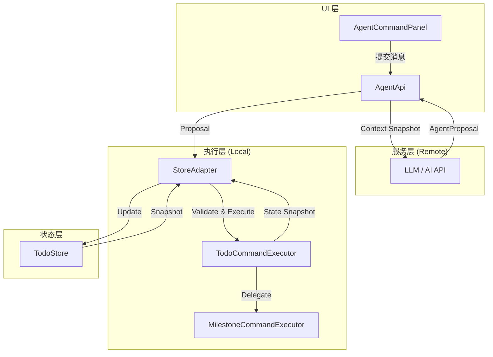
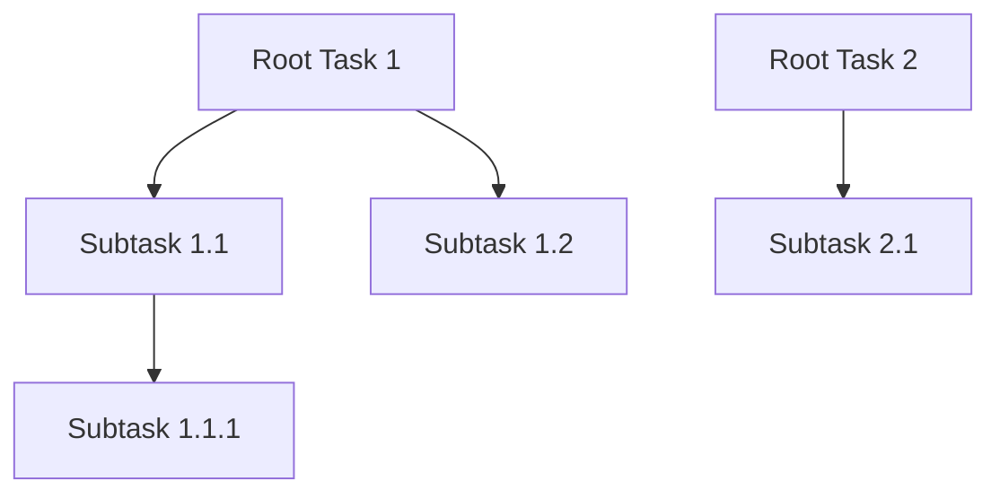
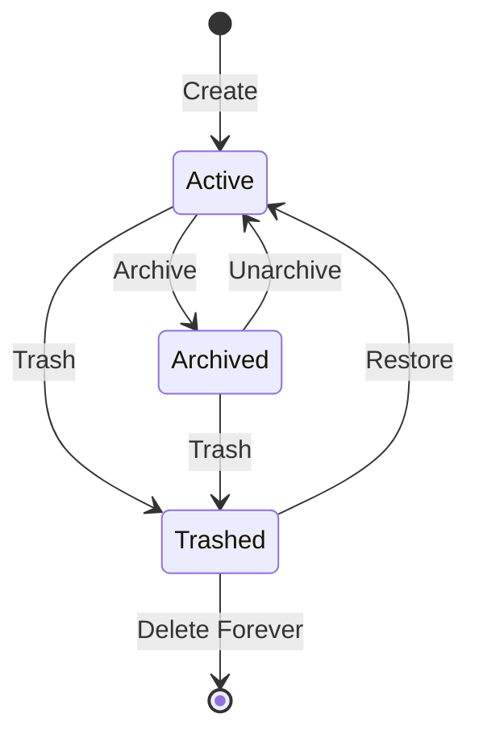
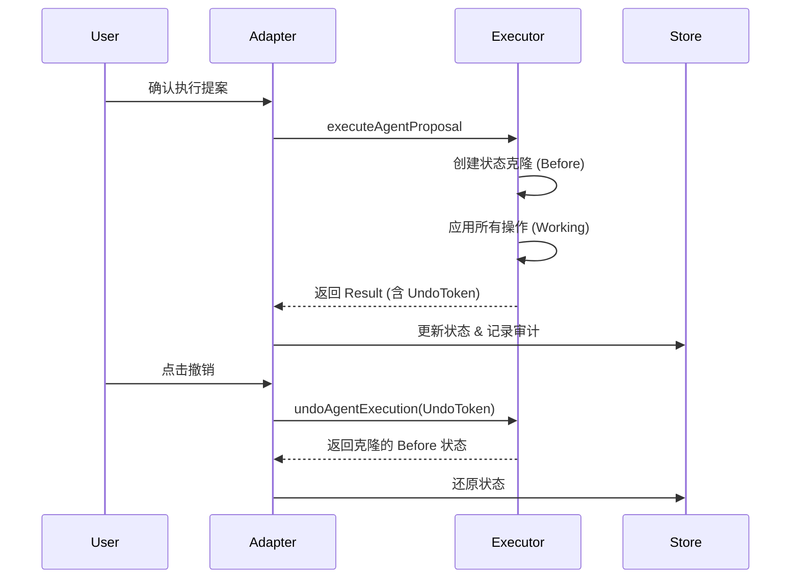

# 指令执行器详解：任务与里程碑自动化

## 目录
1. [模块概览](#模块概览)
2. [引言：指令执行器的核心角色](#引言指令执行器的核心角色)
3. [系统架构与数据流](#系统架构与数据流)
4. [核心数据模型：Proposal 与 Operation](#核心数据模型-proposal-与-operation)
5. [任务执行器详解 (TodoCommandExecutor)](#任务执行器详解-todocommandexecutor)
   - [5.1 任务指令集与参数逻辑](#51-任务指令集与参数逻辑)
   - [5.2 任务层级与排序维护](#52-任务层级与排序维护)
   - [5.3 分组管理指令](#53-分组管理指令)
6. [里程碑执行器详解 (MilestoneCommandExecutor)](#里程碑执行器详解-milestonecommandexecutor)
   - [6.1 里程碑指令集与自动化](#61-里程碑指令集与自动化)
   - [6.2 复杂日期规则校验 (公历与农历)](#62-复杂日期规则校验-公历与农历)
7. [状态适配器与上下文感知 (StoreAdapter)](#状态适配器与上下文感知-storeadapter)
   - [7.1 上下文快照生成](#71-上下文快照生成)
   - [7.2 搜索与过滤逻辑](#72-搜索与过滤逻辑)
8. [数据一致性与版本校验机制](#数据一致性与版本校验机制)
9. [风险评估与安全确认机制](#风险评估与安全确认机制)
10. [撤销与审计追踪](#撤销与审计追踪)
11. [自然语言意图映射参考](#自然语言意图映射参考)
12. [错误处理与用户反馈](#错误处理与用户反馈)
13. [文件参考](#文件参考)

## 模块概览

本模块位于 `lightflux/agent/` 目录下，是 LightFlux 智能助理（Agent）能力的核心实现层。它负责将 AI 模型生成的抽象意图转化为具体的数据变更操作，并确保这些操作在本地状态机中安全、一致地执行。

**统计信息**：
- **文件总数**：4 个核心实现文件。
- **核心子模块**：
  - `todoCommandExecutor.ts`: 任务与分组的核心逻辑处理。
  - `milestoneCommandExecutor.ts`: 里程碑（倒数纪念日）的自动化逻辑。
  - `todoCommandStoreAdapter.ts`: 状态适配器，连接执行器与应用 Store。
  - `types.ts`: 定义了整个 Agent 系统的类型契约。

本章节将深入解析这些执行器的内部逻辑、数据校验机制以及它们如何协同工作以实现任务与里程碑的自动化管理。

## 引言：指令执行器的核心角色

在 LightFlux 的 AI 架构中，指令执行器（Executors）扮演着“手”的角色。当用户通过自然语言输入指令时，前端会将当前的系统状态快照发送给后端的 LLM（大语言模型）。LLM 分析意图后，并不直接修改数据库，而是返回一个包含一系列原子操作的“提案”（Proposal）。

指令执行器的职责就是：
1. **解析提案**：验证提案的合法性。
2. **状态校验**：确保执行环境的版本与提案生成时的版本一致。
3. **原子执行**：在内存中模拟执行所有操作，确保逻辑正确。
4. **持久化映射**：通过适配器将变更应用到全局 Store。
5. **提供反馈**：将执行结果和风险等级返回给用户界面。

这种设计实现了 AI 决策与数据执行的解耦，极大地提升了系统的稳定性和可预测性。

## 系统架构与数据流

LightFlux 的 Agent 执行系统采用了分层架构，从顶层的 UI 交互到底层的状态管理，数据流向清晰且受控。



在上述流程中，`StoreAdapter` 起到了承上启下的作用。它首先从 `TodoStore` 中提取当前的 `AgentContextSnapshot`（包含所有任务、分组和里程碑的精简信息），发送给 AI。当 AI 返回 `AgentProposal` 后，`StoreAdapter` 调用 `TodoCommandExecutor` 进行执行。执行过程中，如果涉及里程碑操作，则进一步委托给 `MilestoneCommandExecutor`。

**架构设计特点**：
- **单向数据流**：所有变更必须通过 Executor 进行，确保业务规则（如子任务必须与父任务同组）得到强制执行。
- **快照机制**：在执行前对状态进行克隆，支持事务性的“全部成功或全部失败”。
- **版本锚定**：通过 `revision` 机制防止脑裂（Split-brain）问题。

**Diagram sources**: 
- [todoCommandStoreAdapter.ts:L259-L301](lightflux/agent/todoCommandStoreAdapter.ts#L259-L301)
- [todoCommandExecutor.ts:L893-L926](lightflux/agent/todoCommandExecutor.ts#L893-L926)

## 核心数据模型：Proposal 与 Operation

Agent 执行系统的灵魂在于其高度结构化的数据模型。所有的 AI 意图都被标准化为 `AgentOperation`。

```typescript
export interface AgentProposal {
  id: string;
  baseRevision: number; // 提案基于的状态版本
  summary: string;      // 用户友好的操作摘要
  operations: AgentOperation[]; // 原子操作列表
  assumptions: string[]; // AI 的假设（如：假设“明天”是 2023-10-27）
  risk: AgentRisk;      // 风险等级：low, medium, high
  requiresConfirmation: boolean; // 是否需要用户确认
}
```

`AgentOperation` 是一个联合类型，涵盖了任务、分组和里程碑的所有增删改查操作。例如，创建一个任务的定义如下：

```typescript
export interface AgentTaskCreateOperation extends AgentOperationBase {
  type: 'task.create';
  taskId: string;
  title: string;
  scheduledDate: string;
  groupId?: string | null;
  parentId?: string | null;
  priority?: TodoPriority;
  beforeTaskId?: string;
  afterTaskId?: string;
}
```

这种模型允许 AI 在一个提案中组合多个操作，例如“创建一个新分组，并将三个过期任务移动到该分组中”。

**Section sources**:
- [types.ts:L17-L152](lightflux/agent/types.ts#L17-L152)

## 任务执行器详解 (TodoCommandExecutor)

`TodoCommandExecutor` 是系统中最复杂的组件，它不仅处理任务的生命周期，还负责维护任务之间的层级关系和排序。

### 5.1 任务指令集与参数逻辑

任务执行器支持以下核心指令：

1.  **`task.create`**: 创建任务。
    - **逻辑特性**：支持 `parentId` 创建子任务。执行器会自动校验父任务是否存在且未被删除。
    - **排序逻辑**：支持通过 `beforeTaskId` 或 `afterTaskId` 进行相对定位插入。
    - **约束**：子任务必须强制继承父任务的 `groupId`。

2.  **`task.update`**: 修改任务属性。
    - **受限字段**：目前仅允许通过 Agent 修改 `title`, `scheduledDate`, 和 `priority`。这确保了 AI 不会意外破坏复杂的元数据。

3.  **`task.move`**: 移动任务位置或更改归属。
    - **跨组逻辑**：当任务移动到新分组时，其所有子任务（由 `collectTodoFamily` 算法递归获取）都会同步移动。
    - **防环校验**：禁止将任务移动到其自身的后代任务之下。

```typescript
// 示例：应用移动操作的内部逻辑
const applyMove = (
  state: TodoCommandState,
  operation: Extract<AgentOperation, { type: 'task.move' }>,
  timestamp: number,
): AgentOperationResult => {
  const todo = activeTask(state.todos, operation.taskId, operation.operationId);
  const activeTodos = state.todos.filter((item) => item.trashedAt === null);
  const familyIds = collectTodoFamily(activeTodos, [todo.id]);
  
  // ... 校验与逻辑处理 ...
  
  let nextTodos = state.todos.map((item) => {
    if (!familyIds.has(item.id)) return item;
    if (item.id === todo.id) {
      return { ...item, groupId: finalGroupId, parentId: finalParentId, ... };
    }
    // 子任务跟随移动
    return item.groupId === finalGroupId ? item : { ...item, groupId: finalGroupId };
  });
  // ... 重新排序逻辑 ...
};
```

### 5.2 任务层级与排序维护

执行器内部维护了一套复杂的排序算法 `orderWithSubtasks`。该算法确保在执行任何移动或插入操作后，任务列表的视觉顺序依然符合“父任务在其所有子任务之前”的原则。



当 Agent 发出 `task.move` 指令时，执行器会先通过 `collectTodoFamily` 收集受影响的整个任务树，然后计算目标位置的插入索引，最后调用 `reorderScope` 重新计算该层级下所有兄弟任务的 `sortOrder`。

### 5.3 分组管理指令

执行器还处理分组的创建与更新。为了保持视觉一致性，当 Agent 创建新分组且未指定颜色时，执行器会从预定义的 `GROUP_COLORS` 调色板中自动分配颜色。

```typescript
const GROUP_COLORS = ['#8B7EFF', '#55B9A5', '#EEA45E', '#6EA7E8', '#DD7C91'];
```

**Section sources**:
- [todoCommandExecutor.ts:L407-L826](lightflux/agent/todoCommandExecutor.ts#L407-L826)

## 里程碑执行器详解 (MilestoneCommandExecutor)

`MilestoneCommandExecutor` 专注于处理具有复杂日期规则的倒数纪念日。

### 6.1 里程碑指令集与自动化

里程碑的操作涉及大量的业务规则校验，特别是针对农历（Lunar）和闰月（Leap Month）的处理。

1.  **`milestone.create`**: 创建里程碑。
    - **主题映射**：根据 `milestoneType`（如 `birthday`, `anniversary`）自动从 `MILESTONE_TYPE_THEME` 映射默认图标和颜色。
    - **日期规则校验**：调用 `isValidMilestoneDateRule` 确保公历或农历日期合法。

2.  **`milestone.update`**: 更新里程碑。
    - **版本递增**：每次更新都会手动递增 `revision` 字段，用于触发 UI 层的刷新和同步。

3.  **状态流转自动化**：
    - 执行器会对 `reminderOffsets` 进行规范化处理（`normalizeReminderOffsets`），确保提醒天数在 0-365 之间且不重复。



### 6.2 复杂日期规则校验 (公历与农历)

里程碑执行器依赖 `isValidMilestoneDateRule` 来处理极端的日期情况：
- **公历闰年**：处理 2 月 29 日在非闰年的回退策略（如回退至 2 月 28 日或顺延至 3 月 1 日）。
- **农历闰月**：处理特定年份缺失闰月时的跳过或回退逻辑。
- **农历小月**：处理农历三十在小月缺失时的逻辑。

这些复杂的校验确保了 AI 助理在创建中国传统节日或农历生日时不会产生无效的日期数据。

**Section sources**:
- [milestoneCommandExecutor.ts:L289-L615](lightflux/agent/milestoneCommandExecutor.ts#L289-L615)
- [utils/milestoneDate.ts:L221-L259](lightflux/utils/milestoneDate.ts#L221-L259)

## 状态适配器与上下文感知 (StoreAdapter)

`todoCommandStoreAdapter.ts` 是 Agent 的“眼睛”和“耳朵”，它决定了 AI 能看到什么，以及如何将 AI 的决策同步回 UI。

### 7.1 上下文快照生成

为了减少传输数据量并保护隐私，`getAgentContextSnapshot` 会对 Store 中的原始数据进行脱敏和精简。

```typescript
export const getAgentContextSnapshot = (): AgentContextSnapshot => {
  const state = useTodoStore.getState();
  return {
    revision: ...,
    tasks: state.allTodos.map(todo => ({
      id: todo.id,
      title: todo.title,
      completed: todo.completed,
      scheduledDate: todo.scheduledDate,
      // ... 仅保留 AI 决策所需的字段
    })),
    // ...
  };
};
```

### 7.2 搜索与过滤逻辑

Adapter 还为 Agent 提供了本地化的搜索能力。当用户问“我上周做了什么？”时，Agent 可以调用 `searchAgentTasks` 接口，利用 Adapter 封装的过滤逻辑（支持 `scheduledFrom`, `scheduledTo`, `priority` 等）快速定位相关任务。

**Section sources**:
- [todoCommandStoreAdapter.ts:L126-L257](lightflux/agent/todoCommandStoreAdapter.ts#L126-L257)

## 数据一致性与版本校验机制

为了防止 AI 在过时的状态上产生错误的提案（例如：AI 建议删除一个用户刚刚重命名的任务），系统实现了一套基于哈希的版本校验机制。

### 版本计算逻辑

`calculateTodoCommandRevision` 函数会对所有任务、分组和里程碑的关键元数据（ID、更新时间、父子关系、排序等）进行序列化，并生成一个 32 位的 FNV-1a 哈希值。

```typescript
export const calculateTodoCommandRevision = (
  todos: Todo[],
  groups: TodoGroup[],
  ungroupedName: string | null,
  milestones: TodoCommandState['milestones'] = [],
): number => {
  const value = JSON.stringify({
    todos: [...todos].sort(...).map(todo => [todo.id, todo.updatedAt, ...]),
    groups: [...groups].sort(...).map(group => [group.id, group.name, ...]),
    // ...
  });
  // FNV-1a hash calculation
  let hash = 2166136261;
  for (let i = 0; i < value.length; i++) {
    hash ^= value.charCodeAt(i);
    hash = Math.imul(hash, 16777619);
  }
  return hash >>> 0;
};
```

在执行提案前，`validateProposal` 会检查：
1. `sourceState.revision` 是否等于当前的实时哈希。
2. `proposal.baseRevision` 是否等于 `sourceState.revision`。

如果任何一项不匹配，执行器将抛出 `stale-revision` 错误，中止执行。

**Section sources**:
- [todoCommandExecutor.ts:L221-L263](lightflux/agent/todoCommandExecutor.ts#L221-L263)
- [todoCommandExecutor.ts:L828-L891](lightflux/agent/todoCommandExecutor.ts#L828-L891)

## 风险评估与安全确认机制

Agent 的每一项操作都会被评估风险等级（`AgentRisk`），这直接决定了 UI 如何展示预览以及是否强制要求用户点击“确认”。

| 风险等级 | 触发条件 | 用户感知 |
| :--- | :--- | :--- |
| **Low** | 单个创建任务、修改标题等非破坏性操作 | 快速预览，默认允许 |
| **Medium** | 移动任务、设置完成状态、归档里程碑 | 醒目预览，需要确认 |
| **High** | 移至垃圾桶、批量删除操作 | 红色警告预览，强制确认 |

执行器通过 `riskForOperations` 函数计算整个提案的综合风险。如果提案包含多个操作，即使每个操作都是低风险，综合风险也会被提升至 `medium`。

**Section sources**:
- [todoCommandExecutor.ts:L283-L310](lightflux/agent/todoCommandExecutor.ts#L283-L310)

## 撤销与审计追踪

为了给用户提供“后悔药”，`TodoCommandStoreAdapter` 维护了一个运行时的审计记录（Audit Records）和撤销令牌（Undo Token）。



撤销操作是基于快照的。`AgentUndoToken` 中保存了执行前的完整状态快照。这意味着撤销不仅仅是“反向操作”，而是将整个系统状态回滚到特定的历史时刻，这极大地简化了复杂批量操作的撤销逻辑。

**Section sources**:
- [todoCommandStoreAdapter.ts:L259-L320](lightflux/agent/todoCommandStoreAdapter.ts#L259-L320)
- [todoCommandExecutor.ts:L928-L948](lightflux/agent/todoCommandExecutor.ts#L928-L948)

## 自然语言意图映射参考

虽然意图识别在云端 LLM 完成，但执行器定义的 `AgentOperation` 类型决定了 Agent 的能力边界。以下是常见的自然语言触发意图与执行器指令的映射关系：

| 用户输入示例 | 识别意图 | 对应指令 (Action) |
| :--- | :--- | :--- |
| “帮我新建一个任务叫‘买牛奶’” | 创建任务 | `task.create` |
| “明天下午三点提醒我开会” | 创建并排期 | `task.create` (含 `scheduledDate`) |
| “把‘写报告’设置成高优先级” | 修改属性 | `task.update` (含 `priority: 'high'`) |
| “我已经完成报销了” | 状态变更 | `task.set_completion` (含 `completed: true`) |
| “把所有过期的任务移到‘待处理’分组” | 批量移动 | `task.move` (多条) |
| “帮我记下老婆的生日，农历八月初八” | 创建里程碑 | `milestone.create` (含 `dateRule`) |
| “我不想要‘购物清单’这个分组了” | 逻辑删除 | `task.trash` (针对该组下所有任务) |

> 💡 **提示**：Agent 能够理解上下文。如果你说“把它改到明天”，Agent 会通过 `AgentContextSnapshot` 找到你当前正在查看或提及的任务 ID，并生成对应的 `task.update` 指令。

## 错误处理与用户反馈

执行器使用统一的 `AgentCommandError` 类来处理异常情况。每个错误都带有一个特定的 `code`，以便前端展示精准的错误信息。

**常见错误码解析**：
- `target-not-found`: 尝试操作一个不存在或已被永久删除的任务/里程碑。
- `stale-revision`: 状态已过期。这通常发生在用户在 Agent 思考期间手动修改了任务列表。
- `invalid-operation`: 参数校验失败（如标题过长、日期格式错误）。
- `confirmation-required`: 尝试在未确认的情况下执行高风险操作。
- `undo-conflict`: 撤销失败，因为当前状态与撤销令牌中的状态不匹配。

执行器的错误处理逻辑遵循“先校验，后执行”的原则，确保不会在执行到一半时因为参数问题导致数据进入中间态。

## 文件参考

本章节涉及的核心源文件如下（路径相对于项目根目录）：

- [lightflux/agent/types.ts](lightflux/agent/types.ts): 基础类型与错误定义。
- [lightflux/agent/todoCommandExecutor.ts](lightflux/agent/todoCommandExecutor.ts): 任务与分组指令执行逻辑。
- [lightflux/agent/milestoneCommandExecutor.ts](lightflux/agent/milestoneCommandExecutor.ts): 里程碑指令执行逻辑。
- [lightflux/agent/todoCommandStoreAdapter.ts](lightflux/agent/todoCommandStoreAdapter.ts): 状态适配与搜索接口。
- [lightflux/services/agentApi.ts](lightflux/services/agentApi.ts): Agent 与云端 API 的通信封装。
- [lightflux/store/todoStore.tsx](lightflux/store/todoStore.tsx): 底层状态存储实现。
- [lightflux/utils/milestoneDate.ts](lightflux/utils/milestoneDate.ts): 里程碑日期计算工具类。
