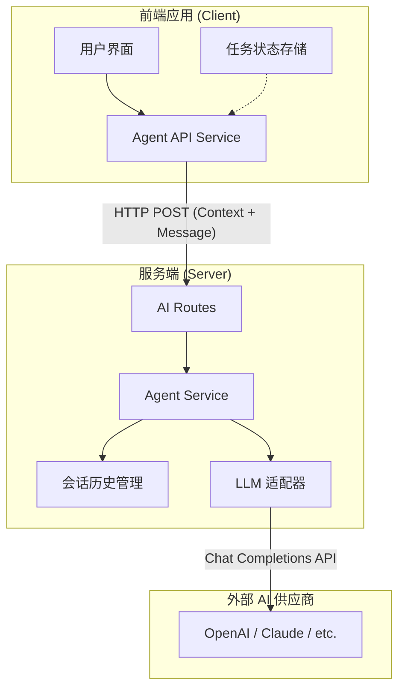
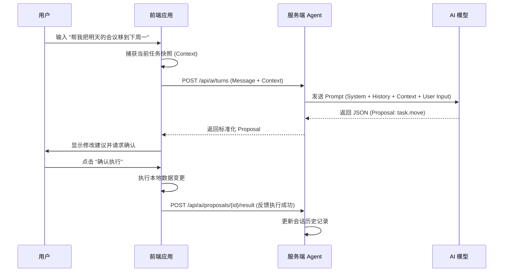
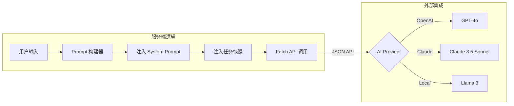
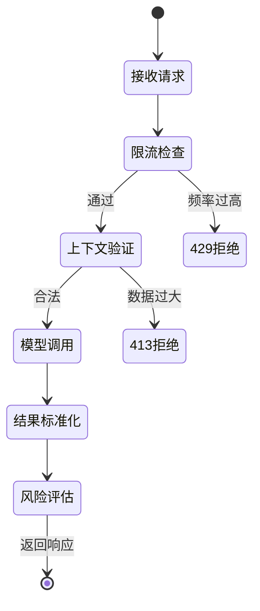

# 服务端 Agent 能力与 API 协作

## 目录
1. [模块概览](#模块概览)
2. [服务端 Agent 架构](#服务端-agent-架构)
3. [核心组件与实现](#核心组件与实现)
   - [AgentService 服务端逻辑](#agentservice-服务端逻辑)
   - [AgentApi 前端封装](#agentapi-前端封装)
4. [API 协议与协作流程](#api-协议与协作流程)
   - [交互时序](#交互时序)
   - [数据契约](#数据契约)
5. [远程解析与 LLM 集成](#远程解析与-llm-集成)
6. [安全、限流与风险控制](#安全-限流与风险控制)
7. [文件参考](#文件参考)

## 模块概览

LightFlux 的 AI 能力不仅局限于前端的本地解析，还通过服务端 Agent 延伸到了更强大的 LLM（大语言模型）领域。服务端 Agent 充当了前端与外部 AI 模型（如 OpenAI 或 Claude）之间的桥梁，负责处理复杂的自然语言理解任务，并将其转化为可执行的任务管理操作。

本模块主要涉及以下两个核心部分：
- **服务端核心 (`server/src/agent.mjs`)**: 实现了 Agent 的核心逻辑，包括对话上下文管理、Prompt 工程、模型响应标准化、风险评估以及限流保护。
- **前端服务 (`lightflux/services/agentApi.ts`)**: 为前端应用提供了调用服务端 AI 能力的简洁接口，封装了复杂的网络请求和状态快照逻辑。

**模块规模统计**:
- **涉及文件总数**: 约 10 个核心文件。
- **主要子模块**:
    - `server/src`: 包含服务端 Agent 的核心实现与路由注册。
    - `lightflux/services`: 包含前端与服务端通信的 API 封装。
- **覆盖深度**: 本文档将深入探讨服务端 Agent 的内部机制、前后端协作协议以及安全防护策略。

## 服务端 Agent 架构

服务端 Agent 采用了典型的代理模式。它并不直接处理任务数据，而是接收前端发送的“状态快照（Context Snapshot）”，结合用户输入的指令，通过精心设计的 System Prompt 引导 LLM 生成结构化的操作建议（Proposals）。

以下图表展示了服务端 Agent 在整个系统中的位置及其与其他组件的交互关系：



**架构说明**:
1. **状态无关性**: 服务端 Agent 本身不持有用户的任务数据库，所有必要的上下文（任务列表、分组信息等）都由前端在每次请求时作为快照发送。这简化了服务端的逻辑，避免了复杂的数据库同步问题。
2. **会话持久化**: 服务端在内存中维护了一个短期的会话历史（Conversation History），用于支持多轮对话和上下文理解。
3. **标准化输出**: 无论底层使用哪种 LLM，服务端都会将模型的响应统一标准化为 `message`（回复）、`clarification`（澄清请求）或 `proposal`（操作建议）。

**Diagram sources**: 
- [agent.mjs](server/src/agent.mjs)
- [index.mjs](server/src/index.mjs)
- [agentApi.ts](lightflux/services/agentApi.ts)

## 核心组件与实现

### AgentService 服务端逻辑

`agent.mjs` 中的 `createAgentService` 是整个服务端 AI 能力的心脏。它负责管理会话、执行限流检查、调用 LLM 并验证返回的 JSON 结构。

```javascript
// server/src/agent.mjs

export const createAgentService = ({
  baseUrl,
  apiKey,
  model,
  // ... 其他配置
}) => {
  const conversations = new Map();
  const proposals = new Map();
  const requestTimestamps = new Map();

  // 处理单次对话轮次
  const turn = async ({ ownerId, request, signal }) => {
    // 1. 清理过期会话与限流检查
    cleanExpired();
    validateContext(request.context);
    consumeRateLimit(ownerId);

    // 2. 获取或创建会话
    let conversation = getOrCreateConversation(ownerId, request.conversationId);

    // 3. 调用 LLM 获取响应
    const modelResponse = await complete([
      { role: 'system', content: SYSTEM_PROMPT },
      ...conversation.messages,
      { role: 'user', content: buildUserContent(request) },
    ], signal);

    // 4. 标准化与验证 Proposal
    const proposal = normalizeProposal({
      modelProposal: modelResponse.proposal,
      context: request.context,
      conversationId: conversation.id,
    });

    // 5. 更新历史并返回结果
    updateConversationHistory(conversation, request.message, modelResponse);
    return { conversationId: conversation.id, message: modelResponse.message, proposal };
  };

  return { isConfigured, turn, proposalResult };
};
```

该组件的关键在于 `normalizeProposal` 函数，它会对 LLM 生成的操作进行严格的校验，确保引用的 `taskId` 或 `groupId` 在当前上下文中确实存在，并为新创建的实体分配临时的 UUID。

### AgentApi 前端封装

在前端，`agentApi.ts` 将底层的 HTTP 请求抽象为简单的异步函数。它会自动获取当前应用的状态快照，并将其附加到请求中。

```typescript
// lightflux/services/agentApi.ts

export const submitAgentTurn = async ({
  message,
  conversationId,
  signal,
}: {
  message: string;
  conversationId?: string;
  signal?: AbortSignal;
}): Promise<AgentTurnResponse> => {
  const request: AgentTurnRequest = {
    conversationId,
    message: message.trim(),
    currentTime: new Date().toISOString(),
    timeZone: Intl.DateTimeFormat().resolvedOptions().timeZone,
    context: getAgentContextSnapshot(), // 获取任务、分组、里程碑的快照
  };

  const response = await fetch(`${agentApiUrl}/api/ai/turns`, {
    body: JSON.stringify(request),
    method: 'POST',
    signal,
  });

  // ... 错误处理与响应解析
  return body;
};
```

**Section sources**:
- [agent.mjs:L616-L910](server/src/agent.mjs#L616-L910)
- [agentApi.ts:L57-L102](lightflux/services/agentApi.ts#L57-L102)

## API 协议与协作流程

### 交互时序

前后端的协作遵循“请求-建议-执行-反馈”的循环。当用户输入指令后，前端发起请求，服务端返回建议，前端执行建议后再次向服务端反馈执行结果，以便服务端更新对话上下文。



在上述时序中，`proposalResult` 的反馈至关重要。如果服务端不知道操作是否成功执行，它在下一轮对话中可能会基于过时的假设生成错误的指令。

### 数据契约

服务端与前端传输的核心对象是 `Command`（在服务端称为 `Operation`）。每个操作都有明确的类型和参数要求。

**典型的 API 请求示例**:
```json
{
  "message": "把买牛奶的任务标记为已完成",
  "currentTime": "2023-10-27T10:00:00Z",
  "timeZone": "Asia/Shanghai",
  "context": {
    "revision": 42,
    "tasks": [{"id": "task-123", "title": "买牛奶", "completed": false}],
    "groups": [],
    "milestones": []
  }
}
```

**典型的 API 响应示例**:
```json
{
  "conversationId": "uuid-conversation-1",
  "message": "好的，我已经为您准备好了更新建议。",
  "proposal": {
    "id": "uuid-proposal-1",
    "summary": "将任务 '买牛奶' 标记为已完成",
    "operations": [
      {
        "type": "task.set_completion",
        "taskId": "task-123",
        "completed": true,
        "operationId": "uuid-op-1",
        "idempotencyKey": "conv-1:turn-1:0"
      }
    ],
    "risk": "medium"
  }
}
```

**Section sources**:
- [agent.mjs:L403-L602](server/src/agent.mjs#L403-L602)
- [agentApi.ts:L17-L39](lightflux/services/agentApi.ts#L17-L39)

## 远程解析与 LLM 集成

服务端 Agent 通过 `complete` 函数与外部 AI 模型集成。它默认支持 OpenAI 兼容的 API 格式，这意味着它可以轻松接入 OpenAI、Claude (通过代理)、Azure OpenAI 或本地部署的模型（如 Ollama）。



**集成要点**:
1. **JSON Mode**: 服务端要求 LLM 必须以 `json_object` 格式返回结果，这通过在请求中设置 `response_format: { type: 'json_object' }` 来实现。
2. **温度控制**: 设置 `temperature: 0.1` 以确保输出的稳定性，减少模型在生成结构化数据时的随机性。
3. **超时管理**: 使用 `AbortSignal.timeout` 设置请求超时（默认 30 秒），防止模型响应过慢导致服务端挂起。
4. **Prompt 工程**: `SYSTEM_PROMPT` 定义了详尽的规则，包括禁止模型执行永久删除、如何处理日期、如何使用临时引用（clientRef）等。

**Section sources**:
- [agent.mjs:L7-L55](server/src/agent.mjs#L7-L55)
- [agent.mjs:L688-L743](server/src/agent.mjs#L688-L743)

## 安全、限流与风险控制

由于 AI 接口通常成本较高且容易受到滥用，服务端 Agent 实现了一套多层防护机制。

### 限流策略 (Rate Limiting)
服务端通过 `consumeRateLimit` 函数对请求进行频率限制。
- **维度**: 基于 `ownerId`（登录用户 ID）或匿名用户的 IP 地址。
- **配置**: 默认每 60 秒允许 20 次请求。
- **实现**: 使用内存中的时间戳数组进行滑动窗口计数。

### 风险评估 (Risk Assessment)
每个生成的 `proposal` 都会被自动评估风险等级：
- **Low**: 仅包含创建类操作（如 `task.create`）。
- **Medium**: 包含修改或移动操作（如 `task.move`, `task.set_completion`）。
- **High**: 包含删除操作（如 `task.trash`）。

风险等级会返回给前端，前端可以根据等级决定是否需要用户进行更显眼的确认。

### 上下文校验 (Context Validation)
为了防止大数据量攻击，服务端会检查 `context` 快照的大小：
- 任务数上限：1000
- 分组数上限：200
- 里程碑数上限：500

如果超过这些阈值，服务端将拒绝处理并返回 `413 Payload Too Large`。



**Section sources**:
- [agent.mjs:L215-L242](server/src/agent.mjs#L215-L242)
- [agent.mjs:L244-L264](server/src/agent.mjs#L244-L264)
- [agent.mjs:L674-L686](server/src/agent.mjs#L674-L686)

## 文件参考

以下是本模块涉及的关键源文件，按其在协作流程中的角色排序：

| 文件路径 | 角色 | 主要职责 |
| :--- | :--- | :--- |
| `server/src/agent.mjs` | 服务端核心 | 实现 AgentService，处理 LLM 集成、Proposal 生成与限流。 |
| `lightflux/services/agentApi.ts` | 前端 API | 封装与服务端的 HTTP 通信，获取状态快照。 |
| `server/src/index.mjs` | 服务端入口 | 注册 `/api/ai/*` 路由，初始化 Agent 服务配置。 |
| `lightflux/services/todoStorage.ts` | 数据源 | 前端任务存储，为 Agent 提供上下文快照数据。 |
| `lightflux/services/appStateMerge.ts` | 数据处理 | 处理 Agent 返回的 Proposal 并将其合并到本地状态。 |

**Section sources**:
- [agent.mjs](server/src/agent.mjs)
- [agentApi.ts](lightflux/services/agentApi.ts)
- [index.mjs](server/src/index.mjs)
