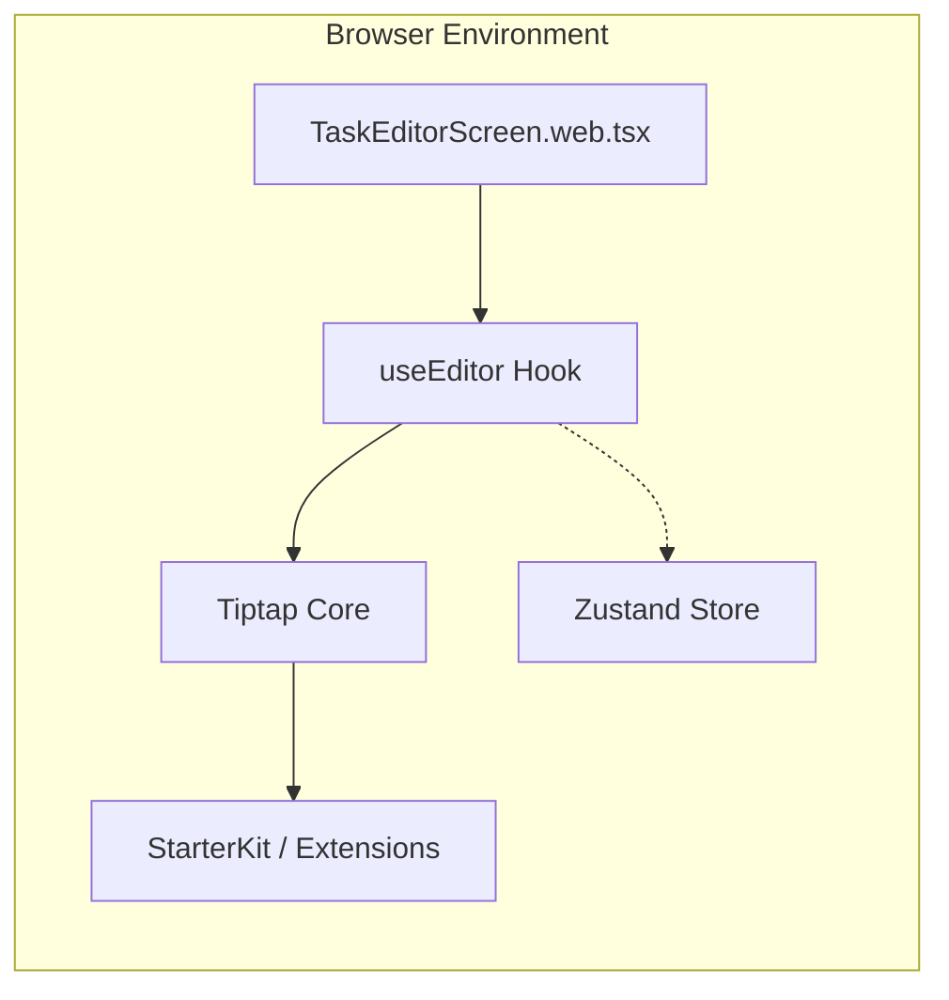
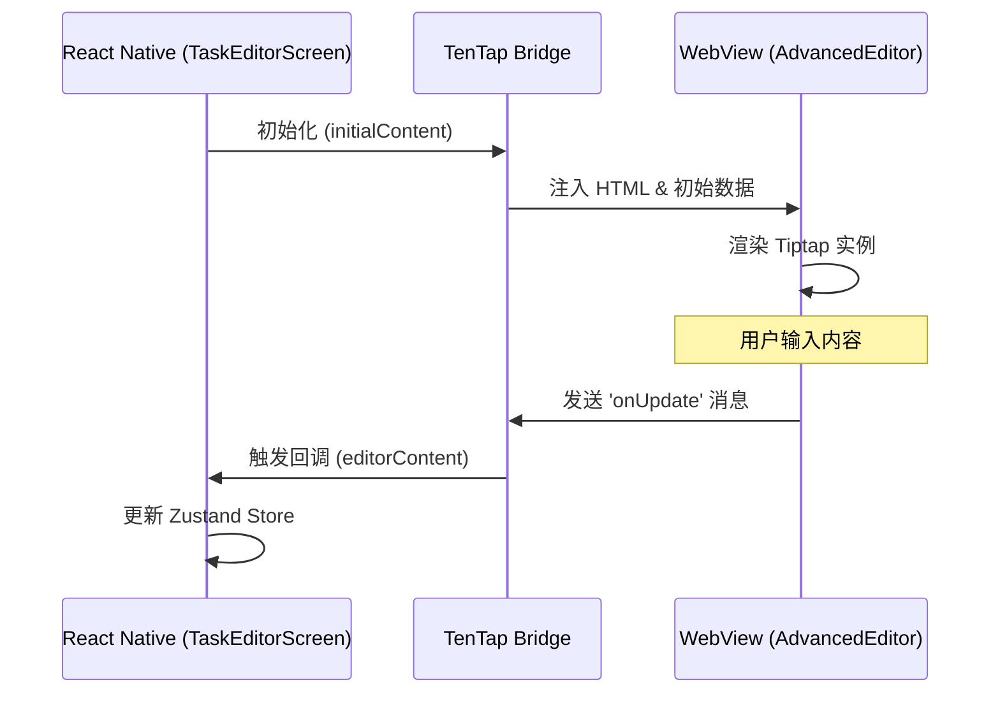
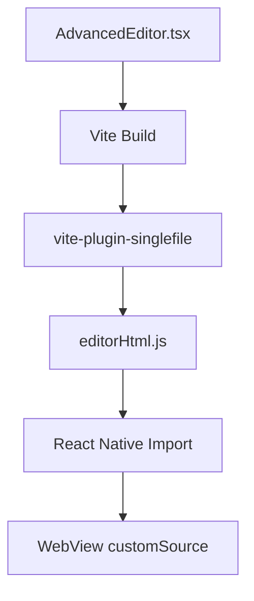
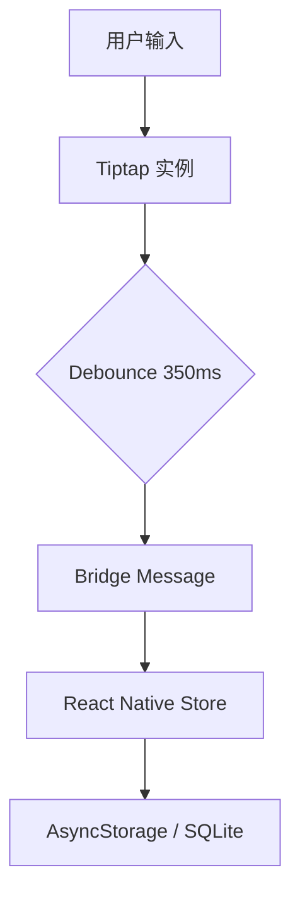

# 富文本编辑器集成

## Table of Contents
1. [模块概览](#模块概览)
2. [引言：跨平台富文本方案](#引言跨平台富文本方案)
3. [架构设计](#架构设计)
   - [Web 端直连架构](#web-端直连架构)
   - [Native 端 WebView 桥接架构](#native-端-webview-桥接架构)
4. [核心组件解析](#核心组件解析)
   - [AdvancedEditor：Native 编辑器入口](#advancededitornative-编辑器入口)
   - [CodeBlockBridge：自定义桥接扩展](#codeblockbridge自定义桥接扩展)
   - [TaskEditorScreen：跨平台容器实现](#taskeditorscreen跨平台容器实现)
5. [构建流程与独立部署](#构建流程与独立部署)
6. [双向通信机制](#双向通信机制)
7. [任务元数据与 Markdown 支持](#任务元数据与-markdown-支持)
8. [性能优化与最佳实践](#性能优化与最佳实践)
9. [关键源文件参考](#关键源文件参考)

## 模块概览

本模块负责 LightFlux 项目中任务详情的富文本编辑功能。为了在 Web 和移动端（iOS/Android）提供高度一致的编辑体验，项目采用了基于 Tiptap 的统一方案。

**文件统计与范围**：
- **总文件数**：15 个核心源文件。
- **核心目录**：
  - `lightflux/editor-web/`：独立的 Web 编辑器项目，用于构建 Native 端所需的 HTML 资源。
  - `lightflux/components/editor/`：React Native 组件层，负责编辑器在双端的集成与交互。
- **覆盖深度**：深度解析（Deep）。涵盖从 Vite 构建流程到 React Native WebView 通信的全链路实现。

## 引言：跨平台富文本方案

在移动应用开发中，富文本编辑器一直是一个挑战。原生组件（如 iOS 的 `UITextView` 或 Android 的 `EditText`）在处理复杂的 Markdown 渲染、代码块高亮和跨平台样式一致性时非常吃力。

LightFlux 选择 **WebView + Tiptap** 的方案，主要基于以下考量：
1. **体验一致性**：确保用户在 Web 端和手机端编辑同一个任务时，看到的格式、样式和交互逻辑完全一致。
2. **生态复用**：Tiptap 拥有极其丰富的插件生态（StarterKit, Image, CodeBlock 等），无需在 Native 端重新实现。
3. **Markdown 原生支持**：Tiptap 基于 ProseMirror，能够完美处理 Markdown 序列化与反序列化。

为了解决 WebView 的性能瓶颈，项目引入了 `@10play/tentap-editor` 桥接库，并配合 Vite 独立构建流程，实现了近乎原生的响应速度。

## 架构设计

LightFlux 的编辑器架构根据运行环境的不同分为两种模式：

### Web 端直连架构

在 Web 环境下，编辑器直接运行在浏览器主线程中，通过 `useEditor` 钩子与 React 组件交互。



在 Web 端，`TaskEditorScreen.web.tsx` 直接管理 Tiptap 实例，数据同步通过 `onUpdate` 回调直接触发 Zustand store 的更新。

### Native 端 WebView 桥接架构

在 Native 环境下，编辑器运行在一个隐藏的 WebView 中，通过消息桥接与 React Native 层通信。



**架构说明**：
- **React Native 层**：负责 UI 布局、任务元数据展示（Milestone/Priority）以及与全局 Store 的同步。
- **WebView 层**：运行由 Vite 构建的单文件 HTML，包含完整的 Tiptap 逻辑。
- **通信桥**：使用 `CodeBlockBridge` 等扩展定义双向通信协议。

**架构图源码参考**:
- [TaskEditorScreen.native.tsx:L64-L79](lightflux/components/editor/TaskEditorScreen.native.tsx#L64-L79)
- [AdvancedEditor.tsx:L9-L15](lightflux/editor-web/AdvancedEditor.tsx#L9-L15)

## 核心组件解析

### AdvancedEditor：Native 编辑器入口

`AdvancedEditor.tsx` 是 WebView 内部的 React 入口。它定义了 Native 端支持的所有 Tiptap 插件。

```typescript
// lightflux/editor-web/AdvancedEditor.tsx
export const AdvancedEditor = () => {
  const editor = useTenTap({
    bridges: [...TenTapStartKit, CodeBlockBridge],
  });

  return <EditorContent editor={editor} />;
};
```

这里使用了 `useTenTap` 钩子，它会自动处理来自 React Native 层的初始化数据和命令。

### CodeBlockBridge：自定义桥接扩展

为了支持代码块的切换和状态同步，项目自定义了 `CodeBlockBridge`。它不仅是 Tiptap 的扩展，也是 Native 端的通信定义。

```typescript
// lightflux/components/editor/CodeBlockBridge.ts
export const CodeBlockBridge = new BridgeExtension<
  CodeBlockState,
  CodeBlockInstance,
  CodeBlockMessage
>({
  tiptapExtension: CodeBlock,
  onBridgeMessage: (editor, message) => {
    if (message.type === 'toggle-code-block') {
      editor.chain().focus().toggleCodeBlock().run();
    }
    return false;
  },
  extendEditorState: (editor) => ({
    canToggleCodeBlock: editor.can().toggleCodeBlock(),
    isCodeBlockActive: editor.isActive('codeBlock'),
  }),
  // ... 注入自定义 CSS 确保 Native 端渲染美观
});
```

`BridgeExtension` 允许我们将编辑器内部的状态（如 `isCodeBlockActive`）实时同步给 React Native，从而让 RN 层的工具栏按钮能正确显示高亮状态。

### TaskEditorScreen：跨平台容器实现

`TaskEditorScreen` 在 Web 和 Native 下有不同的实现，但保持了相似的 API 结构。

- **Web 实现**：直接在 `ScrollView` 中渲染 `EditorContent`，处理图片粘贴上传逻辑。
- **Native 实现**：使用 `RichText` 组件作为 WebView 容器，通过 `editorHtml` 注入预构建的资源。

**核心组件源码参考**:
- [AdvancedEditor.tsx](lightflux/editor-web/AdvancedEditor.tsx)
- [CodeBlockBridge.ts](lightflux/components/editor/CodeBlockBridge.ts)
- [TaskEditorScreen.native.tsx](lightflux/components/editor/TaskEditorScreen.native.tsx)

## 构建流程与独立部署

`editor-web` 目录是一个独立的 Vite 项目。其核心任务是将整个编辑器环境打包成一个单文件 HTML，以便 React Native 能够离线加载。



**关键配置解析**：
- **`vite-plugin-singlefile`**：将所有 JS 和 CSS 内联到 HTML 中，避免 WebView 加载外部资源导致的延迟。
- **Alias 配置**：在 `vite.config.ts` 中，通过 `alias` 将 Tiptap 的核心库重定向到 `@10play/tentap-editor/web`，这是为了确保在 Web 环境下正确运行。

**构建配置参考**:
- [vite.config.ts](lightflux/editor-web/vite.config.ts)

## 双向通信机制

编辑器与 React Native 之间的通信是异步的。为了保证性能，项目采用了以下策略：

1. **状态同步 (State Syncing)**：
   通过 `extendEditorState` 将 Tiptap 的选区状态、格式状态（加粗、标题等）定期推送到 RN 层。
2. **命令执行 (Command Execution)**：
   RN 层通过 `editor.toggleCodeBlock()` 等方法发送消息，WebView 接收后通过 `onBridgeMessage` 执行对应的 Tiptap 命令。
3. **内容持久化**：
   Native 端使用 `useEditorContent` 钩子，并配置 `debounceInterval: 350`。这意味着用户输入停止 350ms 后，内容才会同步到 Zustand store，有效减少了桥接层的通信压力。



**通信机制源码参考**:
- [TaskEditorScreen.native.tsx:L80-L98](lightflux/components/editor/TaskEditorScreen.native.tsx#L80-L98)

## 任务元数据与 Markdown 支持

### 任务元数据 (Metadata)

虽然编辑器支持富文本，但任务的标题、日期、分组和优先级等元数据被设计为独立组件 `TaskEditorMetadata`。

```typescript
// lightflux/components/editor/TaskEditorMetadata.tsx
const TaskEditorMetadata = ({ groupName, labels, language, todo }) => {
  // ... 渲染日历、分组和优先级 Chip
};
```

这种设计将结构化数据（元数据）与非结构化数据（富文本内容）分离，既保证了数据库查询的效率，也简化了编辑器的实现逻辑。

### Markdown 支持

通过 `TenTapStartKit`（基于 Tiptap StarterKit），编辑器原生支持 Markdown 快捷键。例如，输入 `# ` 会自动转换为一级标题。在 Web 端，图片上传通过 `handlePaste` 拦截并调用 `uploadTaskImage` 服务实现。

## 性能优化与最佳实践

为了提供流畅的编辑体验，项目实施了以下优化：

1. **预构建 HTML**：Native 端不动态生成 HTML，而是直接引用 `build/editorHtml.js` 中的字符串。
2. **避免重复渲染**：在 `TaskEditorScreen.native.tsx` 中，使用 `useRef` 记录 `lastSavedContent`，只有当内容真正发生变化时才调用 `updateTodo`。
3. **键盘避让**：配置 `avoidIosKeyboard: true`，确保在 iOS 上输入法弹出时，编辑器内容不会被遮挡。
4. **图片懒加载**：在 Web 端配置 `Image.configure({ HTMLAttributes: { loading: 'lazy' } })`，优化长文档的渲染性能。

> 💡 **提示**：在开发调试 Native 编辑器时，可以通过开启 WebView 的调试模式来查看 Tiptap 内部的控制台输出。

## 关键源文件参考

本章节涉及的核心文件如下：

- [lightflux/editor-web/vite.config.ts](lightflux/editor-web/vite.config.ts)：Vite 构建配置。
- [lightflux/editor-web/AdvancedEditor.tsx](lightflux/editor-web/AdvancedEditor.tsx)：Native 编辑器核心定义。
- [lightflux/components/editor/CodeBlockBridge.ts](lightflux/components/editor/CodeBlockBridge.ts)：自定义桥接扩展实现。
- [lightflux/components/editor/TaskEditorScreen.native.tsx](lightflux/components/editor/TaskEditorScreen.native.tsx)：Native 端集成逻辑。
- [lightflux/components/editor/TaskEditorScreen.web.tsx](lightflux/components/editor/TaskEditorScreen.web.tsx)：Web 端集成逻辑。
- [lightflux/components/editor/TaskEditorMetadata.tsx](lightflux/components/editor/TaskEditorMetadata.tsx)：任务元数据展示组件。
- [lightflux/editor-web/index.tsx](lightflux/editor-web/index.tsx)：WebView 入口挂载逻辑。
