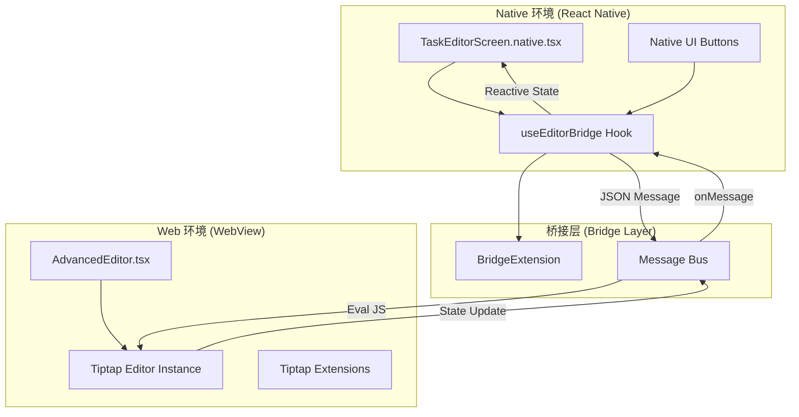
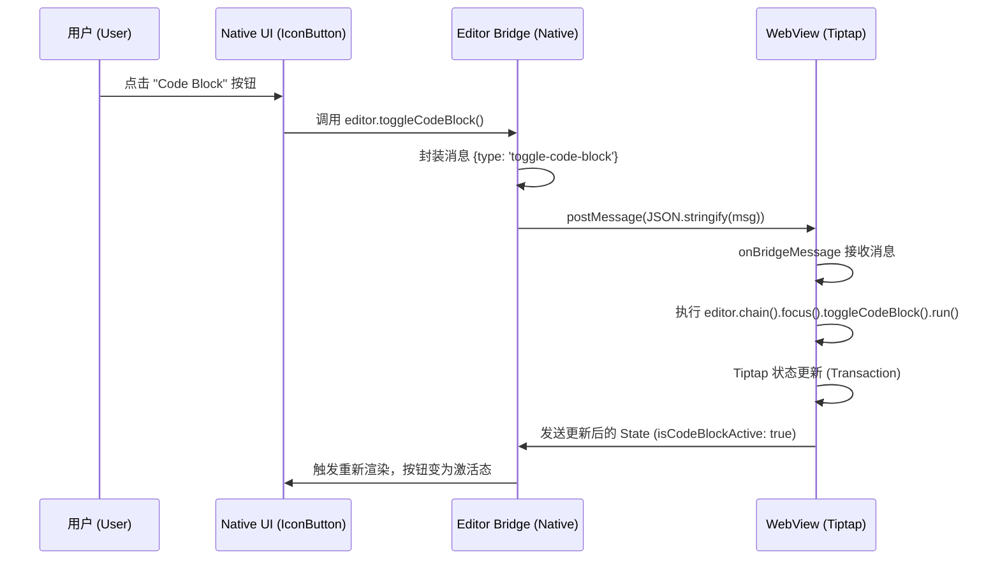

# Native 端 WebView 桥接机制

## 目录
1. [模块概览](#模块概览)
2. [引言](#引言)
3. [架构设计](#架构设计)
4. [核心组件解析](#核心组件解析)
5. [Bridge 模式深度解析](#bridge-模式深度解析)
6. [消息传递机制](#消息传递机制)
7. [性能优化与 UX 策略](#性能优化与-ux-策略)
8. [资源加载与构建流程](#资源加载与构建流程)
9. [内容同步与状态管理](#内容同步与状态管理)
10. [文件参考](#文件参考)

## 模块概览

本模块负责 LightFlux 在 Native 端（iOS/Android）的高级富文本编辑功能。由于 React Native 原生的 `TextInput` 难以支持复杂的富文本（如代码块、图片嵌入、Markdown 实时渲染等），系统采用了基于 WebView 的 Tiptap 编辑器方案，并通过高性能的桥接机制实现 Native UI 与 Web 编辑器之间的无缝交互。

**统计信息**：
- **涉及文件总数**：约 12 个核心文件。
- **主要子模块**：
    - `lightflux/components/editor/`：Native 端界面与桥接逻辑（核心覆盖）。
    - `lightflux/editor-web/`：Web 端编辑器实现与构建配置（核心覆盖）。
    - `lightflux/store/`：负责持久化编辑器内容的 Todo Store（简要提及）。

本 Wiki 将重点解析 `TaskEditorScreen.native.tsx` 这一关键入口，以及 `CodeBlockBridge.ts` 所代表的自定义桥接扩展模式。

## 引言

在移动端开发中，实现一个既美观又功能强大的富文本编辑器是一项巨大的挑战。传统的 Native 实现往往受限于平台差异，且难以复用 Web 端成熟的生态（如 Tiptap/ProseMirror）。LightFlux 选择了 `@10play/tentap-editor` 方案，它本质上是在 React Native 的 `WebView` 中运行一个精简的 Tiptap 实例，并提供了一套声明式的 API 来处理跨环境通信。

本页面的目标是深入剖析这一桥接机制的底层原理，帮助开发者理解如何扩展编辑器功能、优化通信性能以及处理复杂的键盘遮挡等移动端特有的交互问题。通过掌握这套机制，开发者可以轻松地将任何 Web 端编辑器功能引入 Native 环境，同时保持 Native 级别的用户体验。

## 架构设计

LightFlux 的编辑器架构采用了典型的“宿主-容器”模型。Native 端作为宿主，负责 UI 布局、键盘控制和数据持久化；WebView 作为容器，负责富文本的渲染、编辑逻辑和 Markdown 解析。

### Native-WebView 双向通信架构

Native 与 Web 之间的通信不是简单的 `postMessage` 调用，而是通过 `@10play/tentap-editor` 封装的 `Bridge` 层进行。



在上述架构中，`BridgeExtension` 起到了协议定义的作用。它定义了 Native 端可以调用哪些 Web 端命令（Instance），以及 Web 端需要向 Native 端同步哪些状态（State）。这种模式确保了双端代码的强类型约束和逻辑解耦。

**架构说明**：
- **Native 环境**：使用 `useEditorBridge` 管理编辑器的生命周期。它通过 `customSource` 加载预构建的 HTML。
- **桥接层**：负责消息的序列化与反序列化。当 Native 点击“代码块”按钮时，发送一个 `toggle-code-block` 消息；Web 端接收后执行相应的 Tiptap 命令。
- **Web 环境**：运行在一个隔离的 WebView 中，通过 `EditorContent` 渲染 Tiptap 内容。它不感知 Native 的存在，只通过 Bridge 暴露的钩子进行交互。

**Diagram sources**:
- [TaskEditorScreen.native.tsx:L64-L79](lightflux/components/editor/TaskEditorScreen.native.tsx#L64-L79)
- [CodeBlockBridge.ts:L17-L51](lightflux/components/editor/CodeBlockBridge.ts#L17-L51)

## 核心组件解析

### TaskEditorScreen.native.tsx

这是 Native 端的编辑器主界面。它不仅负责渲染 `RichText` 组件，还处理了标题编辑、元数据展示（优先级、截止日期）以及与 Zustand Store 的同步。

```typescript
// TaskEditorScreen.native.tsx 核心逻辑
const editor = useEditorBridge({
  autofocus: false,
  avoidIosKeyboard: true, // 关键：处理 iOS 键盘遮挡
  bridgeExtensions: [...TenTapStartKit, CodeBlockBridge], // 注册桥接扩展
  customSource: editorHtml, // 注入预构建的 HTML 资源
  editable: !readOnly,
  initialContent: todo?.content,
});
```

`useEditorBridge` 是整个机制的核心。它初始化了一个桥接实例，该实例会自动处理 WebView 的创建和消息监听。通过 `bridgeExtensions` 数组，我们可以灵活地插拔功能模块。

### CodeBlockBridge.ts

`CodeBlockBridge` 是自定义功能的典范。它展示了如何将 Tiptap 的 `CodeBlock` 扩展封装成一个可在 Native 端操控的 Bridge。

```typescript
export const CodeBlockBridge = new BridgeExtension<
  CodeBlockState,
  CodeBlockInstance,
  CodeBlockMessage
>({
  tiptapExtension: CodeBlock,
  onBridgeMessage: (editor, message) => {
    if (message.type === 'toggle-code-block') {
      editor.chain().focus().toggleCodeBlock().run();
    }
    return false;
  },
  extendEditorInstance: (sendBridgeMessage) => ({
    toggleCodeBlock: () => sendBridgeMessage({ type: 'toggle-code-block' }),
  }),
  extendEditorState: (editor) => ({
    canToggleCodeBlock: editor.can().toggleCodeBlock(),
    isCodeBlockActive: editor.isActive('codeBlock'),
  }),
});
```

这个文件定义了三个关键接口：
1. `CodeBlockState`：Web 端同步给 Native 的状态（例如：当前光标是否在代码块内）。
2. `CodeBlockInstance`：Native 端可以调用的方法（例如：`editor.toggleCodeBlock()`）。
3. `CodeBlockMessage`：双端通信的消息格式。

### AdvancedEditor.tsx (Web 端)

在 WebView 内部，`AdvancedEditor` 接收来自 Native 的桥接定义，并初始化 Tiptap 实例。

```typescript
export const AdvancedEditor = () => {
  const editor = useTenTap({
    bridges: [...TenTapStartKit, CodeBlockBridge],
  });

  return <EditorContent editor={editor} />;
};
```

这里必须保证 `bridges` 数组与 Native 端保持一致，否则消息将无法被正确路由和处理。

**Section sources**:
- [TaskEditorScreen.native.tsx](lightflux/components/editor/TaskEditorScreen.native.tsx)
- [CodeBlockBridge.ts](lightflux/components/editor/CodeBlockBridge.ts)
- [AdvancedEditor.tsx](lightflux/editor-web/AdvancedEditor.tsx)

## Bridge 模式深度解析

Bridge 模式的核心在于将复杂的 Tiptap API 抽象为简单的消息协议。`@10play/tentap-editor` 提供的 `BridgeExtension` 类通过几个核心钩子实现了这一目标。

### extendEditorInstance 钩子

该钩子用于在 Native 端的 `editor` 对象上注入自定义方法。它接收一个 `sendBridgeMessage` 函数，允许 Native 发送异步指令给 WebView。

> **注意**：由于 Native 与 Web 的通信是跨进程的，这些方法通常是异步触发的，虽然在 Native 端看起来像普通的函数调用。

### extendEditorState 钩子

该钩子定义了哪些 Web 端状态需要被“推”送到 Native 端。每当 Tiptap 的编辑器状态（Transaction）发生变化时，`extendEditorState` 都会被执行，并将结果通过桥接发送给 Native。

这对于实现 Native 工具栏非常重要。例如，如果 `isCodeBlockActive` 为 true，Native 端的代码块按钮会自动变色，提供实时的视觉反馈。

### extendCSS 钩子

`BridgeExtension` 还允许注入自定义 CSS 到 WebView 中。在 `CodeBlockBridge.ts` 中，我们为 `pre` 标签定义了深色背景和圆角，确保了编辑器在 WebView 内部的渲染效果符合 LightFlux 的 UI 风格。

```typescript
extendCSS: `
  pre {
    background: #25233b;
    border-radius: 12px;
    color: #f4f2ff;
    padding: 16px;
  }
`,
```

这种声明式的注入方式避免了手动操作 DOM 或注入 JS 的繁琐过程。

## 消息传递机制

了解消息如何在双端流动对于调试至关重要。以下序列图展示了从用户在 Native 端点击按钮到 WebView 内容更新的完整链路。



这个流程体现了数据流的闭环。Native 端不直接修改内容，而是通过发送意图（Intent）来驱动 Web 端执行。Web 端执行完毕后，再将最新的状态反馈给 Native 端。

**消息传递细节**：
1. **序列化**：所有跨环境传输的数据都必须是可序列化的 JSON 对象。
2. **异步性**：Native 调用 `editor.getJSON()` 等方法时，底层会返回一个 Promise，等待 WebView 的响应。
3. **冲突处理**：如果 Native 和 Web 同时修改内容，Tiptap 的 Transaction 机制会负责解决冲突。

**Diagram sources**:
- [CodeBlockBridge.ts:L23-L36](lightflux/components/editor/CodeBlockBridge.ts#L23-L36)

## 性能优化与 UX 策略

在 WebView 中运行编辑器可能会带来性能开销，特别是在处理大型文档或频繁同步时。LightFlux 采取了以下策略来确保流畅度：

### debounceInterval 的应用

在 `TaskEditorScreen.native.tsx` 中，我们使用了 `useEditorContent` 来监听内容变化：

```typescript
const editorContent = useEditorContent(editor, {
  debounceInterval: 350, // 关键：防抖处理
  type: 'json',
}) as RichTextDocument | undefined;
```

**为什么需要防抖？**
用户打字时，Tiptap 会频繁触发内容变更事件。如果每次变更都立即同步到 Native 端并触发 Zustand Store 的更新，会导致主线程卡顿，甚至引起输入延迟。设置 `350ms` 的防抖间隔，可以确保只有在用户停止输入一段时间后才进行数据持久化，极大地减轻了通信压力。

### avoidIosKeyboard 键盘处理

在 iOS 上，WebView 内部的焦点获取往往无法自动触发 Native 容器的滚动，导致键盘遮挡住正在输入的行。

```typescript
const editor = useEditorBridge({
  avoidIosKeyboard: true, // 开启键盘自动避让
  // ...
});
```

开启此选项后，桥接库会自动监听键盘弹出事件，并调整 WebView 的内容偏移量或容器高度，确保光标始终在可视区域内。这是实现“Native 感”编辑体验的关键配置。

### 资源预加载

通过将编辑器代码构建为单 HTML 文件并注入 `customSource`，我们避免了 WebView 加载远程 URL 的延迟。编辑器几乎是瞬间开启的。

## 资源加载与构建流程

WebView 需要加载 HTML 和 JS 才能运行。LightFlux 并没有将编辑器部署在 Web 服务器上，而是将其打包进 App 包内。

### customSource 注入机制

在 `TaskEditorScreen.native.tsx` 中，`customSource: editorHtml` 并不是一个普通的字符串，而是经过 Base64 编码或内联处理后的完整 HTML 资源。

```typescript
import { editorHtml } from '../../editor-web/build/editorHtml';
```

### Vite 单文件构建流程

为了生成这个 `editorHtml`，`lightflux/editor-web` 目录使用了专门的构建流程：

1. **Vite 构建**：使用 `vite-plugin-singlefile` 插件，将所有的 CSS 和 JS 全部内联进 `index.html`。
2. **脚本转换**：运行 `buildEditor.js` 脚本，将 `index.html` 转换为一个导出字符串的 TypeScript/JavaScript 文件（即 `editorHtml.js`）。

```mermaid
graph LR
    A[index.tsx + AdvancedEditor.tsx] --> B[Vite Build]
    B --> C[index.html (Single File)]
    C --> D[buildEditor.js Script]
    D --> E[editorHtml.js]
    E --> F[TaskEditorScreen.native.tsx]
```

这种方式确保了编辑器代码的版本与 Native 代码完全同步，且无需网络请求即可运行。

**Diagram sources**:
- [package.json:L10-L11](lightflux/package.json#L10-L11)
- [vite.config.ts:L45](lightflux/editor-web/vite.config.ts#L45)

## 内容同步与状态管理

编辑器的内容同步遵循“单向数据流”原则，但由于 WebView 的存在，它变成了一个“双向同步”的过程。

### 从 Store 到编辑器 (初始化)

当用户打开一个 Todo 时，`initialContent` 被传递给 `useEditorBridge`。桥接库会将这些数据序列化并注入到 WebView 的 Tiptap 实例中。

### 从编辑器到 Store (自动保存)

我们使用 `useEffect` 监控 `editorContent` 的变化，并将其持久化到全局 Store。

```typescript
useEffect(() => {
  if (!readOnly && editorContent) {
    const serializedContent = JSON.stringify(editorContent);
    // 只有在内容真正变化时才更新 Store，避免冗余更新
    if (serializedContent !== lastSavedContent.current) {
      lastSavedContent.current = serializedContent;
      updateTodo(todoId, { content: editorContent });
    }
  }
}, [editorContent, readOnly, todoId, updateTodo]);
```

这里使用了 `lastSavedContent` 引用来存储上一次保存的内容快照。由于 `editorContent` 是一个复杂的 JSON 对象，直接在依赖项中比较可能会导致无限循环或性能问题，因此通过序列化后的字符串进行比对是一种稳健的做法。

### 退出时的强制保存

在 `closeEditor` 函数中，我们通过 `await editor.getJSON()` 显式获取一次最新内容，以确保在用户快速退出时，最后一次输入也能被正确捕获。

## 文件参考

以下是实现 Native 端 WebView 桥接机制的关键文件：

- `lightflux/components/editor/TaskEditorScreen.native.tsx`：Native 端主入口，配置 `useEditorBridge`。
- `lightflux/components/editor/CodeBlockBridge.ts`：自定义桥接扩展的定义文件。
- `lightflux/editor-web/AdvancedEditor.tsx`：Web 端编辑器容器，负责接收桥接配置。
- `lightflux/editor-web/index.tsx`：Web 端入口，处理内容注入后的挂载逻辑。
- `lightflux/editor-web/vite.config.ts`：Vite 配置文件，负责单文件打包。
- `lightflux/package.json`：包含 `editor:build` 和 `editor:postbuild` 构建脚本。
- `lightflux/store/todoStore.ts`：负责存储和更新 Todo 内容的 Zustand Store。

**Section sources**:
- [TaskEditorScreen.native.tsx](lightflux/components/editor/TaskEditorScreen.native.tsx)
- [CodeBlockBridge.ts](lightflux/components/editor/CodeBlockBridge.ts)
- [AdvancedEditor.tsx](lightflux/editor-web/AdvancedEditor.tsx)
- [package.json](lightflux/package.json)
