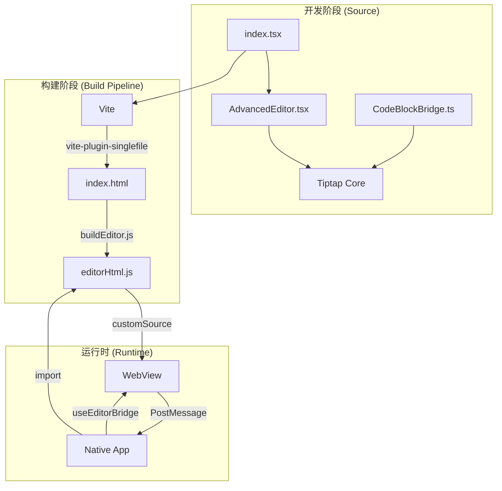
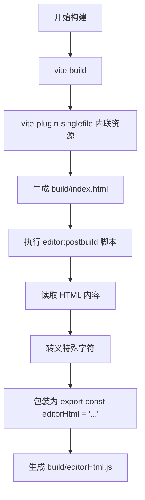
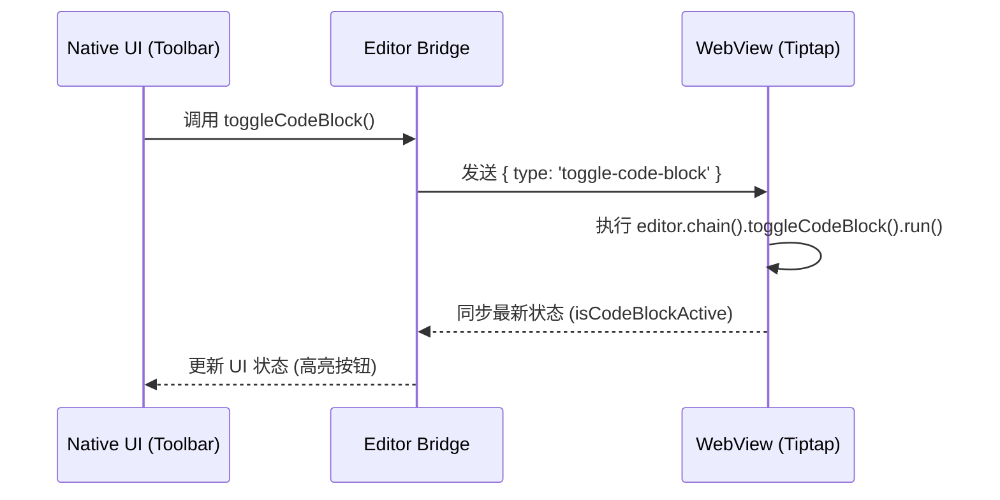

# Tiptap 编辑器核心与构建流程

## 目录
1. [模块概览](#模块概览)
2. [编辑器独立化的必要性](#编辑器独立化的必要性)
3. [架构设计与组件关系](#架构设计与组件关系)
4. [Tiptap 核心配置与扩展](#tiptap-核心配置与扩展)
5. [Vite 构建流程深度解析](#vite-构建流程深度解析)
6. [单文件 HTML 生成与转换机制](#单文件-html-生成与转换机制)
7. [Native 端集成与通信桥接](#native-端集成与通信桥接)
8. [性能优化与兼容性处理](#性能优化与兼容性处理)
9. [文件引用](#文件引用)

## 模块概览

`lightflux/editor-web` 模块是 LightFlux 应用的核心富文本编辑引擎。它作为一个独立的 Web 项目存在，旨在为移动端（Native）提供高性能、可定制且功能丰富的 Tiptap 编辑器环境。

### 统计信息
- **总文件数**: 9 个源文件
- **核心目录**:
    - `build/`: 存放构建后的产物，包括关键的 `editorHtml.js`。
    - `root`: 根目录下包含编辑器逻辑 `AdvancedEditor.tsx` 和构建配置 `vite.config.ts`。

### 核心职责
该模块负责将现代 Web 富文本编辑技术（Tiptap）打包成一个轻量级的 HTML/JS 字符串，使得 Native 端可以通过 `react-native-webview` 无缝加载并与之通信。这种架构实现了“一次编写，多端复用”的编辑器逻辑，同时保持了 Web 端在处理复杂文本排版时的天然优势。

---

## 编辑器独立化的必要性

在开发跨平台移动应用时，直接在 Native 端实现复杂的富文本编辑器（如支持代码块、图片混排、撤销重做等）具有极高的开发成本和维护难度。LightFlux 选择将编辑器独立成一个 Web 项目，主要基于以下考虑：

1. **生态兼容性**: Tiptap 是基于 ProseMirror 的现代富文本编辑器框架，拥有庞大的扩展生态。通过 Web 项目承载，可以直接利用这些成熟的 Web 插件。
2. **性能隔离**: 编辑器的渲染逻辑运行在 WebView 的独立进程中，不会阻塞 Native 端的主 UI 线程，从而保证了长文档编辑时的流畅度。
3. **逻辑复用**: 同样的编辑器核心代码可以轻松适配到桌面端（Tauri）或纯 Web 端，无需为不同平台重写编辑逻辑。
4. **定制化能力**: CSS 在处理富文本样式（如代码高亮、引用块、列表缩进）方面比 Native 布局引擎更灵活、更强大。

---

## 架构设计与组件关系

LightFlux 的编辑器架构采用了“桥接模式”（Bridge Pattern），通过 `@10play/tentap-editor` 库实现 Native 环境与 Web 环境的双向同步。

下面的架构图展示了编辑器从开发、构建到运行时的完整生命周期：



**架构说明**:
- **开发阶段**: 开发者在 `editor-web` 中编写 React 组件，定义 Tiptap 的扩展和样式。
- **构建阶段**: Vite 将所有资源（JS, CSS, HTML）压缩并内联到一个单文件中，随后通过脚本转换为 JS 导出字符串。
- **运行时**: Native 端通过 `editorHtml.js` 加载编辑器内容，并利用桥接机制同步编辑器状态（如标题、内容、撤销栈）。

**Diagram sources**:
- [package.json](lightflux/package.json)
- [vite.config.ts](lightflux/editor-web/vite.config.ts)
- [TaskEditorScreen.native.tsx](lightflux/components/editor/TaskEditorScreen.native.tsx)

---

## Tiptap 核心配置与扩展

在 `AdvancedEditor.tsx` 中，编辑器通过 `useTenTap` 钩子进行初始化。这是 Web 端的入口，负责接收来自 Native 的指令并渲染编辑器内容。

### 核心组件实现

```typescript
// lightflux/editor-web/AdvancedEditor.tsx
import { EditorContent } from '@tiptap/react';
import { TenTapStartKit, useTenTap } from '@10play/tentap-editor';
import { CodeBlockBridge } from '../components/editor/CodeBlockBridge';

export const AdvancedEditor = () => {
  const editor = useTenTap({
    bridges: [...TenTapStartKit, CodeBlockBridge],
  });

  return <EditorContent editor={editor} />;
};
```

### 关键机制解析
1. **`useTenTap`**: 这是一个由 `@10play/tentap-editor` 提供的特殊钩子，它不仅初始化了 Tiptap 实例，还自动注入了 Web 端的桥接监听逻辑，使得 WebView 能够响应 Native 端发送的 `evalJS` 指令。
2. **`TenTapStartKit`**: 预设的 Tiptap 扩展包，包含了加粗、斜体、列表等基础功能。
3. **`CodeBlockBridge`**: 自定义的桥接扩展，用于处理代码块逻辑。它定义了如何在 Native 按钮点击时触发 Web 端的代码块切换。

### 启动握手逻辑
为了确保编辑器在内容注入后才开始渲染，`index.tsx` 采用了轮询检查机制：

```typescript
// lightflux/editor-web/index.tsx
const interval = window.setInterval(() => {
  if (!window.contentInjected) {
    return;
  }
  const container = document.getElementById('root');
  if (container) {
    createRoot(container).render(<AdvancedEditor />);
  }
  window.clearInterval(interval);
}, 1);
```

这种设计确保了 Native 端在初始化 WebView 时，可以先设置一些全局变量（如 `contentInjected`），待环境准备就绪后再挂载 React 应用，避免了白屏或状态不同步的问题。

---

## Vite 构建流程深度解析

由于移动端 WebView 加载本地资源（如 `.js` 或 `.css` 文件）存在路径限制和权限问题，LightFlux 采用了“单文件内联”的构建策略。

### Vite 配置详解

```typescript
// lightflux/editor-web/vite.config.ts
export default defineConfig({
  root: 'editor-web',
  build: {
    emptyOutDir: true,
    outDir: 'build',
  },
  resolve: {
    alias: [
      {
        find: '@10play/tentap-editor',
        replacement: '@10play/tentap-editor/web',
      },
    ],
  },
  plugins: [
    disableTenTapExpoProbe(), // 移除 Expo 探测逻辑
    react(),
    viteSingleFile()          // 核心插件：将所有产物内联到 index.html
  ],
});
```

### 关键插件与策略
- **`vite-plugin-singlefile`**: 这是构建流程的核心。它会拦截 Vite 的输出阶段，将所有的 CSS 样式块和 JS 脚本块直接插入到 `index.html` 的 `<style>` 和 `<script>` 标签中。最终产出的 `build/index.html` 是一个完全自包含的文件，不依赖任何外部网络请求或本地文件路径。
- **别名配置 (Alias)**: 由于 `@10play/tentap-editor` 是一个同构库，在 Web 构建环境下，必须通过别名强制指定加载其 `/web` 子目录的代码，以避免引入不必要的 React Native 依赖。
- **`disableTenTapExpoProbe`**: 这是一个自定义插件，用于在构建时移除代码中对 `expo-constants` 的引用。因为该 Web 应用运行在 WebView 中，无法直接访问 Expo 的 Native 模块。

---

## 单文件 HTML 生成与转换机制

构建完成后，系统需要将物理文件 `index.html` 转换为 Native 端可以引用的 JS 变量。这一步通过 `postbuild` 脚本完成。

### 构建流水线



**流程说明**:
1. **读取与转义**: `buildEditor.js` 脚本读取 `index.html` 的全文内容。
2. **字符串包装**: 将 HTML 字符串包装在一个 ES 模块中。这样 Native 端就可以通过普通的 `import` 语句获取到完整的 HTML 内容，而无需处理文件系统的异步读取。
3. **类型支持**: 同时生成 `editorHtml.d.ts`，确保在 TypeScript 环境下引用该字符串时拥有正确的类型提示。

**脚本引用**:
在 `lightflux/package.json` 中定义了该流程：
```json
"editor:build": "vite --config ./editor-web/vite.config.ts build && npm run editor:postbuild",
"editor:postbuild": "node ./node_modules/@10play/tentap-editor/scripts/buildEditor.js ./editor-web/build/index.html ./editor-web/build/editorHtml.js"
```

---

## Native 端集成与通信桥接

在 Native 端，`TaskEditorScreen.native.tsx` 是编辑器的宿主环境。它通过 `useEditorBridge` 钩子加载 `editorHtml`。

### 集成实现

```typescript
// lightflux/components/editor/TaskEditorScreen.native.tsx
import { editorHtml } from '../../editor-web/build/editorHtml';

const editor = useEditorBridge({
  bridgeExtensions: [...TenTapStartKit, CodeBlockBridge],
  customSource: editorHtml, // 注入生成的 HTML 字符串
  initialContent: todo?.content,
});

// 在 UI 中渲染
<RichText editor={editor} style={styles.richText} />
```

### 桥接通信原理
`BridgeExtension` 是连接两端的纽带。它定义了状态（State）、指令（Instance）和消息（Message）的协议。

以 `CodeBlockBridge` 为例，其通信流程如下：



**关键点解析**:
- **`customSource`**: 告诉 `RichText` 组件不要加载远程 URL，而是加载内存中的 `editorHtml` 字符串。
- **状态同步**: 每次编辑器内容改变或选区改变，WebView 都会通过 `window.ReactNativeWebView.postMessage` 将状态同步回 Native。Native 端通过 `useEditorContent` 实时监听这些变化，并更新到 Zustand 存储中。

---

## 性能优化与兼容性处理

为了确保编辑器在移动端表现出色，`editor-web` 模块实施了多项优化：

1. **资源最小化**: 通过 Vite 的压缩混淆，将整个编辑器的 HTML 字符串控制在合理范围内（通常几百 KB），确保 WebView 加载速度极快。
2. **防抖保存**: 在 Native 端使用 `debounceInterval: 350` 监听内容变化。这避免了频繁的跨进程通信（PostMessage）导致的性能损耗，同时确保了用户输入的实时保存。
3. **键盘避让**: 配置 `avoidIosKeyboard: true`，利用 `tentap-editor` 内部的处理逻辑，确保 iOS 端软键盘弹出时不会遮挡编辑区域。
4. **样式注入**: 在 `index.html` 的 `<style>` 标签中预置了 `ProseMirror` 的核心样式，确保编辑器在 JS 加载完成前就有基本的视觉结构，减少视觉闪烁（FOUC）。

---

## 文件引用

**核心逻辑**:
- [AdvancedEditor.tsx](lightflux/editor-web/AdvancedEditor.tsx) - Web 端编辑器主组件
- [index.tsx](lightflux/editor-web/index.tsx) - Web 端入口与启动握手
- [index.html](lightflux/editor-web/index.html) - 编辑器基础 HTML 模板
- [CodeBlockBridge.ts](lightflux/components/editor/CodeBlockBridge.ts) - 自定义桥接扩展实现

**构建配置**:
- [vite.config.ts](lightflux/editor-web/vite.config.ts) - Vite 构建配置
- [package.json](lightflux/package.json) - 包含构建脚本与依赖定义

**Native 集成**:
- [TaskEditorScreen.native.tsx](lightflux/components/editor/TaskEditorScreen.native.tsx) - Native 端编辑器容器
- [editorHtml.js](lightflux/editor-web/build/editorHtml.js) - 编译后的单文件字符串产物
