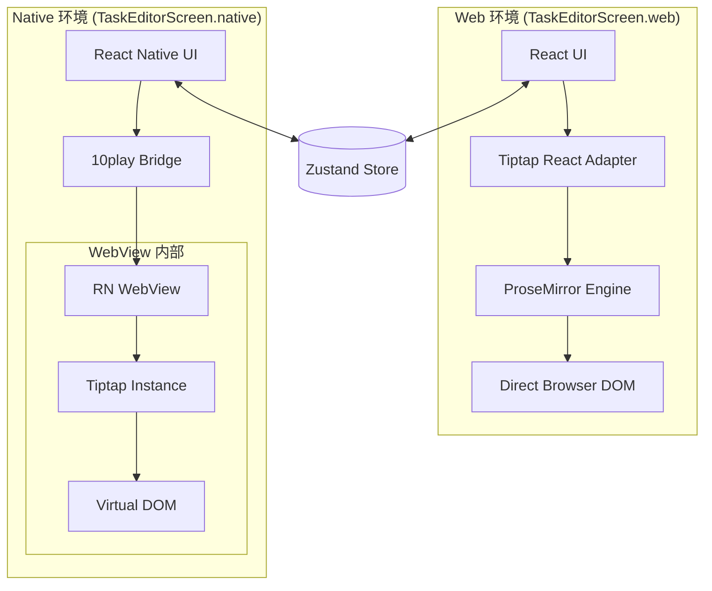
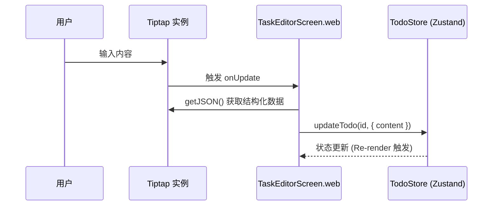

# Web 端集成实现

## 目录
1. [引言](#引言)
2. [模块概览](#模块概览)
3. [架构设计：Web 与 Native 的差异](#架构设计-web-与-native-的差异)
4. [核心实现：Tiptap 集成](#核心实现-tiptap-集成)
   - [编辑器初始化](#编辑器初始化)
   - [扩展配置](#扩展配置)
5. [数据流与状态同步](#数据流与状态同步)
   - [实时同步机制](#实时同步机制)
   - [关闭保存逻辑](#关闭保存逻辑)
6. [高级功能：图像处理与粘贴上传](#高级功能-图像处理与粘贴上传)
7. [响应式布局与样式控制](#响应式布局与样式控制)
8. [文件参考](#文件参考)

## 引言
在 LightFlux 项目中，富文本编辑器是任务管理体验的核心。为了确保在不同平台上都能提供一致且高性能的编辑体验，项目采用了平台特定的实现策略。`TaskEditorScreen.web.tsx` 是专门为 Web 端设计的编辑器组件，它直接利用了 Tiptap（基于 ProseMirror 的现代富文本编辑器框架）的强大功能。

Web 端的集成方案侧重于“原生 Web 体验”，即直接在浏览器 DOM 中运行编辑器实例，而不是像 Native 端那样通过 WebView 进行桥接。这种方式带来了更快的响应速度、更好的可访问性支持以及更灵活的样式定制能力。本页面将深入解析 Web 端编辑器的实现细节，包括其与 Zustand 状态库的同步逻辑、图像上传处理以及响应式布局方案。

## 模块概览
在 `lightflux/components/editor/` 目录下，编辑器模块由以下核心文件组成：

- **总文件数**: 6 个核心组件文件
- **子目录**: 无
- **核心文件**:
  - `TaskEditorScreen.web.tsx`: Web 端编辑器的主入口，负责 Tiptap 实例的生命周期管理和渲染。
  - `TaskEditorScreen.native.tsx`: Native 端实现，使用 `@10play/tentap-editor` 进行 WebView 桥接。
  - `TaskEditorScreen.tsx`: 平台入口文件，根据运行环境自动分发到 `.web` 或 `.native` 实现。
  - `TaskEditorScreen.types.ts`: 定义了编辑器组件的共享 Props 类型。
  - `TaskEditorMetadata.tsx`: 渲染任务的元数据信息（如所属清单、创建时间等）。
  - `CodeBlockBridge.ts`: 用于 Native 端的代码块扩展支持。

本章节将重点解析 `TaskEditorScreen.web.tsx` 的实现细节，并辅以与 Native 端的对比分析。

## 架构设计：Web 与 Native 的差异
LightFlux 采用了“分而治之”的架构来处理跨平台富文本编辑。Web 端直接集成 Tiptap，而 Native 端则需要一个桥接层来在原生应用中运行 Web 环境的编辑器。

以下图表展示了 Web 端与 Native 端在编辑器加载机制上的本质区别：



在 Web 端，`TaskEditorScreen` 直接通过 `useEditor` 钩子创建 Tiptap 实例。这意味着所有的交互（输入、粘贴、格式化）都直接发生在主线程的 DOM 中，没有任何跨进程或跨环境的通信开销。相比之下，Native 端必须通过 `WebView` 容器，这虽然解决了移动端富文本编辑的复杂性，但在性能和集成深度上略逊于 Web 端的原生实现。

**架构设计要点**:
- **直接渲染**: Web 端避免了 iframe 或 WebView 的隔离，使得编辑器可以无缝地应用全局 CSS 变量和响应式布局。
- **状态共享**: 无论哪种实现，最终都通过 `useTodoStore` (Zustand) 进行状态持久化，确保了数据模型的一致性。

## 核心实现：Tiptap 集成

### 编辑器初始化
在 Web 端，编辑器的核心是由 `@tiptap/react` 提供的 `useEditor` 钩子驱动的。它负责配置扩展、设置初始内容以及监听更新事件。

```typescript
// lightflux/components/editor/TaskEditorScreen.web.tsx

const editor = useEditor(
  {
    extensions: [
      StarterKit,
      Image.configure({
        allowBase64: false,
        HTMLAttributes: { loading: 'lazy' },
      }),
      Placeholder.configure({
        placeholder: labels.editor.bodyPlaceholder,
      }),
    ],
    content: todo?.content,
    editable: !readOnly,
    onUpdate: ({ editor: currentEditor }) => {
      if (readOnly) return;
      updateTodo(todoId, {
        content: currentEditor.getJSON() as RichTextDocument,
      });
    },
    // ... 其他配置
  },
  [labels.editor.bodyPlaceholder, readOnly, todoId, uploadPastedImages]
);
```

**实现细节分析**:
- **StarterKit**: 包含了最常用的富文本功能，如加粗、斜体、列表、引用等。
- **JSON 格式**: LightFlux 使用 JSON 格式（ProseMirror 的节点树）存储内容，而不是 HTML 字符串。这使得数据在不同平台间传输时更加结构化且易于解析。
- **只读模式**: 通过 `editable` 属性动态控制编辑器的可编辑性，这在查看已删除（回收站）的任务时非常有用。

### 扩展配置
Web 端特别配置了 `Image` 扩展，禁用了 Base64 存储（`allowBase64: false`），强制通过服务器上传获取 URL。这对于保持数据库轻量化和提高加载性能至关重要。同时，`Placeholder` 扩展为用户提供了直观的输入引导。

**Section sources**:
- [TaskEditorScreen.web.tsx](lightflux/components/editor/TaskEditorScreen.web.tsx)
- [TaskEditorScreen.types.ts](lightflux/components/editor/TaskEditorScreen.types.ts)

## 数据流与状态同步
编辑器与应用全局状态（Zustand store）之间的同步是实现“即写即存”体验的关键。

### 实时同步机制
Web 端采用了基于事件的实时同步策略。每当编辑器内容发生变化时，`onUpdate` 回调会被触发，进而调用 `updateTodo` 方法更新全局 store。



这种同步方式的优点是数据始终是最新的，用户无需手动保存。为了防止高频输入导致的性能问题，Native 端通常会使用 `debounce`（防抖），但在 Web 端，由于直接操作 DOM 且 Zustand 的更新非常轻量，目前采用了更直接的同步逻辑。

### 关闭保存逻辑
除了实时同步，在用户点击“关闭”按钮时，组件还会进行一次最终的校验和保存。这是为了处理标题更新以及确保最后一次编辑操作被正确记录。

```typescript
// lightflux/components/editor/TaskEditorScreen.web.tsx L253-L270

const closeEditor = () => {
  if (readOnly) {
    onClose();
    return;
  }

  const normalizedTitle = title.trim();
  if (!normalizedTitle) {
    setTitleError(labels.editor.emptyTitle);
    return;
  }

  updateTodo(todo.id, {
    title: normalizedTitle,
    content: (editor?.getJSON() ?? todo.content) as RichTextDocument,
  });
  onClose();
};
```

**逻辑说明**:
- **标题校验**: 任务标题不能为空。如果用户尝试保存空标题，会触发错误提示 `setTitleError`。
- **内容兜底**: 使用 `editor?.getJSON() ?? todo.content` 确保即使编辑器未初始化完成，也能保留原始数据。

**Section sources**:
- [todoStore.tsx](lightflux/store/todoStore.tsx)
- [TaskEditorScreen.web.tsx](lightflux/components/editor/TaskEditorScreen.web.tsx)

## 高级功能：图像处理与粘贴上传
Web 端编辑器支持强大的图像粘贴上传功能，这极大提升了用户记录信息的效率。

当用户在编辑器中粘贴内容时，`handlePaste` 拦截器会检查剪贴板中是否包含图像文件。如果有，它会阻止默认的粘贴行为，并启动异步上传流程。

```mermaid
flowchart TD
    Start[用户粘贴内容] --> IsImage{是否为图像文件?}
    IsImage -- 否 --> Default[默认粘贴行为]
    IsImage -- 是 --> Prevent[阻止默认行为]
    Prevent --> ShowStatus[显示 "正在上传..." 状态]
    ShowStatus --> Upload[调用 uploadTaskImage 服务]
    Upload -- 成功 --> InsertNode[在光标处插入 Image 节点]
    Upload -- 失败 --> ShowError[显示错误提示]
    InsertNode --> ClearStatus[清除上传状态]
    ShowError --> AutoHide[4.5秒后自动隐藏错误]
```

**核心实现代码**:
```typescript
// lightflux/components/editor/TaskEditorScreen.web.tsx L194-L214

handlePaste: (view, event) => {
  if (readOnly) return false;

  const files = Array.from(event.clipboardData?.items ?? [])
    .filter(item => item.kind === 'file' && item.type.startsWith('image/'))
    .map(item => item.getAsFile())
    .filter((file): file is File => file !== null);

  if (files.length === 0) return false;

  event.preventDefault();
  void uploadPastedImages(view, files);
  return true;
},
```

`uploadPastedImages` 函数负责循环处理文件流，调用后端 API，并在成功后使用 `view.dispatch` 将图像节点插入到 ProseMirror 的文档树中。这种处理方式确保了图像是以引用的形式（URL）存在于富文本中，而不是庞大的数据流。

**Section sources**:
- [imageUpload.ts](lightflux/services/imageUpload.ts)
- [TaskEditorScreen.web.tsx](lightflux/components/editor/TaskEditorScreen.web.tsx)

## 响应式布局与样式控制
Web 端编辑器需要适配从手机浏览器到桌面大屏的各种尺寸。LightFlux 结合了 `react-native-web` 的组件模型和原生 CSS 的灵活性。

### CSS 动态注入
由于 Tiptap 的内容渲染在 `EditorContent` 组件内部，为了精确控制富文本的样式（如标题大小、代码块背景、引用块边框），组件在 `useEffect` 中动态注入了一段名为 `EDITOR_CSS` 的全局样式。

```typescript
// lightflux/components/editor/TaskEditorScreen.web.tsx L34-L100

const EDITOR_CSS = `
  .lightflux-tiptap {
    min-height: 390px;
    padding: 22px;
    outline: none;
    color: #303145;
    font: 15px/1.7 -apple-system, sans-serif;
  }
  .lightflux-tiptap img {
    border-radius: 14px;
    max-width: 100%;
    margin: 16px auto;
  }
  /* ... 其他样式定义 */
`;
```

### 容器适配
外部容器使用了 `ScrollView` 和自定义样式来确保在大屏幕上内容不会过度铺开，同时在小屏幕上保持良好的边距。

```typescript
const styles = StyleSheet.create({
  content: {
    alignSelf: 'center',
    maxWidth: 900, // 限制最大宽度以提升阅读体验
    padding: 20,
    width: '100%',
  },
  // ...
});
```

通过设置 `maxWidth: 900`，编辑器在宽屏显示器上会居中显示，避免了行宽过长导致的阅读困难。而在移动端，它会自动缩放到 `100%` 宽度。

**Section sources**:
- [TaskEditorScreen.web.tsx](lightflux/components/editor/TaskEditorScreen.web.tsx)

## 文件参考
本章节涉及的关键源代码文件如下：

- `lightflux/components/editor/TaskEditorScreen.web.tsx`: Web 端编辑器核心实现，包含 Tiptap 配置与 UI 逻辑。
- `lightflux/components/editor/TaskEditorScreen.native.tsx`: Native 端编辑器实现，用于架构对比参考。
- `lightflux/components/editor/TaskEditorScreen.types.ts`: 定义了编辑器的 Props 接口。
- `lightflux/store/todoStore.tsx`: 定义了 `updateTodo` 方法，负责编辑器内容的持久化。
- `lightflux/services/imageUpload.ts`: 提供图像上传服务，支持 Web 端的粘贴上传功能。
- `lightflux/components/editor/TaskEditorMetadata.tsx`: 负责渲染任务的元数据，如清单名称和时间戳。
