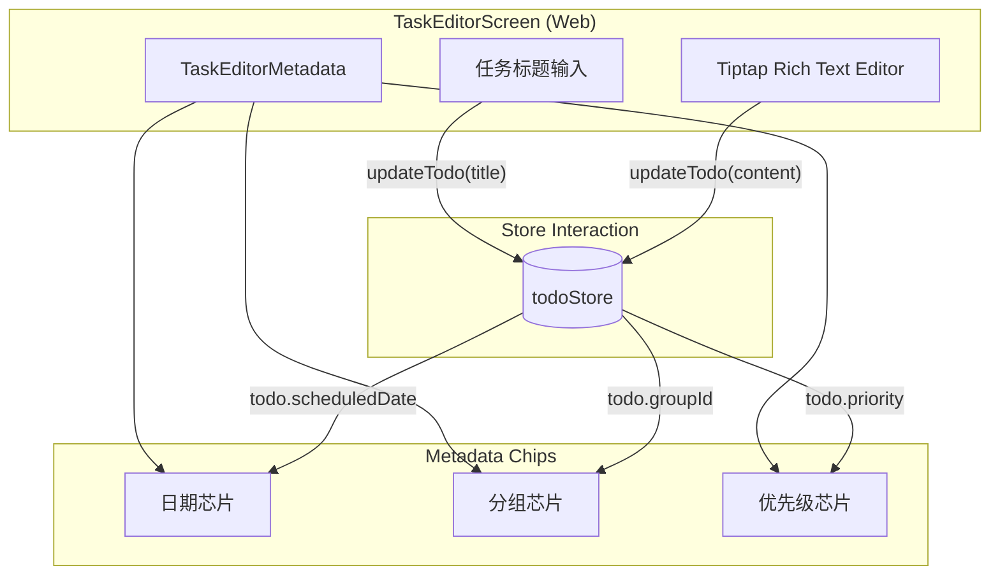
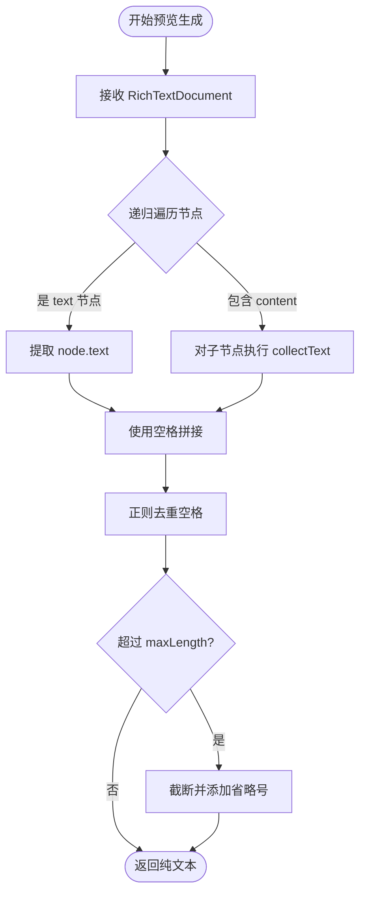
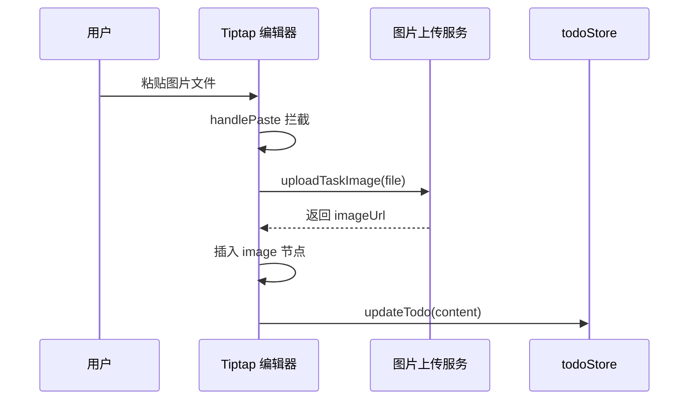
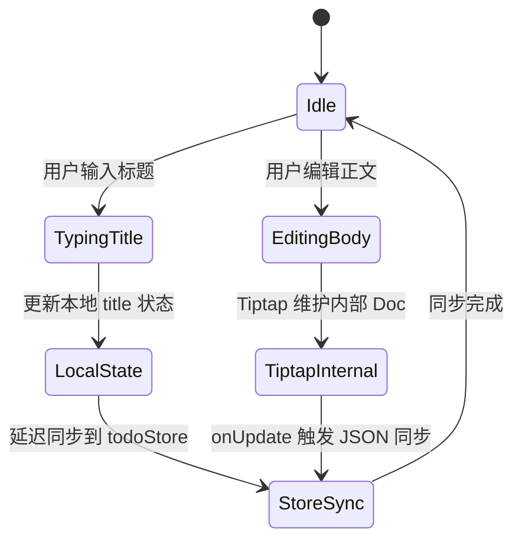
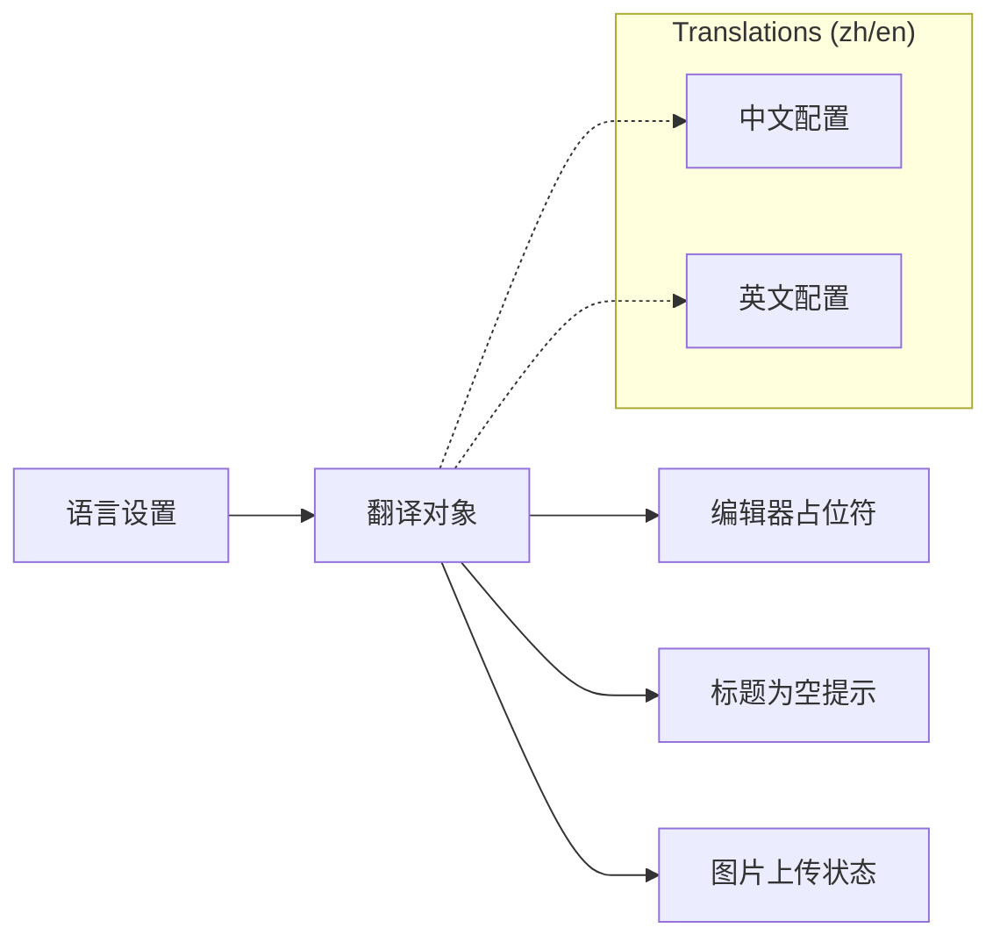

# 编辑器扩展与任务元数据管理

## 目录
1. [模块概览](#模块概览)
2. [引言](#引言)
3. [核心组件分析](#核心组件分析)
   - [TaskEditorScreen.web.tsx：核心容器](#taskeditorscreenwebtsx核心容器)
   - [TaskEditorMetadata：元数据展示](#taskeditormetadata元数据展示)
4. [任务元数据管理](#任务元数据管理)
5. [富文本处理与预览逻辑](#富文本处理与预览逻辑)
6. [Markdown 支持与 Tiptap 扩展](#markdown-支持与-tiptap-扩展)
7. [状态管理与同步机制](#状态管理与同步机制)
8. [国际化与多语言实现](#国际化与多语言实现)
9. [文件参考](#文件参考)

## 模块概览

本模块负责 LightFlux 应用中任务详情编辑器的核心逻辑，涵盖了富文本编辑、元数据展示、Markdown 快捷支持以及多平台适配。

- **总文件数**：约 8 个核心文件。
- **子模块/目录**：
  - `components/editor/`：包含编辑器的 UI 组件和平台特定实现（Web/Native）。
  - `utils/richText.ts`：提供富文本处理的工具函数。
  - `i18n/translations.ts`：管理编辑器相关的多语言文本。
- **覆盖范围**：
  - 重点深入：`TaskEditorScreen.web.tsx`（Web 端核心实现）、`TaskEditorMetadata.tsx`（元数据展示）、`richText.ts`（预览算法）。
  - 简要提及：`TaskEditorScreen.native.tsx`（原生端适配）、`CodeBlockBridge.ts`（代码块桥接）。

## 引言

编辑器是 LightFlux 中用户交互最为频繁的模块之一。它不仅需要提供流畅的文本输入体验，还必须无缝集成任务的元数据（如优先级、截止日期、所属分组）管理。为了实现这一目标，LightFlux 采用了基于 Tiptap 的富文本方案，并结合 Zustand 状态管理库实现了高效的实时同步。

本页面的核心目标是解析编辑器如何处理非文本数据（元数据）与富文本内容的协同工作，以及如何通过工具函数从复杂的 JSON 结构中提取出轻量级的纯文本预览。

## 核心组件分析

### TaskEditorScreen.web.tsx：核心容器

`TaskEditorScreen.web.tsx` 是 Web 端编辑器的入口点，它集成了 Tiptap 编辑器实例、任务标题输入框以及元数据展示区域。

该组件采用了分层更新策略：
1. **标题更新**：通过原生的 `TextInput` 组件处理，实时反馈到本地状态并同步至 `todoStore`。
2. **正文更新**：由 Tiptap 引擎驱动，通过 `onUpdate` 钩子将编辑器内部的 JSON 状态同步到全局存储。

**代码示例：Tiptap 编辑器初始化**
```typescript
const editor = useEditor(
  {
    extensions: [
      StarterKit,
      Image.configure({
        allowBase64: false,
        HTMLAttributes: { loading: 'lazy' },
      }),
      Placeholder.configure({
        placeholder: labels.editor.bodyPlaceholder,
      }),
    ],
    content: todo?.content,
    editable: !readOnly,
    onUpdate: ({ editor: currentEditor }) => {
      if (readOnly) return;
      updateTodo(todoId, {
        content: currentEditor.getJSON() as RichTextDocument,
      });
    },
    // ... 其他配置
  },
  [labels.editor.bodyPlaceholder, readOnly, todoId]
);
```

### TaskEditorMetadata：元数据展示

`TaskEditorMetadata.tsx` 负责在编辑器顶部以“芯片（Chip）”形式展示任务的关键属性。这些属性包括：
- **日程日期**：显示任务计划执行的时间。
- **所属分组**：标识任务所在的文件夹或项目。
- **优先级**：通过图标和标签直观展示任务的重要性。

目前该组件主要承担展示职责，通过 `MetadataChip` 子组件保持 UI 的一致性。

**Section sources**:
- [TaskEditorScreen.web.tsx](lightflux/components/editor/TaskEditorScreen.web.tsx)
- [TaskEditorMetadata.tsx](lightflux/components/editor/TaskEditorMetadata.tsx)

## 任务元数据管理

在 LightFlux 中，任务元数据与正文内容是解耦存储但协同展示的。元数据管理的核心在于如何将 `todoStore` 中的结构化数据转化为用户可感知的 UI 元素。

下图展示了编辑器组件的内部结构及其与元数据的关系：



该架构确保了 UI 的响应性。当用户在其他地方修改任务优先级时，编辑器顶部的 `TaskEditorMetadata` 会通过 Zustand 的订阅机制自动更新，而无需重新加载整个编辑器实例。这种“局部更新”策略对于提升复杂文档编辑时的性能至关重要。

**Section sources**:
- [TaskEditorMetadata.tsx](lightflux/components/editor/TaskEditorMetadata.tsx)
- [todoStore.ts](lightflux/store/todoStore.ts)

## 富文本处理与预览逻辑

由于任务正文存储为 Tiptap 的 JSON 格式（`RichTextDocument`），在任务列表等场景中直接展示 JSON 是不可行的。因此，`richText.ts` 提供了一个高效的预览生成工具。

`richTextPreview` 函数的工作原理是递归遍历 JSON 树，提取所有 `text` 类型的节点，并将其拼接成一段连续的纯文本。

**代码示例：预览生成算法**
```typescript
const collectText = (node: RichTextNode): string => {
  const ownText = typeof node.text === 'string' ? node.text : '';
  const childText = node.content?.map(collectText).join(' ') ?? '';
  return `${ownText} ${childText}`.trim();
};

export const richTextPreview = (
  document: RichTextDocument,
  maxLength = 90,
): string => {
  const text = collectText(document).replace(/\s+/g, ' ').trim();
  return text.length > maxLength
    ? `${text.slice(0, maxLength).trim()}…`
    : text;
};
```

该算法的递归流程如下所示：



这种处理方式能够确保即使在复杂的嵌套结构（如引用块中包含列表）中，也能准确提取出用户可见的文本内容，同时通过正则去重空格保证了预览的美观性。

**Section sources**:
- [richText.ts](lightflux/utils/richText.ts)

## Markdown 支持与 Tiptap 扩展

LightFlux 编辑器通过 Tiptap 的 `StarterKit` 扩展提供了开箱即用的 Markdown 快捷支持。用户可以使用标准的 Markdown 语法快速触发格式化操作。

### 快捷键映射
在 `translations.ts` 中定义了编辑器支持的快捷键描述，这些描述不仅用于 UI 展示，也反映了底层扩展的配置：
- `# + 空格`：触发一级标题。
- `- + 空格`：触发无序列表。
- `> + 空格`：触发引用块。
- ` ``` + 空格`：触发代码块。

### 自定义图像处理
除了标准 Markdown，编辑器还扩展了图像粘贴功能。在 `TaskEditorScreen.web.tsx` 中，通过 `handlePaste` 拦截剪贴板事件，自动调用 `uploadTaskImage` 服务并将返回的 URL 插入到编辑器中。



这种集成方式极大地提升了记录笔记或技术文档时的效率，使用户无需手动上传图片再复制链接。

**Section sources**:
- [TaskEditorScreen.web.tsx](lightflux/components/editor/TaskEditorScreen.web.tsx)
- [translations.ts](lightflux/i18n/translations.ts)

## 状态管理与同步机制

编辑器与 `todoStore` 的同步遵循“单向数据流”原则，但在具体实现上针对性能进行了微调。

### 独立更新逻辑
任务标题和正文的更新是相互独立的。标题使用 `useState` 维护本地即时状态，以保证输入的极致流畅；而正文则直接由 Tiptap 管理其内部状态，仅在内容发生变化时异步同步到 Store。



### 自动保存与关闭逻辑
当用户点击“关闭”按钮时，`closeEditor` 函数会执行最后的校验和同步。如果标题为空，则会触发错误提示并阻止关闭，确保数据的完整性。

**Section sources**:
- [TaskEditorScreen.web.tsx](lightflux/components/editor/TaskEditorScreen.web.tsx)
- [todoStore.ts](lightflux/store/todoStore.ts)

## 国际化与多语言实现

编辑器的国际化不仅限于按钮标签，还包括占位符、错误信息以及上传状态提示。

### 动态标签注入
编辑器通过 `useTodoStore` 获取当前的 `language` 设置，并从 `translations` 对象中提取对应的语言包。

**代码示例：多语言状态处理**
```typescript
const { language } = useTodoStore(useShallow(state => ({ language: state.language })));
const labels = translations[language];

// 使用示例
<Placeholder.configure({
  placeholder: labels.editor.bodyPlaceholder,
})>
```

### 状态提示的国际化
图片上传过程中的各种状态（上传中、文件过大、不支持的格式等）都通过 `imageUploadMessage` 计算属性进行动态翻译，确保全球用户都能获得清晰的反馈。



通过这种方式，LightFlux 保持了高度的可维护性：新增一种语言只需在 `translations.ts` 中添加对应的配置项，而无需修改编辑器核心代码。

**Section sources**:
- [translations.ts](lightflux/i18n/translations.ts)
- [TaskEditorScreen.web.tsx](lightflux/components/editor/TaskEditorScreen.web.tsx)

## 文件参考

以下是本模块涉及的核心文件列表：

- `lightflux/components/editor/TaskEditorScreen.web.tsx`: Web 端编辑器核心实现，集成了 Tiptap 和 Store 同步。
- `lightflux/components/editor/TaskEditorMetadata.tsx`: 任务元数据展示组件，以 Chip 形式呈现关键属性。
- `lightflux/components/editor/TaskEditorScreen.types.ts`: 编辑器组件的 Props 定义。
- `lightflux/utils/richText.ts`: 富文本处理工具，包含预览生成和空文档定义。
- `lightflux/i18n/translations.ts`: 全局国际化配置文件，包含编辑器的所有文本标签。
- `lightflux/store/todoStore.ts`: 任务状态存储中心，处理编辑器的更新请求。
- `lightflux/components/editor/CodeBlockBridge.ts`: 用于处理代码块的高亮或特殊渲染逻辑。
- `lightflux/components/editor/TaskEditorScreen.native.tsx`: 移动端编辑器的适配层实现。
