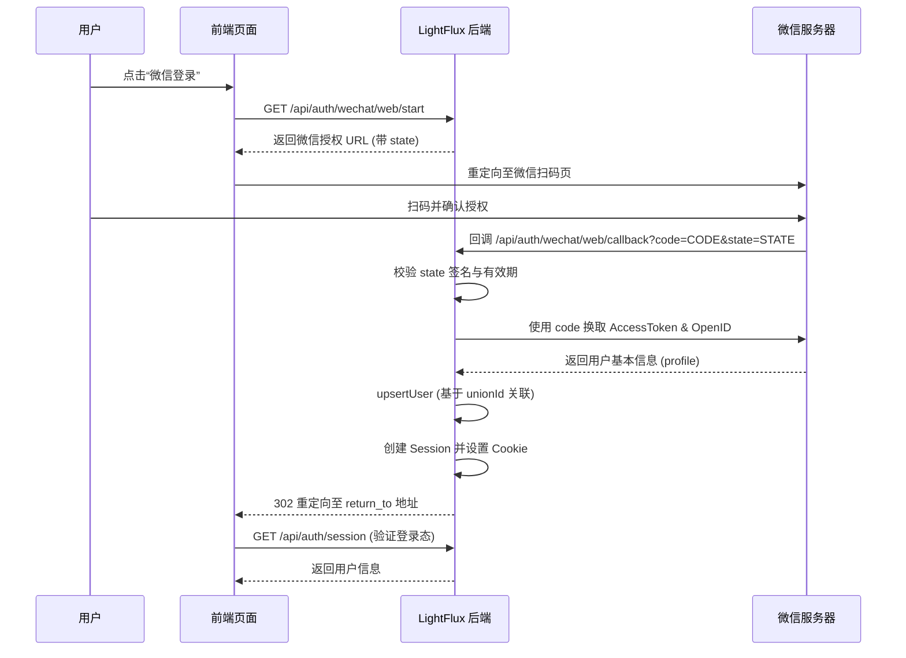
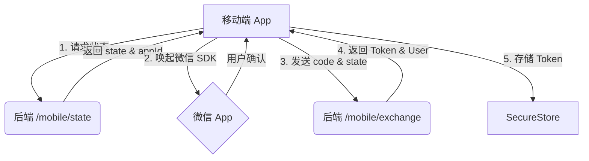
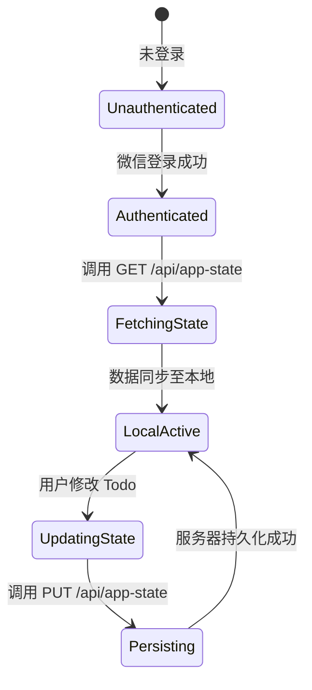

# 微信集成与认证

## 目录
1. [模块概述](#模块概述)
2. [引言](#引言)
3. [微信开放平台配置清单](#微信开放平台配置清单)
4. [核心组件与认证架构](#核心组件与认证架构)
   - [认证流程概览](#认证流程概览)
   - [前端服务层 (authApi.ts)](#前端服务层-authapits)
   - [后端认证逻辑 (index.mjs)](#后端认证逻辑-indexmjs)
5. [Web 端扫码登录实现](#web-端扫码登录实现)
6. [移动端原生集成与校验](#移动端原生集成与校验)
7. [跨端状态同步机制](#跨端状态同步机制)
8. [错误处理与安全实践](#错误处理与安全实践)
9. [文件引用](#文件引用)

## 模块概述

本模块涵盖了 LightFlux 与微信生态系统的深度集成方案，旨在为用户提供无缝的跨端登录体验。通过对 `docs/wechat-open-platform` 目录及相关前后端代码的调研，我们确定了该模块的覆盖范围和核心实现。

**范围评估**：
- **涉及目录**：`docs/wechat-open-platform/`, `lightflux/services/`, `server/src/`。
- **关键文件总数**：约 5 个核心文件，包括文档说明、前端 API 定义、后端路由处理器及应用配置文件。
- **子模块划分**：
  - **配置文档**：详细记录了微信开放平台的申请流程与环境参数。
  - **前端认证服务**：封装了 Web 与 Mobile 端的登录触发及 Token 交换逻辑。
  - **后端认证引擎**：负责与微信服务器通信、用户信息持久化及会话管理。

本章节将重点介绍 Web 扫码登录与移动端原生登录的实现差异，并详细解析后端如何通过 `unionId` 实现跨端身份统一。

## 引言

微信集成是 LightFlux 实现用户体系的核心环节。由于 LightFlux 作为一个跨平台的效率工具，需要在 Web、iOS 和 Android 端保持一致的用户身份和任务数据。微信开放平台提供的 OAuth 2.0 授权机制是实现这一目标的技术基石。

**核心术语**：
- **AppID / AppSecret**：微信开放平台分配的应用唯一标识与密钥。
- **Code**：临时授权码，由微信客户端/网页返回，用于向后端换取 AccessToken。
- **OpenID**：用户在某个特定应用（AppID）下的唯一标识。
- **UnionID**：用户在同一个微信开放平台账号下的所有应用中的唯一标识，是实现跨端数据同步的关键。
- **State**：用于防止 CSRF 攻击的随机字符串，在 LightFlux 中还承载了 `return_to` 重定向信息。

## 微信开放平台配置清单

在开始编码前，开发者必须在[微信开放平台](https://open.weixin.qq.com/)完成相关应用的申请。LightFlux 推荐申请两个独立的应用：一个“网站应用”用于 Web 端，一个“移动应用”用于 iOS/Android 端。

### 1. 网站应用配置
- **授权回调域**：必须填写后端 API 的域名（如 `auth.example.com`），严禁填写 `localhost`。
- **权限**：确保已获得 `snsapi_login` 权限。

### 2. 移动应用配置
- **iOS 端**：需配置 Bundle ID 和 Universal Link（通用链接）。Universal Link 必须支持 HTTPS 且包含 `apple-app-site-association` 文件。
- **Android 端**：需配置应用包名（Package Name）和应用签名值（Signature）。

### 3. 环境变量配置
配置完成后，需将敏感信息写入 `server/.env` 文件，确保不会泄露到代码库中。

> 💡 **注意**：AppSecret 是最高机密，绝对不能在前端代码中硬编码，也不应提交到 Git 仓库。

**Section sources**:
- [README.md](docs/wechat-open-platform/README.md)

## 核心组件与认证架构

LightFlux 的认证架构采用了典型的“前端引导 - 后端校验”模式。前端负责调用微信 SDK 或跳转授权页，后端负责与微信 API 握手并管理本地会话。

### 认证流程概览

下面的序列图展示了 Web 端扫码登录的完整握手过程。理解这一流程对于调试认证失败问题至关重要。



在上述流程中，`Server` 扮演了中转站的角色。它首先生成一个包含加密签名的 `state`，并在回调时进行校验，以确保请求是由 LightFlux 发起的。通过 `upsertWechatUser` 逻辑，系统能够自动识别老用户或创建新用户，并根据 `unionId` 实现不同 AppID 下的账号合并。

### 前端服务层 (authApi.ts)

前端通过 `authApi.ts` 封装了所有与认证相关的 HTTP 请求。它会根据运行平台（Web 或 Native）选择不同的调用策略。

```typescript
// Web 端启动微信登录
export const beginWechatLogin = async (): Promise<void> => {
  // ... 校验配置与平台
  const returnTo = globalThis.location?.href;
  const response = await fetch(
    `${apiUrl}/api/auth/wechat/web/start?return_to=${encodeURIComponent(returnTo ?? '')}`,
    { credentials: 'include' }
  );
  const body = await response.json();
  if (body.authorizationUrl) {
    globalThis.location?.assign(body.authorizationUrl);
  }
};
```

### 后端认证逻辑 (index.mjs)

后端使用 Node.js 原生模块处理 OAuth 回调。核心逻辑在于 `exchangeWechatCode` 函数，它连续调用微信的 `access_token` 和 `userinfo` 接口。

```javascript
const exchangeWechatCode = async (platform, code) => {
  const provider = requireProvider(platform);
  // 1. 换取 Token
  const token = await requestWechat(tokenUrl);
  // 2. 获取用户信息
  const profile = await requestWechat(userUrl);
  return {
    appId: provider.appId,
    openId: profile.openid,
    unionId: profile.unionid || null,
    displayName: profile.nickname,
    avatarUrl: profile.headimgurl,
  };
};
```

**Section sources**:
- [authApi.ts](lightflux/services/authApi.ts)
- [index.mjs](server/src/index.mjs)

## Web 端扫码登录实现

Web 端的集成相对简单，主要依赖于微信提供的 `qrconnect` 页面。LightFlux 后端在 `/api/auth/wechat/web/start` 接口中动态构造该 URL。

关键实现细节：
1. **State 生成**：使用 `HMAC-SHA256` 对包含 `platform`、`returnTo` 和 `nonce` 的 JSON 对象进行签名。这不仅防止了 CSRF，还允许登录成功后自动跳回用户之前的页面。
2. **回调处理**：后端接收到微信的 `code` 后，直接在服务器端完成所有后续操作，并通过 `Set-Cookie` 头部将 SessionID 注入浏览器。这种方式避免了前端接触到任何敏感的 Token。

**Diagram sources**:
- [index.mjs:L196-L232](server/src/index.mjs#L196-L232) (State 生成与校验)
- [index.mjs:L529-L565](server/src/index.mjs#L529-L565) (Web 路由处理)

## 移动端原生集成与校验

与 Web 端不同，移动端登录需要调用微信的原生 SDK。由于 Expo Go 环境不支持原生微信 SDK，开发者必须使用 `development build` 进行测试。

移动端登录流程如下：
1. **获取状态**：前端调用 `/api/auth/wechat/mobile/state` 获取后端生成的 `state` 和 `appId`。
2. **唤起微信**：使用 Expo 插件或原生模块唤起微信 App。
3. **交换 Code**：用户授权后，微信返回 `code` 给 App，App 再将 `code` 和 `state` 发送至后端的 `/api/auth/wechat/mobile/exchange` 接口。
4. **Token 管理**：后端返回一个长期有效的 `token`，移动端需将其安全地存储在 `SecureStore` 中，并在后续请求的 `Authorization` 头部中携带。



该流程确保了移动端的安全性，因为所有的微信 API 调用（使用 AppSecret）仍然发生在后端。

**Section sources**:
- [authApi.ts:L68-L103](lightflux/services/authApi.ts#L68-L103)
- [index.mjs:L567-L602](server/src/index.mjs#L567-L602)

## 跨端状态同步机制

LightFlux 的核心价值在于数据的云端同步。一旦用户通过微信认证，系统就会通过 `app-state` 接口同步任务数据。



后端通过 `upsertWechatUser` 函数确保了无论用户从哪个端登录，只要 `unionId` 一致，就能访问到同一份 `appState`。`appState` 在数据库中以 JSON 格式存储在 `users` 表的 `appState` 字段中。

**Section sources**:
- [authApi.ts:L105-L139](lightflux/services/authApi.ts#L105-L139)
- [index.mjs:L307-L359](server/src/index.mjs#L307-L359)

## 错误处理与安全实践

在集成过程中，可能会遇到多种错误情况，系统对此进行了分类处理：

1. **配置缺失**：如果环境变量中缺少 `WECHAT_APP_ID` 等，后端会返回 `503 Service Unavailable`，并提示具体的缺失项。
2. **State 校验失败**：如果 `state` 签名不匹配或已过期（默认 10 分钟），后端会抛出 `Invalid OAuth state` 错误，防止重放攻击。
3. **微信 API 异常**：如果微信服务器返回错误码（如 `errcode: 40001`），后端会将其包装为 `502 Bad Gateway` 返回给前端。
4. **会话过期**：Session 默认有效期为 30 天，过期后前端会收到 `401 Unauthorized`，触发重新登录流程。

> ⚠️ **警告**：在开发环境下，确保 `PUBLIC_BASE_URL` 与微信开放平台配置的回调域名完全一致，否则会导致 `state` 校验通过但 Cookie 无法写入的问题。

## 文件引用

以下是本模块涉及的核心文件列表：

- [docs/wechat-open-platform/README.md](docs/wechat-open-platform/README.md)：微信开放平台申请与配置指南。
- [lightflux/services/authApi.ts](lightflux/services/authApi.ts)：前端认证服务接口封装。
- [lightflux/app.json](lightflux/app.json)：移动端应用包名与域名关联配置。
- [server/src/index.mjs](server/src/index.mjs)：后端认证路由、Session 管理与微信 API 交互逻辑。
- [server/.env](server/.env)：（本地文件）存储 AppID 和 AppSecret 等环境变量。
