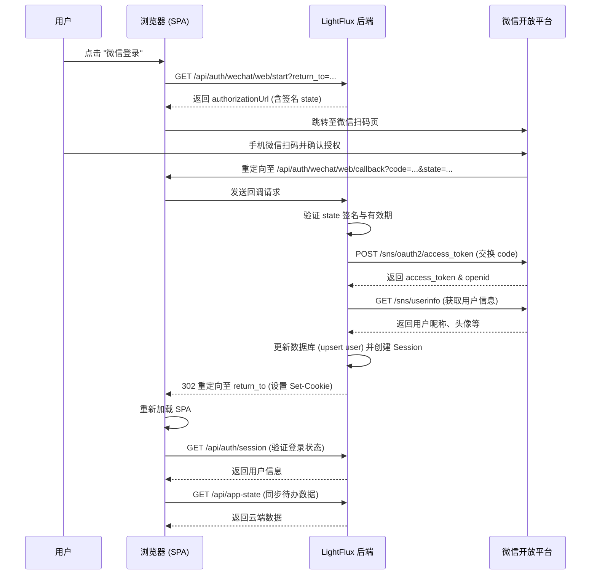
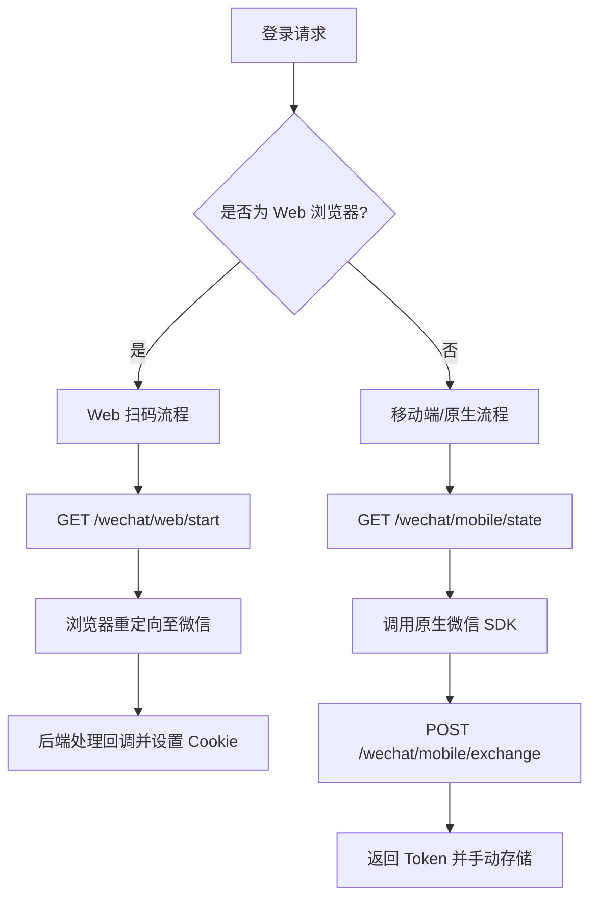

# Web 端扫码登录实现

## 目录
1. [模块概览](#模块概览)
2. [引言](#引言)
3. [核心组件](#核心组件)
   - [前端交互层：SignedOutScreen](#前端交互层signedoutscreen)
   - [服务请求层：authApi](#服务请求层authapi)
   - [后端认证逻辑：index.mjs](#后端认证逻辑indexmjs)
4. [架构设计与登录时序](#架构设计与登录时序)
   - [Web 扫码登录时序图](#web-扫码登录时序图)
5. [关键逻辑实现](#关键逻辑实现)
   - [State 参数与 CSRF 防护](#state-参数与-csrf-防护)
   - [会话管理与 Cookie 策略](#会话管理与-cookie-策略)
6. [Web 与 Tauri 桌面端的适配差异](#web-与-tauri-桌面端的适配差异)
7. [文件参考](#文件参考)

## 模块概览

本模块实现了 LightFlux Web 端（包括集成在 Tauri 中的 Web 视图）的微信扫码登录功能。该功能是 LightFlux 实现跨端数据同步的基础，允许用户通过微信授权建立云端身份，并同步待办事项和系统设置。

在本次探索中，我们识别了以下关键区域：
- **前端服务层 (`lightflux/services/`)**: 包含 8 个文件，其中 `authApi.ts` 是处理认证请求的核心。
- **UI 组件层 (`lightflux/components/`)**: 包含约 30 个顶层组件及多个子目录。`SignedOutScreen.tsx` 作为登录入口，负责触发认证流程。
- **后端服务层 (`server/src/`)**: 包含 2 个核心文件。`index.mjs` 承载了所有的 OAuth 回调处理、会话管理和用户数据持久化逻辑。

本文将重点深入解析微信扫码登录的端到端实现，涵盖从前端触发到后端回调及会话建立的全过程。

## 引言

LightFlux 的 Web 端扫码登录方案旨在为用户提供便捷且安全的身份验证体验。在 Web 环境下，传统的账号密码登录往往存在记忆负担，而微信扫码登录利用了微信的普及性，通过 OAuth 2.0 协议实现了“即扫即登”。

该方案的核心目标包括：
1. **安全性**：通过 HMAC 签名的 `state` 参数防止跨站请求伪造（CSRF）攻击。
2. **无缝体验**：登录成功后自动重定向回用户之前的页面，并自动加载云端同步的待办数据。
3. **跨端一致性**：为 Web 端和桌面端提供统一的身份体系，支持 UnionID 关联，确保用户在不同设备上的数据同步。

在 LightFlux 的整体架构中，Web 认证模块充当了本地存储与云端同步之间的桥梁。当用户未登录时，应用处于离线模式；一旦通过微信扫码登录，应用将切换到在线模式，通过 `authApi` 与后端同步 `appState`。

## 核心组件

### 前端交互层：SignedOutScreen

`SignedOutScreen.tsx` 是用户未登录时看到的第一个界面。它根据环境配置动态展示登录选项。

```typescript
// lightflux/components/SignedOutScreen.tsx

const loginWithWechat = async () => {
  setLoginError('');
  try {
    // 调用服务层开始微信登录流程
    await beginWechatLogin();
  } catch {
    setLoginError(labels.signedOut.wechatError);
  }
};

// ... 渲染逻辑
{isRemoteAuthConfigured ? (
  <Pressable
    accessibilityRole="button"
    className="mt-7 min-h-12 w-full flex-row items-center justify-center rounded-[15px] bg-[#07C160] px-5"
    onPress={() => void loginWithWechat()}
  >
    <Ionicons color="white" name="logo-wechat" size={21} />
    <Text className="ml-2 text-[14px] font-extrabold text-white">
      {labels.signedOut.wechat}
    </Text>
  </Pressable>
) : (
  // 离线模式下的继续按钮
  <Pressable onPress={onContinue}>...</Pressable>
)}
```

`SignedOutScreen` 组件通过 `isRemoteAuthConfigured` 判断是否启用了远程认证。如果配置了 `EXPO_PUBLIC_AUTH_API_URL` 且运行在 Web 环境，则显示微信登录按钮。点击按钮后，调用 `beginWechatLogin` 发起流程。

**核心组件源码**:
- [SignedOutScreen.tsx](lightflux/components/SignedOutScreen.tsx)

### 服务请求层：authApi

`authApi.ts` 封装了与后端认证服务器的所有通信逻辑。

```typescript
// lightflux/services/authApi.ts

export const beginWechatLogin = async (): Promise<void> => {
  if (Platform.OS !== 'web') {
    throw new Error('Web WeChat login is only supported on web platform.');
  }

  const returnTo = globalThis.location?.href;
  const response = await fetch(
    `${apiUrl}/api/auth/wechat/web/start?return_to=${encodeURIComponent(returnTo ?? '')}`,
    { credentials: 'include' }
  );
  
  const body = await response.json();
  if (!response.ok || !body.authorizationUrl) {
    throw new Error(body.error || 'Unable to start WeChat login.');
  }

  // 重定向到微信授权页面
  globalThis.location?.assign(body.authorizationUrl);
};
```

`beginWechatLogin` 函数负责获取当前的页面 URL 作为 `return_to` 参数，并请求后端生成微信授权 URL。获取 URL 后，使用 `location.assign` 执行全页面跳转。这种设计确保了登录流程的简单性，利用浏览器的原生重定向能力处理 OAuth 回调。

**核心组件源码**:
- [authApi.ts](lightflux/services/authApi.ts)

### 后端认证逻辑：index.mjs

后端采用 Node.js 原生 HTTP 模块实现，处理 OAuth 的核心握手过程。

```javascript
// server/src/index.mjs

// 1. 开始授权：生成微信扫码链接
if (url.pathname === '/api/auth/wechat/web/start' && request.method === 'GET') {
  const provider = requireProvider('web');
  const returnTo = safeReturnTo(url.searchParams.get('return_to'));
  const authorizationUrl = new URL('https://open.weixin.qq.com/connect/qrconnect');
  authorizationUrl.search = new URLSearchParams({
    appid: provider.appId,
    redirect_uri: config.web.redirectUri,
    response_type: 'code',
    scope: 'snsapi_login',
    state: createState('web', returnTo), // 关键：生成带签名的 state
  }).toString();
  json(response, 200, { authorizationUrl: authorizationUrl.toString() }, corsHeaders);
}

// 2. 回调处理：验证 state 并交换 token
if (url.pathname === '/api/auth/wechat/web/callback' && request.method === 'GET') {
  const state = verifyState(url.searchParams.get('state'), 'web');
  const code = url.searchParams.get('code');
  const profile = await exchangeWechatCode('web', code);
  const user = await upsertWechatUser('web', profile);
  const token = await createSession(user.id);
  
  response.writeHead(302, {
    'Set-Cookie': cookieHeader(token), // 设置 HttpOnly Cookie
    Location: safeReturnTo(state.returnTo),
  });
  response.end();
}
```

后端通过两个主要的路由完成认证：`start` 负责生成授权 URL 并注入经过签名的 `state`；`callback` 负责验证微信返回的 `code` 和 `state`，完成用户注册/登录，并通过 `Set-Cookie` 建立会话。

**核心组件源码**:
- [index.mjs](server/src/index.mjs)

## 架构设计与登录时序

LightFlux 的 Web 登录架构遵循标准的 OAuth 2.0 授权码模式，但针对单页应用（SPA）进行了优化。

### Web 扫码登录时序图

以下时序图展示了从用户点击登录按钮到最终回到应用并加载数据的完整过程。理解这一流程对于排查登录失败或重定向死循环等问题至关重要。



该流程从用户在 `SignedOutScreen` 的交互开始。后端作为中转站，不仅负责与微信通信，还负责维护本地的 Session 状态。关键点在于 `302 重定向` 阶段，后端通过 `Set-Cookie` 将 Session Token 注入浏览器，随后的所有 API 请求（如 `/api/auth/session` 和 `/api/app-state`）都会自动携带该 Cookie，从而实现身份识别。

**图表说明**：
- **触发阶段**：用户点击按钮，前端通过 `authApi` 获取授权跳转链接。
- **授权阶段**：用户在微信域内完成扫码。
- **同步阶段**：后端完成 OAuth 换票，并将用户信息持久化到 `auth.json`。
- **恢复阶段**：浏览器回到 SPA，前端组件挂载时通过 `/api/auth/session` 确认登录成功，并触发数据同步。

**图表来源**:
- [authApi.ts:L32-L60](lightflux/services/authApi.ts#L32-L60)
- [index.mjs:L528-L565](server/src/index.mjs#L528-L565)

## 关键逻辑实现

### State 参数与 CSRF 防护

在 OAuth 流程中，`state` 参数不仅用于存储重定向路径，更承担了防御 CSRF 攻击的重任。LightFlux 实现了一套基于 HMAC 的签名机制。

```javascript
// server/src/index.mjs

const createState = (platform, returnTo) => {
  const payload = base64url(JSON.stringify({
    platform,
    returnTo,
    nonce: randomBytes(18).toString('base64url'),
    issuedAt: Date.now(),
  }));
  const signature = createHmac('sha256', stateKey())
    .update(payload)
    .digest('base64url');
  return `${payload}.${signature}`;
};

const verifyState = (state, expectedPlatform) => {
  const [payload, signature] = String(state ?? '').split('.');
  // 验证签名是否匹配
  const expected = createHmac('sha256', stateKey()).update(payload).digest();
  const received = Buffer.from(signature, 'base64url');
  if (!timingSafeEqual(received, expected)) {
    throw new Error('Invalid OAuth state signature.');
  }
  // 验证有效期 (STATE_TTL_MS = 10分钟)
  const value = JSON.parse(Buffer.from(payload, 'base64url').toString('utf8'));
  if (value.platform !== expectedPlatform || Date.now() - value.issuedAt > STATE_TTL_MS) {
    throw new Error('OAuth state has expired.');
  }
  return value;
};
```

这种实现的优势在于：
1. **防篡改**：由于使用了 `SESSION_SECRET` 进行 HMAC 签名，攻击者无法伪造有效的 `state`。
2. **防重放**：包含 `nonce` 和 `issuedAt`，后端验证时会检查是否在 10 分钟有效期内。
3. **无状态验证**：后端不需要在内存或数据库中存储生成的 `state`，直接通过解析和校验签名即可确认其合法性。

> 💡 **提示**：在开发环境下，请确保 `SESSION_SECRET` 环境变量已正确配置且长度不少于 32 位，否则后端将无法启动。

### 会话管理与 Cookie 策略

Web 端的会话主要依赖 `HttpOnly` Cookie。这种策略相比于 `localStorage` 存储 Token 具有更高的安全性，因为脚本无法读取 `HttpOnly` Cookie，从而有效防御 XSS 攻击。

```javascript
// server/src/index.mjs

const cookieHeader = (token, maxAge = SESSION_TTL_MS / 1000) => {
  const secure = config.publicBaseUrl.startsWith('https://') ? '; Secure' : '';
  return `${COOKIE_NAME}=${encodeURIComponent(token)}; Path=/; HttpOnly; SameSite=Lax; Max-Age=${maxAge}${secure}`;
};
```

- **HttpOnly**：防止 JavaScript 访问 Cookie。
- **SameSite=Lax**：在跨站请求时提供适度的保护，同时允许从微信回调页重定向回来时携带 Cookie。
- **Secure**：仅在 HTTPS 环境下发送。

前端在调用接口时，必须显式设置 `credentials: 'include'`，否则浏览器不会发送 Cookie：

```typescript
// lightflux/services/authApi.ts
const response = await fetch(`${apiUrl}/api/auth/session`, {
  credentials: 'include',
});
```

**逻辑来源**:
- [index.mjs:L196-L232](server/src/index.mjs#L196-L232)
- [index.mjs:L410-L415](server/src/index.mjs#L410-L415)

## Web 与 Tauri 桌面端的适配差异

虽然 LightFlux 在桌面端（Tauri）也使用了 Web 技术栈，但其登录流程与纯 Web 端存在显著差异。

| 特性 | Web 端 (Browser) | 桌面端 (Tauri / Mobile) |
| :--- | :--- | :--- |
| **微信授权类型** | `qrconnect` (扫码登录) | `snsapi_userinfo` (移动端授权) |
| **跳转方式** | `location.assign` 全页面重定向 | 调用原生微信 SDK 或 Deep Link |
| **会话存储** | `HttpOnly` Cookie | `Authorization: Bearer <token>` |
| **回调处理** | 后端 302 重定向回应用 URL | 前端接收 Code 后调用 `/api/auth/wechat/mobile/exchange` |
| **跨域处理** | 依赖 CORS 配置 | 无跨域限制（Tauri 视图特权） |

在 Tauri 环境下，虽然 `Platform.OS` 可能被识别为 `web`，但通常建议使用移动端流程以获得更好的原生集成体验。后端通过 `createState` 中的 `platform` 字段来区分这两种流程，确保回调逻辑的一致性。



这种双轨制设计允许 LightFlux 在保持核心逻辑复用的同时，针对不同平台的安全模型和交互习惯进行优化。Web 端利用 Cookie 的自动管理特性，而原生端则利用 Token 的灵活性。

## 文件参考

以下是实现 Web 端扫码登录涉及的核心源文件：

- [lightflux/services/authApi.ts](lightflux/services/authApi.ts)：前端认证服务接口，处理请求发起与重定向。
- [lightflux/components/SignedOutScreen.tsx](lightflux/components/SignedOutScreen.tsx)：登录入口 UI 组件。
- [server/src/index.mjs](server/src/index.mjs)：后端认证服务器，包含 OAuth 握手、State 校验及 Session 管理。
- [lightflux/store/todoStore.tsx](lightflux/store/todoStore.tsx)：管理应用语言设置，影响登录界面的文案展示。
- [server/src/agent.mjs](server/src/agent.mjs)：后端 AI 服务，虽然不直接参与认证，但认证后的 Session 用于控制 AI 访问权限。
