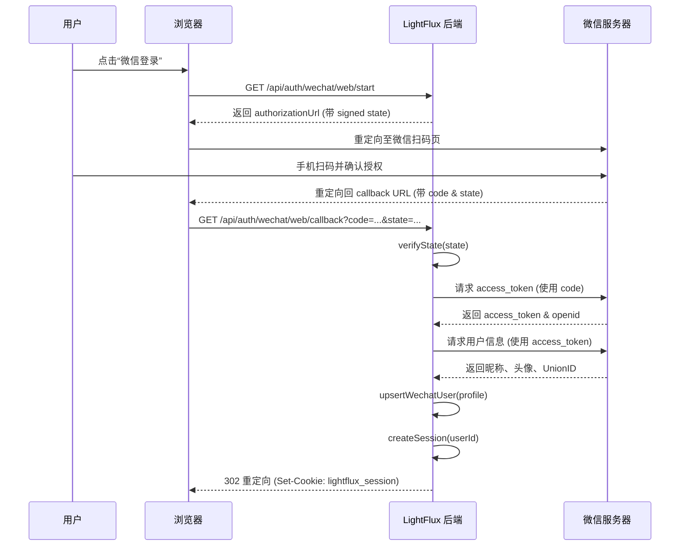
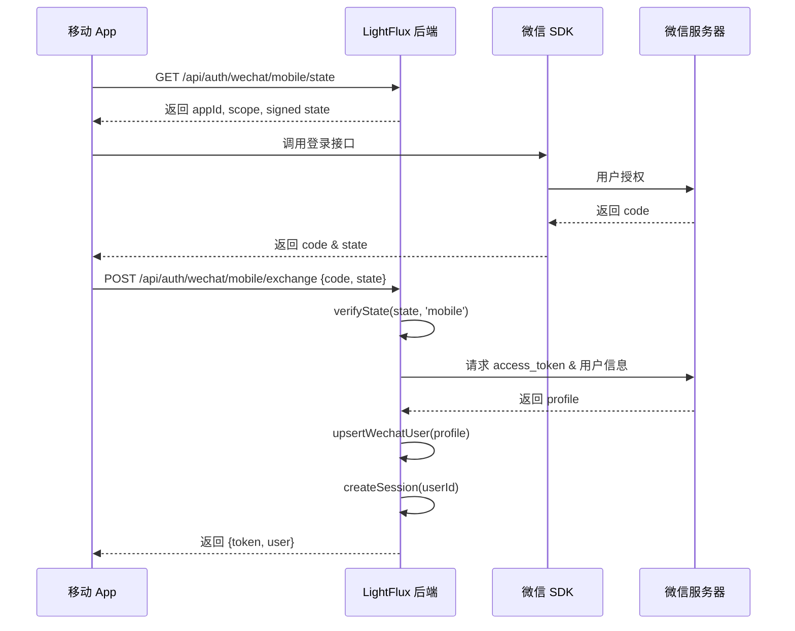
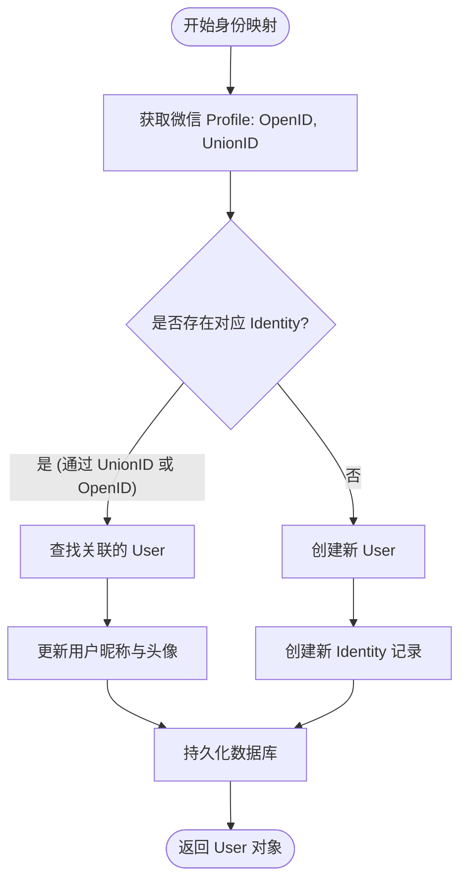
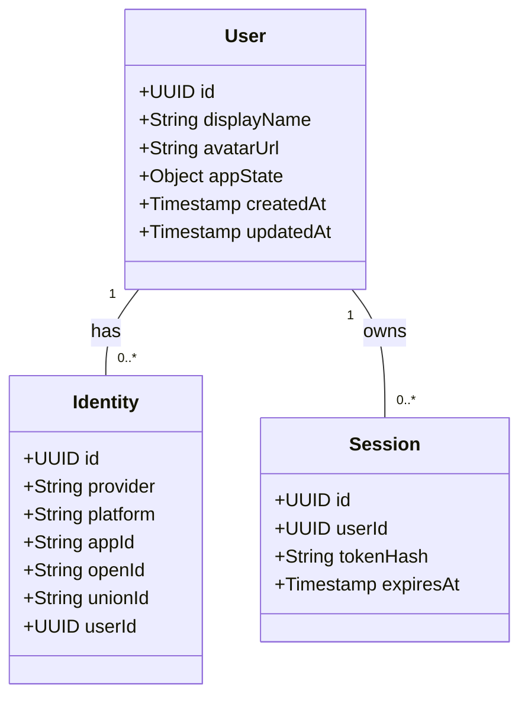

# 后端认证与会话管理

## 目录
1. [模块概览](#模块概览)
2. [微信 OAuth 认证流程](#微信-oauth-认证流程)
   - [Web 端扫码登录流程](#web-端扫码登录流程)
   - [移动端 App 登录流程](#移动端-app-登录流程)
   - [State 机制与安全校验](#state-机制与安全校验)
3. [用户身份映射 (Identity Mapping)](#用户身份映射-identity-mapping)
   - [身份唯一性标识](#身份唯一性标识)
   - [upsertWechatUser 逻辑解析](#upsertwechatuser-逻辑解析)
4. [会话管理实现](#会话管理实现)
   - [Session 生命周期](#session-生命周期)
   - [Token Hashing 安全机制](#token-hashing-安全机制)
   - [双通道认证：Cookie 与 Bearer Token](#双通道认证cookie-与-bearer-token)
5. [数据模型与持久化](#数据模型与持久化)
   - [JSON 数据库 Schema](#json-数据库-schema)
   - [原子化持久化策略](#原子化持久化策略)
6. [安全设计与防护](#安全设计与防护)
7. [核心组件](#核心组件)
8. [文件参考](#文件参考)

## 模块概览

LightFlux 后端认证与会话管理模块是整个系统的安全基石。该模块位于 `server/src/index.mjs` 中，采用轻量级但高度安全的架构设计，主要负责处理微信第三方登录、用户身份统一映射以及基于令牌的会话维持。

在 LightFlux 的设计哲学中，后端服务被定位为一个无状态的 API 网关，但为了支持用户数据的同步（如任务列表、分组信息），必须引入可靠的身份验证机制。该模块不仅实现了标准的微信 OAuth 2.0 流程，还针对 Web 和移动端（React Native）的差异性进行了适配。

**核心职责包括：**
- **微信 OAuth 适配**：封装了微信网页授权和移动端授权的接口调用，屏蔽了底层 API 的复杂性。
- **身份统一化**：通过 UnionID 机制，确保用户在微信公众号、小程序、PC 网站及移动 App 之间拥有统一的系统内部 ID。
- **轻量级持久化**：使用基于文件系统的 JSON 数据库，避免了部署复杂数据库集群的开销，同时通过原子写入保证了数据的完整性。
- **安全会话**：实现了基于 SHA-256 哈希的令牌存储机制，有效防止了数据库泄露导致的会话劫持风险。

该模块共涉及约 2 个核心源文件，处理了从 OAuth 回调到会话校验的完整闭环。在接下来的章节中，我们将深入解析其内部实现细节。

## 微信 OAuth 认证流程

LightFlux 支持两种主要的微信认证场景：Web 端（通过浏览器扫码）和移动端（通过 React Native 调用微信 SDK）。这两种流程在前端触发方式上有所不同，但在后端逻辑上最终汇聚于统一的身份处理函数。

### Web 端扫码登录流程

Web 端的认证遵循经典的 OAuth 2.0 授权码模式。用户点击登录后，前端请求后端生成授权 URL，随后跳转至微信二维码页面。



**流程解析**：
1. **授权初始化**：后端在 `/api/auth/wechat/web/start` 接口中，利用 `createState` 函数生成一个包含 `platform` 和 `returnTo` 信息的加密字符串。这个字符串通过 HMAC-SHA256 签名，确保了重定向过程的完整性，防止 CSRF 攻击。
2. **回调处理**：当微信回调 `/api/auth/wechat/web/callback` 时，后端首先调用 `verifyState` 校验 `state` 参数的合法性与时效性（TTL 为 10 分钟）。
3. **令牌交换**：通过 `exchangeWechatCode` 函数，后端向微信 API 发送 `authorization_code` 以换取 `access_token`。随后立即调用 `sns/userinfo` 接口获取用户的基本资料。

### 移动端 App 登录流程

移动端的认证流程略有不同，因为微信 SDK 的调用发生在 React Native 客户端。



在移动端流程中，后端的主要职责是提供安全的 `state` 和进行最终的 `code` 交换。由于移动端不方便使用 Cookie，登录成功后后端会直接在 JSON 响应中返回 `token`，由客户端存储在 `SecureStore` 中。

### State 机制与安全校验

为了防御 CSRF（跨站请求伪造）攻击，LightFlux 实现了一套基于 HMAC 的 `state` 校验机制。

```javascript
const createState = (platform, returnTo) => {
  const payload = base64url(
    JSON.stringify({
      platform,
      returnTo,
      nonce: randomBytes(18).toString('base64url'),
      issuedAt: Date.now(),
    }),
  );
  const signature = createHmac('sha256', stateKey())
    .update(payload)
    .digest('base64url');
  return `${payload}.${signature}`;
};
```

**设计要点**：
- **Nonce**：引入 18 字节的随机数，确保每次生成的 `state` 都是唯一的。
- **过期时间**：通过 `issuedAt` 字段限制 `state` 的有效期为 10 分钟，缩小攻击窗口。
- **签名校验**：使用 `timingSafeEqual` 进行签名对比，防止针对哈希比较的时间攻击。

**Diagram sources**: 
- [index.mjs:L196-L232](server/src/index.mjs#L196-L232)
- [index.mjs:L528-L602](server/src/index.mjs#L528-L602)

## 用户身份映射 (Identity Mapping)

在多端应用中，如何识别“同一个用户”是认证系统的核心挑战。LightFlux 通过建立 `User` 与 `Identity` 的多对一关系（逻辑上支持，当前主要为微信身份）来解决这一问题。

### 身份唯一性标识

微信提供了两个关键的 ID：
1. **OpenID**：用户在某个特定应用（如某个公众号或某个 App）中的唯一标识。
2. **UnionID**：如果开发者拥有多个移动应用、网站应用和公众帐号，只要这些应用都绑定在同一个微信开放平台账号下，用户在这些应用中的 `UnionID` 是唯一的。

LightFlux 优先使用 `UnionID` 进行匹配，这使得用户在 Web 端扫码注册后，在移动端登录时能自动关联到同一个账号。

### upsertWechatUser 逻辑解析

`upsertWechatUser` 是身份映射的核心算法，其逻辑如下：



**实现细节**：
- **双重查找**：首先尝试通过 `unionId` 在 `identities` 表中查找。如果没找到，再通过 `appId` + `openId` 组合查找。这种策略兼顾了跨端统一性和单端兼容性。
- **按需更新**：如果用户更改了微信昵称或头像，系统会在每次登录时自动同步这些变化到 `users` 表。
- **解耦设计**：`users` 表存储业务层面的用户信息（如 `appState`），而 `identities` 表存储第三方平台的原始信息。这种设计方便未来扩展其他登录方式（如 GitHub、Google）。

**Section sources**:
- [index.mjs:L307-L359](server/src/index.mjs#L307-L359)

## 会话管理实现

LightFlux 并没有使用复杂的 Redis 或外部 Session 存储，而是实现了一套自包含的、基于令牌哈希的会话机制。

### Session 生命周期

Session 的默认有效期 (`SESSION_TTL_MS`) 为 30 天。每次用户登录时，系统都会清理掉该用户已过期的旧会话，以保持数据库的整洁。

```javascript
const createSession = async (userId) => {
  const token = randomBytes(32).toString('base64url');
  const timestamp = Date.now();
  // 清理过期会话
  database.sessions = database.sessions.filter(
    (session) => session.expiresAt > timestamp,
  );
  // 添加新会话
  database.sessions.push({
    id: randomUUID(),
    userId,
    tokenHash: tokenHash(token),
    createdAt: timestamp,
    expiresAt: timestamp + SESSION_TTL_MS,
  });
  await persistDatabase();
  return token;
};
```

### Token Hashing 安全机制

这是一个关键的安全特性。后端**从不直接存储**原始的 Session Token。

1. **生成**：使用 `randomBytes(32)` 生成高熵随机令牌。
2. **存储**：存储令牌的 SHA-256 哈希值 (`tokenHash`)。
3. **校验**：当请求到达时，后端对传入的令牌再次进行哈希，并与数据库中的哈希值比对。

**为什么要这样做？**
如果 `auth.json` 数据库文件意外泄露，攻击者拿到的只是令牌的哈希值。由于 SHA-256 是不可逆的，攻击者无法根据哈希值还原出原始令牌，从而无法伪造有效的 Cookie 或 Authorization Header 登录系统。

### 双通道认证：Cookie 与 Bearer Token

为了同时支持 Web 和移动端，`requestToken` 函数支持从两个位置读取令牌：

1. **Cookie**：针对 Web 端，使用 `lightflux_session` Cookie。后端在设置 Cookie 时使用了 `HttpOnly`（防止 XSS 读取）、`SameSite=Lax`（防御 CSRF）和 `Secure`（仅 HTTPS 传输）属性。
2. **Authorization Header**：针对移动端，支持标准的 `Bearer <token>` 格式。

```javascript
const requestToken = (request) => {
  const authorization = request.headers.authorization ?? '';
  if (authorization.startsWith('Bearer ')) {
    return authorization.slice(7);
  }
  return parseCookies(request)[COOKIE_NAME] ?? null;
};
```

**Section sources**:
- [index.mjs:L361-L408](server/src/index.mjs#L361-L408)

## 数据模型与持久化

LightFlux 使用一个单一的 JSON 文件 (`auth.json`) 作为数据存储。虽然简单，但其内部结构设计严谨。

### JSON 数据库 Schema

数据库由四个核心部分组成：
- `schemaVersion`: 用于未来的数据迁移。
- `users`: 核心用户表，存储 `displayName`, `avatarUrl` 和最重要的 `appState`（任务数据）。
- `identities`: 身份映射表，连接微信账号与系统用户。
- `sessions`: 会话记录表。



### 原子化持久化策略

为了防止在写入过程中发生崩溃导致 JSON 文件损坏，`persistDatabase` 采用了“先写临时文件，再重命名”的原子操作策略：

1. 将当前内存中的 `database` 对象序列化为字符串。
2. 写入一个带有进程 PID 的临时文件（如 `auth.json.1234.tmp`）。
3. 使用 `fs.rename` 将临时文件原子地替换为正式文件。

这种方法利用了操作系统底层文件系统的原子性保证，确保了即使在断电等极端情况下，`auth.json` 也不会处于“写了一半”的损坏状态。

**Section sources**:
- [index.mjs:L69-L106](server/src/index.mjs#L69-L106)

## 安全设计与防护

除了上述提到的机制外，LightFlux 还实施了多项安全最佳实践：

1. **Timing-Safe Equal**：在校验 OAuth `state` 签名时，使用 `crypto.timingSafeEqual`。这可以防止攻击者通过测量响应时间的微小差异来逐位猜测签名。
2. **CORS 严格限制**：通过 `corsOrigin` 配置项，仅允许受信任的前端域名访问 API，并正确处理 `OPTIONS` 预检请求。
3. **上传安全**：在 `/api/uploads` 中，系统会通过魔数（Magic Bytes）校验文件内容是否真的是图片（`IMAGE_TYPES.matches`），而不只是依赖文件扩展名。
4. **匿名访问控制**：通过 `AI_ALLOW_ANONYMOUS` 和 `UPLOAD_ALLOW_ANONYMOUS` 环境变量，管理员可以精细控制是否允许未登录用户使用高成本的 AI 功能或上传功能。

## 核心组件

下表列出了认证模块中的关键函数及其职责：

| 函数名称 | 职责描述 |
| :--- | :--- |
| `createState` | 生成带签名的 OAuth 状态字符串，用于防止 CSRF 攻击。 |
| `verifyState` | 校验状态字符串的签名及过期时间。 |
| `exchangeWechatCode` | 封装微信 API 调用，将授权码转换为用户信息。 |
| `upsertWechatUser` | 实现身份映射逻辑，处理用户的创建与更新。 |
| `createSession` | 生成新的会话令牌并存储其哈希值。 |
| `currentSession` | 从请求中解析令牌并验证会话有效性，返回当前用户对象。 |
| `persistDatabase` | 将内存中的数据库状态安全地写入磁盘。 |

## 文件参考

本章节内容基于以下源文件分析得出：

- `server/src/index.mjs`: 包含所有后端认证逻辑、会话管理及 API 路由。
- `lightflux/services/authApi.ts`: 前端对接认证 API 的服务层实现。
- `server/README.md`: 提供了环境变量配置及系统架构的初步说明。
