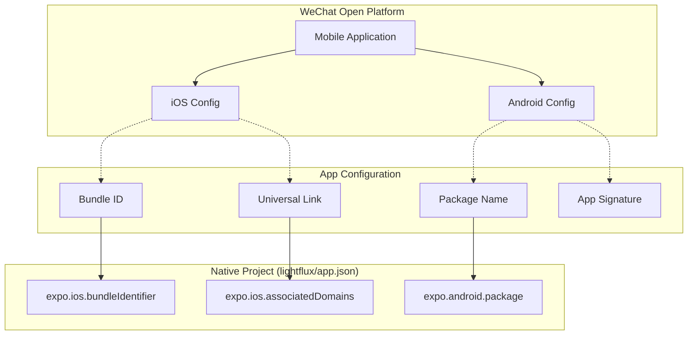
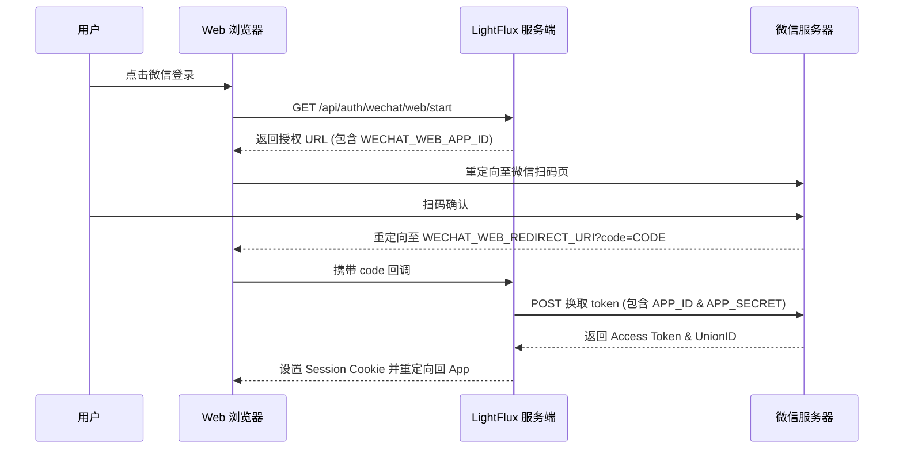
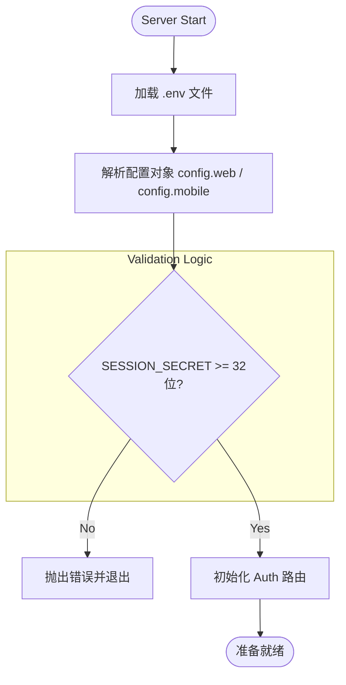
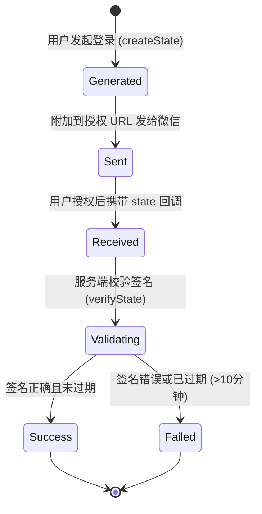

# 微信开放平台配置与环境准备

## 目录
1. [模块概览](#模块概览)
2. [引言](#引言)
3. [账号申请与资质认证](#账号申请与资质认证)
4. [网站应用创建与配置](#网站应用创建与配置)
5. [移动应用创建与配置](#移动应用创建与配置)
6. [本地环境变量配置](#本地环境变量配置)
7. [集成架构与数据流](#集成架构与数据流)
8. [安全性与最佳实践](#安全性与最佳实践)
9. [文件引用](#文件引用)

## 模块概览

本模块主要涵盖了 LightFlux 项目在接入微信开放平台（WeChat Open Platform）时的全流程配置指南。微信集成是实现用户身份验证、多端同步以及原生移动端体验的核心环节。

**范围统计**：
- **涉及目录**：`docs/wechat-open-platform/` (文档), `server/` (服务端配置), `lightflux/` (客户端配置)
- **关键文件数**：约 5 个核心配置文件及相关说明文档。
- **覆盖内容**：从云端账号申请、应用创建、资质审核到本地 `.env` 环境变量及 `app.json` 移动端元数据的完整链条。

本指南将深入探讨如何获取并配置 `AppID` 和 `AppSecret`，以及如何正确设置授权回调域、Universal Link 和 Android 签名，确保 Web、iOS 和 Android 三端能够顺畅地完成微信登录。

## 引言

微信开放平台是 LightFlux 实现用户体系的核心基础设施。作为一个跨平台的效率工具，LightFlux 需要在不同的运行环境下提供一致的登录体验：

- **Web 端**：通过“网站应用”实现扫码登录，利用 OAuth 2.0 协议完成授权。
- **移动端 (iOS/Android)**：通过“移动应用”集成微信原生 OpenSDK，提供一键登录功能。

通过统一的微信 UnionID，LightFlux 能够识别同一用户在不同平台上的身份，从而实现任务数据的无缝同步。本页面旨在为开发者提供一份详尽的“配置地图”，避免在复杂的微信申请流程中走弯路。

## 账号申请与资质认证

在开始创建任何应用之前，必须首先拥有一个经过认证的微信开放平台开发者账号。

### 1. 开发者资质认证
微信要求所有接入登录功能的开发者必须完成“开发者资质认证”。
- **认证费用**：通常为 300 元人民币/年（企业主体）。
- **准备材料**：
  - 企业营业执照扫描件。
  - 盖章的申请公函。
  - 运营者联系方式及身份证信息。
- **关键点**：认证主体必须与后续网站备案、App 软著（如适用）的主体保持一致，否则可能导致审核失败。

### 2. 基础材料准备清单
在点击“创建应用”按钮前，请确保已准备好以下材料：
- **应用图标**：28x28 像素和 108x108 像素的 PNG 图片，背景建议透明。
- **官网地址**：必须是支持 HTTPS 的正式域名，页面需展示应用名称、功能截图、隐私政策。
- **应用简介**：清晰、简洁地描述 LightFlux 的功能（如：一款极简高效的任务管理工具）。

## 网站应用创建与配置

网站应用主要用于 LightFlux 的 Web 版本。用户在浏览器中点击微信登录后，会跳转到微信二维码页面进行扫码授权。

### 1. 创建流程
1. 登录 [微信开放平台](https://open.weixin.qq.com/) -> 管理中心 -> 网站应用 -> 创建网站应用。
2. 填写基本信息（名称、简介、图标、官网）。
3. **授权回调域**：这是最关键的配置。
   - **规范**：填写服务端 API 所在的域名（例如 `auth.lightflux.com`）。
   - **注意**：不要包含 `http://` 前缀，也不要填写 `localhost`。生产环境必须使用 HTTPS。

### 2. 获取凭证
审核通过后，你将获得：
- **AppID**：应用的唯一标识。
- **AppSecret**：应用的密钥，用于换取 Access Token。

**Section sources**:
- [docs/wechat-open-platform/README.md](docs/wechat-open-platform/README.md)

## 移动应用创建与配置

移动应用涵盖了 iOS 和 Android 两个平台。由于 LightFlux 使用 Expo 开发，因此需要特定的原生配置。

### 1. iOS 开发信息配置
iOS 端依赖 **Universal Link** 确保微信授权后能安全地跳回 App。
- **Bundle ID**：例如 `com.yourname.lightflux`。
- **Universal Link**：例如 `https://app.lightflux.com/apple-app-site-association` 所在的根路径。
- **配置要求**：必须在服务器根目录配置 `apple-app-site-association` 文件。

### 2. Android 开发信息配置
Android 端依赖 **应用签名** 和 **包名**。
- **应用包名 (Package Name)**：例如 `com.yourname.lightflux`。
- **应用签名 (Signature)**：使用微信提供的签名生成工具，获取正式发布版 `.keystore` 的 MD5 签名值。

以下是移动端配置的逻辑流向：

The following diagram illustrates the relationship between mobile platform identifiers and the WeChat Open Platform configuration.



该图展示了微信开放平台上的配置项如何映射到本地 `app.json` 文件中。开发者需要确保微信后台填写的 `Bundle ID`、`Package Name` 与代码中的配置完全一致，否则微信 SDK 将无法唤起或无法回调。

**Section sources**:
- [lightflux/app.json](lightflux/app.json)
- [docs/wechat-open-platform/README.md](docs/wechat-open-platform/README.md)

## 本地环境变量配置

一旦应用审核通过并获取了 `AppID` 和 `AppSecret`，就需要将其配置到本地环境变量中。

### 1. 服务端配置 (`server/.env`)
服务端负责处理 OAuth 2.0 的核心逻辑，包括用 `code` 换取 `access_token`。

```bash
# 微信网站应用配置
WECHAT_WEB_APP_ID=wx1234567890abcdef
WECHAT_WEB_APP_SECRET=your_web_app_secret_here
WECHAT_WEB_REDIRECT_URI=https://auth.example.com/api/auth/wechat/web/callback

# 微信移动应用配置
WECHAT_MOBILE_APP_ID=wx0987654321fedcba
WECHAT_MOBILE_APP_SECRET=your_mobile_app_secret_here
```

> ⚠️ **警告**：`WECHAT_WEB_APP_SECRET` 和 `WECHAT_MOBILE_APP_SECRET` 是极其敏感的信息。严禁将其提交到 Git 仓库。

### 2. 客户端配置 (`lightflux/.env`)
客户端主要需要知道服务端 API 的地址。

```bash
EXPO_PUBLIC_AUTH_API_URL=https://auth.example.com
```

### 3. 移动端元数据 (`lightflux/app.json`)
在进行原生构建（Development Build）前，必须更新 `app.json`。

```json
{
  "expo": {
    "ios": {
      "bundleIdentifier": "com.example.lightflux",
      "associatedDomains": ["applinks:app.example.com"]
    },
    "android": {
      "package": "com.example.lightflux"
    }
  }
}
```

**Section sources**:
- [server/.env.example](server/.env.example)
- [lightflux/.env.example](lightflux/.env.example)
- [lightflux/app.json](lightflux/app.json)

## 集成架构与数据流

理解配置如何被代码读取并应用于登录流程至关重要。

The following sequence diagram shows how the server uses environment variables to facilitate the Web OAuth login process.



在上述流程中，服务端在启动阶段从 `.env` 读取配置。当用户发起登录时，服务端利用 `WECHAT_WEB_APP_ID` 构建跳转链接；在回调阶段，服务端利用 `WECHAT_WEB_APP_SECRET` 向微信服务器发起后台请求。这一流程确保了敏感密钥（AppSecret）永远不会暴露给前端。

The following flowchart describes how the configuration is loaded and validated within the server application.



在 `server/src/index.mjs` 中，系统会严格校验 `SESSION_SECRET` 的长度，并根据环境变量初始化 `config.web` 和 `config.mobile` 对象。如果配置缺失，相关的微信登录接口将返回错误。

**Section sources**:
- [server/src/index.mjs](server/src/index.mjs)
- [lightflux/services/authApi.ts](lightflux/services/authApi.ts)

## 安全性与最佳实践

在配置微信环境时，安全性是首要考虑因素。

### 1. 密钥管理
- **禁止硬编码**：永远不要在代码中直接写入 `AppSecret`。
- **.gitignore**：确保 `.env` 文件已被列入 `.gitignore`。
- **最小权限原则**：如果可能，为开发环境和生产环境申请不同的微信应用，避免开发阶段的配置泄露影响生产数据。

### 2. 状态校验 (State Parameter)
LightFlux 服务端实现了基于 HMAC 的 `state` 校验机制。

The following state machine explains the lifecycle of an OAuth state used during the login process to prevent CSRF attacks.



服务端使用 `SESSION_SECRET` 作为密钥，对包含平台信息、返回地址和随机数的 Payload 进行签名。在回调时，通过 `verifyState` 函数确保请求是由 LightFlux 主动发起且在 10 分钟有效期内，从而有效防止跨站请求伪造（CSRF）攻击。

### 3. 环境隔离
建议维护三套环境配置：
- **开发环境**：使用 `localhost` 和 Mock 数据（或受限的微信测试号）。
- **预发布环境**：使用真实的微信 AppID，但指向测试域名。
- **生产环境**：严格受控的正式配置。

## 文件引用

以下是本配置指南涉及的核心代码与文档文件：

- [docs/wechat-open-platform/README.md](docs/wechat-open-platform/README.md)：微信申请全流程清单。
- [server/.env.example](server/.env.example)：服务端环境变量模板。
- [lightflux/.env.example](lightflux/.env.example)：客户端环境变量模板。
- [lightflux/app.json](lightflux/app.json)：Expo 移动端元数据配置。
- [server/src/index.mjs](server/src/index.mjs)：服务端配置加载与 OAuth 逻辑实现。
- [lightflux/services/authApi.ts](lightflux/services/authApi.ts)：客户端授权接口调用逻辑。
