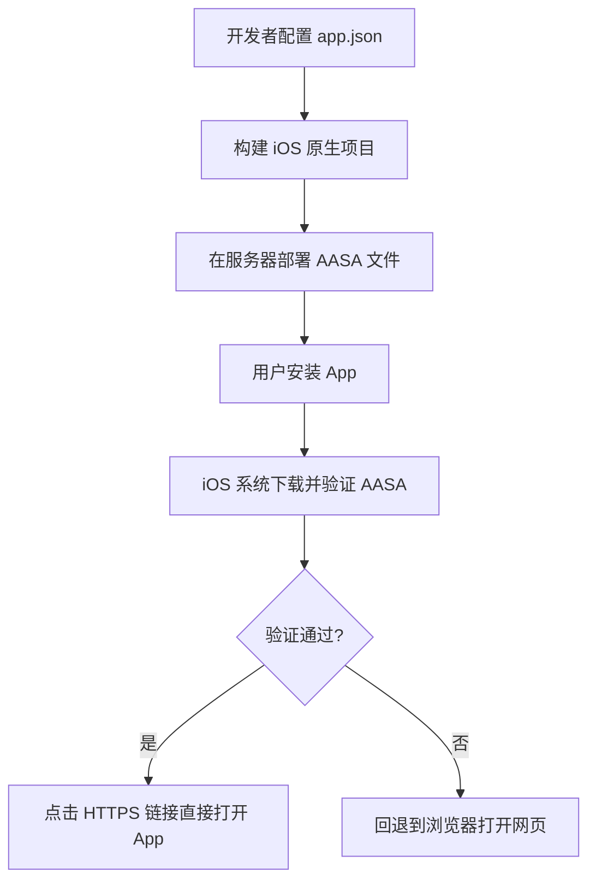
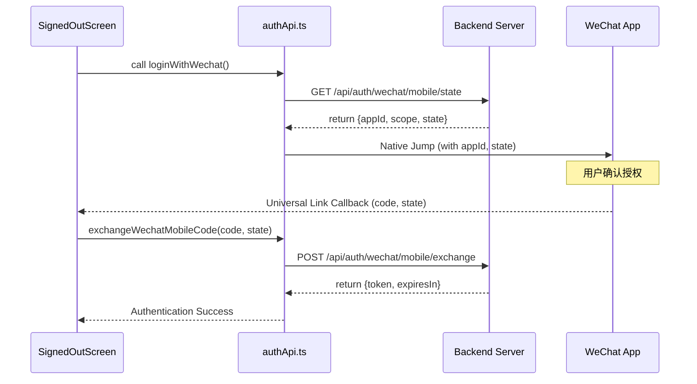
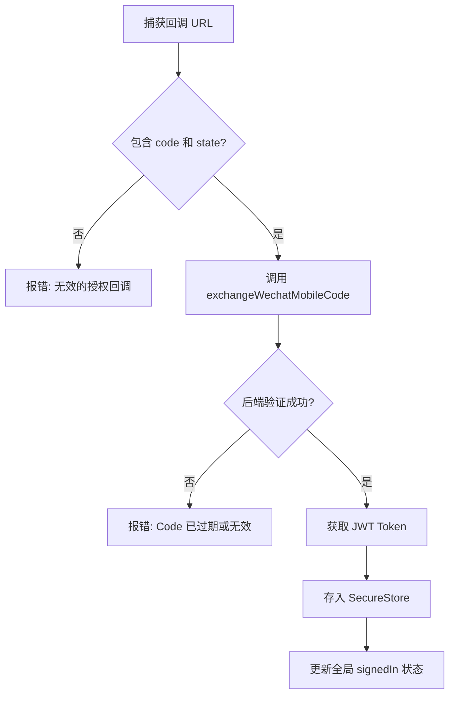
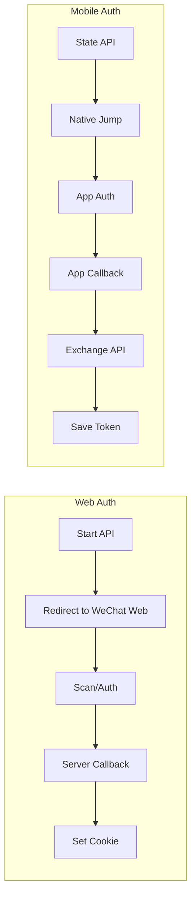

# 移动端原生集成与认证

## 目录
1. [模块概览](#模块概览)
2. [架构概览](#架构概览)
3. [Expo 原生配置指南](#expo-原生配置指南)
4. [iOS Universal Links 深度集成](#ios-universal-links-深度集成)
5. [移动端认证核心逻辑](#移动端认证核心逻辑)
6. [Code 交换与 Token 管理](#code-交换与-token-管理)
7. [开发构建与调试环境](#开发构建与调试环境)
8. [移动端与 Web 端认证差异分析](#移动端与-web-端认证差异分析)
9. [错误处理与安全建议](#错误处理与-安全建议)
10. [文件参考](#文件参考)

## 模块概览

移动端原生集成与认证模块是 LightFlux 实现跨平台一致性体验的核心组件之一。在移动端（iOS 和 Android）环境下，微信登录无法像 Web 端那样简单地通过页面跳转和扫码完成，而是需要深度集成微信原生 SDK 或通过精心配置的 Universal Links（通用链接）与微信客户端进行进程间通信。

本模块主要负责处理以下任务：
- **原生环境适配**：通过 `app.json` 配置 iOS 的 Bundle Identifier 和 Android 的 Package Name，确保应用在微信开放平台登记的身份合法。
- **双端认证协议**：实现从后端获取认证元数据（appId, scope, state），并调用原生接口唤起微信。
- **异步 Code 交换**：在用户授权后，捕获微信回调的授权码（Code），并通过安全通道与后端交换 JWT 访问令牌。
- **环境一致性**：确保移动端获取的 Token 能够与 Web 端共享同一套后端权限体系。

目前该模块的代码主要分布在 `lightflux/services/authApi.ts`（逻辑实现）和 `lightflux/app.json`（原生配置）中。经过初步探索，项目中涉及认证相关的 TS 文件约 5 个，配置文件 2 个。本指南将重点深入分析 `authApi.ts` 中的移动端特有逻辑，并结合 `docs/wechat-open-platform/README.md` 中的申请指南，详细说明如何完成从配置到代码的完整闭环。

## 架构概览

移动端微信认证采用的是基于 OAuth 2.0 的授权码模式，但针对移动端原生环境进行了优化。与 Web 端不同，移动端认证不依赖于浏览器重定向，而是依赖于 App-to-App 的跳转。

以下图表展示了移动端认证的整体系统架构及参与方之间的交互关系：

```mermaid
graph TB
    subgraph "移动端应用 (LightFlux App)"
        UI[登录界面] --> Service[authApi.ts]
        Service --> NativeSDK[微信原生 SDK / Linking]
    end

    subgraph "微信客户端 (WeChat App)"
        AuthUI[授权界面] --> Callback[回调跳转]
    end

    subgraph "后端服务 (LightFlux Server)"
        StateAPI[/api/auth/wechat/mobile/state]
        ExchangeAPI[/api/auth/wechat/mobile/exchange]
    end

    NativeSDK -- "1. 唤起微信" --> AuthUI
    Callback -- "2. 返回 Code/State" --> Service
    Service -- "3. 获取配置" --> StateAPI
    Service -- "4. 交换 Token" --> ExchangeAPI
```

该架构将复杂的原生交互封装在 `authApi.ts` 之后。`UI` 层只需要调用 `getWechatMobileAuthRequest` 获取必要的参数，然后触发原生跳转。当微信授权完成并跳回 LightFlux 时，应用会捕获包含 `code` 的 URL，并调用 `exchangeWechatMobileCode` 完成最后的身份验证。这种设计解耦了前端 UI 与复杂的原生跳转逻辑，使得认证流程更加健壮。

**架构说明**：
- **LightFlux App**：作为 OAuth 客户端，负责发起请求和处理回调。
- **WeChat App**：作为授权服务器的移动端代理，负责用户交互和权限确认。
- **LightFlux Server**：作为资源服务器和真正的授权服务器，负责验证 Code 并签发 Token。

**Diagram sources**: 
- [authApi.ts](lightflux/services/authApi.ts)
- [README.md](docs/wechat-open-platform/README.md)

## Expo 原生配置指南

为了使移动端认证正常工作，必须在 `app.json` 中正确配置原生标识符。这些标识符必须与微信开放平台（Open Platform）中登记的信息完全一致，否则微信 SDK 将拒绝授权请求，或者无法正确跳回应用。

### 核心配置项

在 `lightflux/app.json` 中，需要根据项目需求补齐以下字段：

```json
{
  "expo": {
    "name": "lightflux",
    "slug": "lightflux",
    "ios": {
      "bundleIdentifier": "com.example.lightflux",
      "supportsTablet": true,
      "associatedDomains": ["applinks:app.example.com"]
    },
    "android": {
      "package": "com.example.lightflux",
      "intentFilters": [
        {
          "action": "VIEW",
          "data": {
            "scheme": "https",
            "host": "app.example.com",
            "pathPrefix": "/lightflux"
          },
          "category": ["BROWSABLE", "DEFAULT"]
        }
      ]
    }
  }
}
```

### 配置逻辑说明

1.  **bundleIdentifier (iOS)**：这是 iOS 应用的唯一标识。在微信开放平台申请“移动应用”时，必须填写此 ID。
2.  **package (Android)**：这是 Android 应用的包名。同样需要在微信开放平台登记，并且还需要登记应用的 **签名摘要 (Signature)**。
3.  **associatedDomains (iOS)**：用于支持 Universal Links。微信在 iOS 上优先使用 Universal Links 进行回调，以提高安全性和用户体验。
4.  **intentFilters (Android)**：用于支持 App Links，实现类似 Universal Links 的深度链接功能。

> ⚠️ **重要提示**：修改这些配置后，必须重新运行 `npx expo prebuild` 并重新构建原生应用，因为这些改动涉及 `Info.plist` 和 `AndroidManifest.xml` 的物理变更。

**Section sources**:
- [app.json](lightflux/app.json)
- [README.md](docs/wechat-open-platform/README.md)

## iOS Universal Links 深度集成

Universal Links 是 iOS 系统提供的一种安全深度链接机制。与传统的自定义 Scheme（如 `lightflux://`）不同，Universal Links 使用标准的 HTTPS 链接，且需要服务器端的配合验证，这有效防止了链接被其他恶意应用劫持。

### 配置流程图



### 关键文件：apple-app-site-association

在服务器的域名根目录下（或 `.well-known/` 目录），必须托管一个名为 `apple-app-site-association` (AASA) 的 JSON 文件。其内容示例如下：

```json
{
  "applinks": {
    "apps": [],
    "details": [
      {
        "appID": "TEAMID.com.example.lightflux",
        "paths": ["/lightflux/*"]
      }
    ]
  }
}
```

**配置要点**：
- **appID**：由 Apple Developer 账号的 Team ID 和应用的 Bundle ID 拼接而成。
- **paths**：指定哪些路径应该触发 App 跳转。微信回调通常会使用特定的路径，建议配置通配符以保证兼容性。
- **HTTPS 强制要求**：该文件必须通过 HTTPS 访问，且证书必须有效。

在 LightFlux 的集成中，微信会通过 Universal Link 将授权结果发送回 App。如果配置不正确，用户在微信授权后可能会停留在浏览器页面，而不是返回 LightFlux 应用。

**Section sources**:
- [README.md:L60-L74](docs/wechat-open-platform/README.md#L60-L74)

## 移动端认证核心逻辑

在 `lightflux/services/authApi.ts` 中，移动端认证逻辑被拆分为两个阶段：**初始化请求** 和 **Code 交换**。这种拆分是为了适应移动端异步跳转的特性。

### 初始化认证请求

首先，应用需要从后端获取本次认证所需的元数据。这包括微信 AppID、授权范围（scope）以及一个用于防止 CSRF 攻击的随机状态字符串（state）。

```typescript
export interface WechatMobileAuthRequest {
  appId: string;
  scope: string;
  state: string;
}

export const getWechatMobileAuthRequest =
  async (): Promise<WechatMobileAuthRequest> => {
    const response = await fetch(`${apiUrl}/api/auth/wechat/mobile/state`, {
      credentials: 'include',
    });
    const body = (await response.json()) as WechatMobileAuthRequest & {
      error?: string;
    };
    if (!response.ok) {
      throw new Error(body.error || 'Unable to initialize WeChat login.');
    }
    return body;
  };
```

### 认证执行序列

以下序列图展示了从 UI 点击到完成认证的完整代码执行路径：



在 `SignedOutScreen.tsx` 中，目前的逻辑仅调用了 `beginWechatLogin`，该函数在移动端会抛出异常。未来的实现应当捕获该异常，并切换到 `getWechatMobileAuthRequest` 流程。

**Section sources**:
- [authApi.ts:L62-L80](lightflux/services/authApi.ts#L62-L80)
- [SignedOutScreen.tsx:L19-L26](lightflux/components/SignedOutScreen.tsx#L19-L26)

## Code 交换与 Token 管理

移动端认证最关键的一步是 **Code 交换**。由于移动端无法像 Web 端那样通过 Cookie 自动管理 Session，因此必须显式地获取 JWT Token 并进行安全存储。

### Code 交换逻辑分析

当 App 捕获到微信回调的 `code` 后，会调用 `exchangeWechatMobileCode`：

```typescript
export const exchangeWechatMobileCode = async (
  code: string,
  state: string,
): Promise<{ token: string; expiresIn: number }> => {
  const response = await fetch(
    `${apiUrl}/api/auth/wechat/mobile/exchange`,
    {
      body: JSON.stringify({ code, state }),
      headers: { 'Content-Type': 'application/json' },
      method: 'POST',
    },
  );
  const body = (await response.json()) as {
    token?: string;
    expiresIn?: number;
    error?: string;
  };
  // ... 校验逻辑
  return { token: body.token, expiresIn: body.expiresIn };
};
```

### Token 存储建议

在移动端，Token 的安全性至关重要。与 Web 端的 `localStorage` 不同，移动端建议使用更安全的存储方案：
1.  **iOS Keychain**：通过 `expo-secure-store` 访问，数据会被加密存储，且在 App 卸载前一直保留。
2.  **Android Keystore**：同样通过 `expo-secure-store` 实现硬件级加密存储。

**交换流程决策树**：



**Section sources**:
- [authApi.ts:L82-L103](lightflux/services/authApi.ts#L82-L103)

## 开发构建与调试环境

微信原生集成的一个巨大挑战是：**它无法在标准的 Expo Go 应用中运行**。

### 为什么必须使用 Expo Development Build？

1.  **原生插件依赖**：微信 SDK 需要集成特定的原生代码，而 Expo Go 只包含预定义的一组原生模块。
2.  **标识符校验**：微信开放平台会校验发起请求的应用包名（Package Name）或 Bundle ID。Expo Go 的标识符是固定的（如 `host.exp.exponent`），无法通过微信的校验。
3.  **签名校验**：Android 端微信会校验应用的签名证书摘要。Expo Go 的签名与 LightFlux 正式版签名不符。
4.  **Universal Links**：Universal Links 需要在 App 的 `Entitlements` 中声明，这只能在自定义构建中完成。

### 构建步骤建议

开发者应当按照以下步骤准备调试环境：
1.  安装 `expo-dev-client`。
2.  配置 `app.json` 中的原生字段。
3.  执行 `npx expo run:ios` 或 `npx expo run:android` 生成本地开发构建。
4.  在真机上安装该构建进行微信登录测试。

**Section sources**:
- [authApi.ts:L37-L41](lightflux/services/authApi.ts#L37-L41)
- [README.md:L139-L141](docs/wechat-open-platform/README.md#L139-L141)

## 移动端与 Web 端认证差异分析

理解两端的差异有助于开发者更好地维护认证逻辑。

| 特性 | Web 端 (Browser) | 移动端 (Native) |
| :--- | :--- | :--- |
| **交互方式** | 浏览器重定向 / 扫码 | App-to-App 原生跳转 |
| **身份标识** | 授权回调域 (Domain) | Bundle ID / Package Name / 签名 |
| **回调机制** | HTTP 302 重定向 | Universal Links / Deep Links |
| **Session 管理** | HTTP-Only Cookie | JWT Token (Secure Storage) |
| **起始 API** | `/api/auth/wechat/web/start` | `/api/auth/wechat/mobile/state` |
| **结束 API** | 自动完成 (Callback) | `/api/auth/wechat/mobile/exchange` |

### 流程对比图



移动端流程多了一个 `Exchange API` 步骤，这是因为移动端 App 无法直接通过重定向设置 Cookie，必须由客户端拿到 Code 后主动向后端“兑换”身份凭证。

**Section sources**:
- [authApi.ts](lightflux/services/authApi.ts)
- [README.md](docs/wechat-open-platform/README.md)

## 错误处理与安全建议

在移动端认证过程中，可能会遇到多种异常情况，需要进行妥善处理。

### 常见错误类型
- **User Cancelled**：用户在微信端点击了“取消”，App 会收到特定的错误码。此时应静默返回或提示用户。
- **Configuration Mismatch**：Bundle ID 或签名不匹配导致微信报错“未注册的应用”。这通常发生在开发阶段。
- **Network Issues**：在 Code 交换阶段网络中断。由于 Code 通常只能使用一次，此时可能需要用户重新发起登录。

### 安全建议
1.  **State 校验**：务必校验后端返回的 `state` 与回调中携带的 `state` 是否一致，防止 CSRF 攻击。
2.  **Token 过期处理**：移动端 Token 通常有效期较长，应实现自动刷新机制或在 401 时引导用户重新登录。
3.  **HTTPS 强制**：所有与后端的通信以及 Universal Links 必须强制使用 HTTPS。

**Section sources**:
- [authApi.ts:L99-L102](lightflux/services/authApi.ts#L99-L102)

## 文件参考

以下是本模块涉及的关键源文件列表：

- `lightflux/app.json`: Expo 全局配置文件，包含 iOS/Android 原生标识符和插件配置。
- `lightflux/services/authApi.ts`: 认证服务层，封装了与后端的所有认证相关交互。
- `lightflux/components/SignedOutScreen.tsx`: 登录界面组件，负责触发认证流程并处理错误反馈。
- `docs/wechat-open-platform/README.md`: 官方申请与集成指南，提供了详细的配置参数说明。
- `lightflux/package.json`: 项目依赖描述文件，定义了构建和运行所需的库。
- `lightflux/App.tsx`: 应用入口，负责初始化 Session 状态和全局路由。
