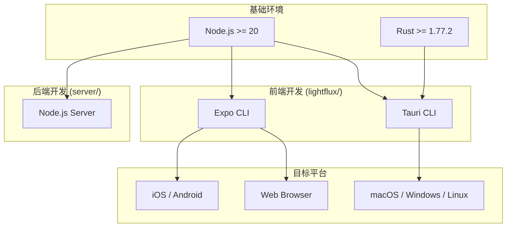
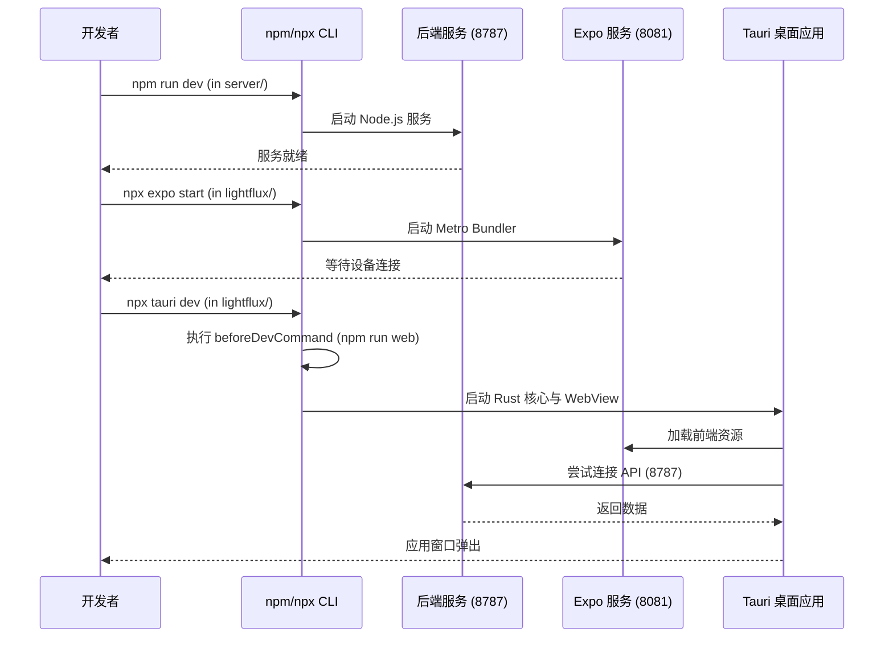
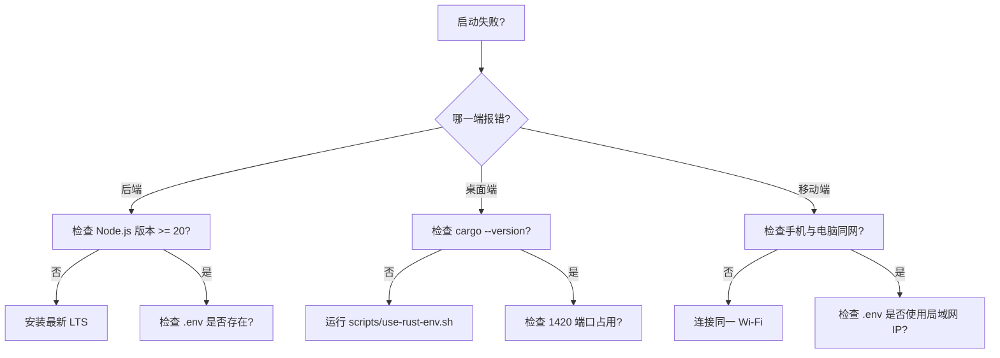

# 快速上手

## 目录
1. [引言](#引言)
2. [模块概览](#模块概览)
3. [环境要求](#环境要求)
4. [核心组件与配置](#核心组件与配置)
5. [分步骤安装指南](#分步骤安装指南)
6. [各端启动流程](#各端启动流程)
7. [环境变量配置详解](#环境变量配置详解)
8. [常见问题与排查](#常见问题与排查)
9. [文件参考](#文件参考)

## 引言

LightFlux 是一个专注于个人效率与每日规划的跨平台任务管理系统。为了提供极致的响应速度与多端同步体验，项目采用了现代化的技术栈，包括前端的 Expo (React Native)、桌面的 Tauri (Rust) 以及后端的 Node.js 服务。

本章节旨在为新加入的开发者提供一份详尽的“30分钟快速上手指南”。无论你是在 macOS 还是 Windows 环境下，通过遵循本指南，你将能够快速搭建起完整的开发环境，并成功运行移动端、Web 端、桌面端以及配套的后端服务。

## 模块概览

在开始搭建环境之前，了解项目的代码结构与规模有助于更好地定位问题。

### 范围与规模

经过对工作区的扫描，LightFlux 项目主要由以下两个核心部分组成：

- **前端项目 (`lightflux/`)**: 包含约 90 个源文件，涵盖了移动端 (iOS/Android)、Web 端以及桌面端 (Tauri) 的逻辑。
- **后端服务 (`server/`)**: 包含约 10 个源文件，负责身份验证、数据同步与 AI 代理接口。
- **工具脚本 (`scripts/`)**: 提供环境初始化与辅助开发脚本。

### 关键子模块

| 子模块 | 路径 | 职责描述 | 覆盖深度 |
| :--- | :--- | :--- | :--- |
| **桌面端核心** | `lightflux/src-tauri/` | 基于 Rust 的桌面外壳配置与原生集成 | 深度覆盖 |
| **业务逻辑层** | `lightflux/store/` | 基于 Zustand 的状态管理，处理任务与里程碑逻辑 | 简要提及 |
| **API 服务层** | `lightflux/services/` | 处理与后端的通信、图片上传及本地存储 | 深度覆盖 |
| **后端核心** | `server/src/` | Node.js 实现的认证与 AI 代理逻辑 | 深度覆盖 |
| **UI 组件库** | `lightflux/components/` | 跨平台的 React Native 组件实现 | 简要提及 |

接下来的文档将重点围绕环境搭建、启动指令以及跨端调试展开。

## 环境要求

LightFlux 对开发环境有特定要求，请确保在开始前已安装以下基础工具。

### 1. 基础工具链

- **Node.js**: 版本需 >= 20.0.0。推荐使用 LTS 版本。
- **npm**: 随 Node.js 安装，建议版本 >= 10.0.0。
- **Rust**: 版本需 >= 1.77.2。这是构建桌面端应用所必需的。

### 2. 移动端开发 (Expo)

- **Expo CLI**: 通过 `npm install -g expo-cli` 安装（或使用 `npx expo`）。
- **iOS**: 需要 macOS 环境并安装 Xcode。
- **Android**: 需要安装 Android Studio 及 JDK (推荐 JDK 17)。

### 3. 桌面端开发 (Tauri)

- **macOS**: 需要安装 Xcode Command Line Tools。
- **Windows**: 需要安装 Microsoft Visual Studio C++ 生成工具。
- **Linux**: 需要安装 `libwebkit2gtk-4.0-dev` 等系统依赖。

The following diagram illustrates the dependency relationship between different development environments and their corresponding target platforms.



该图展示了 Node.js 作为核心基础，支撑了前端 Expo 和后端服务的运行。Rust 则专门为 Tauri 桌面端提供底层支持。开发者需要根据自己想要调试的端来准备相应的子环境。

## 核心组件与配置

LightFlux 的启动与运行高度依赖于几个关键的配置文件。理解这些文件是快速上手的关键。

### 1. 前端配置 (`lightflux/package.json`)

前端项目定义了多端的启动脚本。

```json
{
  "scripts": {
    "start": "expo start",
    "android": "expo start --android",
    "ios": "expo start --ios",
    "web": "expo start --web",
    "desktop:web": "expo export --platform web --output-dir desktop-dist",
    "test": "vitest run"
  }
}
```

### 2. 桌面端配置 (`lightflux/src-tauri/tauri.conf.json`)

Tauri 配置文件定义了桌面应用的构建逻辑。

```json
{
  "build": {
    "beforeDevCommand": "npm run web -- --port 1420",
    "devUrl": "http://localhost:1420",
    "beforeBuildCommand": "npm run desktop:web",
    "frontendDist": "../desktop-dist"
  }
}
```

### 3. Rust 环境脚本 (`scripts/use-rust-env.sh`)

为了方便管理 Rust 环境，项目提供了一个环境切换脚本。

```bash
#!/bin/sh
DEV_ENV="${LIGHTFLUX_DEV_ENV:-$HOME/Desktop/Dev_env}"
export RUSTUP_HOME="${RUSTUP_HOME:-$DEV_ENV/rust/rustup}"
export CARGO_HOME="${CARGO_HOME:-$DEV_ENV/rust/cargo}"
export PATH="$CARGO_HOME/bin:$PATH"
```

**Section sources**:
- [lightflux/package.json](lightflux/package.json)
- [lightflux/src-tauri/tauri.conf.json](lightflux/src-tauri/tauri.conf.json)
- [scripts/use-rust-env.sh](scripts/use-rust-env.sh)

## 分步骤安装指南

按照以下步骤，从零开始搭建 LightFlux 环境。

### 第一步：克隆仓库与基础依赖安装

首先，安装前端与后端的 Node.js 依赖。

```bash
# 进入前端目录并安装依赖
cd lightflux
npm install

# 进入后端目录并安装依赖
cd ../server
npm install
```

### 第二步：Rust 环境初始化 (针对桌面端)

如果你打算进行桌面端开发，需要初始化项目指定的 Rust 路径。

```bash
# 创建自定义 Rust 目录
mkdir -p "$HOME/Desktop/Dev_env/rust"

# 下载并运行 rustup-init
curl --proto '=https' --tlsv1.2 -sSf https://sh.rustup.rs -o /tmp/lightflux-rustup-init.sh
RUSTUP_HOME="$HOME/Desktop/Dev_env/rust/rustup" \
  CARGO_HOME="$HOME/Desktop/Dev_env/rust/cargo" \
  sh /tmp/lightflux-rustup-init.sh -y --no-modify-path --profile minimal
```

### 第三步：配置文件准备

将 `.env.example` 文件复制为 `.env` 并根据需要进行修改。

```bash
# 前端配置
cp lightflux/.env.example lightflux/.env

# 后端配置
cp server/.env.example server/.env
```

## 各端启动流程

LightFlux 支持多种端同时运行。以下是各端的启动指令。

### 1. 后端服务启动

后端服务是所有端的基础，建议最先启动。

```bash
cd server
npm run dev
```
后端服务默认运行在 `http://localhost:8787`。

### 2. 移动端与 Web 端启动 (Expo)

使用 Expo 启动前端项目。

```bash
cd lightflux
npm start
```
在控制台中，你可以按 `a` 打开 Android 模拟器，按 `i` 打开 iOS 模拟器，或按 `w` 打开浏览器 Web 版。

### 3. 桌面端启动 (Tauri)

桌面端需要先确保 Rust 环境已配置，然后运行 Tauri 开发指令。

```bash
cd lightflux
npx tauri dev
```

The following sequence diagram shows the interaction between the developer, the CLI tools, and the running applications during the startup process.



启动流程遵循从底层服务到上层应用的顺序。后端服务提供数据支持，Expo 提供前端资源打包，而 Tauri 则将这些资源封装进原生窗口中。

## 环境变量配置详解

LightFlux 使用 `.env` 文件来管理不同环境下的配置。

### 前端环境变量 (`lightflux/.env`)

| 变量名 | 说明 | 默认值 |
| :--- | :--- | :--- |
| `EXPO_PUBLIC_AUTH_API_URL` | 后端认证 API 地址 | `http://localhost:8787` |
| `EXPO_PUBLIC_UPLOAD_API_URL` | 图片上传 API 地址 | `http://localhost:8787` |
| `EXPO_PUBLIC_AI_API_URL` | AI 代理 API 地址 | `http://localhost:8787` |

> 💡 **提示**: 如果你希望在真机上调试移动端，请将 `localhost` 替换为你电脑的局域网 IP 地址。

### 后端环境变量 (`server/.env`)

后端配置更为复杂，涉及数据库路径、密钥及 AI 模型配置。

```env
PORT=8787
SESSION_SECRET=your-random-secret
DATA_FILE=./data/auth.json
UPLOAD_DIR=./data/uploads

# AI 配置
AI_BASE_URL=https://api.openai.com/v1
AI_API_KEY=sk-xxxx
AI_MODEL=gpt-4
```

**Section sources**:
- [lightflux/.env.example](lightflux/.env.example)
- [server/.env.example](server/.env.example)

## 常见问题与排查

在初次运行项目时，你可能会遇到以下常见问题。

### 1. 依赖冲突或安装失败
- **现象**: `npm install` 报错，提示 `peer dependencies` 冲突。
- **解决**: 尝试使用 `npm install --legacy-peer-deps`。项目使用了 React 19 和 Expo 57，部分旧插件可能尚未完全适配。

### 2. 桌面端启动黑屏
- **现象**: 运行 `tauri dev` 后窗口弹出但内容为空白或显示连接失败。
- **解决**: 检查 `tauri.conf.json` 中的 `devUrl` 是否与 `beforeDevCommand` 启动的端口一致（默认为 1420）。同时确保没有其他进程占用该端口。

### 3. Rust 环境找不到
- **现象**: 报错 `cargo: command not found`。
- **解决**: 确保已执行 `source scripts/use-rust-env.sh` 或者手动将 `$HOME/Desktop/Dev_env/rust/cargo/bin` 添加到你的系统 `PATH` 中。

### 4. 移动端无法连接后端
- **现象**: 手机端显示 "Network Error"。
- **解决**: 确保手机与电脑在同一 Wi-Fi 下，并且 `.env` 中的 API URL 使用的是电脑的局域网 IP（如 `192.168.1.x`），而不是 `localhost`。

The following flowchart describes the decision logic for troubleshooting common startup issues.



该流程图为开发者提供了一个快速排查路径。大多数问题集中在环境版本不匹配、网络连通性以及端口冲突上。

## 文件参考

以下是本章节涉及的核心文件列表，建议开发者详细阅读以深入理解启动逻辑。

- [lightflux/package.json](lightflux/package.json): 前端依赖与启动脚本定义。
- [server/package.json](server/package.json): 后端依赖与 Node.js 运行要求。
- [lightflux/src-tauri/tauri.conf.json](lightflux/src-tauri/tauri.conf.json): 桌面端构建与调试配置。
- [scripts/use-rust-env.sh](scripts/use-rust-env.sh): Rust 环境变量管理脚本。
- [lightflux/.env.example](lightflux/.env.example): 前端环境变量模板。
- [server/.env.example](server/.env.example): 后端环境变量模板。
- [lightflux/src-tauri/Cargo.toml](lightflux/src-tauri/Cargo.toml): Rust 核心依赖与版本要求。
- [docs/desktop-release.md](docs/desktop-release.md): 关于桌面端发布与环境初始化的补充说明。

**Section sources**:
- [lightflux/package.json](lightflux/package.json)
- [server/package.json](server/package.json)
- [lightflux/src-tauri/tauri.conf.json](lightflux/src-tauri/tauri.conf.json)
- [scripts/use-rust-env.sh](scripts/use-rust-env.sh)
- [lightflux/.env.example](lightflux/.env.example)
- [server/.env.example](server/.env.example)
- [lightflux/src-tauri/Cargo.toml](lightflux/src-tauri/Cargo.toml)
- [docs/desktop-release.md](docs/desktop-release.md)
