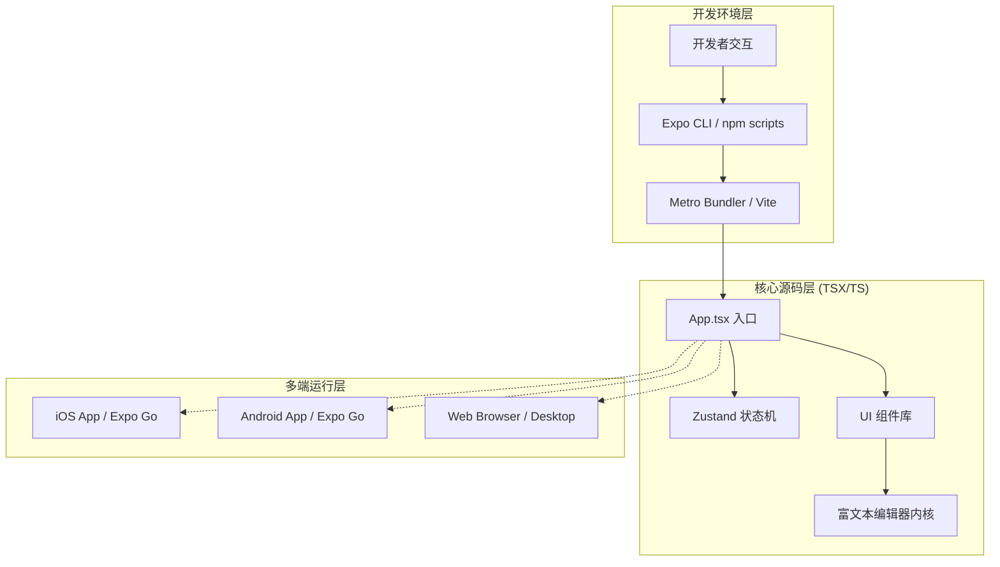
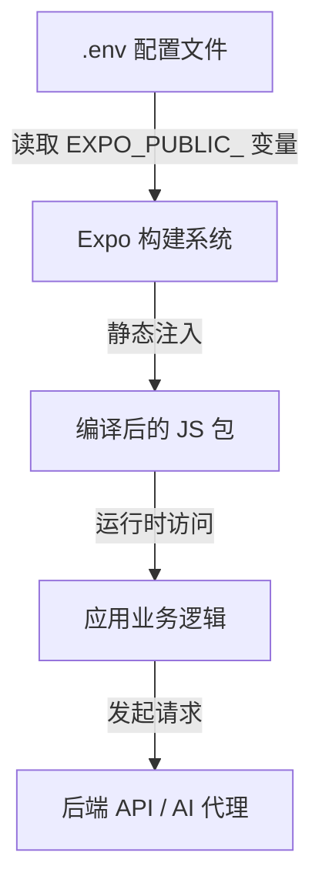
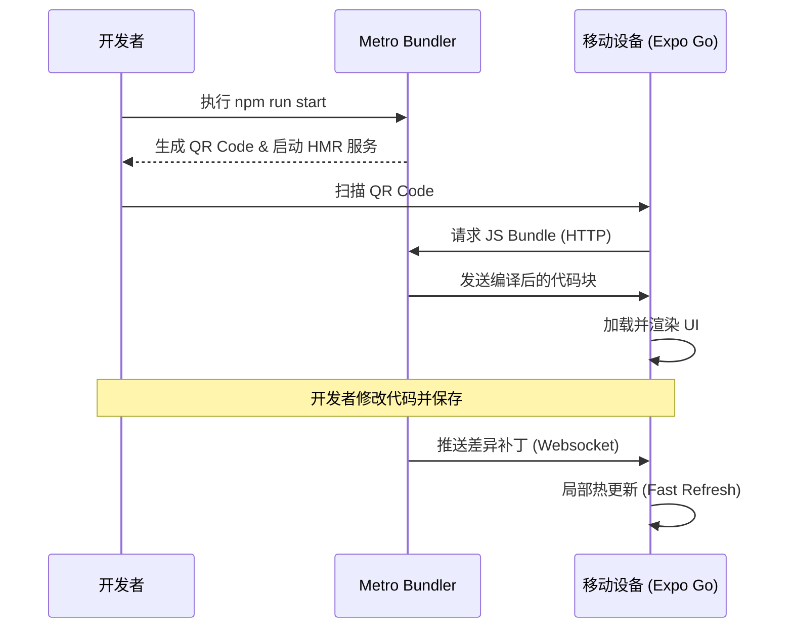
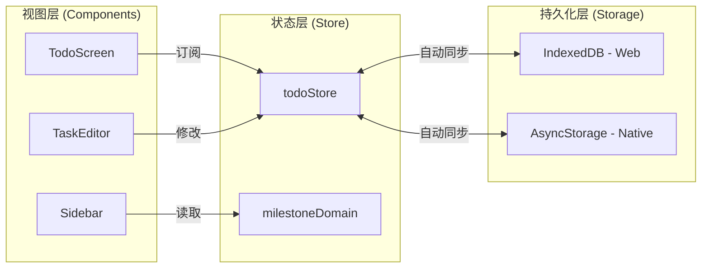
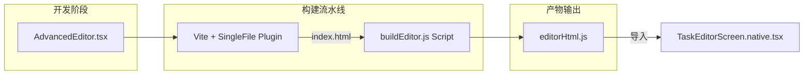
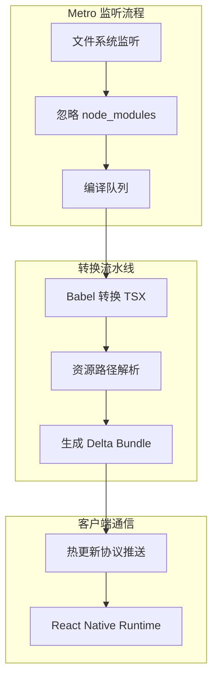

# 前端开发环境（移动端与 Web）

## 目录
1. [模块概览](#模块概览)
2. [开发环境准备](#开发环境准备)
   - [依赖安装与环境要求](#依赖安装与环境要求)
   - [环境变量配置详解](#环境变量配置详解)
3. [启动与调试流程](#启动与调试流程)
   - [Expo 启动指令矩阵](#expo-启动指令矩阵)
   - [移动端调试与 Expo Go 实践](#移动端调试与-expo-go-实践)
   - [Web 端调试与跨平台适配](#web-端调试与跨平台适配)
4. [核心架构与组件设计](#核心架构与组件设计)
   - [响应式布局与 App 入口](#响应式布局与-app-入口)
   - [基于 Zustand 的状态管理架构](#基于-zustand-的状态管理架构)
5. [富文本编辑器构建机制深度解析](#富文本编辑器构建机制深度解析)
   - [编辑器构建流水线 (Build Pipeline)](#编辑器构建流水线-build-pipeline)
   - [WebView Bridge 与 Native 交互实现](#webview-bridge-与-native-交互实现)
6. [热更新与 Metro Bundler 优化](#热更新与-metro-bundler-优化)
7. [常见问题排查与开发建议](#常见问题排查与开发建议)
8. [关键源码文件参考](#关键源码文件参考)

## 模块概览

LightFlux 的前端部分是一个高度集成的跨平台应用系统，基于 **Expo** 和 **React Native** 技术栈构建。它不仅支持传统的 iOS 和 Android 移动端设备，还通过 React Native Web 实现了对桌面浏览器（Web）的完美支持。这种“一份代码，多端运行”的架构极大地提高了开发效率，并确保了业务逻辑在不同平台上的一致性。

### 规模与范围
- **代码体量**：本项目在 `lightflux/` 目录下拥有约 150 个 TypeScript/TSX 文件。这些文件构成了应用的核心，从底层的 API 通信协议到高层的 UI 交互逻辑，均采用了强类型定义，以确保大型项目的可维护性。
- **功能模块划分**：
    - **`components/`**：这是应用最庞大的目录，采用了功能模块化的组织方式。例如，`tasks/` 包含了任务列表的所有交互组件，`milestones/` 负责里程碑管理，而 `editor/` 则封装了复杂的富文本编辑界面。
    - **`store/`**：应用的大脑。基于 Zustand 实现的响应式状态机，管理着从用户偏好到任务列表的所有数据流。
    - **`services/`**：封装了所有的副作用操作，包括与 AI 代理的通信、身份验证以及本地 IndexedDB 存储的适配。
    - **`editor-web/`**：一个专门为富文本编辑器设计的子工程，它独立于主应用构建，体现了项目在处理复杂 UI 组件时的解耦思路。
- **技术栈核心**：Expo SDK 57、React Native 0.86、Zustand、NativeWind (Tailwind CSS) 以及 Tiptap 编辑器内核。

下图展示了 LightFlux 前端系统的整体架构层次，描述了代码如何通过 Metro Bundler 分发到不同平台，以及各层级之间的依赖关系。



在架构设计上，LightFlux 强调了“逻辑共享，视图适配”的原则。通过 React Native 的跨平台抽象，开发者可以编写通用的业务逻辑，而对于特定平台的 UI 差异，则通过后缀名机制（`.native.tsx` vs `.web.tsx`）进行精细化控制。这种设计使得应用既能拥有 Native 的流畅体验，又能享受 Web 的部署便捷性。

**模块源码参考**:
- [package.json](lightflux/package.json)
- [App.tsx](lightflux/App.tsx)
- [index.ts](lightflux/index.ts)

## 开发环境准备

在开始 LightFlux 的开发旅程之前，正确配置开发环境是至关重要的第一步。

### 依赖安装与环境要求

项目要求 Node.js 版本在 v18 以上，推荐使用最新的 LTS 版本。在 `lightflux/` 根目录下执行以下命令来初始化项目：

```bash
npm install
```

**关键技术点说明**：
1. **React 19 适配**：LightFlux 率先采用了 React 19。由于 React Native 生态中部分第三方库可能尚未完全更新 peer dependencies，我们在 `package.json` 中使用了 `overrides` 字段来强制锁定 `react-dom` 等库的版本，确保依赖树的稳定性。
2. **NativeWind (Tailwind CSS)**：项目使用 NativeWind 将 Tailwind 的开发体验带入 React Native。在安装依赖后，Babel 插件会自动处理类名到样式的转换。如果你发现样式没有按预期工作，请检查 `babel.config.js` 是否正确配置了 NativeWind 插件。

### 环境变量配置详解

LightFlux 依赖于一系列环境变量来连接后端服务或 AI 代理。项目提供了一个模板文件 `.env.example`。

```bash
cp .env.example .env
```

在 `.env` 文件中，所有以 `EXPO_PUBLIC_` 开头的变量都会在构建时被注入到客户端代码中。

- **`EXPO_PUBLIC_AUTH_API_URL`**：这是应用连接认证服务器的端点。如果你的开发环境没有运行后端服务，可以将其保持为空，应用会自动降级到“本地离线模式”，此时数据将仅存储在设备的本地数据库中。
- **`EXPO_PUBLIC_AI_API_URL`**：指定 AI 代理服务器的地址。LightFlux 的核心 AI 交互逻辑（如自然语言处理任务）都依赖于这个地址。



**安全提示**：切勿将包含敏感信息的 `.env` 文件提交到版本控制系统中。`.gitignore` 已经默认排除了该文件。在生产环境中，这些变量通常通过 CI/CD 平台的机密管理功能进行注入。

**配置参考**:
- [.env.example](lightflux/.env.example)
- [tailwind.config.js](lightflux/tailwind.config.js)
- [babel.config.js](lightflux/babel.config.js)

## 启动与调试流程

一旦环境配置完成，你就可以启动开发服务器并开始调试了。

### Expo 启动指令矩阵

`package.json` 中定义了丰富的脚本，以满足不同场景下的开发需求：

| 指令 | 目标平台 | 适用场景 |
| :--- | :--- | :--- |
| `npm run start` | 所有平台 | 启动 Metro 开发服务器，展示二维码 |
| `npm run android` | Android | 在模拟器或已连接的真机上运行 |
| `npm run ios` | iOS | 在 macOS 上的 iOS 模拟器中运行 |
| `npm run web` | Web | 在默认浏览器中开启 Web 预览 |
| `npm run test` | N/A | 运行 Vitest 单元测试 |

### 移动端调试与 Expo Go 实践

对于大多数移动端 UI 开发，**Expo Go** 是最推荐的工具。它允许你在不编译原生代码的情况下，直接在真机上预览 JavaScript 的更改。

1. **准备工作**：在手机应用商店下载 Expo Go。
2. **启动服务**：在终端运行 `npm run start`。
3. **连接设备**：确保手机和电脑处于同一局域网内。使用 Expo Go 扫描终端中的二维码。
4. **交互调试**：Metro Bundler 会实时将代码补丁推送到手机。你可以通过摇晃手机来唤出开发者菜单，进行性能监控或开启远程调试。



### Web 端调试与跨平台适配

运行 `npm run web` 时，Expo 会启动一个针对 Web 优化的开发服务器。Web 版本是调试复杂布局和网络请求的最佳场所，因为它允许你使用 Chrome DevTools 的完整功能。

**适配逻辑**：
LightFlux 在 `config/focusStyles.web.ts` 等文件中专门处理了 Web 端的交互细节，例如鼠标悬停状态和焦点环样式。在开发 Web 版本时，请务必关注这些桌面端特有的交互体验。

**启动脚本参考**:
- [package.json:L6-L16](lightflux/package.json#L6-L16)

## 核心架构与组件设计

LightFlux 的前端架构采用了典型的“单向数据流 + 响应式视图”模式。

### 响应式布局与 App 入口

`App.tsx` 是整个应用的灵魂。它不仅是路由的起点，还承担了复杂的响应式布局计算。应用会根据 `useWindowDimensions` 获取的屏幕宽度，动态决定是展示移动端的单栏布局，还是桌面端的多栏（侧边栏 + 列表 + 详情）布局。

```typescript
// App.tsx 中的核心布局决策
const usesDesktopLayout = width >= 900;
const labels = translations[language];

return (
  <SafeAreaProvider>
    <TodoProvider>
      <View className="flex-1 flex-row bg-canvas">
        {/* 桌面端侧边栏 */}
        {usesDesktopLayout && <DesktopSidebar navigationItems={navigationItems} />}
        
        {/* 主内容区域 */}
        <View style={usesDesktopLayout && selectedTask ? { width: resolvedListPaneWidth } : styles.fullPane}>
          {activeScreen}
        </View>

        {/* 桌面端详情编辑器 */}
        {usesDesktopLayout && selectedTask && (
          <TaskEditorScreen embedded todoId={selectedTask.id} />
        )}
      </View>
    </TodoProvider>
  </SafeAreaProvider>
);
```

这种设计确保了用户在不同设备上都能获得最佳的交互体验，而开发者只需维护一套核心业务逻辑。

### 基于 Zustand 的状态管理架构

项目放弃了笨重的 Redux，转而使用轻量级且高性能的 **Zustand**。所有的全局状态都集中在 `store/` 目录下。

- **`todoStore.tsx`**：管理核心业务对象（任务、里程碑、分组）。它集成了持久化中间件，能够自动将状态同步到本地存储。
- **原子化更新**：通过 `useShallow` 钩子，组件可以仅在关心的状态发生变化时才重新渲染，这对于拥有大量任务列表的 Todo 应用来说至关重要。



这种架构使得状态的流转非常透明，开发者可以通过简单的函数调用来触发复杂的状态变更，而无需编写大量的模版代码。

**核心组件参考**:
- [App.tsx](lightflux/App.tsx)
- [store/todoStore.tsx](lightflux/store/todoStore.tsx)
- [components/editor/TaskEditorScreen.tsx](lightflux/components/editor/TaskEditorScreen.tsx)

## 富文本编辑器构建机制深度解析

LightFlux 提供了一个接近桌面级体验的富文本编辑器，这是通过在 Native 环境中嵌入高度定制的 WebView 实现的。

### 编辑器构建流水线 (Build Pipeline)

编辑器内核位于 `lightflux/editor-web/`。它基于 Tiptap (ProseMirror 的现代封装) 构建。由于 Native 端无法直接运行复杂的 Web 富文本引擎，我们需要将其预编译为一个静态资源。

**构建流程详解**：
1. **源码编写**：在 `editor-web/AdvancedEditor.tsx` 中定义编辑器的扩展（如代码块、图片、占位符等）。
2. **Vite 编译**：执行 `npm run editor:build`。Vite 会根据 `vite.config.ts` 将所有 React 代码和样式打包成一个单一的 HTML 文件。
3. **字符串化转换**：`editor:postbuild` 脚本会读取生成的 HTML，将其转义并封装成一个 JavaScript 模块 `editorHtml.js`。



### WebView Bridge 与 Native 交互实现

在移动端，`TaskEditorScreen.native.tsx` 使用 `@10play/tentap-editor` 提供的 Bridge 机制。

```typescript
// TaskEditorScreen.native.tsx 实现片段
import { editorHtml } from '../../editor-web/build/editorHtml';

const editor = useEditorBridge({
  autofocus: false,
  customSource: editorHtml, // 注入构建出的 HTML 字符串
  bridgeExtensions: [...TenTapStartKit, CodeBlockBridge],
  initialContent: todo?.content,
});

// 监听编辑器内容变化并同步到 Zustand Store
const editorContent = useEditorContent(editor, { debounceInterval: 350 });
useEffect(() => {
  if (editorContent) updateTodo(todoId, { content: editorContent });
}, [editorContent]);
```

这种“混合架构”既保留了 Web 编辑器的强大功能，又通过 Bridge 实现了与 Native 状态的无缝同步，是本项目最核心的技术壁垒之一。

**编辑器参考**:
- [editor-web/vite.config.ts](lightflux/editor-web/vite.config.ts)
- [components/editor/TaskEditorScreen.native.tsx](lightflux/components/editor/TaskEditorScreen.native.tsx)

## 热更新与 Metro Bundler 优化

为了提供极致的开发体验，LightFlux 深度利用了 Metro Bundler 的特性。

- **Fast Refresh**：Metro 能够智能识别文件修改。如果你只修改了组件的样式或渲染逻辑，应用会在不丢失当前页面状态的情况下进行更新。
- **缓存管理**：Metro 会在 `node_modules/.cache/metro` 中缓存编译产物。如果遇到奇怪的编译错误，通常可以通过 `npx expo start -c` 清除缓存来解决。



在开发过程中，终端会实时显示打包进度和可能的语法错误。通过点击 `j` 键，你可以访问 Expo 的开发控制台，查看网络请求和日志输出。

## 常见问题排查与开发建议

在开发 LightFlux 前端时，可能会遇到以下常见问题：

1. **编辑器白屏或内容不加载**：
   - **原因**：通常是因为没有运行 `npm run editor:build`，导致 `editorHtml.js` 文件为空或过旧。
   - **对策**：在修改 `editor-web` 目录下的任何代码后，务必重新执行构建命令。

2. **NativeWind 样式失效**：
   - **对策**：检查 `tailwind.config.js`。NativeWind 需要明确知道哪些文件需要扫描类名。如果你的新组件位于一个新的子目录下，请确保该路径已包含在 `content` 数组中。

3. **Android 模拟器无法连接 Metro**：
   - **对策**：运行 `adb reverse tcp:8081 tcp:8081`。这会将模拟器的 8081 端口映射到电脑的 8081 端口，确保调试流量能够正常通过。

4. **性能建议**：
   - 在移动端开发时，尽量减少在 `App.tsx` 中定义大型匿名函数，以避免不必要的重渲染。
   - 利用 `useMemo` 和 `useCallback` 优化列表项组件，特别是在处理长列表（如 `TodoScreen`）时。

## 关键源码文件参考

以下是本章节涉及的核心源码文件，建议开发者在开始工作前仔细研读：

- [lightflux/package.json](lightflux/package.json)：项目配置的源头，包含所有依赖和构建脚本。
- [lightflux/App.tsx](lightflux/App.tsx)：应用主框架，实现了复杂的响应式布局逻辑。
- [lightflux/app.json](lightflux/app.json)：Expo 配置文件，定义了应用在原生平台上的表现。
- [lightflux/index.ts](lightflux/index.ts)：应用的注册起点。
- [lightflux/editor-web/vite.config.ts](lightflux/editor-web/vite.config.ts)：富文本编辑器子项目的构建配置。
- [lightflux/components/editor/TaskEditorScreen.native.tsx](lightflux/components/editor/TaskEditorScreen.native.tsx)：Native 编辑器的桥接实现。
- [lightflux/store/todoStore.tsx](lightflux/store/todoStore.tsx)：全局业务状态的核心定义。
- [lightflux/.env.example](lightflux/.env.example)：环境变量配置模板。
- [lightflux/tailwind.config.js](lightflux/tailwind.config.js)：样式系统的全局配置。
