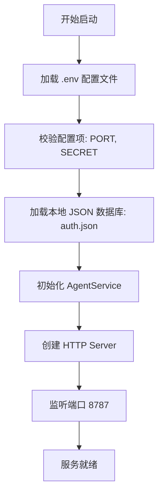
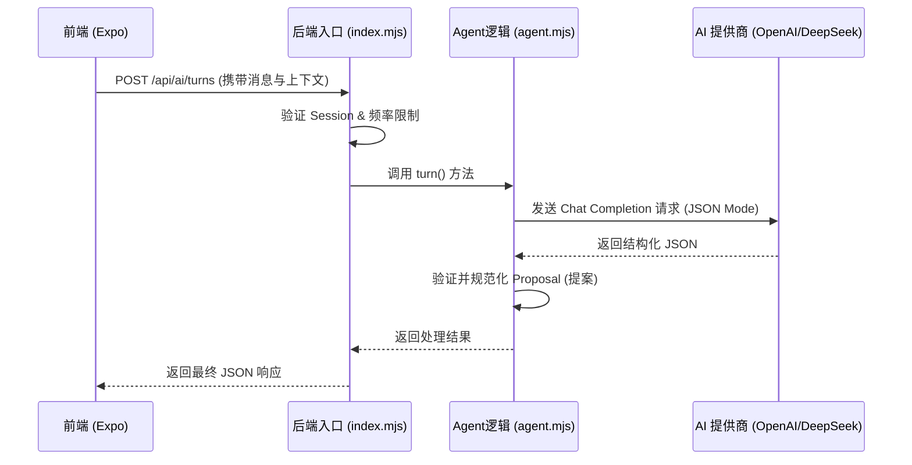
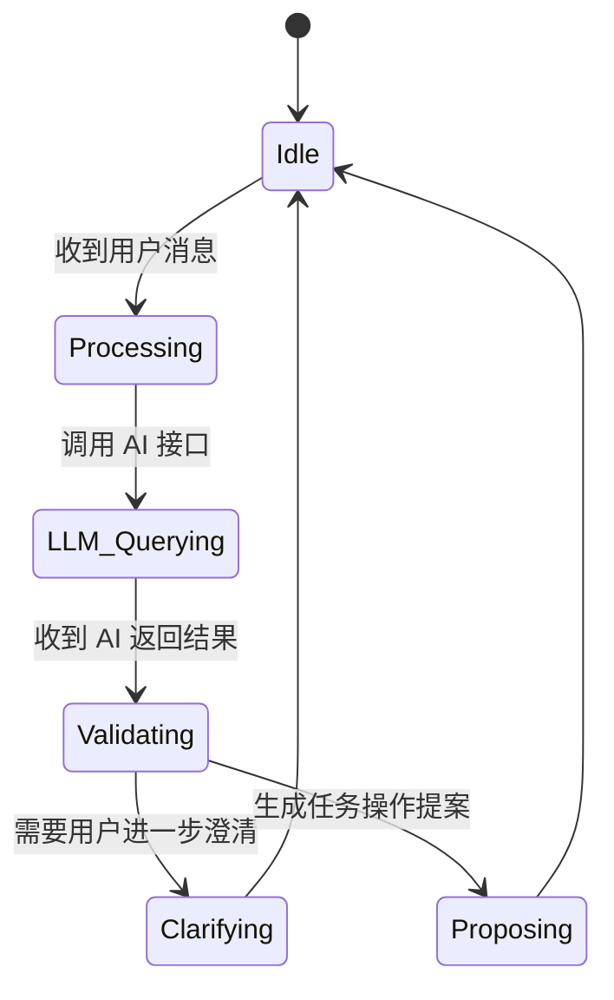
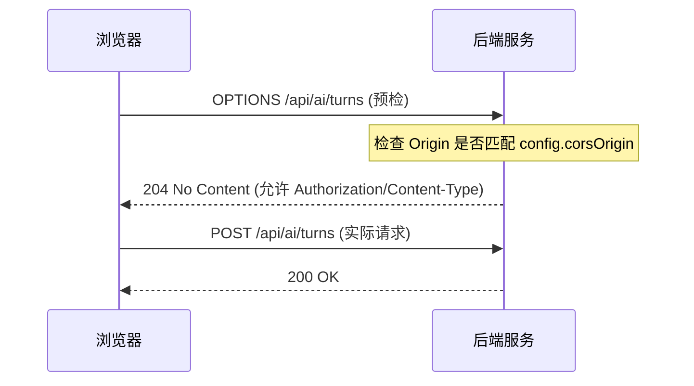

# 后端服务启动

 ## 目录
 1. [模块概览](#模块概览)
 2. [环境配置](#环境配置)
 3. [服务启动流程](#服务启动流程)
 4. [核心架构与数据流](#核心架构与数据流)
 5. [AI Agent 逻辑实现](#ai-agent-逻辑实现)
 6. [CORS 与跨域安全配置](#cors-与跨域安全配置)
 7. [接口验证与健康检查](#接口验证与健康检查)
 8. [关键文件索引](#关键文件索引)

## 模块概览

LightFlux 的后端服务是一个轻量级的 Node.js 应用，主要负责处理 AI Agent 的核心逻辑、微信身份验证（Auth）以及静态资源（如图片上传）的管理。该服务的设计哲学是“极简”，它仅依赖 Node.js 的原生模块（如 `node:http`, `node:crypto`, `node:fs`），而不使用 Express 或 Koa 等第三方框架，从而保证了极高的启动速度和较低的运行时开销。

在 `server/` 目录下，我们发现了以下结构：
- **总文件数**：约 6 个核心文件。
- **子目录**：
    - `src/`：包含服务的入口文件 `index.mjs` 和 AI 逻辑实现 `agent.mjs`。
    - `tests/`：包含针对 Agent 逻辑的自动化测试。
- **配置文件**：`.env.example` 提供了环境变量的模板，`package.json` 定义了启动脚本。

本章节将重点介绍如何配置并启动该服务，确保其能够与前端（Expo 应用）正常通信。

**模块概览来源**:
- [package.json](server/package.json)
- [README.md](server/README.md)

## 环境配置

在启动服务之前，必须正确配置环境变量。后端服务通过 Node.js 20+ 原生支持的 `--env-file` 参数读取 `.env` 文件。这消除了对 `dotenv` 库的依赖。

### 环境变量详解

下表列出了 `server/.env` 中最关键的配置项及其含义：

| 变量名 | 默认值 | 说明 |
| :--- | :--- | :--- |
| `PORT` | `8787` | 后端服务监听的端口号。 |
| `CORS_ORIGIN` | `http://localhost:8081` | 允许跨域访问的前端地址，通常为前端开发服务器地址。 |
| `SESSION_SECRET` | (必填) | 用于加密 Session 的密钥，长度必须至少为 32 位。 |
| `AI_BASE_URL` | (必填) | OpenAI 兼容的 API 基础路径（如 `https://api.deepseek.com`）。 |
| `AI_API_KEY` | (必填) | 访问 AI 模型的 API Key。 |
| `AI_MODEL` | (必填) | 使用的 AI 模型名称（如 `deepseek-chat`）。 |
| `DATA_FILE` | `./data/auth.json` | 简单的 JSON 数据库路径，用于存储用户信息和 Session。 |

> 💡 **提示**：在开发环境下，如果你需要测试图片粘贴功能但尚未配置微信登录，可以将 `UPLOAD_ALLOW_ANONYMOUS` 设置为 `true`。但在生产环境中请务必关闭此项。

**环境配置来源**:
- [.env.example](server/.env.example)
- [src/index.mjs:L14-L48](server/src/index.mjs#L14-L48)

## 服务启动流程

LightFlux 后端服务的启动非常直观。由于它主要使用原生模块，因此 `npm install` 通常只会安装极少数的开发依赖（如测试工具）。

### 启动步骤

1. **准备配置文件**：
   复制模板文件并进行编辑：
   ```bash
   cp .env.example .env
   ```
   使用文本编辑器打开 `.env`，填入你的 `AI_API_KEY` 和 `SESSION_SECRET`。

2. **安装依赖**：
   ```bash
   npm install
   ```

3. **运行开发服务器**：
   开发模式下，服务使用 `--watch` 模式运行，代码修改后会自动重启：
   ```bash
   npm run dev
   ```

4. **运行生产环境**：
   ```bash
   npm start
   ```

下图展示了后端服务从启动到就绪的内部初始化流程：



在启动过程中，`index.mjs` 会首先调用 `loadDatabase()` 加载本地数据，然后通过 `createAgentService()` 初始化 AI 逻辑组件。如果配置项（如 `SESSION_SECRET` 长度不足）不合法，服务将直接抛出异常并停止启动。

**服务启动来源**:
- [package.json:L6-L10](server/package.json#L6-L10)
- [src/index.mjs:L728-L751](server/src/index.mjs#L728-L751)

## 核心架构与数据流

后端服务的核心架构采用了“处理器-服务”模式。`index.mjs` 充当 HTTP 处理器，负责路由分发、CORS 处理和 Session 管理；而 `agent.mjs` 则封装了所有的 AI 业务逻辑。

### 系统交互流

下图展示了用户发送一条 AI 指令时，数据在前端、后端与 LLM 之间的流转过程：



当请求到达 `index.mjs` 时，`handleRequest` 函数会根据 URL 路径进行匹配。对于 AI 相关的请求，它会提取当前用户的上下文（Context），并将其传递给 `agentService`。`agent.mjs` 负责构建 System Prompt，并将用户的自然语言转化为可执行的任务操作提案（Proposals）。

**核心架构来源**:
- [src/index.mjs:L427-L726](server/src/index.mjs#L427-L726)
- [src/agent.mjs:L745-L850](server/src/agent.mjs#L745-L850)

## AI Agent 逻辑实现

`agent.mjs` 是 LightFlux 的大脑。它并不直接修改数据库，而是通过 LLM 生成一系列“操作提案”（Operations），如 `task.create` 或 `milestone.update`。

### 核心逻辑解析

1. **System Prompt**：定义了 Agent 的行为准则，要求其必须返回纯 JSON，且严禁执行任何破坏性操作。
2. **状态管理**：Agent 维护了一个内存中的 `conversations` Map，用于存储对话历史。为了防止内存溢出，系统会自动清理超过 30 分钟未更新的对话。
3. **提案验证**：`normalizeProposal` 函数会严格校验 LLM 返回的操作。例如，它会检查 `taskId` 是否在用户当前的上下文中真实存在，防止 AI “幻觉”导致的数据错误。



这种设计确保了系统的安全性：AI 只能“建议”修改，最终的执行权掌握在用户手中。用户点击确认后，前端才会真正执行这些操作。

**AI Agent 来源**:
- [src/agent.mjs:L7-L55](server/src/agent.mjs#L7-L55)
- [src/agent.mjs:L266-L614](server/src/agent.mjs#L266-L614)

## CORS 与跨域安全配置

由于前端（通常运行在 8081 端口）与后端（8787 端口）处于不同的源，必须正确处理跨域资源共享（CORS）。

### CORS 处理逻辑

在 `index.mjs` 的 `handleRequest` 函数中，系统为每个响应都注入了 CORS 头部：

```javascript
const corsHeaders = {
  'Access-Control-Allow-Credentials': 'true',
  'Access-Control-Allow-Origin': config.corsOrigin,
  Vary: 'Origin',
};
```

对于浏览器的“预检请求”（Preflight Request），后端通过处理 `OPTIONS` 方法来响应：



这种配置允许前端在请求中携带凭据（Credentials），这对于基于 Cookie 的 Session 管理至关重要。

**CORS 配置来源**:
- [src/index.mjs:L429-L443](server/src/index.mjs#L429-L443)

## 接口验证与健康检查

在完成启动后，建议通过以下方式验证服务状态。

### 1. 健康检查接口
访问 `GET /health` 可以查看服务的基本配置状态：
```bash
curl http://localhost:8787/health
```
响应示例：
```json
{
  "status": "ok",
  "aiConfigured": true,
  "wechat": {
    "webConfigured": false,
    "mobileConfigured": false
  }
}
```

### 2. AI 接口冒烟测试
你可以使用 `curl` 模拟一个简单的 AI 对话请求（假设已开启 `AI_ALLOW_ANONYMOUS=true`）：
```bash
curl -X POST http://localhost:8787/api/ai/turns \
  -H "Content-Type: application/json" \
  -d '{
    "message": "帮我创建一个明天上午10点的会议任务",
    "currentTime": "2023-10-27T09:00:00Z",
    "timeZone": "Asia/Shanghai",
    "context": { "revision": 1, "tasks": [], "groups": [], "milestones": [] }
  }'
```

如果后端返回了包含 `proposal` 的 JSON 对象，说明整个 AI 链路已经打通。

**验证方法来源**:
- [src/index.mjs:L445-L457](server/src/index.mjs#L445-L457)
- [README.md:L43-L55](server/README.md#L43-L55)

## 关键文件索引

以下是启动和维护后端服务时需要重点关注的文件：

- `server/src/index.mjs`: 服务入口，处理 HTTP 路由、CORS、Session 和上传逻辑。
- `server/src/agent.mjs`: AI Agent 的核心实现，包含 Prompt 定义和提案验证逻辑。
- `server/.env.example`: 环境变量模板，定义了所有可用的配置项。
- `server/package.json`: 定义了启动脚本 `npm run dev` 和 `npm start`。
- `server/README.md`: 提供了官方的设置指南和接口说明。

**文件索引来源**:
- [server/](server/)
- [server/src/](server/src/)

**Section sources**:
- [package.json](server/package.json)
- [src/index.mjs](server/src/index.mjs)
- [src/agent.mjs](server/src/agent.mjs)
- [.env.example](server/.env.example)
- [README.md](server/README.md)
