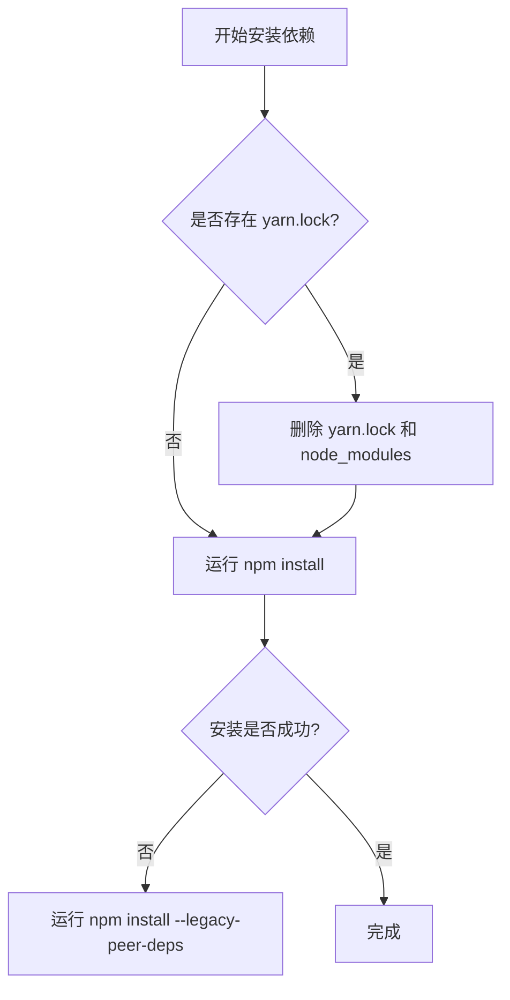
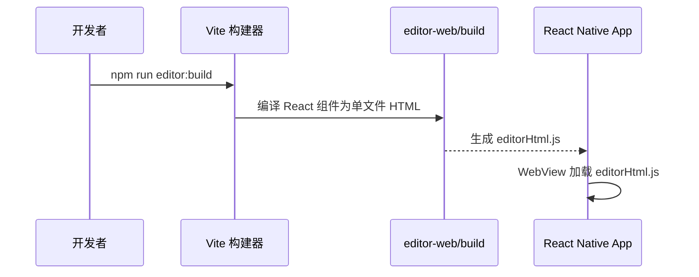
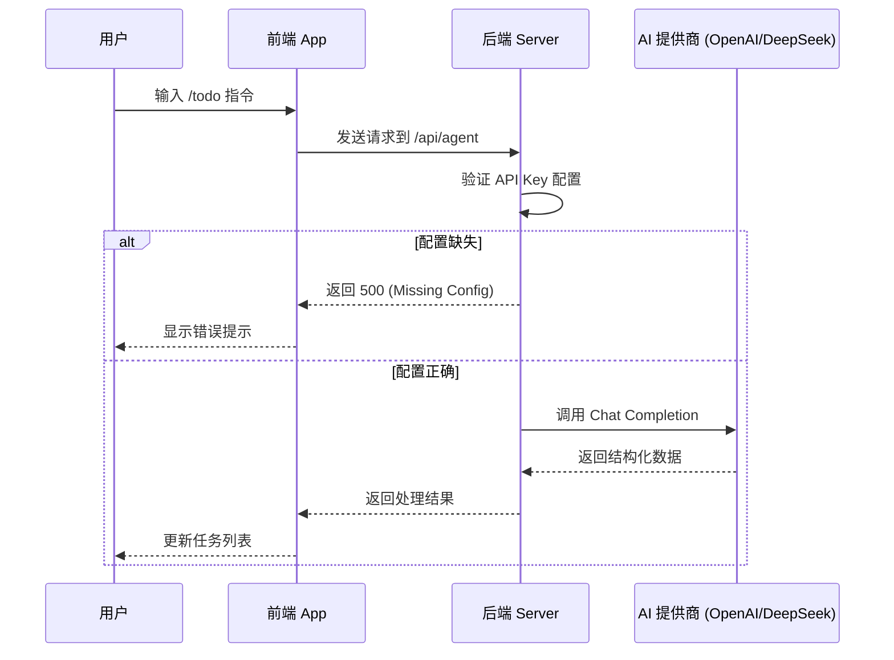
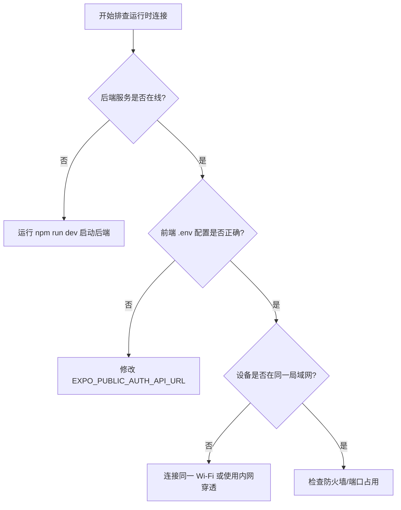

# 常见问题排查

## 目录
1. [模块概览](#模块概览)
2. [环境准备与依赖问题](#环境准备与依赖问题)
   - [Node.js 版本不匹配](#nodejs-版本不匹配)
   - [依赖锁文件冲突 (npm vs yarn)](#依赖锁文件冲突-npm-vs-yarn)
   - [Rust 编译环境缺失](#rust-编译环境缺失)
3. [编译与构建错误](#编译与构建错误)
   - [富文本编辑器显示为空 (WebView Blank)](#富文本编辑器显示为空-webview-blank)
   - [Expo SDK 版本不兼容](#expo-sdk-版本不兼容)
   - [Tauri 桌面端构建失败](#tauri-桌面端构建失败)
4. [运行时与连接问题](#运行时与连接问题)
   - [前端无法连接后端 (Network Error)](#前端无法连接后端-network-error)
   - [AI 指令无响应或报错](#ai-指令无响应或报错)
   - [微信登录流程中断](#微信登录流程中断)
5. [平台特定问题](#平台特定问题)
   - [Android 模拟器无法访问本地服务](#android-模拟器无法访问本地服务)
   - [iOS CocoaPods 依赖安装失败](#ios-cocoapods-依赖安装失败)
6. [核心配置文件参考](#核心配置文件参考)
7. [文件参考](#文件参考)

## 模块概览

本章节汇总了 LightFlux 全栈项目在搭建环境和初次运行过程中可能遇到的常见问题及其解决方案。项目采用了现代化的跨端技术栈，包括前端（Expo/React Native）、桌面端（Tauri/Rust）以及后端（Node.js ESM），因此环境依赖较为多样化。

- **覆盖范围**：全项目范围，重点解决从代码克隆到成功启动 `App` 的阻塞性问题。
- **涉及文件总数**：约 210 个源文件（基于 Glob 统计）。
- **核心子模块**：
  - `lightflux/`：React Native 移动端与 Tauri 桌面端代码。
  - `server/`：基于 Node.js 的认证与 AI 代理服务端。
  - `editor-web/`：嵌入式 Tiptap 富文本编辑器。
  - `src-tauri/`：Rust 编写的桌面端原生外壳。

本指南旨在帮助开发者在遇到错误时，能够通过“错误现象 -> 原因分析 -> 解决方案”的模式快速定位问题，减少环境配置带来的挫败感。

## 环境准备与依赖问题

在项目启动阶段，环境配置不当是导致失败的首要原因。LightFlux 对 Node.js 和 Rust 的版本有明确要求。

### Node.js 版本不匹配

**错误现象**：在启动后端服务时出现 `SyntaxError` 或提示不支持 `node --watch` 或 `--env-file` 参数。

**原因分析**：
LightFlux 后端使用了 Node.js v20+ 引入的原生环境变量支持（`--env-file`）和 ESM 模块特性。如果系统 Node 版本过低，将无法识别这些新语法和标志位。

**解决方案**：
1. 检查当前版本：`node -v`。
2. 确保版本 $\ge$ 20.0.0。推荐使用 `nvm` 管理版本：
   ```bash
   nvm install 20
   nvm use 20
   ```

### 依赖锁文件冲突 (npm vs yarn)

**错误现象**：执行 `npm install` 后出现 `peerDependencies` 冲突，或者在构建阶段提示某些包未找到。

**原因分析**：
项目默认使用 `npm` 进行包管理。如果开发者习惯使用 `yarn` 或 `pnpm`，可能会生成不同的锁文件，导致依赖树版本不一致。



上图展示了依赖安装的推荐流程。在 React Native 项目中，`peerDependencies` 冲突非常常见，特别是当多个 UI 库依赖不同版本的 `react` 时。通过统一工具和必要时使用 `--legacy-peer-deps` 标志，可以解决大部分安装问题。

### Rust 编译环境缺失

**错误现象**：运行桌面端构建脚本时提示 `cargo: command not found` 或 `rustc` 版本过低。

**原因分析**：
桌面端基于 Tauri 2.0，要求 Rust 版本 $\ge$ 1.77.2。

**解决方案**：
1. 安装 Rust：`curl --proto '=https' --tlsv1.2 -sSf https://sh.rustup.rs | sh`。
2. 使用项目提供的环境脚本（如果适用）：
   ```bash
   source ./scripts/use-rust-env.sh
   ```

**Section sources**:
- [lightflux/package.json](lightflux/package.json)
- [server/package.json](server/package.json)
- [scripts/use-rust-env.sh](scripts/use-rust-env.sh)

## 编译与构建错误

编译阶段的错误通常与特定的构建步骤缺失或 SDK 版本不匹配有关。

### 富文本编辑器显示为空 (WebView Blank)

**错误现象**：进入任务详情页后，正文编辑区域显示为白色块，无法输入内容。

**原因分析**：
LightFlux 使用 TenTap 编辑器，它通过 WebView 加载一个预编译的 HTML/JS 文件。如果未执行 `editor:build`，WebView 将找不到加载的静态资源。



如上图所示，编辑器的构建是一个独立的流水线。`editor-web` 目录下的 Tiptap 代码必须先经过 Vite 编译压缩，并转化为 React Native 能够通过字符串引用的 `editorHtml.js` 文件，编辑器才能正常工作。

**解决方案**：
在 `lightflux` 目录下执行构建命令：
```bash
npm run editor:build
```

### Expo SDK 版本不兼容

**错误现象**：启动 Expo 开发服务器时提示 `Expo SDK version mismatch`。

**原因分析**：
`package.json` 中的 `expo` 版本与全局安装的 `expo-cli` 或其他 Expo 库版本不匹配。本项目目前锁定在 SDK 57。

**解决方案**：
使用 `npx` 运行命令以确保使用项目本地版本：
```bash
npx expo start
```

### Tauri 桌面端构建失败

**错误现象**：`npm run tauri build` 报错，提示 `Could not find tauri.conf.json`。

**原因分析**：
Tauri 配置文件位于 `lightflux/src-tauri/tauri.conf.json`。如果在错误的目录下运行命令，或者 Rust 依赖下载失败，会导致此问题。

**Section sources**:
- [lightflux/package.json](lightflux/package.json)
- [lightflux/src-tauri/tauri.conf.json](lightflux/src-tauri/tauri.conf.json)

## 运行时与连接问题

运行时错误通常源于配置缺失或网络隔离，特别是在前后端联调阶段。

### 前端无法连接后端 (Network Error)

**错误现象**：登录时提示 `Network Error`，或 AI 助手显示“连接失败”。

**原因分析**：
1. 后端服务未启动（默认端口 8787）。
2. 环境变量 `EXPO_PUBLIC_AUTH_API_URL` 配置错误。
3. 移动端真机调试时，`localhost` 无法指向开发机。

**解决方案**：
在 `lightflux/.env` 中配置正确的 IP 地址：
```env
# 不要使用 localhost，使用你的局域网 IP
EXPO_PUBLIC_AUTH_API_URL=http://192.168.1.100:8787
```

### AI 指令无响应或报错

**错误现象**：在输入框输入 AI 指令后，系统无反应或返回 `500 Internal Server Error`。

**原因分析**：
后端 `server/.env` 中未正确配置 AI 服务的 API Key 或 Base URL。



该时序图展示了 AI 指令的处理流程。后端的 `server/.env` 文件是核心，它必须包含有效的 `AI_API_KEY` 和 `AI_BASE_URL`。如果后端无法成功调用外部 AI 接口，前端将无法获得任何响应。

**解决方案**：
检查 `server/.env` 中的 AI 相关配置，并确保网络环境可以访问指定的 `AI_BASE_URL`。

### 排查连接问题的通用逻辑



上图展示了从后端状态到网络环境的逐级排查过程。首先确认服务本身是否存活，然后检查配置的 URL 是否能被当前运行环境解析（特别是移动端对 `localhost` 的限制），最后检查物理网络连接。

**Section sources**:
- [lightflux/.env.example](lightflux/.env.example)
- [server/.env.example](server/.env.example)
- [lightflux/services/agentApi.ts](lightflux/services/agentApi.ts)

## 平台特定问题

不同平台的宿主环境差异会导致特定的报错。

### Android 模拟器无法访问本地服务

**错误现象**：在 Android 模拟器中运行，无法访问 `127.0.0.1:8787`。

**原因分析**：
Android 模拟器将 `127.0.0.1` 视为模拟器自身。

**解决方案**：
使用 `10.0.2.2` 访问宿主机：
```env
EXPO_PUBLIC_AUTH_API_URL=http://10.0.2.2:8787
```

### iOS CocoaPods 依赖安装失败

**错误现象**：`npx expo run:ios` 报错 `pod install` 失败。

**原因分析**：
通常与 Ruby 版本、CocoaPods 版本或 M1/M2 芯片的兼容性有关。

**解决方案**：
1. 进入 `ios` 目录：`cd ios && pod install`。
2. 如果是 M1 芯片，尝试：`arch -x86_64 pod install`。

## 核心配置文件参考

以下是项目中关键的配置模板，排查时请优先核对：

**前端环境变量 (`lightflux/.env`)**:
```env
# 认证 API 地址
EXPO_PUBLIC_AUTH_API_URL=http://localhost:8787
# AI 代理 API 地址 (通常与认证 API 相同)
EXPO_PUBLIC_AI_API_URL=http://localhost:8787
```

**后端环境变量 (`server/.env`)**:
```env
PORT=8787
# 允许的跨域来源 (Expo Web 默认端口为 8081)
CORS_ORIGIN=http://localhost:8081
# AI 服务配置
AI_BASE_URL=https://api.deepseek.com
AI_API_KEY=sk-xxxx
```

## 文件参考

以下是排查过程中涉及的核心文件路径：

- `lightflux/package.json`: 前端依赖与脚本定义。
- `server/package.json`: 后端 Node.js 环境要求。
- `lightflux/.env.example`: 前端环境变量模板。
- `server/.env.example`: 后端环境变量模板。
- `lightflux/src-tauri/Cargo.toml`: 桌面端 Rust 依赖配置。
- `lightflux/src-tauri/tauri.conf.json`: Tauri 核心配置。
- `scripts/use-rust-env.sh`: Rust 环境辅助脚本。
- `README.md`: 项目启动与基本操作指南。
