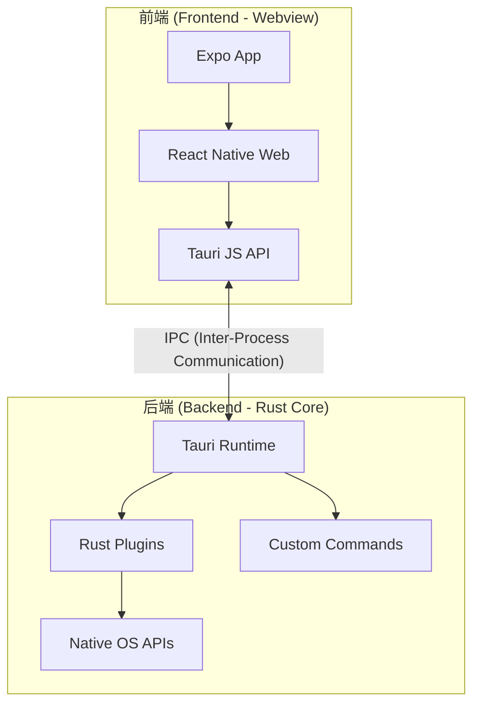
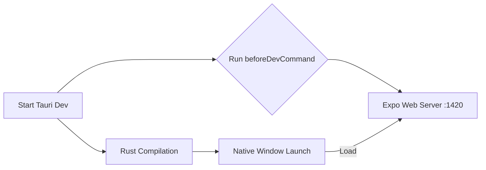
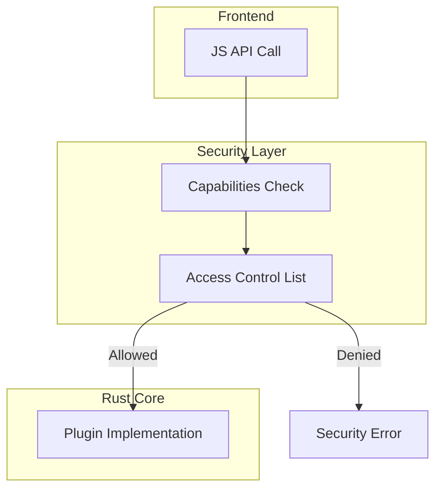
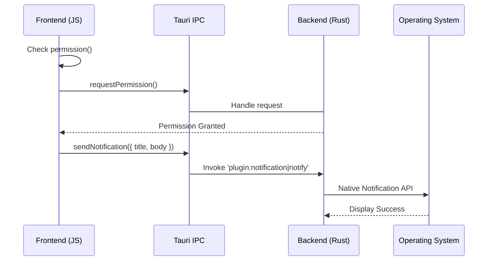

# 桌面端开发环境（Tauri）

## 目录
1. [模块概述](#模块概述)
2. [Tauri 架构简述](#tauri-架构简述)
3. [核心组件分析](#核心组件分析)
   - [Rust 入口点 (main.rs)](#rust-入口点-mainrs)
   - [配置中心 (tauri.conf.json)](#tauriconfjson)
4. [开发与调试流程](#开发与调试流程)
   - [本地开发环境启动](#本地开发环境启动)
   - [构建桌面端产物](#构建桌面端产物)
5. [权限与能力配置 (Capabilities)](#权限与能力配置-capabilities)
6. [Rust 依赖管理](#rust-依赖管理)
7. [桌面端特有 API 调用](#桌面端特有-api-调用)
8. [文件参考](#文件参考)

## 模块概述

LightFlux 的桌面端实现基于 **Tauri 2.0** 框架，旨在为 macOS 和 Windows 用户提供原生级别的应用体验。该模块位于项目的 `lightflux/src-tauri/` 目录下，负责将基于 Expo/React Native Web 构建的前端界面包装成独立的桌面应用程序。

### 范围与规模
- **核心文件总数**：约 10 个关键配置文件及源代码文件。
- **子目录结构**：
    - `src/`：包含 Rust 后端的核心逻辑（如 `main.rs`）。
    - `capabilities/`：Tauri 2.0 新引入的权限管理目录，定义了应用可使用的 API 范围。
    - `icons/`：存放不同平台的应用图标。
    - `gen/`：自动生成的模式定义（Schema）和元数据。
- **覆盖深度**：本章节将深入探讨 `src-tauri` 目录下的架构设计、调试指令、权限配置以及 Rust 依赖管理，确保开发者能够顺利跑通桌面端的开发与打包流程。

## Tauri 架构简述

Tauri 采用了典型的 **前后端分离架构**。前端部分是由 Expo 构建的 Web 环境，而后端则是基于 Rust 的原生进程。两者通过 Tauri 提供的安全桥接（IPC）进行交互。

### 架构组件图
以下图表展示了 LightFlux 桌面端的主要组成部分及其交互方式：



**架构解析**：
前端应用运行在操作系统的原生 Webview 中（macOS 上是 WkWebView，Windows 上是 WebView2）。这种方式极大地减少了内存占用，因为不需要像 Electron 那样打包整个 Chromium 浏览器。前端通过 `@tauri-apps/api` 调用后端定义的 Rust 函数或内置插件。后端 Rust 进程负责处理系统级任务，如文件系统访问、系统通知、窗口管理等，确保了应用的安全性和高性能。

### 数据流向
当用户在界面上触发一个需要原生能力的操作（例如显示系统通知）时，流程如下：
1. 前端调用 `tauri-plugin-notification` 的 JS 接口。
2. 请求通过 IPC 序列化并传递给 Rust 进程。
3. Rust 进程验证 `capabilities` 权限。
4. 验证通过后，Rust 调用操作系统的原生通知 API。

## 核心组件分析

### Rust 入口点 (main.rs)

`src/main.rs` 是桌面端应用的灵魂，负责初始化 Tauri 运行时并注册所需的插件。

```rust
#![cfg_attr(not(debug_assertions), windows_subsystem = "windows")]

fn main() {
    tauri::Builder::default()
        .plugin(tauri_plugin_notification::init()) // 初始化通知插件
        .run(tauri::generate_context!())
        .expect("error while running LightFlux");
}
```

**核心逻辑说明**：
- `cfg_attr` 指令确保在 Windows 生产环境下运行时不会弹出控制台窗口。
- `tauri::Builder::default()` 开启了链式调用模式。
- `.plugin()` 方法用于集成扩展功能。在 LightFlux 中，目前主要集成了 `tauri_plugin_notification`，用于实现跨平台的桌面通知。
- `tauri::generate_context!()` 是一个宏，它在编译时读取 `tauri.conf.json` 配置并生成必要的元数据。

### 配置中心 (tauri.conf.json)

该文件定义了应用的构建行为、窗口属性和打包信息。

```json
{
  "build": {
    "beforeDevCommand": "npm run web -- --port 1420",
    "devUrl": "http://localhost:1420",
    "beforeBuildCommand": "npm run desktop:web",
    "frontendDist": "../desktop-dist"
  },
  "app": {
    "windows": [
      {
        "title": "LightFlux",
        "width": 1280,
        "height": 820
      }
    ]
  }
}
```

**关键字段解析**：
- **`beforeDevCommand`**：在启动开发环境前运行的命令。这里启动了 Expo 的 Web 开发服务器，并指定端口为 1420。
- **`devUrl`**：Tauri 开发窗口加载的 URL，指向 Expo 的本地服务。
- **`beforeBuildCommand`**：在正式打包前运行的命令。`npm run desktop:web` 会执行 `expo export` 将前端代码编译为静态资源。
- **`frontendDist`**：告诉 Tauri 从哪个目录读取静态产物进行打包。

**Section sources**:
- [lightflux/src-tauri/src/main.rs](lightflux/src-tauri/src/main.rs)
- [lightflux/src-tauri/tauri.conf.json](lightflux/src-tauri/tauri.conf.json)

## 开发与调试流程

跑通桌面端调试流程需要前端与后端的紧密配合。LightFlux 利用了 Expo 的 Web 导出能力与 Tauri 的开发模式。

### 本地开发环境启动

开发流程如下图所示：



**操作步骤**：
1. **启动开发模式**：在项目根目录运行 `npx tauri dev`（或通过 `npm run desktop`，如果已配置）。
2. **前端热更新**：Tauri 窗口会加载 `localhost:1420`。由于底层是 Expo Web，修改前端代码会触发即时热更新，无需重启 Tauri。
3. **后端调试**：修改 `src-tauri` 下的 Rust 代码会触发 Rust 增量编译并自动重启应用窗口。

### 构建桌面端产物

构建流程涉及到资源的导出与二进制文件的链接：
1. **资源导出**：运行 `npm run desktop:web`。这会调用 `expo export --platform web --output-dir desktop-dist`。
2. **执行打包**：运行 `npx tauri build`。
    - Tauri 会检查 `desktop-dist` 目录下的静态文件。
    - 将这些文件嵌入到 Rust 生成的可执行二进制文件中。
    - 根据平台生成 `.app` (macOS) 或 `.msi/.exe` (Windows) 安装包。

> 💡 **提示**：在 macOS 上打包需要 Xcode 命令行工具，Windows 上则需要 WebView2 SDK 和 WiX Toolset。

## 权限与能力配置 (Capabilities)

Tauri 2.0 引入了极其严格的权限系统。默认情况下，前端无法调用任何原生 API，必须在 `capabilities` 中显式授权。

### 权限模型图


**权限配置详解**：
在 `lightflux/src-tauri/capabilities/default.json` 中定义了基础权限：

```json
{
  "identifier": "default",
  "windows": ["main"],
  "permissions": [
    "core:default",
    "notification:default"
  ]
}
```

- **`core:default`**：允许基础的窗口操作和应用生命周期管理。
- **`notification:default`**：允许前端触发系统通知。如果没有这一行，即使在 Rust 中注册了插件，前端调用 `sendNotification` 也会被拦截。

**Section sources**:
- [lightflux/src-tauri/capabilities/default.json](lightflux/src-tauri/capabilities/default.json)

## Rust 依赖管理

LightFlux 的桌面端依赖主要通过 `Cargo.toml` 进行管理。由于采用了 Tauri 2.0，所有插件都作为独立的 crate 引入。

```toml
[dependencies]
tauri = { version = "2", features = [] }
tauri-plugin-notification = "2"
```

**依赖项说明**：
- **`tauri`**：核心运行时框架。
- **`tauri-plugin-notification`**：官方提供的通知插件。它封装了不同操作系统的通知发送逻辑。
- **`build-dependencies`**：包含 `tauri-build`，用于在编译阶段处理资源和生成元数据。

**依赖更新建议**：
当需要新增功能（如文件系统操作）时，应首先查看 [Tauri Plugins 列表](https://v2.tauri.app/plugin/)，在 `Cargo.toml` 中添加对应依赖，并在 `main.rs` 中进行初始化。

## 桌面端特有 API 调用

在桌面端环境下，LightFlux 可以利用一些 Web 环境无法直接使用的原生能力。

### 通知系统 (Notifications)
前端通过 `@tauri-apps/plugin-notification` 与后端通信。

**交互序列图**：


**开发表现**：
- **macOS**：通知会出现在右上角的通知中心，支持应用图标显示。
- **Windows**：显示在任务栏右侧的通知区域。
- **调试注意**：在开发环境下，如果权限未正确配置在 `capabilities/default.json` 中，控制台会抛出 `Permission denied` 错误。

### 文件系统与持久化
虽然 LightFlux 主要通过前端的持久化方案，但桌面端可以通过 Tauri 的 `fs` 插件实现更深度的文件系统集成（如导出任务报告）。目前该功能处于规划阶段，需在 `Cargo.toml` 中添加 `tauri-plugin-fs` 并配置相应的权限作用域（Scopes）。

## 文件参考

以下是本模块涉及的核心文件及其在项目中的位置：

| 文件路径 | 描述 |
| :--- | :--- |
| `lightflux/src-tauri/tauri.conf.json` | Tauri 全局配置文件，定义构建指令和窗口属性。 |
| `lightflux/src-tauri/Cargo.toml` | Rust 项目依赖管理文件。 |
| `lightflux/src-tauri/src/main.rs` | Rust 后端入口，负责插件注册和运行时启动。 |
| `lightflux/src-tauri/build.rs` | 编译脚本，用于集成 Tauri 构建流程。 |
| `lightflux/src-tauri/capabilities/default.json` | 权限定义文件，控制前端对原生 API 的访问。 |
| `lightflux/package.json` | 根目录配置文件，包含桌面端相关的 npm 脚本。 |
| `lightflux/src-tauri/icons/` | 应用图标目录，包含各平台所需的尺寸。 |

**Section sources**:
- [lightflux/src-tauri/Cargo.toml](lightflux/src-tauri/Cargo.toml)
- [lightflux/src-tauri/build.rs](lightflux/src-tauri/build.rs)
- [lightflux/package.json](lightflux/package.json)
