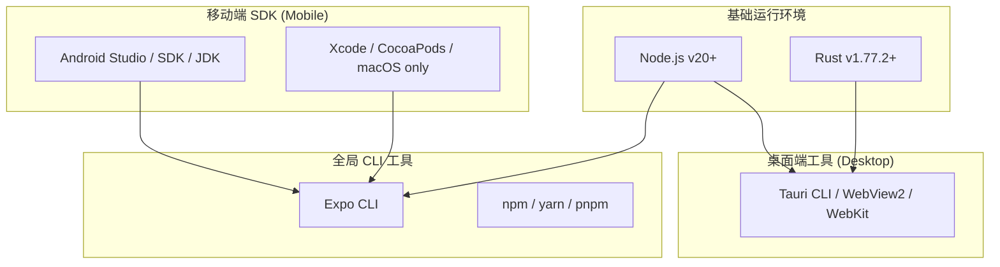
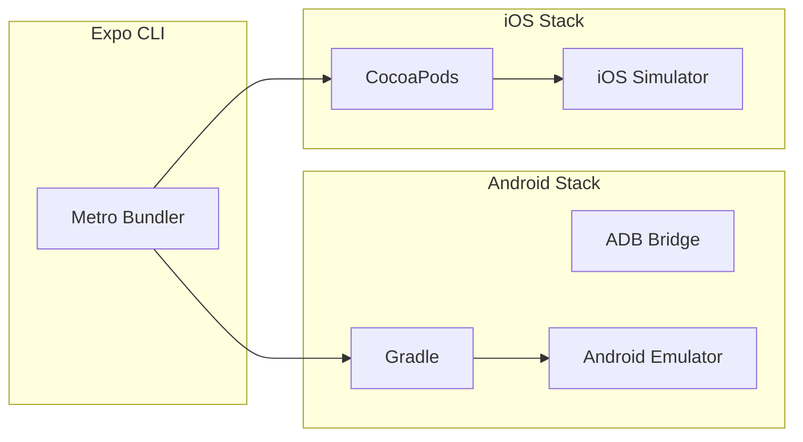
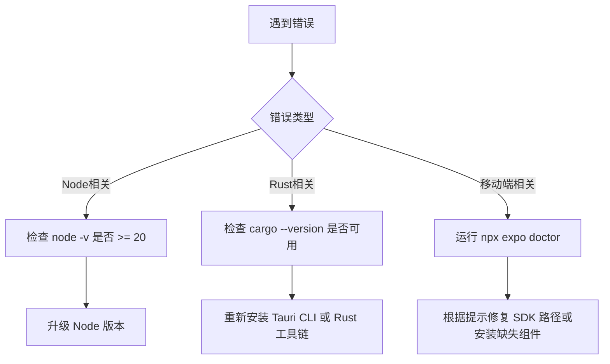

# 环境准备

## 目录
1. [模块概览](#模块概览)
2. [环境准备入门](#环境准备入门)
3. [核心环境配置](#核心环境配置)
   - [Node.js 环境](#nodejs-环境)
   - [Rust 环境与 Tauri 支持](#rust-环境与-tauri-支持)
4. [移动端 SDK 配置指南](#移动端-sdk-配置指南)
   - [Android 开发环境](#android-开发环境)
   - [iOS 开发环境 (仅限 macOS)](#ios-开发环境-仅限-macos)
5. [开发工具与全局 CLI](#开发工具与全局-cli)
6. [环境检查清单](#环境检查清单)
7. [常见问题与故障排除](#常见问题与故障排除)
8. [参考文件列表](#参考文件列表)

## 模块概览

在开始 LightFlux 的开发之前，理解项目的物理结构及其对应的环境需求至关重要。本项目是一个复杂的跨端应用，涵盖了移动端（Expo/React Native）、桌面端（Tauri/Rust）以及后端服务（Node.js）。

**项目规模评估**：
- **总文件数**：经过初步扫描，项目中包含约 200+ 个核心源文件（包括 `.ts`, `.tsx`, `.rs`, `.mjs`, `.sh` 等）。
- **主要子模块**：
  - `lightflux/`：核心前端项目，基于 Expo 57 构建，包含移动端逻辑和 `src-tauri` 桌面端配置。这是环境配置的重点。
  - `server/`：基于 Node.js 的认证与辅助服务器，对 Node 版本有特定要求（v20+）。
  - `lightflux/editor-web/`：一个独立的 Web 编辑器模块，用于嵌入到 Native 应用中。

本章节将重点覆盖 `lightflux/` 和 `server/` 的开发环境搭建，确保开发者能够顺利运行移动端模拟器、桌面端应用以及本地服务器。

## 环境准备入门

LightFlux 旨在提供极致的任务管理体验，这种体验建立在高性能的跨端技术栈之上。为了实现这一目标，我们采用了 **Expo (React Native)** 处理移动端 UI，**Tauri (Rust)** 构建桌面端外壳，以及 **Node.js** 驱动后端逻辑。

这种“三位一体”的架构虽然带来了强大的功能，但也对开发环境提出了较高的要求。开发者不仅需要熟悉传统的 Web/Node.js 开发环境，还需要配置 Rust 工具链以支持桌面端编译，以及配置 Android/iOS SDK 以支持移动端调试。

本指南的目标是帮助开发者从零开始，逐步构建起一个完整的 LightFlux 开发环境。无论你是在 macOS 还是 Windows 上开发，本页面都提供了详尽的差异化指导。

下图展示了 LightFlux 开发环境的整体构成：



该架构确保了代码在不同平台间的高度复用，同时通过 Rust 提供了原生级别的桌面性能。

**Diagram sources**:
- [lightflux/package.json](lightflux/package.json)
- [lightflux/src-tauri/Cargo.toml](lightflux/src-tauri/Cargo.toml)
- [server/package.json](server/package.json)

## 核心环境配置

### Node.js 环境

LightFlux 的所有前端逻辑和后端服务都深度依赖于 Node.js。根据 `server/package.json` 中的 `engines` 字段定义，项目要求 Node.js 版本必须大于或等于 **v20**。

> 💡 **建议**：使用版本管理工具（如 `nvm` 或 `fnm`）来管理 Node 版本。这可以避免不同项目间的版本冲突。

**安装步骤**：
1. **安装 nvm**：访问 [nvm 官网](https://github.com/nvm-sh/nvm) 获取安装指令。
2. **安装 Node v20**：
   ```bash
   nvm install 20
   nvm use 20
   ```
3. **配置镜像源**（可选，针对国内开发者）：
   ```bash
   npm config set registry https://registry.npmmirror.com
   ```

Node.js 环境不仅用于运行 `server/` 中的认证服务，还负责 `lightflux/` 中 Expo 捆绑器（Metro）的运行以及桌面端前端代码的构建。

### Rust 环境与 Tauri 支持

桌面端应用基于 Tauri v2 构建，这要求本地安装有 Rust 工具链。

根据 `lightflux/src-tauri/Cargo.toml` 的定义，Rust 版本应至少为 **1.77.2**。

**验证 Rust 环境**：

```bash
cargo --version
rustc --version
cargo check --manifest-path lightflux/src-tauri/Cargo.toml
```

**桌面端依赖安装 (OS 差异)**：
- **Windows**：需要安装 [C++ Build Tools](https://visualstudio.microsoft.com/visual-cpp-build-tools/)。
- **macOS**：通常只需安装 Xcode 命令行工具。
- **Linux**：需要安装 `libwebkit2gtk-4.1` 等开发库。

**Section sources**:
- [lightflux/src-tauri/Cargo.toml](lightflux/src-tauri/Cargo.toml)
- [server/package.json](server/package.json)

## 移动端 SDK 配置指南

LightFlux 使用 Expo 57，这是一个强大的 React Native 框架。为了进行原生开发和调试，你需要配置相应的移动端 SDK。

### Android 开发环境

无论你使用什么操作系统，Android 开发都需要以下组件：

1. **JDK (Java Development Kit)**：推荐使用 OpenJDK 17。
2. **Android Studio**：安装后需通过 SDK Manager 安装以下内容：
   - Android SDK Platform (推荐 API 34+)
   - Android SDK Build-Tools
   - Android Emulator
3. **环境变量**：
   在 `.zshrc` 或 `.bashrc` 中添加：
   ```bash
   export ANDROID_HOME=$HOME/Library/Android/sdk
   export PATH=$PATH:$ANDROID_HOME/emulator
   export PATH=$PATH:$ANDROID_HOME/platform-tools
   ```

### iOS 开发环境 (仅限 macOS)

对于 iOS 开发，必须拥有一台安装了 macOS 的电脑：

1. **Xcode**：从 App Store 安装最新版本。
2. **Command Line Tools**：在 Xcode 设置中安装。
3. **CocoaPods**：React Native 的依赖管理器。
   ```bash
   sudo gem install cocoapods
   ```
   或者通过 Homebrew 安装：
   ```bash
   brew install cocoapods
   ```

下图展示了移动端 SDK 与 Expo 之间的交互关系：



Expo 作为抽象层，屏蔽了大部分复杂的原生配置，但在执行 `npx expo run:android` 或 `npx expo run:ios` 时，底层的 SDK 配置依然是成功的关键。

**Section sources**:
- [lightflux/app.json](lightflux/app.json)
- [lightflux/package.json](lightflux/package.json)

## 开发工具与全局 CLI

为了提高开发效率，我们需要安装一些全局工具。虽然大部分工具可以通过 `npx` 运行，但全局安装常用工具可以显著加快启动速度。

| 工具名称 | 建议安装方式 | 用途 |
| :--- | :--- | :--- |
| **Expo CLI** | `npm install -g expo-cli` | 启动 Expo 开发服务器、管理项目 |
| **Tauri CLI** | `cargo install tauri-cli --version "^2.0.0"` | 桌面端开发、构建和打包 |
| **Vite** | 项目内已包含 | 用于 `editor-web` 的快速构建 |
| **TypeScript** | `npm install -g typescript` | 类型检查和静态分析 |

**Tauri CLI 的特殊说明**：
在 LightFlux 中，桌面端是通过 `lightflux/src-tauri` 目录管理的。你可以使用以下命令启动桌面端开发模式：
```bash
cd lightflux
npm run web -- --port 1420  # 启动前端
cargo tauri dev             # 启动 Tauri 外壳
```
或者直接使用 `tauri.conf.json` 中配置的 `beforeDevCommand` 自动化此流程。

**Section sources**:
- [lightflux/src-tauri/tauri.conf.json](lightflux/src-tauri/tauri.conf.json)
- [lightflux/package.json](lightflux/package.json)

## 环境检查清单

在完成上述所有安装后，请使用以下清单验证你的开发环境。

| 检查项 | 命令 | 预期结果 |
| :--- | :--- | :--- |
| Node.js 版本 | `node -v` | `>= v20.x.x` |
| Rust 版本 | `rustc --version` | `>= 1.77.2` |
| Cargo 版本 | `cargo --version` | 与 rustc 匹配 |
| Java 版本 | `java -version` | `openjdk 17.x.x` |
| Android SDK | `adb --version` | 正常输出版本信息 |
| CocoaPods (iOS) | `pod --version` | 正常输出版本信息 |
| Tauri CLI | `cargo tauri --version` | `2.x.x` |

如果所有检查项均通过，恭喜你！你已经准备好运行 LightFlux 了。

## 常见问题与故障排除

在搭建环境的过程中，开发者经常会遇到一些典型问题。以下是基于项目经验的总结：

### 1. `tauri-cli` 找不到命令
**现象**：运行 `cargo tauri dev` 时提示 `command not found`。
**解决**：
- 确保已运行 `cargo install tauri-cli`。
- 确保 `$HOME/.cargo/bin` 已添加到系统的 `PATH` 环境变量中。

### 2. Node.js 版本不匹配
**现象**：运行 `server/` 时抛出 `node: --env-file-if-exists is not a valid option`。
**原因**：该参数在 Node.js v20.6.0 之后才引入。
**解决**：使用 `nvm install 20` 升级到最新的 Node 20 版本。

### 3. Android SDK 路径问题
**现象**：Expo 启动时提示 `ANDROID_HOME` 未设置。
**解决**：检查你的 shell 配置文件（`.zshrc` 或 `.bashrc`），确保路径指向正确的 Android SDK 安装目录。在 macOS 上通常是 `~/Library/Android/sdk`。

### 4. Rust 编译性能缓慢
**现象**：首次运行 `cargo tauri dev` 需要数分钟。
**原因**：Rust 需要下载并编译所有依赖项。
**解决**：这是正常现象，后续编译将利用增量编译技术，速度会大幅提升。建议确保网络环境通畅，或配置 Cargo 镜像源。

下表总结了环境故障排查的决策流程：



## 参考文件列表

以下是本章节涉及的核心配置文件，开发者在遇到环境问题时应优先检查这些文件：

- [lightflux/package.json](lightflux/package.json)：定义了前端和 Expo 的依赖关系。
- [server/package.json](server/package.json)：定义了后端对 Node.js 版本的限制。
- [lightflux/src-tauri/Cargo.toml](lightflux/src-tauri/Cargo.toml)：定义了桌面端 Rust 工具链的版本要求。
- [lightflux/src-tauri/tauri.conf.json](lightflux/src-tauri/tauri.conf.json)：桌面端构建与开发配置。
- [lightflux/app.json](lightflux/app.json)：Expo 移动端配置。
- [lightflux/tsconfig.json](lightflux/tsconfig.json)：TypeScript 编译配置。
