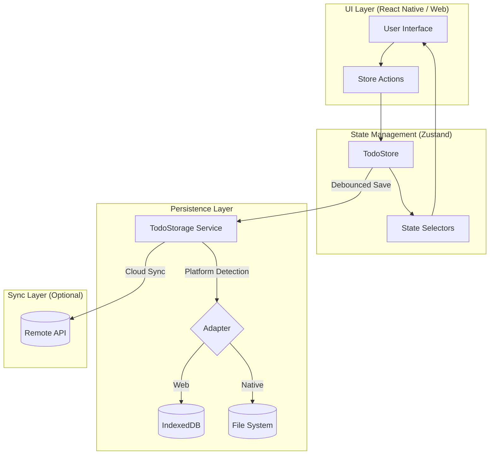
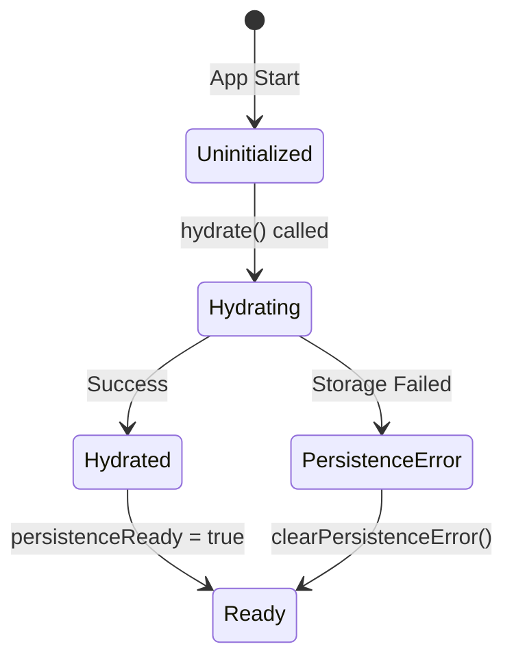
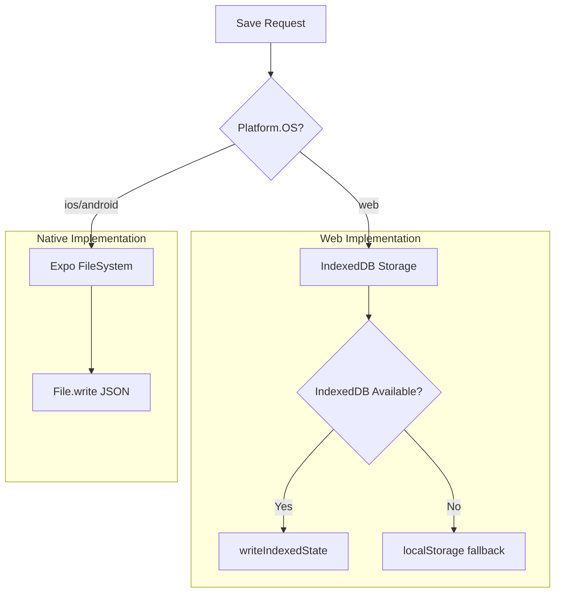
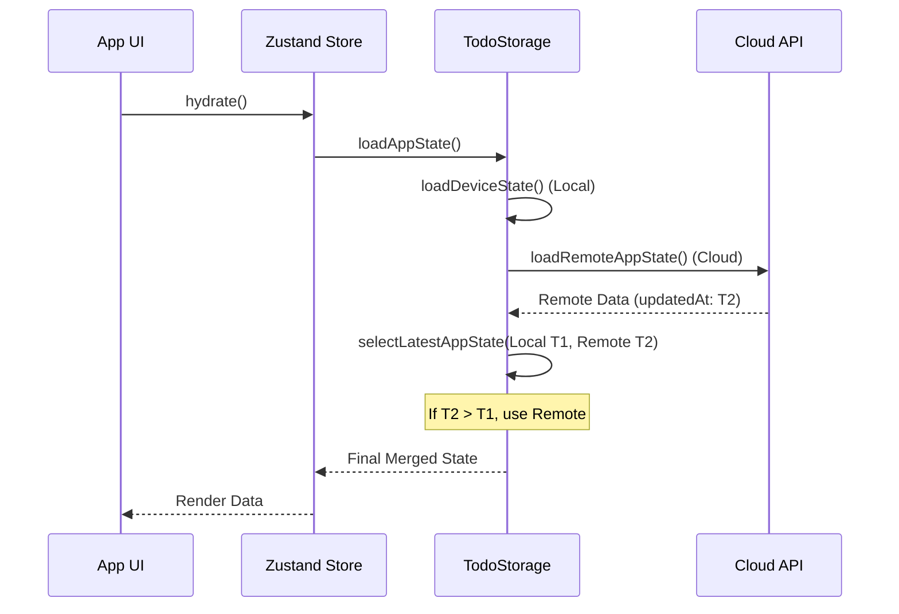
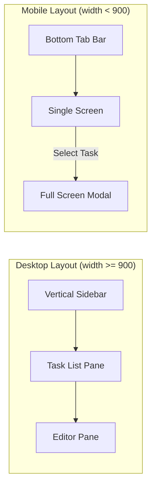

# 架构设计与数据流

## 目录
1. [模块概览](#模块概览)
2. [本地优先架构 (Local-First)](#本地优先架构-local-first)
3. [基于 Zustand 的状态管理](#基于-zustand-的状态管理)
4. [数据持久化方案](#数据持久化方案)
5. [数据同步与冲突解决](#数据同步与冲突解决)
6. [跨端适配原理](#跨端适配原理)
7. [核心组件](#核心组件)
8. [文件引用](#文件引用)

## 模块概览

LightFlux 采用现代的**本地优先 (Local-first)** 架构设计，旨在为用户提供极致的响应速度和离线可用性。本章节将深入解析系统如何通过 Zustand 管理内存状态，利用 IndexedDB 和文件系统实现持久化，以及如何通过简单的 LWW (Last-Write-Wins) 策略实现跨端同步。

在本次架构调研中，我们覆盖了以下核心区域：
- **总文件数**: 约 14 个核心架构文件（不含 UI 组件）。
- **主要子模块**:
    - `lightflux/store`: 包含全局状态定义及领域逻辑（`todoStore.tsx`, `todoDomain.ts` 等）。
    - `lightflux/services`: 包含底层存储适配器与同步逻辑（`todoStorage.ts`, `indexedDbStorage.ts`, `appStateMerge.ts`）。
    - `lightflux/App.tsx`: 应用入口，负责跨端布局适配与持久化调度。

本章节将重点分析数据在 UI 层、状态管理层、本地持久化层及远程后端之间的流动路径。

## 本地优先架构 (Local-First)

LightFlux 的核心设计哲学是“本地即权威”。用户所有的操作（如添加任务、修改截止日期）都会立即反映在 UI 上，并同步写入本地存储，而无需等待网络响应。

### 架构拓扑

下图展示了 LightFlux 的分层架构，体现了数据从用户交互到最终持久化的流转过程。



**图表说明**:
该架构图展示了典型的本地优先闭环。用户通过 UI 触发 `Store Actions`，Zustand 立即更新内存状态并通知 UI 重新渲染。随后，`TodoProvider` 监听状态变化，通过 180ms 的防抖机制触发 `TodoStorage` 的保存操作。`TodoStorage` 会根据当前运行环境（Web 或 Native）选择合适的存储适配器。如果配置了远程同步，系统还会在保存本地数据后异步推送到云端。

**架构优势**:
1. **零延迟响应**: 所有写操作都在本地内存中完成，UI 响应速度不受网络波动影响。
2. **离线能力**: 应用在断网环境下功能完全不受限，所有变更暂存在本地，待网络恢复后同步。
3. **隐私安全**: 默认情况下数据仅存储在用户设备上。

**Diagram sources**: 
- [App.tsx:L803-L805](lightflux/App.tsx#L803-L805)
- [todoStore.tsx:L770-L790](lightflux/store/todoStore.tsx#L770-L790)
- [todoStorage.ts:L425-L472](lightflux/services/todoStorage.ts#L425-L472)

## 基于 Zustand 的状态管理

LightFlux 使用 [Zustand](https://github.com/pmndrs/zustand) 作为其全局状态管理库。相比于 Redux，Zustand 更加轻量且易于与 React Hooks 集成。

### 状态初始化与水合 (Hydration)

应用启动时，`TodoStore` 需要经历一个“水合”过程，即从持久化介质中读取数据并填充内存状态。



**图表说明**:
该状态机描述了 `TodoStore` 的生命周期。初始状态下 `isHydrated` 为 `false`。调用 `hydrate()` 后，系统异步加载数据。成功后进入 `Hydrated` 状态，UI 此时可以安全展示用户数据。如果加载失败（如浏览器 IndexedDB 损坏），则进入 `PersistenceError` 状态并向用户发出警告。

### 核心 Store 实现分析

在 `todoStore.tsx` 中，Store 不仅存储数据，还封装了复杂的领域逻辑。例如，添加一个 Todo 需要处理排序（`sortOrder`）、生成 ID 以及记录任务事件（`taskEvents`）。

```typescript
// lightflux/store/todoStore.tsx

export const useTodoStore = create<TodoStore>((set, get) => ({
  // ... 初始状态
  addTodo: (todo) => {
    const title = todo.title.trim();
    if (!title) return;

    set((state) => {
      const timestamp = Date.now();
      const newTodo: Todo = {
        id: makeId(),
        title,
        completed: false,
        // ... 其他字段初始化
        content: todo.content ?? emptyRichTextDocument(),
      };
      
      // 处理排序逻辑：默认插入到列表顶部
      const nextTodos = [
        ...state.allTodos.map(t => ({ ...t, sortOrder: t.sortOrder + 1 })),
        { ...newTodo, sortOrder: 0 }
      ];

      return {
        ...todoState(nextTodos),
        taskEvents: [
          ...state.taskEvents,
          createTaskEvent(newTodo.id, 'created', timestamp)
        ],
      };
    });
  },
  // ...
}));
```

**代码解析**:
1. **不可变更新**: 遵循 React 的不可变原则，每次修改都返回新的对象引用。
2. **领域逻辑解耦**: `todoState` 和 `milestoneState` 是辅助函数，用于根据原始数据列表派生出过滤后的状态（如 `todos` vs `trashedTodos`）。
3. **事件追踪**: 每次状态变更都会生成对应的 `TaskEvent`，这为后续的统计分析和可能的增量同步奠定了基础。

**Section sources**:
- [todoStore.tsx](lightflux/store/todoStore.tsx)
- [todoDomain.ts](lightflux/store/todoDomain.ts)

## 数据持久化方案

LightFlux 实现了跨平台的持久化抽象层，屏蔽了 Web 端和原生端存储机制的差异。

### 跨平台存储策略



**图表说明**:
此流程图展示了 `saveDeviceState` 的内部逻辑。在 Web 端，系统优先使用 `IndexedDB` 以支持大数据量的存储，并提供 `localStorage` 作为降级方案。在原生端，则直接通过 `expo-file-system` 将整个状态序列化为 JSON 文件存储在应用的文档目录中。

### IndexedDB 适配器

在 `indexedDbStorage.ts` 中，系统封装了原生的 IndexedDB API，将其转换为 Promise 风格的接口：

```typescript
// lightflux/services/indexedDbStorage.ts

const writeIndexedState = async (value: string): Promise<void> => {
  const database = await openDatabase();
  const transaction = database.transaction(STORE_NAME, 'readwrite');
  const completion = transactionComplete(transaction);
  await requestResult(
    transaction.objectStore(STORE_NAME).put(value, STATE_KEY),
  );
  await completion;
};
```

**实现细节**:
- **单例数据库连接**: 通过 `databasePromise` 确保全局只有一个活跃的数据库连接。
- **事务保证**: 使用 `transactionComplete` 确保数据完全写入磁盘后再返回。
- **降级处理**: 当 IndexedDB 不可用（如隐私模式）时，自动回退到 `localStorage`。

**Section sources**:
- [indexedDbStorage.ts](lightflux/services/indexedDbStorage.ts)
- [todoStorage.ts](lightflux/services/todoStorage.ts)

## 数据同步与冲突解决

当用户登录后，LightFlux 会尝试将本地数据与云端同步。为了保持实现简单且可靠，系统目前采用 **LWW (Last-Write-Wins)** 策略。

### 同步时序图



**图表说明**:
同步过程发生在应用水合阶段。`TodoStorage` 同时发起本地和远程读取请求。`selectLatestAppState` 函数比较两者的 `updatedAt` 时间戳，选择最新的一份数据作为权威状态。如果远程数据更新，系统会自动更新本地缓存；反之，则将本地数据推送到云端。

### 冲突解决逻辑

冲突解决的核心在于 `appStateMerge.ts` 中的简单比较逻辑：

```typescript
// lightflux/services/appStateMerge.ts

export const selectLatestAppState = (
  deviceState: PersistedAppState | null,
  remoteState: PersistedAppState | null,
): PersistedAppState | null => {
  if (!deviceState) return remoteState;
  if (!remoteState) return deviceState;

  // 简单的“最后写入者胜”策略
  return remoteState.updatedAt > deviceState.updatedAt
    ? remoteState
    : deviceState;
};
```

**设计权衡**:
- **优点**: 实现极其简单，不需要复杂的 CRDT 算法或版本向量。
- **缺点**: 在多端同时离线编辑时，可能会发生覆盖现象。但考虑到 LightFlux 主要是个人工具，单用户并发编辑的概率较低，此方案在复杂度与体验之间取得了平衡。

**Section sources**:
- [appStateMerge.ts](lightflux/services/appStateMerge.ts)
- [todoStorage.ts:L425-L463](lightflux/services/todoStorage.ts#L425-L463)

## 跨端适配原理

LightFlux 能够同时作为 Web 应用和原生移动应用运行，这得益于 React Native 的跨端能力以及系统对平台差异的精细处理。

### 布局适配策略

在 `App.tsx` 中，系统根据屏幕宽度和平台动态切换布局：



**图表说明**:
- **桌面端**: 采用多栏布局，左侧为窄边栏导航，中间为任务列表，右侧为详情编辑器。通过 `ResizableDivider` 支持动态调整列宽。
- **移动端**: 采用典型的底部标签导航。任务编辑器以全屏 `Modal` 形式弹出，以最大化利用有限的屏幕空间。

### 平台差异处理

系统通过 `Platform.OS` 在代码中处理细微差异：
- **快捷键**: 仅在 Web 端注册 `Ctrl+J` (Agent) 和 `Ctrl+F` (Search) 监听器。
- **通知**: 在 Native 端使用 `milestoneNotifications.ts` 调用系统级提醒，而在 Web 端则依赖运行时轮询。
- **安全区域**: 使用 `SafeAreaProvider` 确保 UI 不会被手机的“刘海屏”或底栏遮挡。

**Section sources**:
- [App.tsx](lightflux/App.tsx)
- [index.ts](lightflux/index.ts)

## 核心组件

本模块涉及的关键类与函数如下：

| 组件名称 | 类型 | 职责描述 |
| :--- | :--- | :--- |
| `useTodoStore` | Hook/Store | 全局状态中心，封装了所有对 Todo、Group、Milestone 的操作逻辑。 |
| `TodoProvider` | Component | 状态上下文提供者，负责触发水合过程及监控状态变化以执行自动保存。 |
| `loadAppState` | Function | 协调本地与远程存储的加载流程，执行冲突解决。 |
| `saveAppState` | Function | 执行双向保存逻辑（本地 + 远程）。 |
| `indexedDbStorage` | Service | Web 端专用的 IndexedDB 读写封装。 |
| `todoDomain` | Logic | 纯函数集合，用于处理 Todo 列表的过滤、排序及树形结构操作。 |

**代码示例 1：自动保存逻辑**

```typescript
// lightflux/store/todoStore.tsx 中的 TodoProvider

useEffect(() => {
  if (!isHydrated || !persistenceReady) return;

  // 180ms 防抖，避免频繁写入磁盘
  const timer = setTimeout(() => {
    saveAppState(
      persistedState(useTodoStore.getState()),
    ).catch((error) => {
      console.warn('Unable to save LightFlux data.', error);
      useTodoStore.setState({ persistenceErrorAt: Date.now() });
    });
  }, 180);

  return () => clearTimeout(timer);
}, [allTodos, allMilestones, groups, language, ...]);
```

**代码示例 2：持久化数据模型**

```typescript
// lightflux/types/todo.ts

export interface PersistedAppState {
  schemaVersion: number;
  updatedAt: number;
  analyticsStartedAt: number;
  language: Language;
  navigationOrder: NavigationItemId[];
  ungroupedName: string | null;
  todos: Todo[];
  groups: TodoGroup[];
  milestones: Milestone[];
  taskEvents: TaskEvent[];
}
```

**代码示例 3：数据规范化逻辑**

```typescript
// lightflux/services/todoStorage.ts

const normalizeTodo = (value: unknown, fallbackOrder: number): Todo | null => {
  const todo = value as Partial<Todo>;
  if (typeof todo.id !== 'string' || typeof todo.title !== 'string') return null;

  return {
    id: todo.id,
    title: todo.title,
    completed: todo.completed ?? false,
    createdAt: todo.createdAt ?? Date.now(),
    updatedAt: todo.updatedAt ?? todo.createdAt ?? Date.now(),
    // ... 更多字段的默认值处理
  };
};
```

**Section sources**:
- [todoStore.tsx:L765-L790](lightflux/store/todoStore.tsx#L765-L790)
- [todoStorage.ts:L57-L109](lightflux/services/todoStorage.ts#L57-L109)

## 文件引用

以下是构建 LightFlux 架构设计的核心文件列表：

- `lightflux/store/todoStore.tsx`: 全局状态定义与持久化调度中心。
- `lightflux/store/todoDomain.ts`: Todo 领域逻辑实现（排序、删除、恢复）。
- `lightflux/services/todoStorage.ts`: 跨平台存储抽象层。
- `lightflux/services/indexedDbStorage.ts`: Web 端 IndexedDB 适配器。
- `lightflux/services/appStateMerge.ts`: 数据合并与冲突解决策略。
- `lightflux/App.tsx`: 应用根组件，处理跨端布局与 Provider 注入。
- `lightflux/index.ts`: Expo 入口文件。
- `lightflux/types/todo.ts`: 核心领域模型定义（Todo, Milestone, PersistedAppState）。
