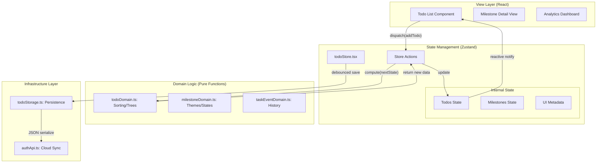
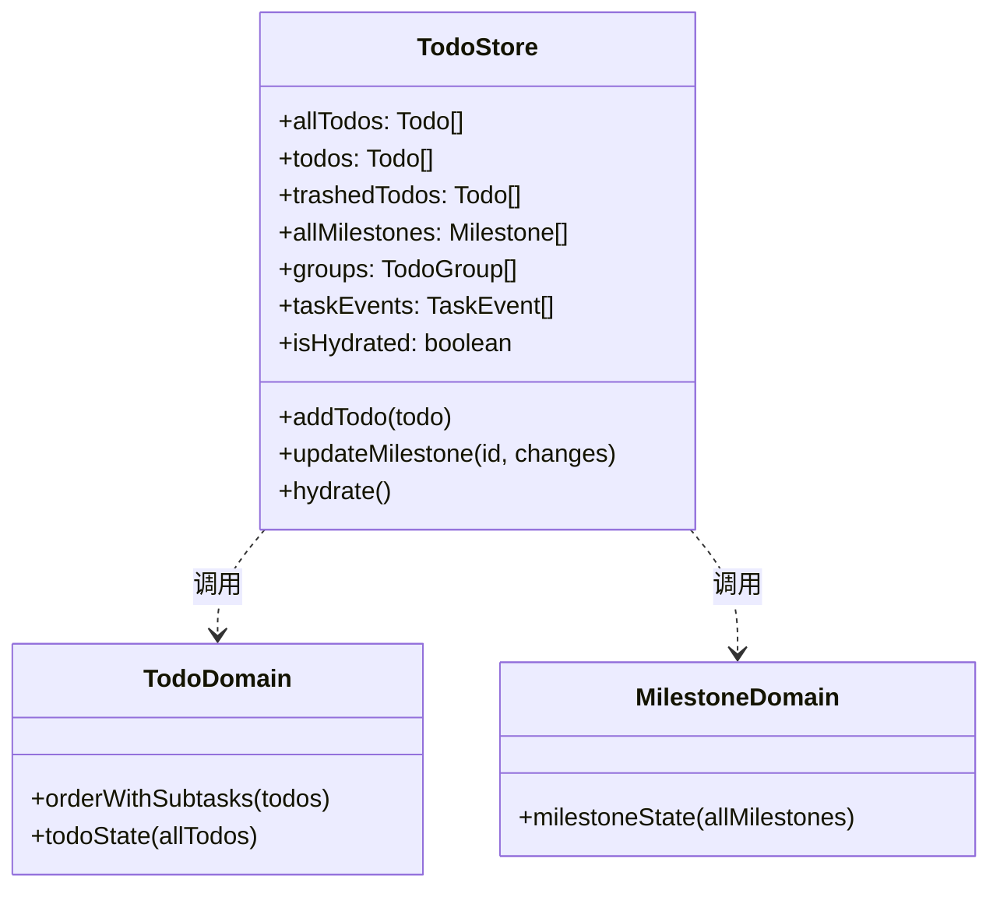
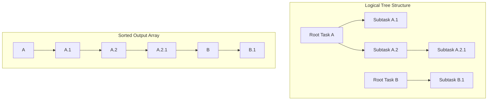
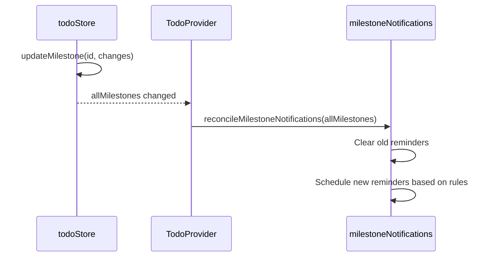
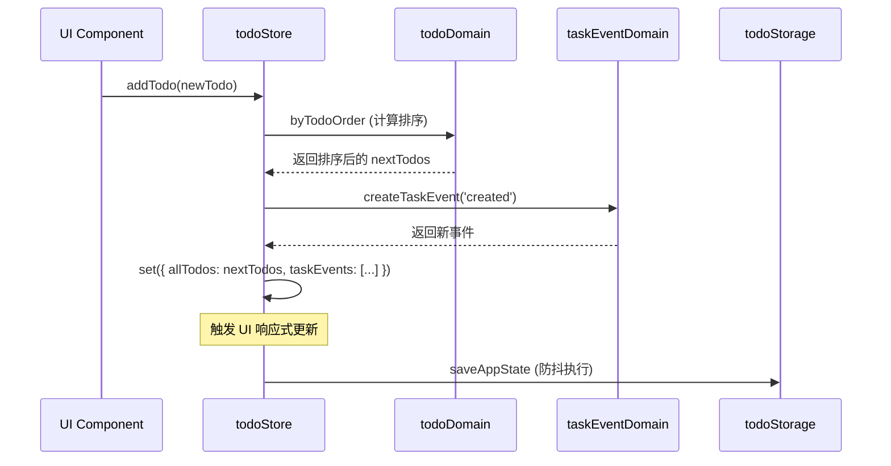
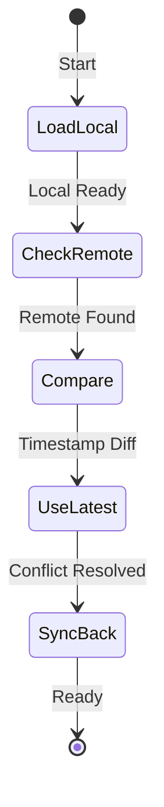

# 基于 Zustand 的状态管理

## 目录
1. [模块概览](#模块概览)
2. [架构设计：DDD 与 Zustand 的深度融合](#架构设计ddd-与-zustand-深度融合)
3. [核心存储结构 (TodoStore) 详解](#核心存储结构-todostore-详解)
   - [状态树的设计原则](#状态树的设计原则)
   - [派生状态的预计算机制](#派生状态的预计算机制)
4. [任务领域逻辑 (Todo Domain)](#任务领域逻辑-todo-domain)
   - [任务森林的排序算法](#任务森林的排序算法)
   - [垃圾箱与恢复逻辑的复杂性处理](#垃圾箱与恢复逻辑的复杂性处理)
5. [里程碑与提醒系统逻辑](#里程碑与提醒系统逻辑)
6. [任务事件追踪与历史分析](#任务事件追踪与历史分析)
7. [响应式数据流与 UI 更新机制](#响应式数据流与-ui-更新机制)
   - [添加任务的操作流分析](#添加任务的操作流分析)
   - [选择器 (Selectors) 的性能优化](#选择器-selectors-的性能优化)
8. [持久化层：数据规范化与多端同步](#持久化层数据规范化与多端同步)
   - [Schema 版本迁移策略](#schema-版本迁移策略)
   - [防抖保存与冲突解决](#防抖保存与冲突解决)
9. [测试驱动开发 (TDD) 实践](#测试驱动开发-tdd-实践)
10. [核心组件与 API 参考](#核心组件与-api-参考)
11. [文件参考](#文件参考)

## 模块概览

LightFlux 的状态管理系统是一个高度模块化且类型安全的架构方案。它不仅负责内存中的数据流转，还承担了复杂的业务规则校验和多端数据持久化的重任。该模块的核心目标是实现“逻辑与视图的彻底解耦”，确保业务逻辑在不同平台（Web、iOS、Android）上表现一致。

**模块规模评估**：
- **文件总数**：4 个核心文件，1 个测试文件，涉及 2 个服务类文件。
- **子模块划分**：
  - **Store 层** (`todoStore.tsx`)：作为系统的“骨架”，负责连接 React 组件与业务逻辑。它定义了所有的 Action 入口，并管理着状态的生命周期（如 Hydration）。
  - **任务领域层** (`todoDomain.ts`)：系统的“大脑”，包含了最复杂的树形结构处理逻辑。它不依赖任何 UI 框架，纯粹处理数据结构。
  - **里程碑领域层** (`milestoneDomain.ts`)：负责时间维度上的业务规则，如周年纪念、倒计时等不同类型的状态分类。
  - **追踪领域层** (`taskEventDomain.ts`)：负责记录用户的每一个关键动作，为后续的报表分析提供数据支撑。

通过这种分层，LightFlux 成功地将一个复杂的待办事项应用拆解为了多个可预测、易测试的微小单元。本章节将深入探讨这些模块的内部实现细节。

## 架构设计：DDD 与 Zustand 深度融合

在传统的 React 开发中，开发者往往会将逻辑直接写在 `useEffect` 或组件方法中，导致代码难以维护。LightFlux 采用了 **领域驱动设计 (Domain-Driven Design, DDD)** 的简化版本，结合 **Zustand** 的轻量级特性，构建了一套响应式系统。

下面的架构图展示了系统中各层级之间的交互关系，特别是领域逻辑如何作为“纯函数服务”被 Store 调用的过程。这种设计确保了 Store 仅负责状态的持有和分发，而不涉及具体的业务算法。

该架构将整个应用划分为视图层、状态层、领域逻辑层和基础设施层。当视图层触发一个 Action 时，Store 会调用领域逻辑层中的纯函数来计算新的状态，然后更新内部的 State。Zustand 负责监听这些变化并通知视图层进行最小化的重绘。同时，Store 还会定期将状态交给基础设施层进行持久化存储。这种分层模式极大地提高了代码的可测试性和可维护性。

**架构设计来源**:
- [todoStore.tsx](lightflux/store/todoStore.tsx)
- [todoDomain.ts](lightflux/store/todoDomain.ts)

## 核心存储结构 (TodoStore) 详解

`TodoStore` 是整个应用的状态容器。它不仅持有原始数据（Raw Data），还持有经过计算的派生数据（Derived Data）。

### 状态树的设计原则

在 `todoStore.tsx` 中，状态被精心划分为几个维度：持久化数据（如 `allTodos`）、计算属性（如 `todos`）以及运行时元数据（如 `isHydrated`）。这种划分方式使得开发者可以清晰地知道哪些数据需要被序列化，哪些数据仅在内存中有效。

下面的类图展示了 `TodoStore` 的主要状态构成及其与领域逻辑的关联。

`TodoStore` 通过调用 `TodoDomain` 和 `MilestoneDomain` 中的函数来维持其内部状态的一致性。例如，每当 `allTodos` 发生变化时，Store 都会重新调用 `todoState` 来更新 `todos` 和 `trashedTodos`。这种模式确保了派生状态始终是基于原始数据的最新投影，避免了数据不同步的问题。

### 派生状态的预计算机制

为了提高 UI 渲染速度，LightFlux 并没有在渲染时进行过滤和排序，而是在状态更新时就预先计算好。这种做法虽然在 `set` 操作时多花了一点时间，但保证了 UI 层的 `useTodoStore(state => state.todos)` 永远是 O(1) 的复杂度。这对于拥有大量任务的用户来说，是保证界面流畅的关键。

**核心组件来源**:
- [todoStore.tsx:L56-L100](lightflux/store/todoStore.tsx#L56-L100)
- [todoDomain.ts:L94-L104](lightflux/store/todoDomain.ts#L94-L104)

## 任务领域逻辑 (Todo Domain)

任务领域逻辑是整个系统中最具挑战性的部分，因为它需要处理任务的嵌套（子任务）和灵活的排序。

### 任务森林的排序算法

LightFlux 支持无限层级的子任务。在数据结构上，它采用了扁平化的数组存储，通过 `parentId` 指向父任务。为了在 UI 上正确显示这种树形结构，`orderWithSubtasks` 函数实现了一个递归的排序遍历算法。

下面的示意图展示了如何将一个扁平的任务数组转化为逻辑上的“任务森林”并进行深度优先排序。

该算法首先识别出所有的根节点，然后对它们进行排序。对于每一个节点，算法会递归地查找其子节点，并按照指定的排序规则（如 `sortOrder` 和 `createdAt`）进行排列。为了确保系统的健壮性，算法还包含了防环检测，防止因错误的父子关系导致无限递归。最终输出的是一个扁平化的数组，但其顺序已经完全符合 UI 树状展示的要求。

### 垃圾箱与恢复逻辑的复杂性处理

当一个父任务被移入垃圾箱时，其所有子任务也应该被视为“已删除”。但当用户从垃圾箱恢复一个子任务时，如果其父任务仍在垃圾箱中，该子任务应该自动“脱离”父节点，变为根节点。这种复杂的业务规则被封装在 `restoreTodoBranch` 函数中，通过递归收集整个家族树并检查父节点状态来实现。这种处理方式保证了用户操作的直觉性，避免了“恢复了子任务却找不到”的情况。

**领域逻辑来源**:
- [todoDomain.ts:L26-L62](lightflux/store/todoDomain.ts#L26-L62)
- [todoDomain.ts:L106-L139](lightflux/store/todoDomain.ts#L106-L139)

## 里程碑与提醒系统逻辑

里程碑模块负责管理具有时间属性的重要事件。`milestoneDomain.ts` 不仅定义了里程碑的分类逻辑，还通过 `MILESTONE_TYPE_THEME` 定义了视觉表现层，为不同类型的里程碑（如生日、周年纪念）提供默认的图标和颜色。

在 `todoStore.tsx` 中，里程碑的变更会触发提醒系统的重算。下面的序列图展示了当用户更新里程碑时，系统是如何重新调度通知提醒的。

这个流程始于 Store 中的状态更新。由于 `TodoProvider` 订阅了 `allMilestones` 的变化，它会在检测到变更后调用通知服务的 `reconcile` 方法。该服务会清除所有旧的定时提醒，并根据最新的里程碑日期规则和用户设置的偏移量（如提前 1 天提醒），通过原生系统的推送 API 重新安排通知。这种自动同步机制确保了用户永远不会错过重要的日子。

**里程碑逻辑来源**:
- [milestoneDomain.ts](lightflux/store/milestoneDomain.ts)
- [todoStore.tsx:L725-L763](lightflux/store/todoStore.tsx#L725-L763)

## 任务事件追踪与历史分析

为了提供类似 GitHub 贡献图的统计功能，LightFlux 记录了任务的每一个生命周期事件。`taskEventDomain.ts` 提供了这些事件的生成逻辑。每一个事件都是一个不可变的对象，记录了操作的类型、发生的时间以及相关的元数据。

系统还具备“差异导出”能力。通过 `deriveTaskEventsFromTodoDiff` 函数，系统可以对比两个任务列表的差异，并自动补全缺失的事件。这在数据迁移或多端同步冲突合并时非常有用，能够确保历史记录的完整性和准确性。这些数据最终可以被用于生成用户的效率报告或热力图。

**事件追踪来源**:
- [taskEventDomain.ts](lightflux/store/taskEventDomain.ts)

## 响应式数据流与 UI 更新机制

### 添加任务的操作流分析

当用户在界面上输入任务标题并回车时，会发生一系列动作，从 UI 层一直贯穿到持久化层。下面的序列图详细描述了一个典型的“添加任务”操作的数据流向。

在操作开始后，Store 首先会调用领域逻辑来确定新任务在列表中的位置。随后，它会生成一个“创建任务”的事件并将其加入历史记录。当 Store 调用 `set` 方法更新内部状态后，Zustand 会立即通知所有订阅了相关数据的 UI 组件进行重绘。最后，为了保证数据安全，Store 会触发一个带防抖逻辑的持久化任务，将最新的状态写入本地存储或同步到云端。

### 选择器 (Selectors) 的性能优化

在大型应用中，频繁的状态更新可能导致性能瓶颈。LightFlux 强烈推荐使用细粒度的选择器。通过这种方式，组件只订阅它关心的那一部分数据。例如，一个只显示任务总数的组件不应该因为某个任务标题的修改而重新渲染。这种精准的响应式控制是 LightFlux 能够处理大规模任务数据的技术基础。

**更新机制来源**:
- [todoStore.tsx:L158-L225](lightflux/store/todoStore.tsx#L158-L225)

## 持久化层：数据规范化与多端同步

持久化是 LightFlux 最复杂的底层设施之一。它位于 `services/todoStorage.ts` 中，被 Store 调用以实现数据的长效存储。

### Schema 版本迁移策略

随着功能的迭代，数据结构不可避免会发生变化。`parsePersistedAppState` 函数充当了“守门员”的角色。它会对读取到的旧版本 JSON 进行逐个字段的校验和转换。例如，如果旧版本数据中没有 `content` 字段（富文本内容），规范化函数会自动补全一个空的富文本对象。这种鲁棒的设计确保了用户在升级应用后，其历史数据能够被正确加载而不会导致崩溃。

### 防抖保存与冲突解决

为了避免高频操作（如快速输入）导致频繁的磁盘 IO，Store 采用了 180ms 的防抖保存策略。这意味着在用户停止操作后的极短时间内，系统才会执行实际的写入操作。同时，系统支持云端同步。下面的状态图展示了系统在处理本地与远程数据同步时的决策逻辑。

当系统启动时，它会首先加载本地缓存的数据以保证极速启动体验。随后，它会尝试连接远程服务器获取最新的同步快照。如果发现远程数据的更新时间戳晚于本地，系统会自动执行合并操作，并将最新的数据写回本地。反之，如果本地数据更新，则会将本地变更推送到云端。这种“最后写入者胜”的策略虽然简单，但在单用户场景下非常高效且可靠。

**持久化层来源**:
- [services/todoStorage.ts:L310-L396](lightflux/services/todoStorage.ts#L310-L396)
- [todoStore.tsx:L765-L790](lightflux/store/todoStore.tsx#L765-L790)

## 测试驱动开发 (TDD) 实践

LightFlux 的稳定性很大程度上归功于详尽的单元测试。`todoDomain.test.ts` 展示了如何对复杂的业务规则进行建模。测试覆盖了诸如循环依赖处理、孤儿节点挂载以及排序索引一致性等极端情况。通过在每次代码提交前运行这些测试，团队可以确信核心业务逻辑在重构过程中没有受到破坏。这种对质量的坚持使得 LightFlux 能够持续交付稳定可靠的体验。

**测试实践来源**:
- [tests/todoDomain.test.ts](lightflux/tests/todoDomain.test.ts)

## 核心组件与 API 参考

### Store Actions

| 方法 | 参数 | 描述 |
| :--- | :--- | :--- |
| `addTodo` | `todo: NewTodo` | 创建新任务并计算初始位置，同时触发事件记录。 |
| `toggleTodo` | `id: string` | 切换任务完成状态，并记录完成/重新开启事件。 |
| `trashTodo` | `id: string` | 将任务及其所有子任务移入回收站，保持层级关系。 |
| `reorderTask` | `id, targetIndex` | 在同一层级内调整任务的显示顺序，更新排序索引。 |
| `addMilestone` | `milestone: NewMilestone` | 创建里程碑，并自动应用对应类型的主题配置。 |

### Domain Functions

| 函数 | 文件 | 描述 |
| :--- | :--- | :--- |
| `collectTodoFamily` | `todoDomain.ts` | 递归收集一个节点及其所有后代节点的 ID 集合，用于批量操作。 |
| `deriveTaskEventsFromTodoDiff` | `taskEventDomain.ts` | 比较两个状态快照，生成增量事件列表，用于数据同步。 |
| `normalizeReminderOffsets` | `utils/milestoneDate.ts` | 确保提醒时间偏移量是合法且有序的数字数组。 |

## 文件参考

本章节内容基于以下核心文件编写：

- [lightflux/store/todoStore.tsx](lightflux/store/todoStore.tsx): Zustand 存储中心与 UI 适配器。
- [lightflux/store/todoDomain.ts](lightflux/store/todoDomain.ts): 核心任务逻辑与排序算法。
- [lightflux/store/milestoneDomain.ts](lightflux/store/milestoneDomain.ts): 里程碑分类与视觉主题逻辑。
- [lightflux/store/taskEventDomain.ts](lightflux/store/taskEventDomain.ts): 任务生命周期事件追踪。
- [lightflux/services/todoStorage.ts](lightflux/services/todoStorage.ts): 数据持久化、规范化与迁移逻辑。
- [lightflux/tests/todoDomain.test.ts](lightflux/tests/todoDomain.test.ts): 针对领域逻辑的 Vitest 单元测试集。
