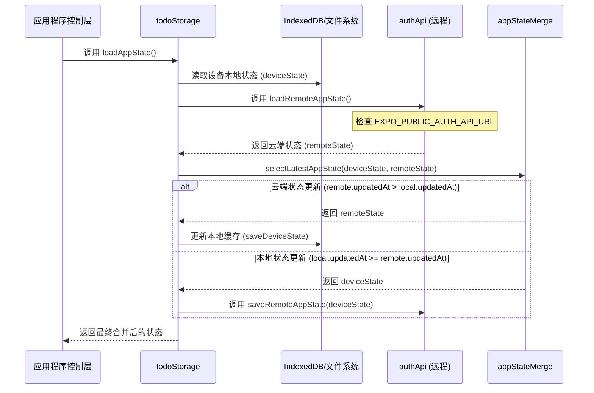
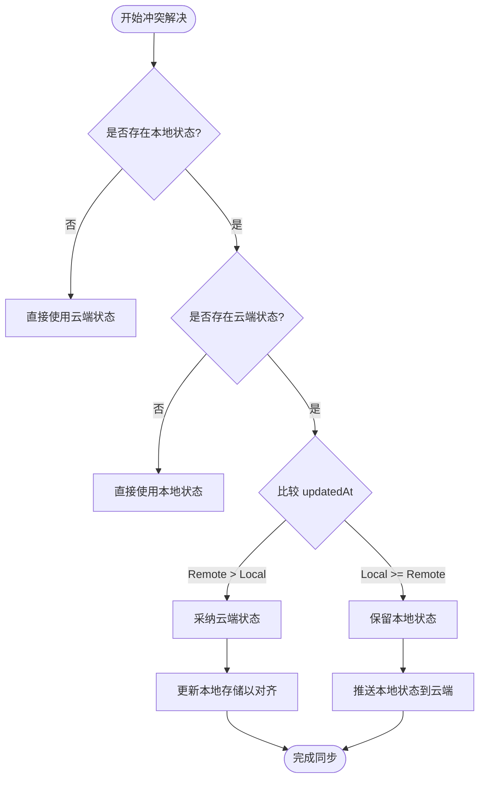
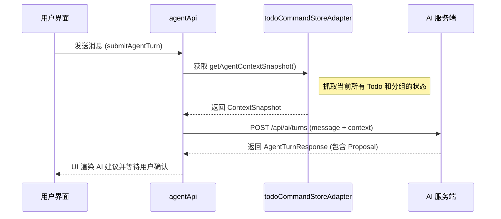

# 数据同步与冲突解决

## 目录
1. [模块概览](#模块概览)
2. [架构设计与同步流程](#架构设计与同步流程)
3. [核心组件分析](#核心组件分析)
   - [状态合并算法 (appStateMerge.ts)](#状态合并算法-appstatemergets)
   - [存储抽象层 (todoStorage.ts)](#存储抽象层-todostoragets)
4. [数据冲突解决策略：LWW 深度解析](#数据冲突解决策略lww-深度解析)
5. [数据规范化与迁移逻辑](#数据规范化与迁移逻辑)
6. [增量同步与应用生命周期](#增量同步与应用生命周期)
7. [AI 代理同步：上下文快照机制](#ai-代理同步上下文快照机制)
8. [媒体文件同步处理](#媒体文件同步处理)
9. [错误处理与容错机制](#错误处理与容错机制)
10. [测试用例与冲突场景模拟](#测试用例与冲突场景模拟)
11. [文件参考](#文件参考)

## 模块概览
LightFlux 的数据同步模块是整个应用的核心基础设施之一，负责确保用户在不同设备（Web、移动端）之间拥有一致的任务、分组和里程碑数据。该模块不仅要处理简单的 CRUD 操作，还要应对复杂的网络环境、多端并发修改以及数据结构的演进。

在 LightFlux 的设计哲学中，数据同步遵循“本地优先”原则。这意味着用户的每一次操作都会立即反馈在本地存储中，随后由同步引擎在后台负责与云端对齐。这种设计极大地提升了应用的响应速度，并赋予了应用在离线状态下完整工作的能力。

**模块范围统计**：
- **总文件数**：8 个 TypeScript 文件位于 `lightflux/services/`。
- **核心子模块**：
    - **同步核心**：`appStateMerge.ts`（算法）、`todoStorage.ts`（协调器）
    - **API 交互**：`authApi.ts`（认证与基础同步）、`agentApi.ts`（AI 交互）
    - **存储实现**：`indexedDbStorage.ts`（Web 端）、`sessionStorage.ts`（临时存储）
    - **媒体处理**：`imageUpload.ts`（附件同步）
- **覆盖深度**：本文将深入分析 `appStateMerge.ts` 的合并逻辑，并详细描述 `todoStorage.ts` 中的同步触发机制，同时引用测试用例来解释冲突解决的具体表现。

## 架构设计与同步流程
LightFlux 采用了一种混合同步架构。本地存储作为“真实数据源”的缓存，而远程 API 则充当“数据交换中心”。

以下时序图展示了应用启动时的同步流程。这个流程至关重要，因为它决定了用户打开应用时看到的是过时的本地数据还是最新的云端数据：



在上述流程中，`todoStorage` 充当了协调者的角色。它首先尝试从本地读取数据，以确保 UI 能够立即渲染。随后，它异步发起远程请求。如果远程数据更具体（时间戳更新），它会触发一次本地更新；反之，如果本地有未同步的更改，它会将本地状态推送到服务器。这种“双向对齐”机制保证了最终一致性。

**Diagram sources**: 
- [todoStorage.ts:L425-L463](lightflux/services/todoStorage.ts#L425-L463)
- [appStateMerge.ts:L26-L40](lightflux/services/appStateMerge.ts#L26-L40)

## 核心组件分析

### 状态合并算法 (appStateMerge.ts)
`appStateMerge.ts` 是同步逻辑的“大脑”。它不关心数据是如何存储的，只关心数据之间的先后顺序。其核心函数 `selectLatestAppState` 实现了冲突解决的最基本逻辑。

```typescript
export const selectLatestAppState = (
  deviceState: PersistedAppState | null,
  remoteState: PersistedAppState | null,
): PersistedAppState | null => {
  if (!deviceState) return remoteState;
  if (!remoteState) return deviceState;

  // 基于 updatedAt 时间戳的“最后写入者胜”策略
  return remoteState.updatedAt > deviceState.updatedAt
    ? remoteState
    : deviceState;
};
```

为了确保 `updatedAt` 的准确性，该组件还提供了一个 `deriveStateUpdatedAt` 函数。在数据迁移或某些旧版数据缺失时间戳的情况下，该函数会扫描所有的 `todos`、`groups` 和 `milestones`，取其中最大的更新时间作为全局状态的时间戳。这是一种防御性编程手段，确保了同步逻辑的鲁棒性。

### 存储抽象层 (todoStorage.ts)
`todoStorage.ts` 封装了跨平台的持久化逻辑。它利用 React Native 的 `Platform.OS` 来抹平 Web 端和原生端的差异。

- **Web 端**：使用 `indexedDbStorage.ts`。IndexedDB 提供了比 localStorage 更大的存储空间和更好的性能。
- **原生端 (iOS/Android)**：使用文件系统存储。通过 `expo-file-system` 将状态序列化为 JSON 文件。

**关键函数 `loadAppState` 的逻辑**：
该函数是整个同步流程的入口。它不仅负责读取数据，还负责处理网络异常。如果远程 API 调用失败（例如由于网络不稳定），它会捕获异常并降级到仅使用本地缓存，同时在控制台输出警告。这种“优雅降级”确保了用户在离线时依然可以正常使用应用。

**Section sources**:
- [appStateMerge.ts](lightflux/services/appStateMerge.ts)
- [todoStorage.ts](lightflux/services/todoStorage.ts)

## 数据冲突解决策略：LWW 深度解析
LightFlux 采用 **LWW (Last-Write-Wins，最后写入者胜)** 策略处理冲突。在分布式系统中，LWW 是一种简单且有效的冲突解决方法，前提是各端的时间戳能够保持相对同步。

以下流程图详细说明了冲突解决的决策路径：



**为什么选择 LWW？**
对于待办事项这类应用，用户的修改通常是覆盖性的（例如修改任务标题、标记完成）。虽然 CRDT (Conflict-free Replicated Data Types) 可以提供更细粒度的合并（例如同时修改标题和日期而不互相覆盖），但 LWW 的实现复杂度更低，性能开销更小，且在大多数单用户多设备场景下已经足够。

在 `appStateMerge.test.ts` 中，有一项测试专门验证了“当本地与远程时间戳相等时，保留本地状态”。这是一种偏向用户的策略，假设用户当前设备上的操作是最及时的。

**Diagram sources**: 
- [appStateMerge.ts:L26-L40](lightflux/services/appStateMerge.ts#L26-L40)
- [appStateMerge.test.ts:L29-L43](lightflux/tests/appStateMerge.test.ts#L29-L43)

## 数据规范化与迁移逻辑
由于应用会不断迭代，存储的数据结构（Schema）也会发生变化。`todoStorage.ts` 中的 `parsePersistedAppState` 函数承担了数据清洗和版本迁移的重任。

**规范化流程**：
1.  **JSON 解析**：将原始字符串转为对象。
2.  **Todo 规范化**：调用 `normalizeTodo`，确保每个任务都有 `id`、`title`、`createdAt` 等必填字段。如果缺失 `updatedAt`，则使用 `createdAt` 补全。
3.  **关系修复**：检查任务引用的 `milestoneId` 是否真实存在。如果引用了不存在的里程碑，则将其重置为 `null`。
4.  **事件迁移**：如果 `schemaVersion` 较低，会调用 `migrateTaskEvents` 根据现有任务重新生成任务事件序列。

这种严谨的规范化过程保证了即使云端返回了旧版本或损坏的数据，应用也能将其修复为可用的状态。

## 增量同步与应用生命周期
LightFlux 的同步并不是实时监听每一个字节的变化，而是基于特定的生命周期事件触发。

1.  **初始化 (Initialization)**：应用启动时，`App` 组件挂载后立即调用 `loadAppState`。这是最重要的一次同步，决定了应用的初始状态。
2.  **操作后保存 (Post-Action Save)**：每当用户执行关键操作（如完成任务、移动分组）后，存储层会调用 `saveAppState`。该函数会首先同步写入本地，然后异步推送到远程。
3.  **身份验证变更 (Auth Change)**：当用户登录或登出时，同步引擎会重新初始化。

通过这种方式，LightFlux 在同步频率和资源消耗之间取得了平衡。

## AI 代理同步：上下文快照机制
`agentApi.ts` 提供了一种特殊的数据交互模式。AI 代理不仅需要处理用户的文字输入，还需要理解用户当前的“任务上下文”。



这种机制确保了 AI 代理能够给出“懂你”的建议。例如，当你说“帮我把今天最重要的事置顶”时，AI 能够通过上下文快照知道哪些任务是“今天”的，从而准确给出修改建议。

**Section sources**:
- [agentApi.ts](lightflux/services/agentApi.ts)
- [lightflux/agent/todoCommandStoreAdapter.ts](lightflux/agent/todoCommandStoreAdapter.ts)

## 媒体文件同步处理
图片附件的同步逻辑独立于主状态同步。这是为了防止 `AppState` JSON 文件因包含 Base64 图片数据而变得巨大。

**`imageUpload.ts` 的核心逻辑**：
- **大小限制**：严格限制在 8MB 以内，防止大文件耗尽用户流量或服务器空间。
- **格式校验**：仅支持主流的图片格式（AVIF, JPEG, PNG, WebP）。
- **异步上传**：上传过程是独立的。上传成功后，系统仅将返回的 HTTPS URL 存储在任务的 `content` 字段（RichText 格式）中。

这种“状态存引用，云端存文件”的策略是现代 Web 应用处理媒体数据的标准做法。

**Section sources**:
- [imageUpload.ts](lightflux/services/imageUpload.ts)

## 错误处理与容错机制
在不稳定的网络环境下，同步模块必须具备极强的容错能力。

- **静默失败策略**：在 `loadRemoteAppState` 中，如果 API 返回 401（未授权）或 500（服务器错误），系统不会弹出报错干扰用户，而是静默返回 `null`，让应用继续使用本地数据。
- **配置感知**：通过 `isRemoteAuthConfigured` 动态判断是否需要发起网络请求。在没有配置 `EXPO_PUBLIC_AUTH_API_URL` 的开发环境中，所有远程同步逻辑都会被自动跳过。
- **数据完整性校验**：通过 `isValidMilestoneDateRule` 等工具函数，在数据进入应用状态树之前进行最后一道关卡的检查。

## 测试用例与冲突场景模拟
`appStateMerge.test.ts` 为同步逻辑提供了信心保证。

**典型测试场景**：
1.  **新旧对齐**：验证当远程状态的 `updatedAt` 为 30，本地为 20 时，系统正确选择远程状态。
2.  **本地优先**：验证当本地状态较新（20）而远程较旧（10）时，系统保留本地状态。
3.  **时间戳派生**：验证 `deriveStateUpdatedAt` 能从一组任务中提取出最晚的 `updatedAt`。这在处理从没有全局时间戳的旧版本迁移过来的数据时非常有用。

这些测试确保了核心算法在各种边界情况下都能按预期工作。

## 文件参考
以下是本文涉及的核心源文件：

- [lightflux/services/appStateMerge.ts](lightflux/services/appStateMerge.ts): 核心冲突解决算法。
- [lightflux/services/todoStorage.ts](lightflux/services/todoStorage.ts): 跨平台存储与同步协调层。
- [lightflux/services/authApi.ts](lightflux/services/authApi.ts): 远程同步 API 与身份验证。
- [lightflux/services/agentApi.ts](lightflux/services/agentApi.ts): AI 代理上下文同步接口。
- [lightflux/services/imageUpload.ts](lightflux/services/imageUpload.ts): 媒体附件上传逻辑。
- [lightflux/tests/appStateMerge.test.ts](lightflux/tests/appStateMerge.test.ts): 冲突场景测试用例。
- [lightflux/services/indexedDbStorage.ts](lightflux/services/indexedDbStorage.ts): Web 端底层存储实现。
