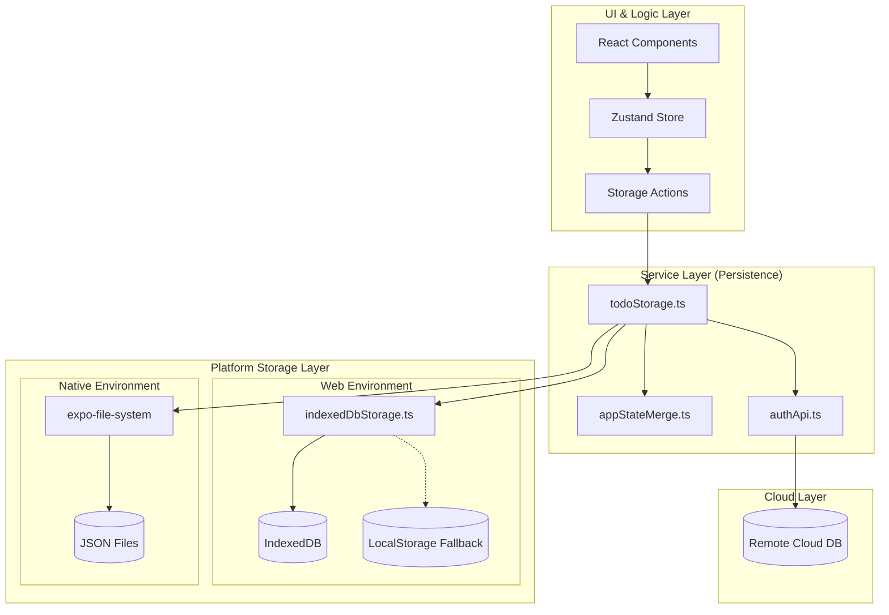
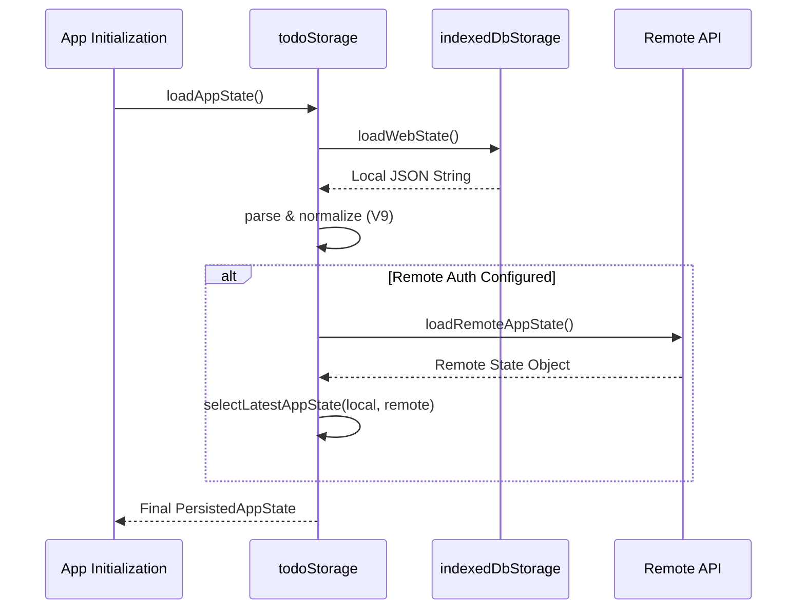
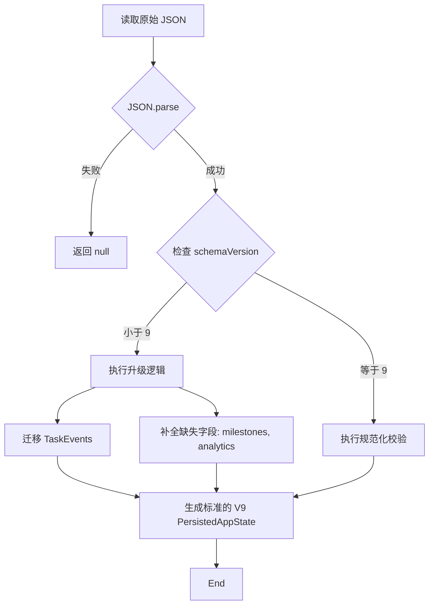
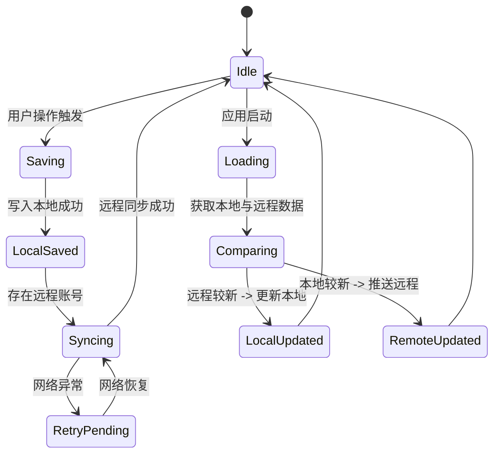

# 本地优先架构与持久化

## 目录
1. [模块概览](#模块概览)
2. [引言](#引言)
3. [架构设计](#架构设计)
4. [核心组件](#核心组件)
   - [IndexedDB 抽象层 (indexedDbStorage.ts)](#indexeddb-抽象层-indexeddbstoragets)
   - [应用状态管理器 (todoStorage.ts)](#应用状态管理器-todostoragets)
   - [会话存储 (sessionStorage.ts)](#会话存储-sessionstoragets)
5. [数据模型与持久化结构](#数据模型与持久化结构)
6. [版本迁移策略](#版本迁移策略)
7. [同步与冲突解决](#同步与冲突解决)
8. [性能优化与离线支持](#性能优化与离线支持)
9. [测试与验证](#测试与验证)
10. [文件引用](#文件引用)

## 模块概览

在开始深入探讨架构细节之前，我们先对持久化模块的规模和组成进行整体评估。LightFlux 的持久化逻辑主要集中在 `lightflux/services` 目录下，该目录包含了所有与外部系统（包括本地存储和远程 API）交互的服务。

**文件统计与范围：**
- **总文件数**：约 8 个核心服务文件。
- **子模块分布**：
  - `indexedDbStorage.ts`: 负责 Web 端的 IndexedDB 封装。
  - `todoStorage.ts`: 核心持久化逻辑，处理 Todo、Milestone 等数据的读写与迁移。
  - `sessionStorage.ts`: 负责用户登录状态的持久化。
  - `appStateMerge.ts`: 提供状态合并与更新时间派生的工具函数。
  - `types/todo.ts`: 定义了所有持久化数据的类型结构。

本章节将深度覆盖上述所有核心文件，特别是 `todoStorage.ts` 中的复杂数据规范化逻辑以及 `indexedDbStorage.ts` 的跨环境适配方案。

## 引言

LightFlux 采用 **本地优先 (Local-First)** 架构设计。与传统的“云优先”应用不同，本地优先应用将用户的数据主副本保存在本地设备上，而不是远程服务器。这种设计理念为用户带来了三个核心优势：
1. **极致的性能**：所有读写操作都直接在本地数据库上进行，消除了网络延迟，UI 响应近乎实时。
2. **离线可用性**：即使用户处于断网状态，应用的所有功能（如创建任务、管理里程碑）依然可以正常使用，数据会在网络恢复后自动同步。
3. **隐私与所有权**：数据首先属于用户，存储在用户的设备中，云端同步仅作为跨设备备份的辅助手段。

持久化层是本地优先架构的基石。在 LightFlux 中，持久化层不仅负责将内存中的状态写入磁盘，还承担了数据完整性校验、多版本 schema 迁移以及跨平台（Web 与 Native）适配的重任。

## 架构设计

LightFlux 的持久化架构采用了分层设计，以确保业务逻辑与底层存储介质的解耦。

下面的架构图展示了数据在系统中的流动路径：



**架构解析**：
- **UI & Logic Layer**：用户通过 UI 触发操作，状态首先更新到内存中的 Zustand Store。
- **Service Layer**：`todoStorage.ts` 作为中枢，负责将内存状态序列化，并调用底层的存储服务。它还负责与 `authApi.ts` 协作，处理远程同步逻辑。
- **Platform Storage Layer**：这是环境适配层。在 Web 端，优先使用 `IndexedDB`，并提供 `LocalStorage` 作为降级方案；在 Native 端（iOS/Android），则通过 `expo-file-system` 将数据持久化为 JSON 文件。
- **Cloud Layer**：当用户配置了远程账号时，系统会异步将本地数据同步到云端。

**图表来源**：
- [todoStorage.ts](lightflux/services/todoStorage.ts)
- [indexedDbStorage.ts](lightflux/services/indexedDbStorage.ts)
- [appStateMerge.ts](lightflux/services/appStateMerge.ts)

## 核心组件

### IndexedDB 抽象层 (indexedDbStorage.ts)

由于底层的 IndexedDB API 是基于事件的（Event-based），这与现代前端常用的 `async/await` 模式不符。`indexedDbStorage.ts` 的核心任务就是将这些繁琐的事件回调封装成 Promise。

**实现细节**：
该组件通过 `openDatabase` 函数管理数据库连接的单例，并使用 `requestResult` 和 `transactionComplete` 辅助函数来简化操作。

```typescript
// 封装 IndexedDB 请求为 Promise
const requestResult = <T,>(request: IDBRequest<T>): Promise<T> =>
  new Promise((resolve, reject) => {
    request.onsuccess = () => resolve(request.result);
    request.onerror = () =>
      reject(request.error ?? new Error('IndexedDB request failed.'));
  });

// 封装事务完成为 Promise
const transactionComplete = (transaction: IDBTransaction): Promise<void> =>
  new Promise((resolve, reject) => {
    transaction.oncomplete = () => resolve();
    transaction.onerror = () =>
      reject(transaction.error ?? new Error('IndexedDB transaction failed.'));
    transaction.onabort = () =>
      reject(transaction.error ?? new Error('IndexedDB transaction aborted.'));
  });
```

此外，该模块还包含了一个关键的迁移逻辑：如果检测到 `localStorage` 中存在旧数据，它会自动将其迁移到 `IndexedDB` 中，并保留一份备份。这种设计保证了用户在应用升级过程中不会丢失任何数据。

### 应用状态管理器 (todoStorage.ts)

`todoStorage.ts` 是整个持久化系统的核心。它定义了 `loadAppState` 和 `saveAppState` 两个主要入口。

在加载状态时，它遵循以下逻辑：
1. 从本地设备加载数据（Web 或 Native）。
2. 如果配置了远程账号，从云端获取数据。
3. 使用 `selectLatestAppState` 比较本地和远程数据的 `updatedAt` 时间戳，选择最新的版本。
4. 如果远程数据更新，则更新本地缓存；如果本地数据更新，则推送到云端。

### 会话存储 (sessionStorage.ts)

`sessionStorage.ts` 负责管理用户的登录状态。与应用状态不同，会话状态通常较小且结构简单。它同样支持跨平台适配，Web 端使用 `localStorage` 存储字符串标识（如 `'signed-in'` 或 `'signed-out'`），Native 端则使用独立的文件。

**核心组件交互序列图**：



该序列展示了应用启动时的初始化流程。重点在于 `parse & normalize` 这一步，它确保了从磁盘读取的原始字符串被转换为符合当前版本 Schema 的对象。

**章节参考**：
- [indexedDbStorage.ts](lightflux/services/indexedDbStorage.ts)
- [todoStorage.ts](lightflux/services/todoStorage.ts)
- [sessionStorage.ts](lightflux/services/sessionStorage.ts)

## 数据模型与持久化结构

持久化的数据结构定义在 `types/todo.ts` 中。`PersistedAppState` 是存储的顶层容器，它包含了应用运行所需的全部关键数据。

```typescript
export interface PersistedAppState {
  schemaVersion: 9;          // 架构版本号，用于迁移逻辑
  updatedAt: number;         // 最后更新时间戳，用于同步冲突解决
  analyticsStartedAt: number; // 统计开始时间
  language: Language;        // 用户语言偏好
  navigationOrder: NavigationItemId[]; // 导航栏排序
  ungroupedName: string | null; // 未分组任务的自定义名称
  todos: Todo[];             // 任务列表
  groups: TodoGroup[];       // 分组列表
  milestones: Milestone[];   // 里程碑列表
  taskEvents: TaskEvent[];   // 任务事件流（用于统计和审计）
}
```

**数据映射关系**：
- **Todo**：每个任务都有唯一的 `id`，并关联到 `groupId` 或 `milestoneId`。
- **Milestone**：包含复杂的 `dateRule`（支持公历和农历），这是 LightFlux 的特色功能之一。
- **TaskEvent**：记录了任务的生命周期事件（创建、完成、重开等），用于生成热力图和统计报表。

在持久化过程中，这些复杂的嵌套对象会被序列化为 JSON 字符串。为了防止损坏的数据导致应用崩溃，`todoStorage.ts` 提供了一系列 `normalize` 函数（如 `normalizeTodo`, `normalizeMilestone`），在加载时对每个字段进行类型检查和默认值填充。

## 版本迁移策略

随着功能的迭代，数据结构（Schema）不可避免地会发生变化。LightFlux 使用 `schemaVersion` 来跟踪数据的演进。

目前最新的版本是 **V9**。在 `todoStorage.ts` 的 `parsePersistedAppState` 函数中，实现了从旧版本到新版本的平滑过渡。

**迁移逻辑流程图**：



**关键迁移案例分析**：
根据 `todoStorageMigration.test.ts` 中的测试用例，从 V7 升级到 V9 时，系统会自动执行以下操作：
1. **补全字段**：为旧数据添加空的 `milestones` 数组和默认的 `analyticsStartedAt`。
2. **导航栏更新**：在 `navigationOrder` 中自动插入新的 `milestones` 入口，并移除已废弃的 `search` 入口。
3. **事件重建**：如果旧版本没有 `taskEvents`，系统会根据现有的 Todo 状态反向推导并生成 `created` 事件（通过 `migrateTaskEvents` 函数）。
4. **外键清理**：检查 Todo 关联的 `milestoneId` 是否真的存在于 `milestones` 列表中，如果不存在则重置为 `null`。

这种“防御性加载”策略极大地增强了系统的健壮性，使得应用能够容忍底层存储的微小损坏或不一致。

**章节参考**：
- [todoStorage.ts:L310-L396](lightflux/services/todoStorage.ts#L310-L396)
- [todoStorageMigration.test.ts](lightflux/tests/todoStorageMigration.test.ts)

## 同步与冲突解决

在本地优先架构中，当多个设备同时修改同一份数据时，就会发生冲突。LightFlux 目前采用了一种简单而有效的策略：**最后写入者胜 (Last-Write-Wins, LWW)**。

**冲突解决逻辑**：
该逻辑由 `appStateMerge.ts` 中的 `selectLatestAppState` 函数实现：

```typescript
export const selectLatestAppState = (
  deviceState: PersistedAppState | null,
  remoteState: PersistedAppState | null,
): PersistedAppState | null => {
  if (!deviceState) return remoteState;
  if (!remoteState) return deviceState;

  // 比较 updatedAt 时间戳
  return remoteState.updatedAt > deviceState.updatedAt
    ? remoteState
    : deviceState;
};
```

**更新时间派生**：
为了确保 `updatedAt` 的准确性，系统不会简单地使用 `Date.now()`，而是通过 `deriveStateUpdatedAt` 函数从所有子实体（Todo, Group, Milestone）的 `updatedAt` 中取最大值。这意味着即使本地时钟不准，只要实体本身记录了正确的修改时间，合并逻辑就能正常工作。

**同步流程状态图**：



**设计权衡**：
虽然 LWW 策略在处理复杂的并发修改（如两个设备同时修改同一个 Todo 的标题）时可能会丢失其中一个修改，但对于单用户多设备的个人待办事项应用来说，这种复杂度的权衡是合理的。它避免了复杂的 CRDT（无冲突复制数据类型）实现，保持了代码的简洁和高性能。

**章节参考**：
- [appStateMerge.ts](lightflux/services/appStateMerge.ts)
- [todoStorage.ts:L425-L463](lightflux/services/todoStorage.ts#L425-L463)

## 性能优化与离线支持

本地优先架构本身就是一种巨大的性能优化。通过将数据存储在 `IndexedDB` 中，LightFlux 实现了以下优化：

1. **减少 UI 阻塞**：所有的数据库操作都是异步的，且 `IndexedDB` 运行在浏览器的主线程之外（通过 Web IDL 接口），不会导致 UI 卡顿。
2. **增量序列化**：虽然目前持久化是以整个 `PersistedAppState` 为单位进行的，但由于本地磁盘 I/O 极快，即使有数百个任务，序列化和写入操作通常也能在几毫秒内完成。
3. **预加载策略**：在应用启动的极早期就开始调用 `loadAppState`，确保当 React 组件挂载时，数据已经就绪。

**离线处理机制**：
当应用检测到网络不可用时，`saveAppState` 会静默失败远程同步部分，但本地持久化依然会成功。系统会在下一次应用启动或网络恢复时，通过 `loadAppState` 中的对比逻辑自动完成补齐。

## 测试与验证

持久化层的正确性至关重要，因为任何 Bug 都可能导致用户数据的丢失。LightFlux 采用了严格的单元测试来验证这一层。

**测试重点**：
- **Schema 迁移测试**：模拟 V7、V8 版本的原始数据，验证 `parsePersistedAppState` 是否能正确升级到 V9。
- **规范化测试**：提供包含非法字段（如错误的日期格式、不存在的 ID 引用）的 JSON，验证系统是否能正确过滤或修复这些数据。
- **跨平台模拟**：通过 Mock `Platform.OS`，分别测试 Web 端和 Native 端的存储路径。

**测试代码示例**：
```typescript
it('upgrades V7 state with milestone and analytics defaults', () => {
  const result = parsePersistedAppState(
    JSON.stringify({
      schemaVersion: 7,
      todos: [legacyTodo],
      // ... 缺少 milestones 和 taskEvents
    }),
    100,
  );

  expect(result).toMatchObject({
    schemaVersion: 9,
    milestones: [],
    taskEvents: [/* 自动生成的事件 */],
  });
});
```

**章节参考**：
- [todoStorageMigration.test.ts](lightflux/tests/todoStorageMigration.test.ts)

## 文件引用

以下是本文档涉及的核心源代码文件，建议开发者在深入研究实现细节时参考：

- [lightflux/services/indexedDbStorage.ts](lightflux/services/indexedDbStorage.ts): IndexedDB 的 Promise 封装与降级逻辑。
- [lightflux/services/todoStorage.ts](lightflux/services/todoStorage.ts): 持久化中枢，包含数据规范化与迁移逻辑。
- [lightflux/services/sessionStorage.ts](lightflux/services/sessionStorage.ts): 用户会话状态持久化。
- [lightflux/services/appStateMerge.ts](lightflux/services/appStateMerge.ts): 状态合并与更新时间计算工具。
- [lightflux/types/todo.ts](lightflux/types/todo.ts): 持久化数据模型定义。
- [lightflux/tests/todoStorageMigration.test.ts](lightflux/tests/todoStorageMigration.test.ts): 版本迁移逻辑的单元测试。
- [lightflux/services/authApi.ts](lightflux/services/authApi.ts): 远程同步的 API 接口。
