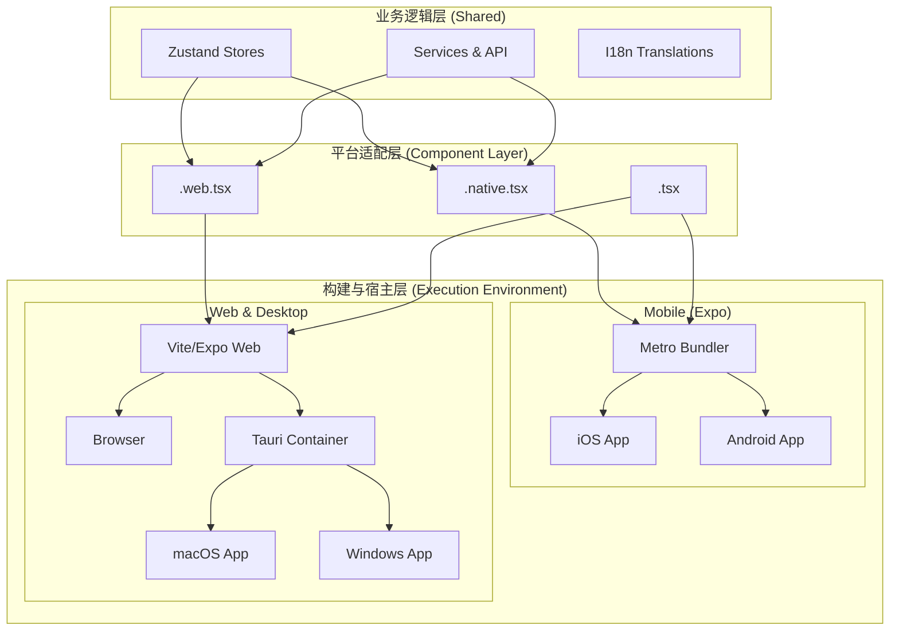
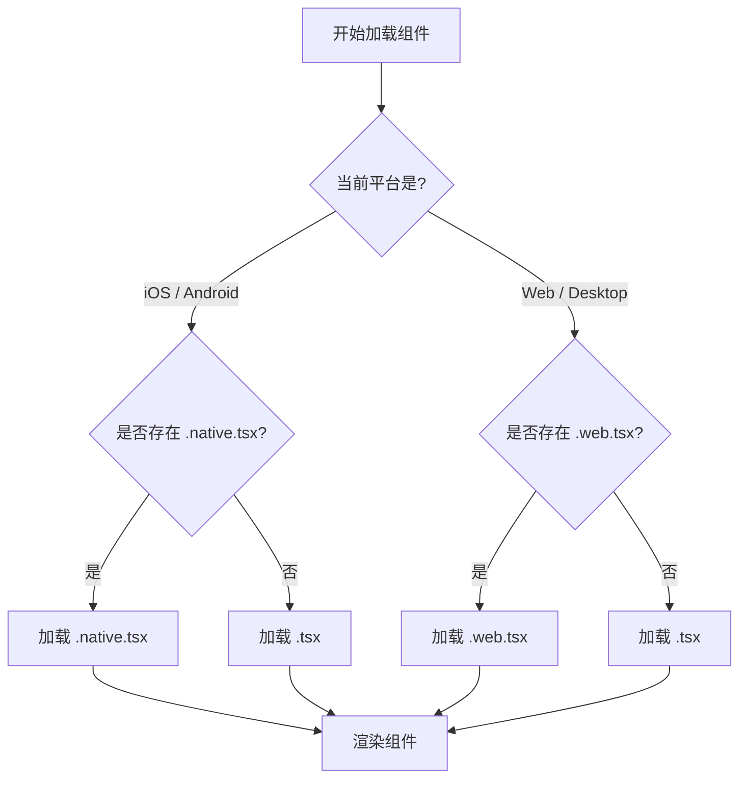
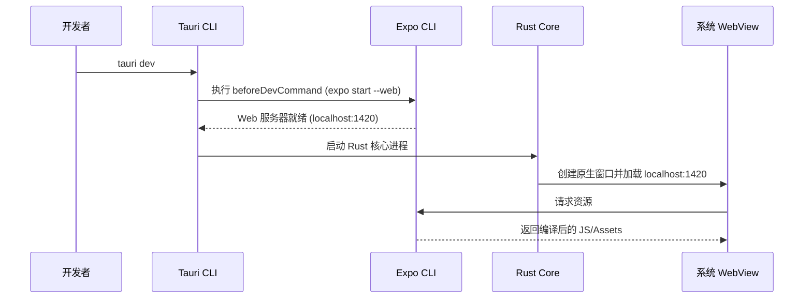
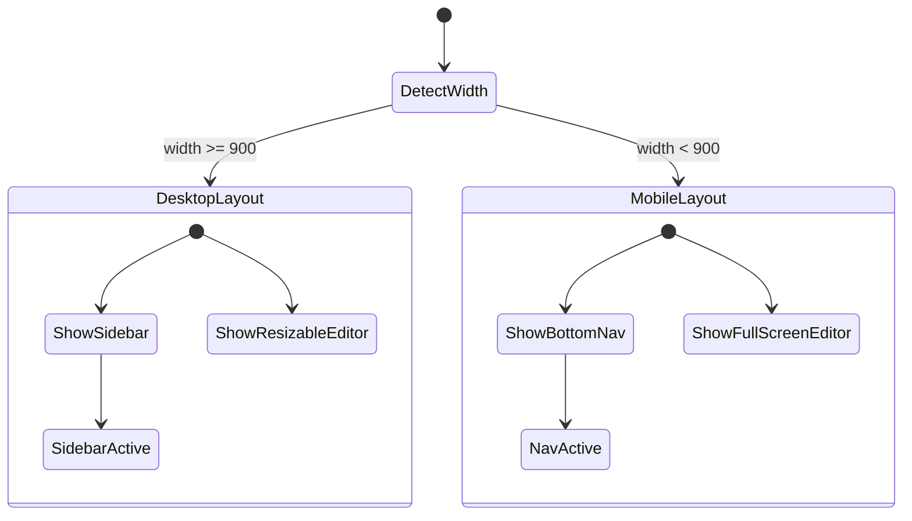
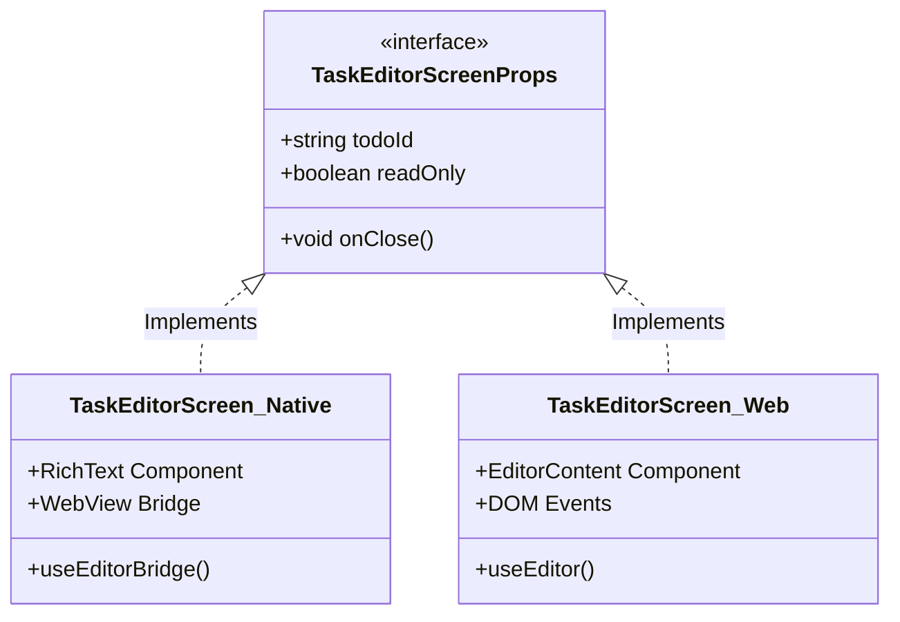

# 跨端适配与 Tauri-Expo 集成原理

## 目录
1. [模块概览](#模块概览)
2. [引言](#引言)
3. [架构设计与集成流程](#架构设计与集成流程)
4. [平台差异化处理机制](#平台差异化处理机制)
5. [Tauri 与 Expo 的共存方案](#tauri-与-expo-的共存方案)
6. [共享 UI 与跨端样式策略](#共享-ui-与跨端样式策略)
7. [核心组件实现分析](#核心组件实现分析)
8. [文件参考](#文件参考)

## 模块概览

在 LightFlux 项目中，跨端适配与集成是整个应用的核心基础设施。通过结合 Expo（React Native）和 Tauri，LightFlux 实现了单一代码库支持 iOS、Android、Web、macOS 和 Windows 五个平台的目标。

**统计数据**：
- **涉及文件总数**：约 100 个核心源文件。
- **主要子目录**：
    - `src-tauri/`：包含桌面端 Rust 核心逻辑与 Tauri 配置。
    - `components/`：包含大量采用 `.native.tsx` 和 `.web.tsx` 后缀的跨端组件。
    - `editor-web/`：专门为 Web/Desktop 环境构建的高级编辑器模块。
    - `config/`：存放平台相关的样式与输入配置。
- **覆盖深度**：本文将深入分析跨端文件解析机制、Tauri 与 Expo 的桥接原理，以及如何编写高性能的共享 UI 组件。

## 引言

LightFlux 的跨端策略并非简单的“一次编写，到处运行”（Write Once, Run Anywhere），而是追求“一次学习，到处编写，极致体验”（Learn Once, Write Anywhere, Native Experience）。为了在移动端保持流畅的交互体验，同时在桌面端提供强大的生产力工具，项目采用了 **Expo + Tauri** 的双引擎架构。

- **Expo (React Native)**：负责移动端（iOS/Android）的原生渲染和 Web 端的适配。它提供了丰富的移动端 API 访问能力（如通知、文件系统）。
- **Tauri**：负责桌面端（macOS/Windows）的容器化。它将 Expo 导出的 Web 构建产物包装在原生的 WebView 窗口中，并通过 Rust 提供的桥接层调用系统级 API。

这种架构的核心挑战在于如何处理不同平台间的 API 差异（如移动端的 `expo-notifications` 与桌面端的 `tauri-plugin-notification`）以及 UI 交互习惯的差异（如移动端的底部导航与桌面端的侧边栏）。

## 架构设计与集成流程

LightFlux 的架构可以分为三层：业务逻辑层（共享）、平台适配层（差异化）和原生宿主层（执行环境）。

下面的架构图展示了代码是如何在不同平台间流转并最终被执行的：



**架构描述**：
该架构图展示了 LightFlux 的分层设计。最上层是完全共享的业务逻辑，包括状态管理（Zustand）和基础服务。中间层是平台适配层，利用 React Native 的文件后缀解析机制，为不同平台提供特化的 UI 实现。最底层是构建与宿主环境，Expo 负责移动端的打包，而 Web 构建产物则被 Tauri 进一步包装以支持桌面端。

**图表来源**：
- [App.tsx](App.tsx)
- [package.json](package.json)

## 平台差异化处理机制

LightFlux 充分利用了 React Native 生态中的 **后缀名解析机制 (Suffix-based Resolution)**。这是实现跨端适配最优雅的方式，因为它允许开发者在保持组件接口一致的前提下，为特定平台编写完全不同的实现。

### 后缀名解析原理

当你在代码中编写 `import TaskEditorScreen from './TaskEditorScreen'` 时，打包工具会根据当前的构建目标按优先级搜索文件：

1.  **移动端 (iOS/Android)**：构建工具（Metro）会优先查找 `TaskEditorScreen.native.tsx`。如果不存在，则查找 `TaskEditorScreen.tsx`。
2.  **Web/桌面端**：构建工具（Vite 或 Webpack）会优先查找 `TaskEditorScreen.web.tsx`。如果不存在，则查找 `TaskEditorScreen.tsx`。

这种机制在 `components/editor/` 目录中得到了完美体现：

```typescript
// TaskEditorScreen.native.tsx (移动端实现)
// 使用 @10play/tentap-editor，这是一个基于 WebView 的富文本编辑器，适合移动端性能
import { RichText, useEditorBridge } from '@10play/tentap-editor';

// TaskEditorScreen.web.tsx (Web/桌面端实现)
// 使用 @tiptap/react，直接操作 DOM，提供更强大的桌面端编辑体验
import { EditorContent, useEditor } from '@tiptap/react';
```

### 决策流程图

下面的流程图描述了系统如何决定加载哪个版本的组件：



**逻辑说明**：
这个决策流程确保了开发者可以针对特定平台进行极致优化。例如，`ResizableDivider` 在移动端可能只是一个简单的视觉分割线，但在桌面端则需要处理复杂的鼠标拖拽逻辑以调整侧边栏宽度。通过后缀名，这些逻辑被完美解耦，互不干扰。

**Section sources**:
- [components/editor/TaskEditorScreen.native.tsx](components/editor/TaskEditorScreen.native.tsx)
- [components/editor/TaskEditorScreen.web.tsx](components/editor/TaskEditorScreen.web.tsx)
- [components/layout/ResizableDivider.tsx](components/layout/ResizableDivider.tsx)

## Tauri 与 Expo 的共存方案

LightFlux 的一大特色是将 Tauri（桌面端框架）与 Expo（移动端框架）集成在同一个项目中。这通常被认为具有挑战性，因为两者都有自己的构建系统和配置要求。

### 构建流程集成

在 `package.json` 中，LightFlux 定义了一系列脚本来驱动不同平台的构建：

```json
{
  "scripts": {
    "start": "expo start",
    "android": "expo start --android",
    "ios": "expo start --ios",
    "web": "expo start --web",
    "desktop:web": "expo export --platform web --output-dir desktop-dist"
  }
}
```

Tauri 的配置文件 `src-tauri/tauri.conf.json` 则巧妙地引用了这些脚本：

```json
{
  "build": {
    "beforeDevCommand": "npm run web -- --port 1420",
    "devUrl": "http://localhost:1420",
    "beforeBuildCommand": "npm run desktop:web",
    "frontendDist": "../desktop-dist"
  }
}
```

### 集成流程图



**流程解释**：
当开发者运行桌面端调试时，Tauri CLI 首先调用 Expo CLI 启动一个 Web 开发服务器。随后，Tauri 启动 Rust 核心进程，创建一个原生操作系统窗口，并将窗口的 URL 指向 Expo 提供的本地服务器。这样，Web 代码就运行在了 Tauri 提供的原生容器中，能够通过 Rust 桥接层访问桌面端特有的 API。

**Section sources**:
- [package.json](package.json)
- [src-tauri/tauri.conf.json](src-tauri/tauri.conf.json)

## 共享 UI 与跨端样式策略

为了确保 UI 在所有平台上的一致性，LightFlux 采用了 **NativeWind** (Tailwind CSS for React Native)。

### NativeWind 的作用

NativeWind 允许开发者使用标准的 Tailwind CSS 类名来编写样式，这些类名在 Web 端会被编译为标准的 CSS，而在原生移动端则会被转换为 React Native 的 `StyleSheet` 对象。

### 响应式布局策略

在 `App.tsx` 中，应用通过检测窗口宽度来切换布局模式：

```typescript
const { width } = useWindowDimensions();
const usesDesktopLayout = width >= 900;

return (
  <View className="flex-1 flex-row bg-canvas">
    {usesDesktopLayout ? (
      <SafeAreaView className="w-[78px] border-r border-[#E2E1E8] bg-[#F7F6F9]">
        {/* 桌面端侧边栏 */}
      </SafeAreaView>
    ) : null}
    
    <View style={usesDesktopLayout ? { width: resolvedListPaneWidth } : styles.fullPane}>
      {/* 主列表内容 */}
    </View>
    
    {!usesDesktopLayout ? (
      <SafeAreaView className="border-t border-[#E4E3EA] bg-white">
        {/* 移动端底部导航栏 */}
      </SafeAreaView>
    ) : null}
  </View>
);
```

### 样式适配状态图



**状态说明**：
应用根据 `useWindowDimensions` 钩子实时监听屏幕宽度。当宽度超过 900 像素时，系统进入 `DesktopLayout` 状态，显示侧边导航栏并允许编辑器以分栏形式存在；反之，则进入 `MobileLayout` 状态，显示底部导航并以全屏 Modal 形式弹出编辑器。这种响应式设计确保了应用在不同设备上的最佳可用性。

**Section sources**:
- [App.tsx](App.tsx)
- [config/nativewind.ts](config/nativewind.ts)

## 核心组件实现分析

### App 入口 (App.tsx)

`App.tsx` 是应用的大脑，它处理了不同平台的初始化逻辑。例如，在 Web 端，它会监听键盘快捷键（如 `Cmd+J` 打开智能助手），而在移动端则依赖手势导航。

```typescript
useEffect(() => {
  if (Platform.OS !== 'web') {
    return undefined;
  }

  const handleKeyDown = (event: KeyboardEvent) => {
    if ((event.metaKey || event.ctrlKey) && event.key.toLowerCase() === 'j') {
      event.preventDefault();
      openAgent();
    }
    // ... 其他快捷键处理
  };

  document.addEventListener('keydown', handleKeyDown);
  return () => document.removeEventListener('keydown', handleKeyDown);
}, [openAgent]);
```

### 跨端编辑器 (TaskEditorScreen)

这是项目中跨端实现最复杂的组件。为了在不同平台上提供最佳的编辑体验，它被拆分为三个文件：

1.  **TaskEditorScreen.types.ts**：定义共享的 Props 接口，确保各平台实现的一致性。
2.  **TaskEditorScreen.native.tsx**：使用 WebView 包装的 Tiptap 编辑器，解决了 React Native 原生输入框在处理复杂富文本时的性能问题。
3.  **TaskEditorScreen.web.tsx**：直接使用 Tiptap 的 React 组件，支持图片粘贴、拖拽等桌面端高级特性。

### 编辑器组件关系图



**关系分析**：
通过定义统一的 `TaskEditorScreenProps` 接口，业务逻辑层（如 `App.tsx`）无需关心当前运行在哪个平台，只需导入 `TaskEditorScreen` 并传入必要的参数即可。具体的渲染逻辑由打包工具根据后缀名自动选择，实现了高度的解耦。

**Section sources**:
- [App.tsx](App.tsx)
- [components/editor/TaskEditorScreen.types.ts](components/editor/TaskEditorScreen.types.ts)
- [components/editor/TaskEditorScreen.native.tsx](components/editor/TaskEditorScreen.native.tsx)
- [components/editor/TaskEditorScreen.web.tsx](components/editor/TaskEditorScreen.web.tsx)

## 文件参考

以下是实现跨端集成与适配的关键源文件：

- [App.tsx](App.tsx)：应用核心入口，处理响应式布局与平台初始化。
- [index.ts](index.ts)：Expo 启动入口，注册根组件。
- [package.json](package.json)：定义多平台构建脚本与依赖关系。
- [src-tauri/tauri.conf.json](src-tauri/tauri.conf.json)：桌面端打包与环境配置。
- [components/editor/TaskEditorScreen.native.tsx](components/editor/TaskEditorScreen.native.tsx)：移动端富文本编辑器实现。
- [components/editor/TaskEditorScreen.web.tsx](components/editor/TaskEditorScreen.web.tsx)：Web/桌面端富文本编辑器实现。
- [components/editor/TaskEditorScreen.types.ts](components/editor/TaskEditorScreen.types.ts)：跨端编辑器接口定义。
- [components/layout/ResizableDivider.web.tsx](components/layout/ResizableDivider.web.tsx)：桌面端特有的可调整大小分割栏。
- [config/nativewind.ts](config/nativewind.ts)：NativeWind 样式配置。
- [editor-web/vite.config.ts](editor-web/vite.config.ts)：高级编辑器模块的构建配置。
