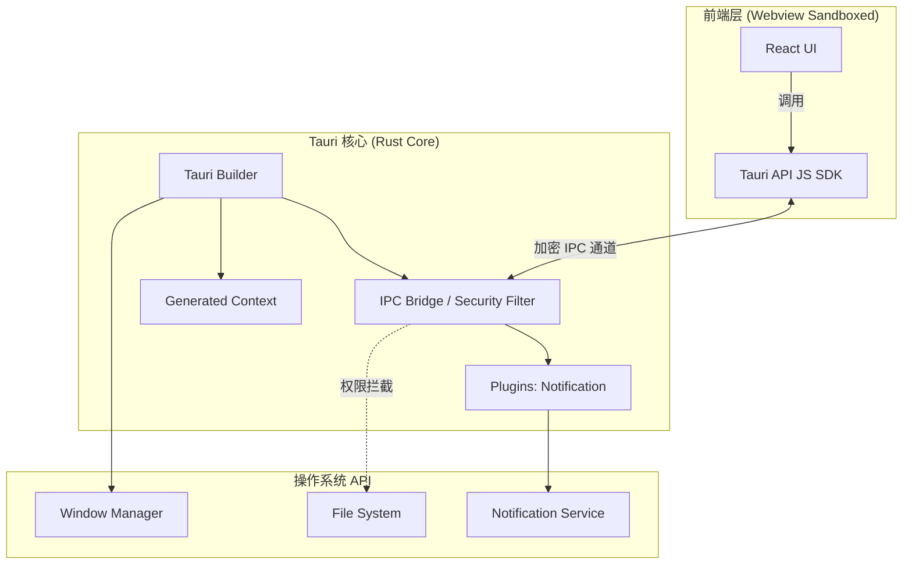
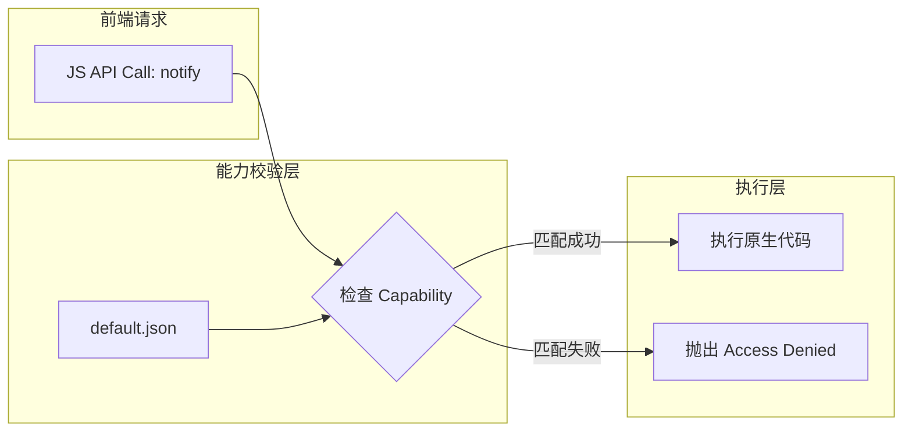
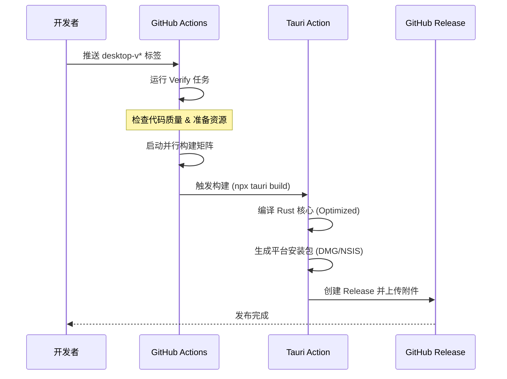

# 桌面端开发与发布

 ## 目录
 1. [模块概览](#模块概览)
 2. [Tauri 2 架构深度解析](#tauri-2-架构深度解析)
    - [核心进程与渲染进程的协作](#核心进程与渲染进程的协作)
    - [Rust 插件系统：功能扩展的基石](#rust-插件系统功能扩展的基石)
 3. [桌面端配置详解：tauri.conf.json](#桌面端配置详解tauriconfjson)
    - [构建流水线配置](#构建流水线配置)
    - [应用捆绑与资源管理](#应用捆绑与资源管理)
 4. [权限与能力系统 (Capabilities)](#权限与能力系统-capabilities)
    - [基于角色的权限分配](#基于角色的权限分配)
    - [安全性设计原则](#安全性设计原则)
 5. [本地开发环境搭建](#本地开发环境搭建)
 6. [自动化发布流水线：GitHub Actions](#自动化发布流水线github-actions)
    - [流水线阶段划分](#流水线阶段划分)
    - [多平台构建矩阵](#多平台构建矩阵)
 7. [打包、签名与发布注意事项](#打包签名与发布注意事项)
    - [macOS 签名与公证](#macos-macos-签名与公证)
    - [Windows 打包与 SmartScreen](#windows-打包与-smartscreen)
 8. [常见问题与排查指南](#常见问题与排查指南)
 9. [文件引用](#文件引用)

## 模块概览

LightFlux 的桌面端基于最新的 **Tauri 2.0** 框架构建，旨在为用户提供高性能、极低内存占用的跨平台任务管理体验。与传统的 Electron 框架不同，Tauri 并不捆绑整个 Chromium 浏览器，而是利用系统原生的 Webview 引擎（macOS 上为 WKWebView，Windows 上为 WebView2），这使得 LightFlux 的安装包体积通常仅为 Electron 应用的 1/10。

在 `lightflux/src-tauri` 目录下，我们维护了桌面端的所有原生配置和逻辑。该模块不仅负责将前端 React 资源打包进可执行文件，还通过 Tauri 强大的插件系统集成了原生通知、文件系统访问等功能。

**模块统计数据**：
- **核心文件数**：约 12 个（包含配置、Rust 源码及 CI/CD 脚本）
- **主要子目录**：
  - `src/`：Rust 源代码，定义应用入口、插件初始化及原生逻辑。
  - `capabilities/`：Tauri v2 特有的能力配置文件，定义细粒度的权限边界。
  - `icons/`：针对不同平台优化的应用图标资源（.ico, .icns, .png）。
  - `gen/`：由 Tauri 构建工具自动生成的 Schema 和元数据，用于辅助配置校验。

本章节将详细介绍 LightFlux 桌面端的架构设计、权限管理模型以及如何通过 GitHub Actions 实现全自动化的多平台发布流程。

## Tauri 2 架构深度解析

Tauri 2 采用了高度模块化且安全导向的架构，将应用逻辑清晰地划分为 **核心进程 (Core Process)** 和 **渲染进程 (WebView Process)**。这种分离不仅提高了稳定性（一个窗口崩溃不会导致整个应用退出），还通过 IPC（进程间通信）层提供了坚固的安全屏障。

### 核心进程与渲染进程的协作

核心进程使用 Rust 编写，拥有完整的系统访问权限。它负责管理窗口生命周期、系统托盘、原生菜单以及处理来自前端的请求。渲染进程则负责 UI 展示，运行在受限的沙盒环境中。

```rust
#![cfg_attr(not(debug_assertions), windows_subsystem = "windows")]

fn main() {
    tauri::Builder::default()
        // 初始化通知插件，允许前端安全地触发系统原生通知
        .plugin(tauri_plugin_notification::init())
        .run(tauri::generate_context!())
        .expect("error while running LightFlux");
}
```

在 `main.rs` 中，`tauri::generate_context!()` 是一个编译时宏，它会扫描 `tauri.conf.json` 并根据配置自动生成应用元数据、图标资源以及前端静态资源的嵌入逻辑。这种“编译时集成”的方式极大地优化了运行时的启动速度。

### Rust 插件系统：功能扩展的基石

Tauri 2 的核心保持了极简，绝大部分功能都通过插件实现。LightFlux 目前集成了 `tauri-plugin-notification`。插件不仅提供了 Rust 端的 API，还自动为前端注入了相应的 JS SDK，使得开发者可以像调用普通函数一样触发原生功能。

下图展示了 LightFlux 桌面端的整体架构交互及 IPC 流转：



**架构描述**：
当用户在前端点击“提醒”按钮时，React 应用通过 `TauriJS` 发起一个通知请求。该请求通过加密的 IPC 通道传输到 Rust 端的 `IPC Bridge`。此时，Tauri 会根据 **Capabilities** 配置检查该窗口是否有权发送通知。如果授权通过，请求将被分发到 `Notification Plugin`，最终调用操作系统的原生通知服务。如果前端尝试调用未授权的 `OS_FS`（文件系统），IPC 层会直接拦截并抛出安全异常。

**Section sources**:
- [main.rs](lightflux/src-tauri/src/main.rs)
- [Cargo.toml](lightflux/src-tauri/Cargo.toml)

## 桌面端配置详解：tauri.conf.json

`tauri.conf.json` 是桌面端的“大脑”，它定义了应用的身份、构建规则以及如何将 Web 代码转化为桌面应用。

### 构建流水线配置

在 `build` 字段中，我们配置了开发环境和生产环境的联动机制：

```json
"build": {
  "beforeDevCommand": "npm run web -- --port 1420",
  "devUrl": "http://localhost:1420",
  "beforeBuildCommand": "npm run desktop:web",
  "frontendDist": "../desktop-dist"
}
```

- **beforeDevCommand**: 当开发者运行 `npm run tauri dev` 时，Tauri 会首先启动前端 Vite 服务器。
- **devUrl**: 告诉 Tauri 在开发模式下监听哪个地址。
- **beforeBuildCommand**: 在生成最终安装包前，执行前端的桌面端专用构建脚本。
- **frontendDist**: 定义了打包后的静态资源存放位置。Tauri 会将该目录下的所有文件压缩并嵌入到最终的可执行文件中。

### 应用捆绑与资源管理

`bundle` 字段控制了安装包的生成行为，包括图标、类别以及平台特有的设置：

```json
"bundle": {
  "active": true,
  "targets": "all",
  "category": "Productivity",
  "icon": [
    "icons/32x32.png",
    "icons/128x128.png",
    "icons/icon.icns",
    "icons/icon.ico"
  ]
}
```

这里配置了 `Productivity`（效率类）分类，这会影响应用在 macOS Launchpad 或 Windows 开始菜单中的归类。图标配置包含了多种尺寸和格式，以确保在不同分辨率的屏幕下都能清晰显示。

**Section sources**:
- [tauri.conf.json](lightflux/src-tauri/tauri.conf.json)

## 权限与能力系统 (Capabilities)

Tauri 2 引入了全新的 **Capabilities** 系统，这是其安全架构的核心。与 v1 中全局生效的 `allowlist` 不同，v2 允许开发者为不同的窗口、甚至不同的远程 URL 分配完全不同的权限集。

### 基于角色的权限分配

在 `lightflux/src-tauri/capabilities/default.json` 中，我们为应用的主窗口定义了基础权限：

```json
{
  "$schema": "../gen/schemas/desktop-schema.json",
  "identifier": "default",
  "description": "Default capabilities for the LightFlux desktop window.",
  "windows": ["main"],
  "permissions": ["core:default", "notification:default"]
}
```

- **identifier**: 能力标识符，用于在复杂应用中区分不同的权限角色。
- **windows**: 绑定到名为 `main` 的窗口。这意味着如果应用未来增加了“帮助”窗口，该窗口默认将不具备发送通知的权限，除非另行配置。
- **permissions**: 
    - `core:default`: 包含窗口缩放、隐藏、显示等基础控制权。
    - `notification:default`: 授权前端调用 `tauri-plugin-notification` 提供的所有功能。

### 安全性设计原则

Tauri 的能力系统遵循“最小权限原则”。即使前端代码被恶意篡改（例如通过 XSS 注入），攻击者也只能在 `default.json` 声明的范围内活动。这种设计极大地降低了 Web 漏洞演变为系统级漏洞的风险。

**能力授权流程图**：



**逻辑说明**：
校验过程发生在 Rust 端的 IPC 处理函数中。Tauri 会提取请求来源窗口的标识符，并在已加载的能力映射表中查找对应的权限条目。这种校验是强制性的，开发者无法在前端绕过。

**Section sources**:
- [capabilities/default.json](lightflux/src-tauri/capabilities/default.json)

## 本地开发环境搭建

为了在本地运行和调试桌面端，开发者需要配置 Rust 编译环境。LightFlux 推荐将 Rust 工具链安装在独立目录下以避免污染系统环境。

1.  **安装 Rust**：使用 `rustup` 安装，建议版本为 `1.77.2` 或更高。
2.  **前端依赖**：在 `lightflux` 目录下运行 `npm install`。
3.  **启动开发模式**：
    ```bash
    cd lightflux
    npm run tauri dev
    ```
    该命令会启动前端 HMR 服务，并编译 Rust 核心。由于 Rust 编译较慢，首次启动可能需要几分钟时间，后续的增量编译会非常快。

**Section sources**:
- [docs/desktop-release.md](docs/desktop-release.md)

## 自动化发布流水线：GitHub Actions

LightFlux 使用 GitHub Actions 实现了全自动化的发布流程，确保每个发布版本都经过严格的校验和一致的构建环境。

### 流水线阶段划分

发布流水线定义在 `.github/workflows/desktop-release.yml` 中，分为两个关键阶段：

1.  **校验阶段 (Verify)**：
    在标准的 Ubuntu 环境下运行。它会安装 Node.js 22，运行 `npm run typecheck` 确保没有 TypeScript 类型错误，并执行 `npm run desktop:web` 验证前端资源是否可以正常导出。这一步是“质量守门员”，防止错误的配置浪费后续昂贵的 macOS 构建资源。

2.  **构建阶段 (Release)**：
    当校验通过后，流水线会根据策略矩阵并行启动三个构建任务。

### 多平台构建矩阵

矩阵配置涵盖了目前主流的桌面操作系统：

| 平台名称 | Runner 镜像 | 目标架构 (Target) | 产物格式 |
| :--- | :--- | :--- | :--- |
| macOS Apple Silicon | `macos-latest` | `aarch64-apple-darwin` | `.dmg` |
| macOS Intel | `macos-latest` | `x86_64-apple-darwin` | `.dmg` |
| Windows x64 | `windows-latest` | `msvc` | `.exe` (NSIS) |



**Section sources**:
- [.github/workflows/desktop-release.yml](.github/workflows/desktop-release.yml)

## 打包、签名与发布注意事项

在桌面端分发领域，构建出二进制文件只是成功了一半。为了让用户能够顺畅地安装，必须处理好各操作系统的安全策略。

### macOS 签名与公证

目前 LightFlux 在 CI 中使用 ad-hoc 签名（即 `signingIdentity: "-"`）。
- **现象**：用户下载 DMG 安装后，打开时会提示“无法验证开发者”或“应用已损坏”。
- **解决方法**：用户需在“系统设置 -> 隐私与安全性”中点击“仍要打开”。
- **正式方案**：未来需加入 Apple Developer Program，并在 CI 中配置证书和 `APPLE_ID` 环境变量，实现自动公证 (Notarization)。

### Windows 打包与 SmartScreen

Windows 端使用 NSIS 生成安装程序，默认不带数字签名。
- **现象**：安装时 Windows SmartScreen 会弹出蓝色警告。
- **解决方法**：引导用户点击“更多信息” -> “仍要运行”。
- **正式方案**：购买 Authenticode 证书并在 `tauri.conf.json` 中配置 `certificatePassword` 等字段。

## 常见问题与排查指南

在桌面端开发和发布过程中，如果遇到问题，可以参考以下清单进行排查：

1.  **白屏问题**：
    - 检查 `tauri.conf.json` 中的 `frontendDist` 是否指向了正确的目录。
    - 检查前端路由是否使用了 `HashRouter`（Tauri 生产环境推荐使用 Hash 路由以避免路径解析问题）。
2.  **构建超时**：
    - Rust 编译（尤其是首次）非常耗时。确保 GitHub Actions 中配置了 `rust-cache` 以加速后续构建。
3.  **插件功能失效**：
    - 检查 `main.rs` 中是否调用了 `.plugin(init())`。
    - 检查 `capabilities/default.json` 中是否声明了该插件的权限。
4.  **图标显示异常**：
    - 确保 `icons/` 目录下包含了所有必需的格式。可以使用 `tauri icon` 命令自动生成全套图标。

## 文件引用

以下是本章节涉及的关键源码文件，建议在修改桌面端逻辑前仔细阅读：

- [lightflux/src-tauri/tauri.conf.json](lightflux/src-tauri/tauri.conf.json) - 桌面端全局配置文件
- [lightflux/src-tauri/src/main.rs](lightflux/src-tauri/src/main.rs) - Rust 核心逻辑与插件初始化
- [lightflux/src-tauri/capabilities/default.json](lightflux/src-tauri/capabilities/default.json) - 默认权限能力定义
- [lightflux/src-tauri/Cargo.toml](lightflux/src-tauri/Cargo.toml) - Rust 依赖与编译配置
- [.github/workflows/desktop-release.yml](.github/workflows/desktop-release.yml) - 自动化发布流水线配置
- [docs/desktop-release.md](docs/desktop-release.md) - 发布流程与本地环境说明文档
