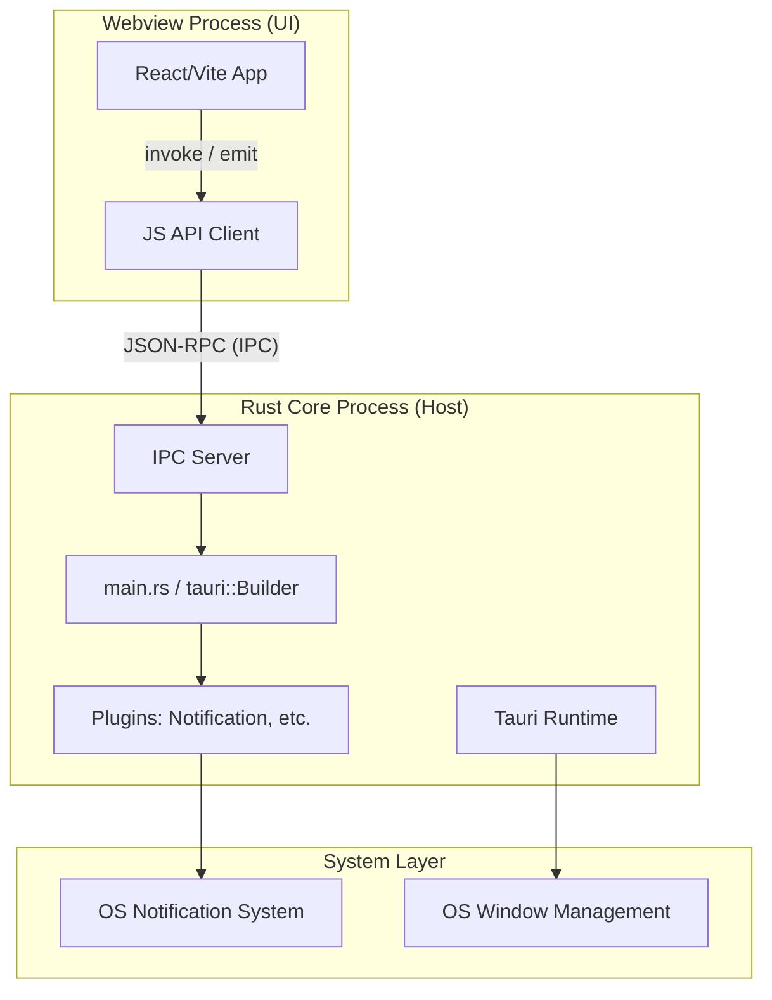
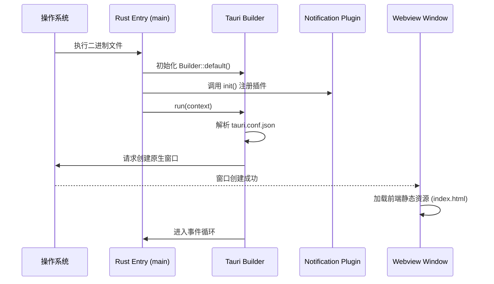
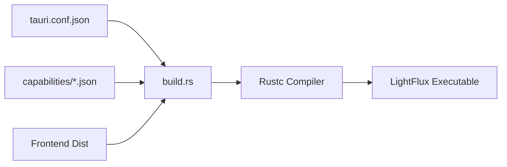

# Tauri 架构与 Rust 核心实现

## 目录
1. [模块概览](#模块概览)
2. [引言](#引言)
3. [Tauri 2 架构模型](#tauri-2-架构模型)
4. [Rust 核心入口：main.rs 解析](#rust-核心入口mainrs-解析)
5. [构建系统与依赖管理](#构建系统与依赖管理)
6. [插件集成与能力安全模型](#插件集成与能力安全模型)
7. [Rust 与 Webview 交互模式](#rust-与-webview-交互模式)
8. [核心文件索引](#核心文件索引)

## 模块概览

本章节深入探讨 LightFlux 桌面端的 Rust 核心实现及其基于 Tauri 2 框架的底层架构。LightFlux 采用典型的混合架构，利用 Rust 处理底层系统交互与生命周期管理，而前端 Webview 则负责用户界面展示。

在本次架构分析中，我们识别并覆盖了以下关键文件与目录：
- **核心文件数**：5 个主要配置文件与源代码文件。
- **子目录结构**：
    - `src/`：Rust 源代码目录，包含主入口点。
    - `capabilities/`：Tauri 2 新增的安全能力定义目录。
    - `gen/`：自动生成的模式与清单文件（由构建脚本维护）。
- **重点覆盖范围**：
    - Rust 初始化流程（`main.rs`）
    - 构建脚本逻辑（`build.rs`）
    - 依赖与包管理（`Cargo.toml`）
    - 应用配置与窗口定义（`tauri.conf.json`）
    - 安全权限管理（`capabilities/default.json`）

通过本章节的学习，开发者将能够理解 Tauri 2 在 LightFlux 中的应用方式，以及如何通过 Rust 扩展桌面端原生能力。

## 引言

LightFlux 桌面端基于 **Tauri 2** 框架构建，这是一个使用 Rust 编写的现代化桌面应用框架。与传统的 Electron 不同，Tauri 显著降低了应用的内存占用和安装包体积，因为它直接使用操作系统的原生 Webview 引擎（如 macOS 上的 WebKit，Windows 上的 WebView2），而不是捆绑整个 Chromium。

在 LightFlux 项目中，Rust 扮演着“宿主”和“系统桥梁”的角色。虽然目前大部分业务逻辑驻留在前端，但 Rust 端负责：
1. **应用生命周期管理**：控制应用的启动、运行和退出。
2. **原生插件调度**：集成如系统通知、文件系统访问等原生功能。
3. **安全沙箱定义**：通过 Tauri 2 的能力模型（Capabilities）严格限制前端可访问的 API。

理解 Rust 核心实现是扩展 LightFlux 原生功能（如本地数据库持久化、系统托盘交互等）的基础。

## Tauri 2 架构模型

Tauri 2 的架构建立在 Rust 核心进程（Core Process）与 Webview 渲染进程（WebView Process）的分离之上。

以下图表展示了 LightFlux 的进程间交互与架构分层：



**架构解析**：
Tauri 的核心是一个基于 Rust 的运行时，它负责编排所有组件。`main.rs` 中的 `tauri::Builder` 是整个应用的配置中心。当应用启动时，Rust 进程会创建一个或多个原生窗口，并在其中加载前端资源。

通信通过 **IPC（进程间通信）** 实现。前端通过 `invoke` 调用 Rust 定义的命令，或者通过 `emit` 发送事件。Rust 端则通过插件系统或自定义命令处理这些请求，并返回结果。在 LightFlux 中，这种模式被用于触发系统通知，确保 Web 代码能够以安全受控的方式访问系统原生 API。

**图表来源**：
- [main.rs](lightflux/src-tauri/src/main.rs)
- [tauri.conf.json](lightflux/src-tauri/tauri.conf.json)

## Rust 核心入口：main.rs 解析

`main.rs` 是 LightFlux 桌面端的逻辑起点。在 Tauri 2 中，初始化流程变得更加简洁和模块化。

### 初始化流程分析

LightFlux 的 `main.rs` 实现如下：

```rust
#![cfg_attr(not(debug_assertions), windows_subsystem = "windows")]

fn main() {
    tauri::Builder::default()
        .plugin(tauri_plugin_notification::init())
        .run(tauri::generate_context!())
        .expect("error while running LightFlux");
}
```

**代码解析**：
1. **`windows_subsystem` 指令**：第 1 行的属性确保在 Windows 平台的发布版本中，应用启动时不会弹出一个控制台窗口。这是桌面应用的常规做法。
2. **`tauri::Builder::default()`**：这是 Tauri 应用的构建器模式。通过链式调用，我们可以配置插件、设置菜单、注册命令以及处理生命周期事件。
3. **插件注册**：`.plugin(tauri_plugin_notification::init())` 将通知插件集成到应用中。这是 Tauri 2 的核心改进之一——大多数功能现在都通过独立的插件提供，而不是内置在核心库中。
4. **上下文生成**：`tauri::generate_context!()` 是一个宏，它在编译时读取 `tauri.conf.json` 文件，自动生成应用所需的元数据（如图标、窗口配置、权限清单等）。
5. **运行与错误处理**：`.run()` 启动事件循环。如果启动失败，`.expect()` 将捕获错误并终止进程。

### 启动时序图

以下序列图描述了从 `main` 函数启动到 Webview 加载完成的过程：



在启动过程中，Tauri 会并发执行多项任务。最关键的是对 `tauri.conf.json` 的解析，它决定了窗口的初始大小、标题以及是否可见。LightFlux 配置了一个 1280x820 的主窗口，并将其居中显示。

**代码参考**：
- [main.rs:L1-L8](lightflux/src-tauri/src/main.rs#L1-L8)

## 构建系统与依赖管理

LightFlux 的构建系统由 Rust 的包管理器 Cargo 和 Tauri 的构建脚本共同驱动。

### Cargo.toml 依赖分析

`Cargo.toml` 定义了项目的元数据和核心依赖。

```toml
[package]
name = "lightflux-desktop"
version = "1.0.0"
edition = "2021"

[dependencies]
tauri = { version = "2", features = [] }
tauri-plugin-notification = "2"

[build-dependencies]
tauri-build = { version = "2", features = [] }
```

**关键项说明**：
- **`tauri` (v2)**：这是核心运行时。相比 v1，v2 更加轻量化，许多功能被拆分到了单独的 crate 中。
- **`tauri-plugin-notification`**：专门用于处理跨平台通知的插件。将其列为依赖后，Rust 端才能调用 `init()` 进行注册。
- **`tauri-build`**：这是构建时依赖，用于在编译过程中处理资源打包和权限清单生成。

### build.rs 的作用

`build.rs` 是 Rust 的标准构建脚本，在实际编译项目源代码之前运行。

```rust
fn main() {
    tauri_build::build()
}
```

在 LightFlux 中，`tauri_build::build()` 执行以下关键操作：
1. **资源绑定**：将前端构建产物（位于 `../desktop-dist`）打包进二进制文件中。
2. **权限编译**：扫描 `capabilities/` 目录下的权限定义，生成运行时校验所需的 ACL（访问控制列表）。
3. **环境校验**：确保当前系统具备编译 Tauri 应用所需的开发环境（如 C++ 编译器、Webview 库等）。

**构建流程图**：



这种构建机制确保了最终生成的二进制文件是自包含的，用户无需安装任何额外的依赖即可运行应用（前提是系统中存在 Webview 运行时）。

**代码参考**：
- [Cargo.toml](lightflux/src-tauri/Cargo.toml)
- [build.rs](lightflux/src-tauri/build.rs)

## 插件集成与能力安全模型

Tauri 2 引入了一个全新的安全模型，称为 **Capabilities（能力）**。这是与 v1 最大的区别点。

### 能力定义 (Capabilities)

在 LightFlux 中，权限不再是全局开启的，而是通过 `capabilities/default.json` 显式授权。

```json
{
  "identifier": "default",
  "description": "Default capabilities for the LightFlux desktop window.",
  "windows": ["main"],
  "permissions": ["core:default", "notification:default"]
}
```

**权限解析**：
- **`core:default`**：允许访问 Tauri 的核心功能，如窗口管理和基本事件。
- **`notification:default`**：允许前端通过 `tauri-plugin-notification` 发送系统通知。

如果没有在 `permissions` 数组中声明 `notification:default`，即使 Rust 端注册了插件，前端的调用也会被拒绝。这种最小权限原则极大地增强了应用的安全性，防止了潜在的恶意脚本滥用系统功能。

### 插件生命周期

插件在 Tauri 2 中拥有完整的生命周期钩子。当我们在 `main.rs` 中调用 `tauri_plugin_notification::init()` 时，发生了以下过程：

```mermaid
stateDiagram-v2
    [*] --> Registration: main.rs 调用 init()
    Registration --> Initialization: Builder::run() 启动
    Initialization --> Setup: 执行插件的 setup 钩子
    Setup --> Ready: 插件准备就绪
    Ready --> IPC_Handling: 等待前端请求
    IPC_Handling --> OS_API: 调用系统通知接口
    OS_API --> IPC_Handling: 返回结果
```

这种插件化架构使得 LightFlux 可以根据需要灵活地添加功能，而不会增加核心运行时的复杂性。

**代码参考**：
- [capabilities/default.json](lightflux/src-tauri/capabilities/default.json)

## Rust 与 Webview 交互模式

虽然 LightFlux 目前的 Rust 端代码非常精简，但它建立了一套标准的 IPC 通信模式。

### 1. 从前端到 Rust (Invoke)
前端通过 `invoke` 函数调用 Rust 函数。虽然 `main.rs` 中目前没有自定义命令，但 Tauri 的插件系统内部大量使用了这种模式。例如，发送通知的流程如下：
1. 前端 JS 调用 `sendNotification`。
2. Tauri JS 桥接器将请求序列化为 JSON-RPC。
3. Rust 端的 `tauri-plugin-notification` 接收并解析请求。
4. Rust 执行原生系统调用。

### 2. 从 Rust 到前端 (Emit)
Rust 可以主动向前端发送事件。这通常用于处理异步任务的结果，例如文件下载进度或系统状态变更。

### 3. 安全性保证
Tauri 通过 **隔离模式 (Isolation Pattern)** 和 **内容安全策略 (CSP)** 确保交互的安全性。在 `tauri.conf.json` 中，虽然目前 `csp` 为空，但在生产环境中，Tauri 会自动注入严格的策略，防止跨站脚本攻击。

> 💡 **提示**：如果需要向 LightFlux 添加复杂的后台任务（如定时同步），建议在 `main.rs` 中使用 `.invoke_handler(tauri::generate_handler![...])` 注册自定义 Rust 函数。

## 核心文件索引

以下是本章节涉及的关键源代码文件，建议开发者在深入研究架构时参考：

- [lightflux/src-tauri/src/main.rs](lightflux/src-tauri/src/main.rs)：应用入口点，负责初始化和插件注册。
- [lightflux/src-tauri/Cargo.toml](lightflux/src-tauri/Cargo.toml)：定义 Rust 依赖项和项目元数据。
- [lightflux/src-tauri/build.rs](lightflux/src-tauri/build.rs)：构建脚本，处理资源打包和权限生成。
- [lightflux/src-tauri/tauri.conf.json](lightflux/src-tauri/tauri.conf.json)：Tauri 全局配置文件，定义窗口外观和构建行为。
- [lightflux/src-tauri/capabilities/default.json](lightflux/src-tauri/capabilities/default.json)：定义应用的安全能力和权限边界。

**Section sources**:
- [main.rs](lightflux/src-tauri/src/main.rs)
- [Cargo.toml](lightflux/src-tauri/Cargo.toml)
- [build.rs](lightflux/src-tauri/build.rs)
- [tauri.conf.json](lightflux/src-tauri/tauri.conf.json)
- [default.json](lightflux/src-tauri/capabilities/default.json)
