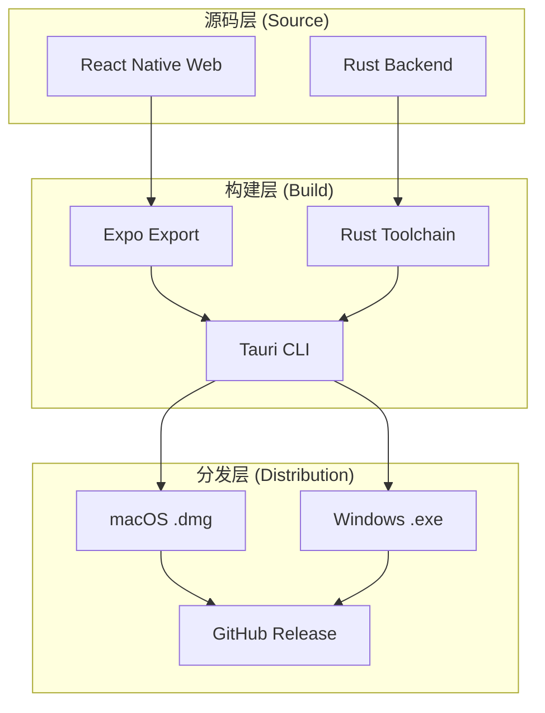
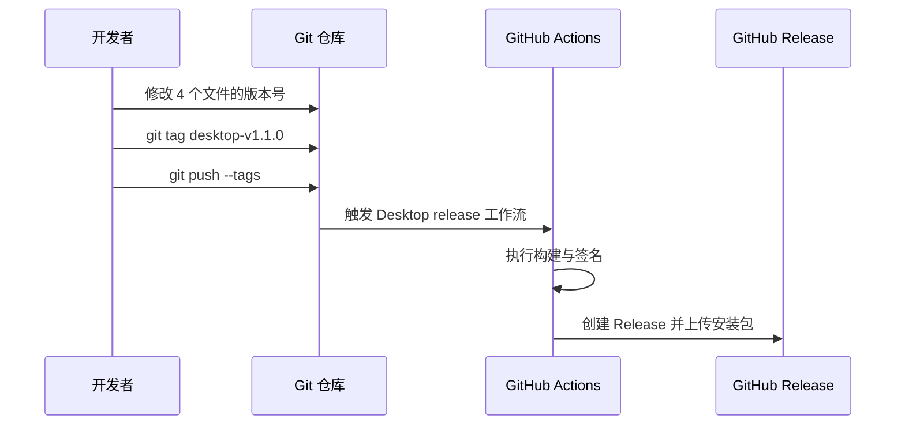
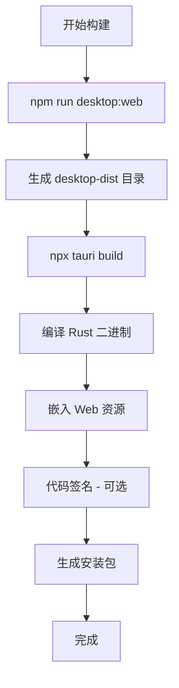

# 打包、签名与分发指南

## 目录
1. [模块概览](#模块概览)
2. [简介](#简介)
3. [核心组件与架构](#核心组件与架构)
4. [版本发布流程](#版本发布流程)
5. [本地构建环境配置](#本地构建环境配置)
6. [打包与构建流程](#打包与构建流程)
7. [证书签名与分发指南](#证书签名与分发指南)
8. [GitHub Actions 自动化发布](#github-actions-自动化发布)
9. [常见问题排查](#常见问题排查)
10. [文件参考](#文件参考)

## 模块概览

本指南涵盖了 LightFlux 桌面端应用的完整生命周期管理，从本地开发环境的搭建、版本号的同步更新，到最终通过 GitHub Actions 实现的自动化构建与分发。

### 范围与规模
- **核心文件数量**：约 6 个关键配置文件。
- **涉及子目录**：
  - `lightflux/src-tauri/`：Tauri 后端配置与 Rust 代码。
  - `.github/workflows/`：CI/CD 自动化脚本。
  - `docs/`：相关文档说明。
- **覆盖重点**：版本一致性管理、Rust 工具链配置、多平台签名策略以及自动化发布流水线。

通过本指南，开发者可以掌握如何将基于 React Native (Web) 的前端代码打包成高性能的桌面应用程序，并确保其在 macOS 和 Windows 平台上能够被安全地安装和运行。

---

## 简介

LightFlux 桌面端基于 **Tauri 2** 框架构建，这是一种现代化的跨平台桌面应用开发方案。与传统的 Electron 不同，Tauri 利用操作系统的原生渲染引擎（macOS 上的 WebKit，Windows 上的 WebView2），显著降低了应用的内存占用和安装包体积。

### 核心目标
本模块的实操指南旨在解决以下核心问题：
- **跨平台一致性**：如何确保 Web 端功能在桌面端完美复现。
- **版本同步**：在多个配置文件中维持版本号的一致性，避免发布冲突。
- **安全性与信任**：通过证书签名解决操作系统对“未知来源软件”的拦截问题。
- **自动化效率**：利用 GitHub Actions 实现一键触发的多平台并行构建。

### 技术栈
- **前端**：React Native (Web) + Expo。
- **后端/容器**：Rust (Tauri 2)。
- **构建工具**：`npm` (前端), `cargo` (后端), `tauri-cli` (集成)。

---

## 核心组件与架构

LightFlux 的桌面端架构采用了典型的“前端驱动，后端增强”模式。前端负责 UI 渲染和业务逻辑，而 Tauri 提供的 Rust 后端则负责文件系统访问、通知推送以及与操作系统的深度集成。

### 架构概览

下面的图示展示了从源代码到最终分发包的转换过程。



该流程始于前端代码的 Web 导出（`expo export`），生成的静态资源被放置在 `desktop-dist` 目录中。随后，Tauri CLI 调用 Rust 工具链，将这些静态资源嵌入到原生的二进制可执行文件中，并最终生成针对不同平台的安装包。

### 核心配置文件说明

1.  **`package.json`**：管理前端依赖和打包脚本。
2.  **`tauri.conf.json`**：Tauri 的主配置文件，定义了应用标识符、窗口属性和打包行为。
3.  **`Cargo.toml`**：Rust 项目的清单文件，管理后端依赖和版本。
4.  **`app.json`**：Expo 项目配置，虽然主要用于移动端，但在 LightFlux 中也用于同步版本号。

**核心组件源码参考**:
- [package.json](lightflux/package.json)
- [tauri.conf.json](lightflux/src-tauri/tauri.conf.json)

---

## 版本发布流程

在发布新版本之前，必须确保所有相关的配置文件版本号保持一致。这是一个手动但至关重要的步骤，因为不一致的版本号会导致更新检查失败或发布信息混乱。

### 版本更新 Checklist

当准备发布新版本（例如 `v1.1.0`）时，请按顺序执行以下操作：

1.  **更新前端版本**：修改 `lightflux/package.json` 中的 `"version": "1.1.0"`。
2.  **更新 Expo 配置**：修改 `lightflux/app.json` 中的 `"version": "1.1.0"`。
3.  **更新 Rust 后端版本**：修改 `lightflux/src-tauri/Cargo.toml` 中的 `version = "1.1.0"`。
4.  **更新 Tauri 配置**：修改 `lightflux/src-tauri/tauri.conf.json` 中的 `"version": "1.1.0"`。
5.  **提交变更**：使用 Git 提交上述修改。
6.  **推送标签**：推送一个以 `desktop-v` 开头的标签，触发自动化流水线。

### 自动化触发机制



通过推送标签，GitHub Actions 会识别到 `desktop-v*` 模式，并启动预定义的构建任务。这种方式确保了发布版本的可追溯性。

---

## 本地构建环境配置

在本地进行桌面端打包或调试之前，需要正确配置 Rust 开发环境。LightFlux 使用了自定义的路径来存储 Rust 工具链，以避免污染系统全局环境。

### Rust 工具链安装

开发者需要运行以下脚本来初始化环境（以 macOS 为例）：

```bash
# 创建自定义环境目录
mkdir -p "$HOME/Desktop/Dev_env/rust"

# 下载并运行 rustup 初始化程序
curl --proto '=https' --tlsv1.2 -sSf https://sh.rustup.rs -o /tmp/lightflux-rustup-init.sh

# 安装最小化 Profile 且不修改全局 PATH
RUSTUP_HOME="$HOME/Desktop/Dev_env/rust/rustup" \
  CARGO_HOME="$HOME/Desktop/Dev_env/rust/cargo" \
  sh /tmp/lightflux-rustup-init.sh -y --no-modify-path --profile minimal
```

> 💡 **提示**：安装完成后，建议将 `$HOME/Desktop/Dev_env/rust/cargo/bin` 添加到你的 Shell 配置文件（如 `.zshrc`）中，以便直接使用 `cargo` 和 `rustc` 命令。

### 依赖安装与验证

在环境准备就绪后，执行以下命令验证环境：

```bash
cd lightflux
npm install
# 检查 Rust 后端代码是否正确
cargo check --manifest-path src-tauri/Cargo.toml
```

**环境配置源码参考**:
- [desktop-release.md](docs/desktop-release.md)

---

## 打包与构建流程

打包过程分为两个阶段：前端 Web 资源的导出和 Tauri 的原生封装。

### 构建命令详解

本地打包通常使用以下命令：

```bash
cd lightflux
npx tauri build
```

该命令背后的逻辑如下：
1.  **`beforeBuildCommand`**：触发 `npm run desktop:web`，这会运行 `expo export --platform web`，将 React Native 代码编译为标准的 HTML/JS/CSS 资源。
2.  **资源定位**：Tauri 读取 `tauri.conf.json` 中的 `frontendDist` 字段，找到生成的静态资源。
3.  **Rust 编译**：调用 `cargo build` 编译 Rust 后端。
4.  **捆绑 (Bundling)**：将前端资源嵌入二进制文件，并根据平台生成 `.dmg` (macOS) 或 `.exe` (Windows) 安装程序。

### 构建流程示意图



在执行 `tauri build` 时，Tauri 会自动处理这些步骤。如果是在本地开发模式下，可以使用 `npx tauri dev`，它会启动一个热更新的 Web 服务器，并实时反映代码更改。

---

## 证书签名与分发指南

为了让用户在下载和安装 LightFlux 时不被操作系统拦截，必须对应用进行数字签名。

### macOS 公证 (Notarization)

macOS 强制要求分发的应用必须经过 Apple 的公证。
- **本地构建**：默认使用 Ad-hoc 签名（`signingIdentity: "-"`），这会导致其他用户无法直接运行。
- **发布要求**：需要 Apple Developer 账号，并在 `tauri.conf.json` 或环境变量中配置 `APPLE_CERTIFICATE` 和 `APPLE_API_KEY`。

### Windows Authenticode 签名

Windows 应用如果未签名，会被 SmartScreen 标记为“不安全”。
- **现状**：目前 LightFlux 的 Windows 安装包是未签名的。
- **建议**：企业分发建议购买 EV 证书或标准的 Authenticode 证书。对于个人开发者，可以引导用户点击“更多信息”并选择“仍要运行”。

### 签名配置参考

在 `tauri.conf.json` 中，签名相关的配置位于 `bundle` 节点下：

```json
"bundle": {
  "active": true,
  "targets": "all",
  "macOS": {
    "signingIdentity": "-" 
  }
}
```

> ⚠️ **警告**：在生产环境中，切勿将私钥或敏感证书文件提交到 Git 仓库。应使用 GitHub Secrets 来管理这些信息。

---

## GitHub Actions 自动化发布

LightFlux 使用 GitHub Actions 实现了全自动的跨平台构建流水线。该流水线在接收到版本标签后，会并行启动 macOS (Intel/Silicon) 和 Windows 的构建任务。

### 工作流分析

`.github/workflows/desktop-release.yml` 定义了两个主要阶段：
1.  **Verify**：在 Ubuntu 上验证前端代码是否能成功导出。
2.  **Release**：在 macOS 和 Windows 的虚拟机上执行实际的打包。

```yaml
# 核心构建步骤示例
- name: Build and publish desktop bundle
  uses: tauri-apps/tauri-action@v1
  env:
    GITHUB_TOKEN: ${{ secrets.GITHUB_TOKEN }}
  with:
    projectPath: lightflux
    tagName: desktop-v__VERSION__
    releaseName: LightFlux Desktop v__VERSION__
    args: ${{ matrix.args }}
```

### 矩阵构建策略

工作流利用 GitHub Actions 的 `matrix` 特性，同时处理不同架构：
- **macOS Apple Silicon**：目标 `aarch64-apple-darwin`。
- **macOS Intel**：目标 `x86_64-apple-darwin`。
- **Windows x64**：生成 NSIS 安装程序。

**自动化脚本源码参考**:
- [.github/workflows/desktop-release.yml](.github/workflows/desktop-release.yml)

---

## 常见问题排查

在打包过程中，可能会遇到以下常见问题及其解决方法：

### 1. 路径找不到错误
**现象**：`tauri build` 提示找不到 `frontendDist` 目录。
**原因**：通常是因为 `npm run desktop:web` 执行失败，或者 `tauri.conf.json` 中的相对路径配置错误。
**解决**：检查 `lightflux/desktop-dist` 是否存在，并确保 `tauri.conf.json` 中的路径为 `../desktop-dist`。

### 2. Rust 编译超时或失败
**现象**：GitHub Actions 在 `Build and publish` 步骤超时。
**原因**：Rust 编译非常耗费资源。
**解决**：工作流中已配置 `swatinem/rust-cache`，确保缓存生效以加速后续构建。如果是本地编译，请确保网络环境可以访问 `crates.io`。

### 3. macOS 权限问题
**现象**：安装后提示“应用已损坏，无法打开”。
**原因**：这是因为应用未经过 Apple 公证。
**解决**：用户可以通过执行 `xattr -d com.apple.quarantine /Applications/LightFlux.app` 来手动解除限制，或者开发者完成公证流程。

---

## 文件参考

以下是本指南涉及的关键文件列表，建议在操作前仔细查阅：

- [docs/desktop-release.md](docs/desktop-release.md)：桌面端发布说明文档。
- [lightflux/package.json](lightflux/package.json)：前端依赖与打包脚本。
- [lightflux/app.json](lightflux/app.json)：项目元数据配置。
- [lightflux/src-tauri/tauri.conf.json](lightflux/src-tauri/tauri.conf.json)：Tauri 打包核心配置。
- [lightflux/src-tauri/Cargo.toml](lightflux/src-tauri/Cargo.toml)：Rust 后端依赖配置。
- [.github/workflows/desktop-release.yml](.github/workflows/desktop-release.yml)：CI/CD 发布流水线定义。
