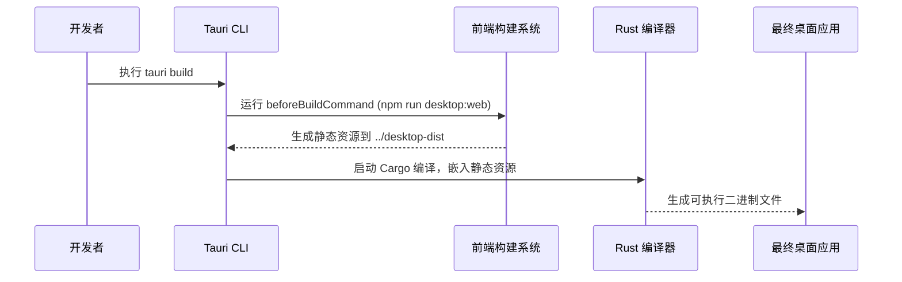
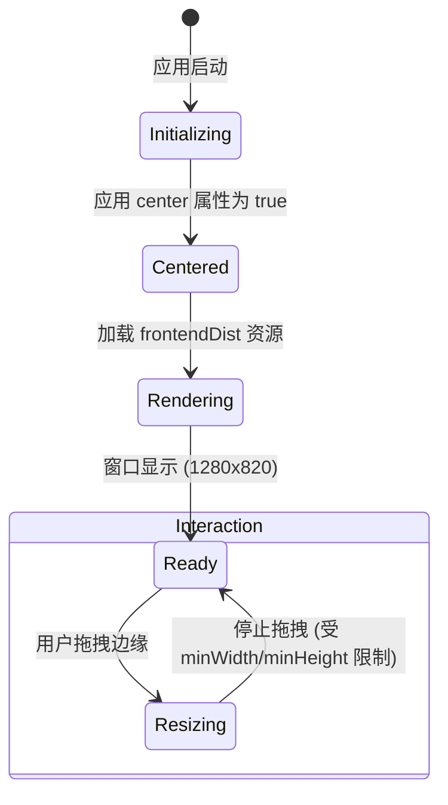
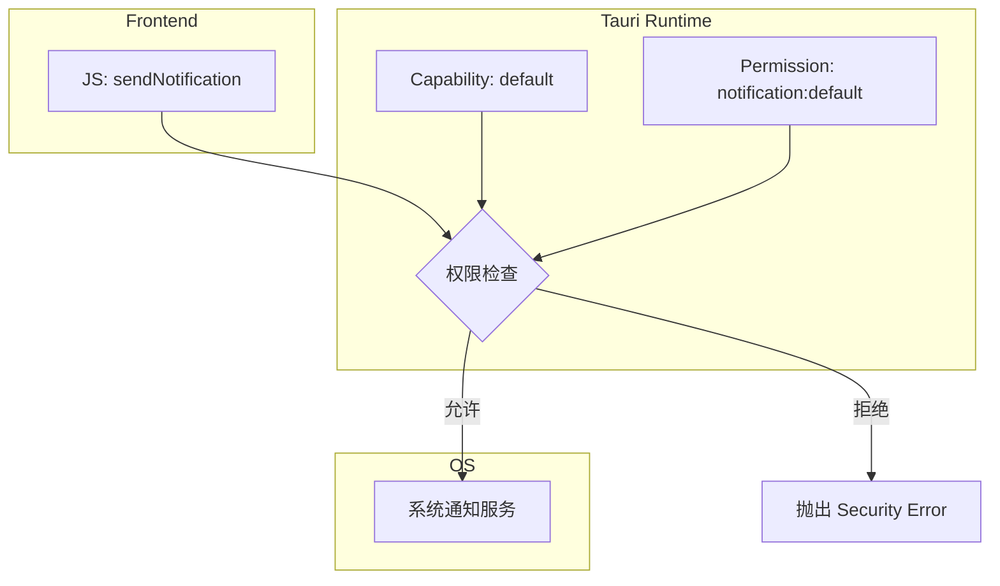
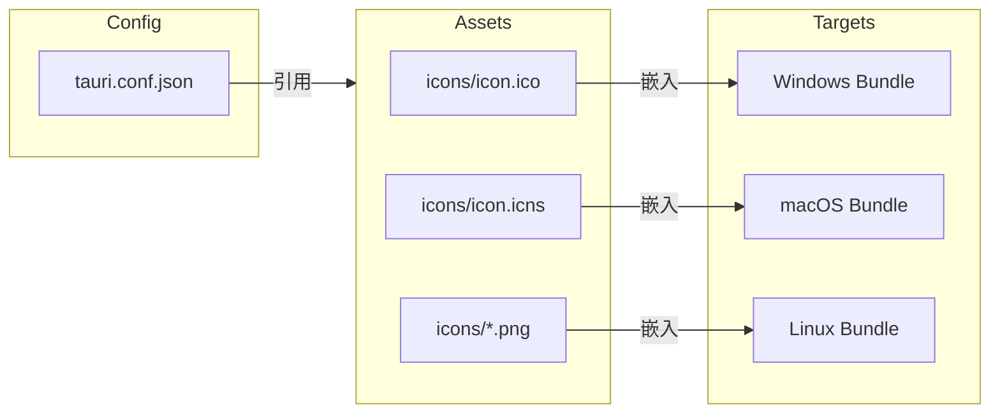

# 桌面端构建与权限配置

## 目录
1. [模块概览](#模块概览)
2. [构建指令与流程配置](#构建指令与流程配置)
3. [主窗口属性解析](#主窗口属性解析)
4. [Tauri 2.0 权限管理系统 (Capabilities)](#tauri-20-权限管理系统-capabilities)
5. [静态资源与应用打包配置](#静态资源与应用打包配置)
6. [核心组件与文件参考](#核心组件与文件参考)

## 模块概览

LightFlux 的桌面端基于 Tauri 2.0 框架构建，其核心配置集中在 `lightflux/src-tauri/` 目录下。作为一款现代化的跨平台桌面应用，LightFlux 充分利用了 Tauri 的高性能与安全性特点，通过精细的配置管理实现了前端资源与原生系统环境的深度集成。

在本项目中，桌面端的构建与权限配置主要涉及以下几个关键维度：
- **构建生命周期管理**：定义了前端代码如何从开发环境过渡到桌面端运行环境，包括热更新调试与最终的静态资源打包。
- **窗口表现定义**：精确控制应用在不同操作系统上的初始外观、尺寸限制及交互行为。
- **细粒度权限控制**：这是 Tauri 2.0 的核心改进之一。通过能力（Capabilities）系统，应用仅被授予运行所需的最小权限集，显著提升了安全性。
- **资源与元数据**：管理应用图标、品牌信息以及特定平台的打包参数。

### 目录结构与规模
经过对 `lightflux/src-tauri/` 目录的扫描，该模块包含约 15 个核心文件，分布在以下子目录中：
- `capabilities/`：存储权限定义文件，是 Tauri 2.0 安全模型的核心。
- `icons/`：存放各种尺寸的应用图标，支持 macOS、Windows 和 Linux。
- `src/`：包含 Rust 编写的后端逻辑入口。
- `gen/`：自动生成的配置文件架构（Schemas），用于 IDE 校验。

本章节将重点解析 `tauri.conf.json` 和 `capabilities/default.json` 两个关键配置文件，深入探讨它们如何驱动 LightFlux 的桌面端表现。

**模块概览来源**:
- [tauri.conf.json](lightflux/src-tauri/tauri.conf.json)
- [capabilities/default.json](lightflux/src-tauri/capabilities/default.json)

---

## 构建指令与流程配置

Tauri 的构建流程是一个将前端 Web 资源嵌入到原生 Rust 二进制文件的过程。在 `tauri.conf.json` 的 `build` 字段中，LightFlux 定义了清晰的指令集，以确保开发模式和生产模式下的资源同步。

### 构建流程解析

LightFlux 的构建配置体现了前后端分离的开发哲学。前端使用现代 Web 技术栈，而 Tauri 负责将其包装为桌面应用。

```json
"build": {
  "beforeDevCommand": "npm run web -- --port 1420",
  "devUrl": "http://localhost:1420",
  "beforeBuildCommand": "npm run desktop:web",
  "frontendDist": "../desktop-dist"
}
```

- **`beforeDevCommand`**: 当开发者运行 `tauri dev` 时，该指令会首先被触发。它启动前端开发服务器（通常是 Vite 或 Webpack），并监听 `1420` 端口。这使得开发者可以利用 Web 端的 HMR（热更新）特性进行桌面端 UI 开发。
- **`devUrl`**: 告诉 Tauri 窗口在开发模式下应该加载哪个 URL。这里指向了本地开发服务器的地址。
- **`beforeBuildCommand`**: 在执行 `tauri build` 打包应用前运行。它会将前端代码编译为静态资源。
- **`frontendDist`**: 指定编译后的静态资源存放路径。Tauri 会将该目录下的所有文件嵌入到最终的可执行文件中。

### 构建生命周期图示

下图展示了从执行命令到应用运行的完整数据流向。



在上述流程中，`beforeBuildCommand` 的执行至关重要。它确保了桌面端使用的永远是经过优化的最新生产环境代码。`frontendDist` 的路径指向项目根目录下的 `desktop-dist`，这说明 LightFlux 采用了专门的构建脚本来处理桌面端的 Web 资源，可能包含了一些针对桌面环境的特定优化或垫片。

**构建配置来源**:
- [tauri.conf.json:L6-L11](lightflux/src-tauri/tauri.conf.json#L6-L11)

---

## 主窗口属性解析

窗口是用户与 LightFlux 交互的第一界面。在 `tauri.conf.json` 的 `app.windows` 数组中，项目定义了主窗口的各项物理属性和行为特征。

### 窗口核心配置项

LightFlux 对主窗口进行了精细的尺寸约束，以保证在不同分辨率的屏幕上都能提供良好的视觉体验。

| 配置项 | 值 | 说明 |
| :--- | :--- | :--- |
| `title` | "LightFlux" | 窗口标题栏显示的文本 |
| `width` | 1280 | 初始窗口宽度（像素） |
| `height` | 820 | 初始窗口高度（像素） |
| `minWidth` | 900 | 用户可缩放的最小宽度 |
| `minHeight` | 620 | 用户可缩放的最小高度 |
| `center` | true | 应用启动时是否在屏幕中央显示 |

### 窗口状态模型

窗口的配置决定了其在操作系统中的生命周期表现和交互限制。



通过设置 `minWidth` 和 `minHeight`，LightFlux 确保了 UI 布局不会因为窗口过小而发生错乱，这对于包含日历、任务组和富文本笔记的复杂应用尤为重要。`center: true` 则提供了一个符合直觉的启动体验。

**窗口配置来源**:
- [tauri.conf.json:L13-L22](lightflux/src-tauri/tauri.conf.json#L13-L22)

---

## Tauri 2.0 权限管理系统 (Capabilities)

Tauri 2.0 引入了全新的权限管理机制，取代了 1.0 中的全局 `allowlist`。LightFlux 采用了这一新模型，通过 `capabilities` 目录下的配置文件来精确定义应用的能力范围。

### 能力定义文件分析

在 `lightflux/src-tauri/capabilities/default.json` 中，我们可以看到 LightFlux 为主窗口授予的权限集：

```json
{
  "$schema": "../gen/schemas/desktop-schema.json",
  "identifier": "default",
  "description": "Default capabilities for the LightFlux desktop window.",
  "windows": ["main"],
  "permissions": ["core:default", "notification:default"]
}
```

- **`identifier`**: 该能力的唯一标识符，此处为 `default`。
- **`windows`**: 指定这些权限适用于哪些窗口。由于 `tauri.conf.json` 中未显式命名窗口，Tauri 默认将第一个窗口命名为 `main`。
- **`permissions`**: 核心权限列表。
    - `core:default`：允许基础的 Tauri 核心功能，如事件监听和基本的窗口操作。
    - `notification:default`：允许应用发送系统通知。这与 `main.rs` 中注册的 `tauri-plugin-notification` 插件相呼应。

### 权限验证流程

当 Web 前端尝试调用一个受保护的 API（如发送通知）时，Tauri 会在 Rust 层进行拦截并检查当前窗口是否具备相应的 Capability。



这种基于能力的模型允许开发者为不同的窗口配置不同的权限。例如，如果未来 LightFlux 增加了一个用于显示广告或第三方内容的窗口，可以为其创建一个仅具备受限权限的 `guest.json` 配置文件，从而实现沙箱隔离。

**权限配置来源**:
- [capabilities/default.json](lightflux/src-tauri/capabilities/default.json)
- [src/main.rs:L5](lightflux/src-tauri/src/main.rs#L5)

---

## 静态资源与应用打包配置

为了使 LightFlux 在各个平台上看起来像一个原生的专业应用，`tauri.conf.json` 中的 `bundle` 字段配置了丰富的元数据和平台特定选项。

### 资源引用策略

应用图标被定义为一个路径数组，涵盖了从 Windows `.ico` 到 macOS `.icns` 以及 Linux 所需的不同分辨率 `.png` 文件。

```json
"icon": [
  "icons/32x32.png",
  "icons/128x128.png",
  "icons/128x128@2x.png",
  "icons/icon.icns",
  "icons/icon.ico"
]
```

这些图标存放在 `lightflux/src-tauri/icons/` 目录下。在打包过程中，Tauri 会根据目标操作系统自动选择最合适的图标格式。

### 打包元数据

LightFlux 在打包配置中明确了应用的定位：
- **`category`**: `Productivity`（生产力工具），这会影响应用在 macOS App Store 或 Linux 软件中心的分组。
- **`identifier`**: `com.little1d.lightflux`，这是应用的唯一 ID，用于系统级的应用识别、通知推送和设置存储。
- **`macOS.signingIdentity`**: 设置为 `-`，表示在开发环境下使用自签名，这对于在 macOS 上进行本地测试是必要的。

### 资源映射关系图



通过这种配置，开发者只需维护一套核心资源，Tauri 即可自动处理复杂的跨平台适配工作。

**打包配置来源**:
- [tauri.conf.json:L27-L43](lightflux/src-tauri/tauri.conf.json#L27-L43)

---

## 核心组件与文件参考

本章节涉及的桌面端构建与权限配置主要由以下核心文件驱动：

| 文件路径 | 职能描述 | 关键配置项 |
| :--- | :--- | :--- |
| `lightflux/src-tauri/tauri.conf.json` | 桌面端全局配置文件 | `build`, `windows`, `bundle` |
| `lightflux/src-tauri/capabilities/default.json` | 默认权限定义 | `permissions`, `windows` |
| `lightflux/src-tauri/src/main.rs` | Rust 入口文件 | 插件初始化 (`tauri_plugin_notification`) |
| `lightflux/src-tauri/Cargo.toml` | Rust 依赖管理 | `tauri`, `tauri-plugin-notification` |
| `lightflux/src-tauri/icons/` | 应用图标集 | `.ico`, `.icns`, `.png` |

**文件参考列表**:
- [lightflux/src-tauri/tauri.conf.json](lightflux/src-tauri/tauri.conf.json)
- [lightflux/src-tauri/capabilities/default.json](lightflux/src-tauri/capabilities/default.json)
- [lightflux/src-tauri/src/main.rs](lightflux/src-tauri/src/main.rs)
- [lightflux/src-tauri/Cargo.toml](lightflux/src-tauri/Cargo.toml)
