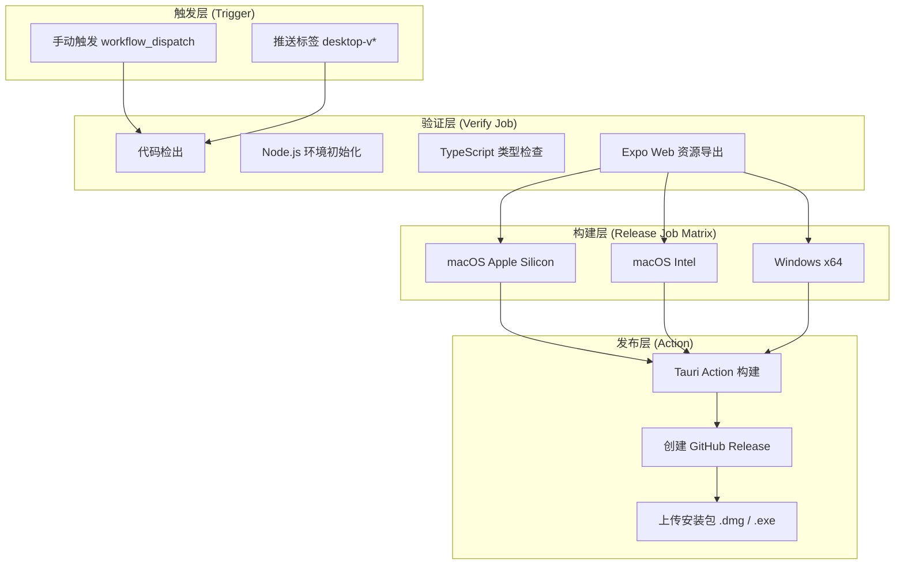
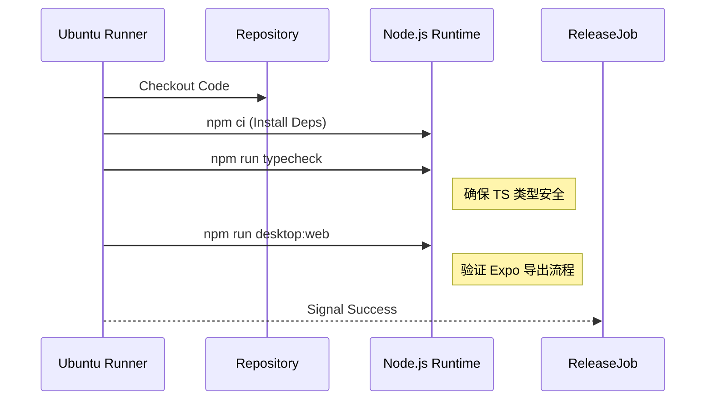
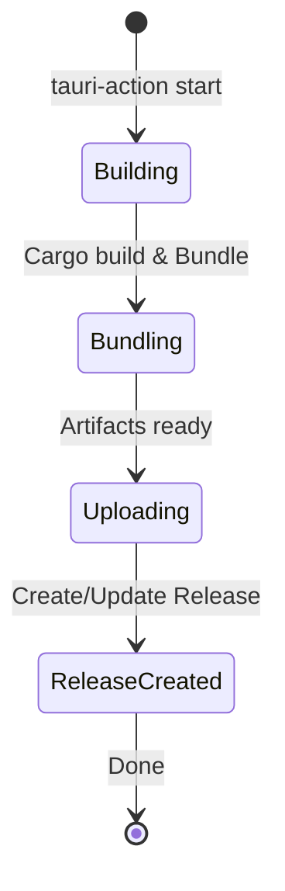

# 自动化发布流水线

## 目录
1. [模块概览](#模块概览)
2. [引言](#引言)
3. [自动化发布流水线架构](#自动化发布流水线架构)
4. [触发机制详解](#触发机制详解)
5. [预构建验证阶段 (Verify)](#预构建验证阶段-verify)
6. [跨平台矩阵构建策略 (Release Matrix)](#跨平台矩阵构建策略-release-matrix)
7. [Tauri 发布动作与版本管理](#tauri-发布动作与版本管理)
8. [构建优化与缓存机制](#构建优化与缓存机制)
9. [环境变量与安全权限](#环境变量与安全权限)
10. [核心组件与文件引用](#核心组件与文件引用)

## 模块概览

本模块专注于 LightFlux 桌面端应用的自动化发布流程。通过 GitHub Actions 实现从代码提交到多平台（macOS 和 Windows）安装包发布的完整闭环。

在本次作用域评估中，我们识别到以下关键点：
- **核心文件数量**：1 个主要的 Workflow 定义文件。
- **涉及子目录**：`.github/workflows/`。
- **关联配置**：`lightflux/src-tauri/tauri.conf.json`（定义了构建指令和输出目录）。
- **覆盖范围**：涵盖了从前端代码验证、跨平台 Rust 编译到 GitHub Release 自动创建的全过程。

本页面将深入解析 `.github/workflows/desktop-release.yml` 的实现细节，帮助开发者理解 CI/CD 脚本如何协调 Node.js 和 Rust 环境，以及如何利用矩阵策略高效生成不同架构的安装程序。

## 引言

自动化发布流水线（Automated Release Pipeline）是 LightFlux 项目中至关重要的基础设施。对于一个基于 Tauri 框架的桌面应用来说，发布过程涉及到复杂的跨平台编译环境配置。手动构建不仅耗时，而且极易因环境差异导致安装包在用户端运行异常。

该流水线的主要目标是：
1. **确保代码质量**：在正式构建前，通过自动化测试和类型检查过滤潜在缺陷。
2. **跨平台支持**：同时生成适用于 macOS（Intel 和 Apple Silicon 芯片）以及 Windows x64 的安装包。
3. **版本一致性**：自动从 `package.json` 或 Git Tag 中提取版本号，确保 GitHub Release 的元数据与应用内部版本一致。
4. **降低发布门槛**：开发者只需推送一个特定格式的 Tag，即可触发全自动的构建与发布任务。

通过 GitHub Actions 的强大能力，LightFlux 实现了“代码即基础设施”的理念，将复杂的构建逻辑封装在 YAML 配置文件中，保证了发布过程的可重复性和透明度。

## 自动化发布流水线架构

LightFlux 的发布流水线采用了典型的“验证-构建-发布”三段式架构。这种设计将轻量级的检查任务与重量级的编译任务分离，从而节省 CI 资源并缩短反馈周期。

下面的流程图展示了从开发者触发流水线到最终生成 Release 产物的完整生命周期：



**架构解析**：
1. **触发层**：支持手动调试和基于 Git Tag 的正式发布。
2. **验证层**：在 Ubuntu 环境下运行，执行开销较小。它不仅检查代码规范，还预演了前端资源的导出过程。
3. **构建层**：利用 GitHub Actions 的 `strategy.matrix` 功能，并行启动三个独立的 Runner（两个 macOS，一个 Windows）。每个 Runner 负责特定的目标架构。
4. **发布层**：集成 `tauri-apps/tauri-action`，它封装了复杂的 Tauri 构建逻辑，并自动处理 GitHub Release 的创建和附件上传。

**图表来源**：
- [.github/workflows/desktop-release.yml:L3-L101](.github/workflows/desktop-release.yml#L3-L101)

## 触发机制详解

流水线的入口由 `on` 配置项定义，支持两种触发模式，兼顾了灵活性与严谨性。

### 1. 手动触发 (workflow_dispatch)
通过 `workflow_dispatch`，维护者可以在 GitHub Actions 界面手动启动流水线。这在以下场景中非常有用：
- 调试流水线配置，而无需频繁提交代码。
- 在未打 Tag 的情况下，为测试人员生成预览版安装包。

### 2. 标签触发 (push tags)
这是生产环境的标准触发方式。配置文件监听匹配 `desktop-v*` 模式的 Git Tag。
- **触发逻辑**：当开发者运行 `git tag desktop-v1.0.0 && git push --tags` 时，GitHub 将自动启动此流水线。
- **版本隔离**：使用特定的前缀（如 `desktop-`）可以防止与其他平台（如移动端或 Web 端）的发布流程冲突。

### 并发控制 (Concurrency)
为了防止并发构建冲突，流水线配置了 `concurrency` 策略：
```yaml
concurrency:
  group: desktop-release-${{ github.ref }}
  cancel-in-progress: false
```
这里将 `cancel-in-progress` 设置为 `false` 是出于安全考虑：一旦发布任务开始（可能涉及 Release 创建和文件上传），中途取消可能会导致 GitHub Release 处于中间状态（如只有部分架构的附件）。

**触发机制来源**：
- [.github/workflows/desktop-release.yml:L3-L15](.github/workflows/desktop-release.yml#L3-L15)

## 预构建验证阶段 (Verify)

在进入耗时的多平台构建之前，`verify` 任务充当了“守门员”的角色。该任务在标准的 `ubuntu-latest` 环境下运行，主要执行两项关键操作：

### 1. TypeScript 类型检查
通过执行 `npm run typecheck`（对应 `tsc --noEmit`），流水线确保代码中没有类型错误。由于 LightFlux 是一个复杂的 React Native / Web 混合项目，严格的类型检查可以避免在 Rust 编译阶段才发现前端逻辑错误，从而节省昂贵的 macOS/Windows Runner 时间。

### 2. Web 资源导出验证
执行 `npm run desktop:web`（对应 `expo export --platform web --output-dir desktop-dist`）。
- **目的**：验证 Expo 是否能成功将 React Native 代码转译为 Tauri 所需的静态 Web 资源。
- **一致性**：虽然 `tauri-action` 之后也会调用此命令，但在 `verify` 阶段提前运行可以确保 `desktop-dist` 目录的生成逻辑是正确的。



**验证阶段来源**：
- [.github/workflows/desktop-release.yml:L17-L42](.github/workflows/desktop-release.yml#L17-L42)
- [lightflux/package.json:L9,L14](lightflux/package.json#L9,L14)

## 跨平台矩阵构建策略 (Release Matrix)

这是流水线中最核心的部分。Tauri 应用的构建必须在目标操作系统上进行（例如，构建 Windows 应用通常需要 Windows 环境来调用 MSVC 编译器）。

### 矩阵配置解析
流水线定义了一个包含三个目标的矩阵：

| 名称 | 平台 (Runner) | Rust 目标 (Targets) | 构建参数 (Args) |
| :--- | :--- | :--- | :--- |
| **macOS Apple Silicon** | `macos-latest` | `aarch64-apple-darwin` | `--target aarch64-apple-darwin --bundles dmg` |
| **macOS Intel** | `macos-latest` | `x86_64-apple-darwin` | `--target x86_64-apple-darwin --bundles dmg` |
| **Windows x64** | `windows-latest` | (默认) | `--bundles nsis` |

### 关键设计决策
1. **macOS 双架构支持**：虽然 `macos-latest` 目前通常是 Intel 架构，但通过安装 `aarch64-apple-darwin` 目标，我们可以在其上交叉编译出适用于 M1/M2 芯片的安装包。
2. **并行化执行**：这三个 Job 是并行启动的。GitHub 会分配三个独立的虚拟机，极大提高了总体的构建速度。
3. **容错处理**：设置 `fail-fast: false`。如果 Windows 构建失败，不应该影响 macOS 构建的继续进行和发布。

**矩阵策略来源**：
- [.github/workflows/desktop-release.yml:L43-L63](.github/workflows/desktop-release.yml#L43-L63)

## Tauri 发布动作与版本管理

流水线使用了官方推荐的 `tauri-apps/tauri-action`。这个 Action 自动化了许多繁琐的步骤。

### 自动化构建流程
在每个矩阵节点中，Action 执行以下逻辑：
1. **环境准备**：自动检测 `lightflux/src-tauri` 目录。
2. **执行构建**：运行 `tauri build` 命令。此时会触发 `tauri.conf.json` 中定义的 `beforeBuildCommand`（即 `npm run desktop:web`）。
3. **产物收集**：自动寻找生成的 `.dmg` 或 `.exe` 文件。

### 版本号提取逻辑
`tauri-action` 具有智能的版本识别能力：
- 配置项 `tagName: desktop-v__VERSION__` 中的 `__VERSION__` 是一个占位符。
- Action 会读取 `lightflux/src-tauri/tauri.conf.json` 中的 `version` 字段，或者根据触发的 Git Tag 自动填充该值。
- 这确保了 GitHub Release 的名称（如 "LightFlux Desktop v1.0.0"）与安装包内的版本信息严格同步。



**发布动作来源**：
- [.github/workflows/desktop-release.yml:L88-L101](.github/workflows/desktop-release.yml#L88-L101)
- [lightflux/src-tauri/tauri.conf.json:L4,L9-L10](lightflux/src-tauri/tauri.conf.json#L4,L9-L10)

## 构建优化与缓存机制

为了缩短 CI 运行时间（尤其是 Rust 编译非常缓慢），流水线集成了多层缓存机制。

### 1. Node.js 依赖缓存
使用 `actions/setup-node` 的内置缓存功能：
```yaml
- name: Set up Node.js
  uses: actions/setup-node@v4
  with:
    node-version: 22
    cache: npm
    cache-dependency-path: lightflux/package-lock.json
```
这避免了每次构建都从 npm 仓库重新下载数以百计的依赖包。

### 2. Rust 编译产物缓存
使用 `swatinem/rust-cache` 缓存 `target` 目录：
```yaml
- name: Cache Rust build artifacts
  uses: swatinem/rust-cache@v2
  with:
    workspaces: lightflux/src-tauri -> target
```
对于 Tauri 项目，Rust 编译通常占据了 80% 以上的构建时间。通过缓存增量编译产物，后续构建的速度可以提升 2-3 倍。

**缓存机制来源**：
- [.github/workflows/desktop-release.yml:L27-L32,L79-L82](.github/workflows/desktop-release.yml#L27-L32,L79-L82)

## 环境变量与安全权限

发布流水线涉及敏感的写操作，因此需要严格的权限控制。

### 1. GitHub Token 权限
流水线显式声明了权限：
```yaml
permissions:
  contents: write
```
这是创建 GitHub Release 并上传附件所必需的。默认的 `GITHUB_TOKEN` 被注入到 `tauri-action` 中：
```yaml
env:
  GITHUB_TOKEN: ${{ secrets.GITHUB_TOKEN }}
```

### 2. 工作目录隔离
由于项目根目录下可能存在多个子项目，流水线通过 `working-directory: lightflux` 或 `projectPath: lightflux` 确保所有指令都在正确的路径下执行，避免了路径引用错误。

### 3. macOS 代码签名
目前 `tauri.conf.json` 中配置为 `"signingIdentity": "-"`。这意味着流水线生成的是未签名的（或 ad-hoc 签名的）macOS 应用。在生产环境中，如果需要分发给广大用户，后续可能需要集成 `APPLE_CERTIFICATE` 等 Secrets 来进行正式签名和公证（Notarization）。

**权限配置来源**：
- [.github/workflows/desktop-release.yml:L9-L10,L90-L91](.github/workflows/desktop-release.yml#L9-L10,L90-L91)
- [lightflux/src-tauri/tauri.conf.json:L40-L42](lightflux/src-tauri/tauri.conf.json#L40-L42)

## 核心组件与文件引用

以下是构建流水线涉及的核心文件及其职责说明：

| 文件路径 | 职责描述 |
| :--- | :--- |
| `.github/workflows/desktop-release.yml` | **核心流水线定义**。包含触发逻辑、矩阵策略和发布动作。 |
| `lightflux/package.json` | 定义了前端构建指令（`desktop:web`）和类型检查指令（`typecheck`）。 |
| `lightflux/src-tauri/tauri.conf.json` | **Tauri 核心配置**。定义了应用元数据、构建钩子和安装包生成选项。 |
| `lightflux/src-tauri/Cargo.toml` | Rust 项目定义，包含 Tauri 插件依赖。 |

**文件引用来源**：
- [.github/workflows/desktop-release.yml](.github/workflows/desktop-release.yml)
- [lightflux/package.json](lightflux/package.json)
- [lightflux/src-tauri/tauri.conf.json](lightflux/src-tauri/tauri.conf.json)
- [lightflux/src-tauri/Cargo.toml](lightflux/src-tauri/Cargo.toml)
