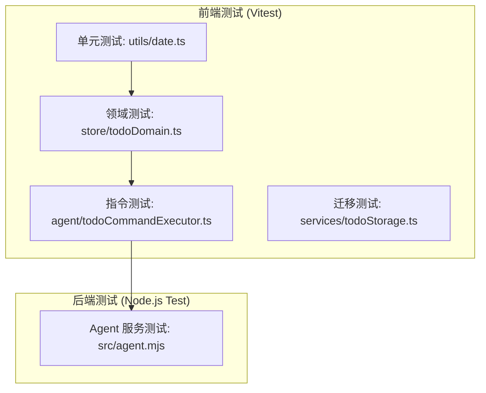
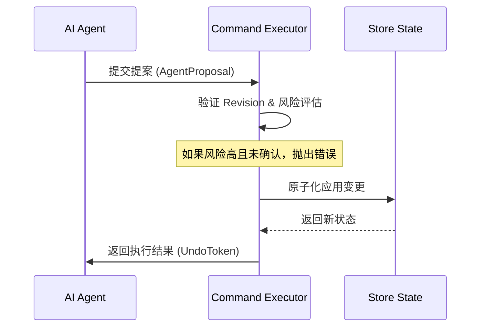
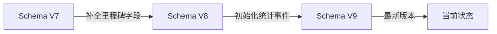
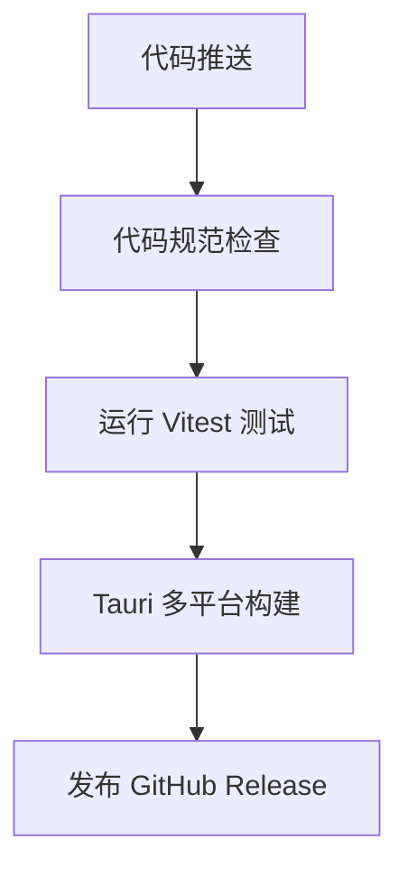

# 测试与质量保证

## 目录
1. [模块概览](#模块概览)
2. [测试策略与框架](#测试策略与框架)
3. [核心领域逻辑测试](#核心领域逻辑测试)
4. [AI 指令执行与 Mock 测试](#ai-指令执行与-mock-测试)
5. [存储迁移与数据兼容性](#存储迁移与数据兼容性)
6. [后端服务测试与运维](#后端服务测试与运维)
7. [持续集成与自动化发布](#持续集成与自动化发布)
8. [关键源文件](#关键源文件)

## 模块概览

LightFlux 的测试与质量保证体系旨在确保核心领域逻辑的严谨性、AI 指令执行的安全性以及跨版本数据迁移的可靠性。由于项目涉及复杂的日期计算（如农历）、多层级的任务结构以及异步的 AI 交互，测试覆盖不仅是代码质量的保障，更是业务逻辑正确性的核心支撑。

在本次调研中，我们识别出以下测试分布：
- **前端/移动端测试 (`lightflux/tests`)**: 共 9 个测试文件，使用 `vitest` 框架。这些测试不仅覆盖了 `store` 层的状态管理，还深入到了 `agent` 层的指令解析器和 `services` 层的持久化逻辑。
- **后端服务测试 (`server/tests`)**: 共 1 个测试文件，使用 Node.js 原生测试运行器。重点在于验证 AI Agent 服务在面对不同 LLM 响应时的鲁棒性。

本章节将详细探讨 LightFlux 如何通过多层级的测试手段，在保证开发效率的同时，维持极高的系统稳定性。

## 测试策略与框架

LightFlux 采用了现代化的分层测试策略，根据代码运行环境和业务重要性选择不同的测试工具。

### 测试框架选型
- **Vitest**: 作为前端和移动端的主力测试框架，Vitest 的优势在于其与 Vite 共享的配置系统和极速的 HMR（热更新）能力。在 LightFlux 中，Vitest 负责处理所有的 TypeScript 逻辑测试，包括复杂的 React Hooks 模拟和 Expo 文件系统的 Mock。
- **Node.js Test Runner**: 后端服务（server）采用了 Node.js 20+ 内置的测试运行器。这种“零依赖”的策略显著降低了后端服务的启动时间和维护成本，非常适合作为轻量级代理服务的测试方案。

### 测试分层架构

下面的图表展示了 LightFlux 的测试分层结构，从底层的工具函数到顶层的集成测试。



该架构确保了每一个核心组件都有对应的测试覆盖。`utils` 层的单元测试保证了日期计算等基础工具的准确性；`store` 层的领域测试则关注任务状态转换和索引构建；`agent` 层的指令测试则模拟了 AI 提案的完整生命周期。

**Diagram sources**:
- [lightflux/package.json](lightflux/package.json)
- [server/package.json](server/package.json)

## 核心领域逻辑测试

领域逻辑测试主要集中在 `todoDomain.test.ts`、`milestoneDate.test.ts` 和 `taskAnalytics.test.ts` 中。这些测试关注于任务的层级关系、回收站操作、复杂的农历日期计算以及用户行为统计的准确性。

### 任务层级与回收站
在 `todoDomain.test.ts` 中，测试重点在于确保删除父任务时子任务的正确处理，以及防止循环引用的发生。

```typescript
// lightflux/tests/todoDomain.test.ts
describe('todo trash operations', () => {
  it('keeps a restored child when its trashed parent is deleted', () => {
    const source = [
      todo('parent', { trashedAt: 10 }),
      todo('child', { parentId: 'parent', trashedAt: 10 }),
    ];

    const restored = restoreTodoBranch(source, 'child', 20);
    expect(restored.find((item) => item.id === 'child')).toMatchObject({
      parentId: null,
      trashedAt: null,
    });

    const afterDelete = deleteTrashedTodoBranch(restored, 'parent', 30);
    expect(afterDelete.map((item) => item.id)).toEqual(['child']);
  });
});
```

上述测试案例展示了“孤儿任务”的处理逻辑：当一个子任务被单独从回收站恢复，而其父任务随后被彻底删除时，子任务应自动断开父级关联并保持活跃状态。这种边缘情况的测试对于防止数据丢失至关重要。

### 农历日期与提醒逻辑
由于 LightFlux 支持农历里程碑，`milestoneDate.test.ts` 和 `milestoneReminder.test.ts` 覆盖了闰月、大小月以及跨年计算。

**测试覆盖点包括**：
- **闰月处理**: 测试当农历存在闰月时，提醒是否能正确触发或按策略跳过。
- **日期转换**: 验证公历与农历互相转换的边界值（如正月初一、除夕）。
- **提醒偏移**: 确保“提前 7 天提醒”等逻辑在跨年或跨月时依然准确。

### 任务统计分析
`taskAnalytics.test.ts` 负责验证系统是否正确记录了用户的任务完成率、专注时长等指标。通过模拟一系列的任务创建、完成和取消事件，测试验证生成的统计报告是否符合预期，这为后续的“成就系统”提供了可靠的数据基础。

**Section sources**:
- [lightflux/tests/todoDomain.test.ts](lightflux/tests/todoDomain.test.ts)
- [lightflux/tests/milestoneDate.test.ts](lightflux/tests/milestoneDate.test.ts)
- [lightflux/tests/milestoneReminder.test.ts](lightflux/tests/milestoneReminder.test.ts)
- [lightflux/tests/taskAnalytics.test.ts](lightflux/tests/taskAnalytics.test.ts)

## AI 指令执行与 Mock 测试

针对 AI 指令的测试是 LightFlux 的核心竞争力之一。由于 LLM 的输出具有不可预测性，系统通过 `todoCommandExecutor` 对 AI 提案进行严格的沙箱验证和原子化执行。

### 指令执行流

AI 提案从生成到最终应用，需要经过风险评估、用户确认和原子提交三个阶段。



该流程保证了即使 AI 生成了错误的指令（如修改不存在的任务），系统也能在应用前拦截并报错，而不会导致本地数据状态损坏。

### 核心机制测试
在 `todoCommandExecutor.test.ts` 中，通过构造模拟的 `AgentProposal` 来测试以下机制：
- **Revision 校验**: 确保 AI 是基于最新的数据状态提出的建议。如果用户在 AI 思考期间手动修改了任务，系统将拒绝执行该提案（`stale-revision` 错误）。
- **原子性执行**: 验证多步操作（如“创建分组并移动任务”）是否能作为一个整体应用。如果中间某一步失败，整个状态应回滚。
- **撤销逻辑 (Undo)**: 测试 `UndoToken` 是否能准确将状态恢复到执行前，并验证在执行了新的手动操作后，旧的撤销令牌是否失效。
- **幂等性 (Idempotency)**: 通过 `idempotencyKey` 确保网络重试不会导致任务被重复创建。

```typescript
// lightflux/tests/todoCommandExecutor.test.ts
it('requires explicit confirmation for every mutation', () => {
  const source = createTodoCommandState([], [], null);
  expectCommandError(
    () => executeAgentProposal(source, proposal([...], source.revision), { confirmed: false }),
    'confirmation-required'
  );
});
```

**Section sources**:
- [lightflux/tests/todoCommandExecutor.test.ts](lightflux/tests/todoCommandExecutor.test.ts)
- [lightflux/agent/todoCommandExecutor.ts](lightflux/agent/todoCommandExecutor.ts)

## 存储迁移与数据兼容性

随着功能迭代，LightFlux 的数据 Schema 也会发生变化。`todoStorageMigration.test.ts` 负责确保旧版本用户的数据能平滑升级。

### 迁移管道

数据迁移遵循单向升级原则，每个版本都有对应的迁移函数。这种设计模式类似于数据库的 Migration，确保了数据演进的可追溯性。



在迁移测试中，我们预设一个 V7 版本的 JSON 字符串（包含旧的任务结构），运行 `parsePersistedAppState` 后，验证输出的对象是否包含 V9 版本新增的 `analyticsStartedAt` 和 `milestones` 数组。

### 关键测试点
- **默认值填充**: 确保新字段（如 `milestoneId`）在旧任务对象中被正确初始化为 `null`，避免运行时出现 `undefined` 错误。
- **数据清洗与规范化**: 在升级过程中，系统会扫描并过滤掉无效的、引用不存在任务的事件记录，从而保持数据库的整洁。
- **UI 配置同步**: 确保侧边栏导航顺序等用户偏好设置在升级后依然保留，并自动加入新功能的入口。

**Section sources**:
- [lightflux/tests/todoStorageMigration.test.ts](lightflux/tests/todoStorageMigration.test.ts)
- [lightflux/services/todoStorage.ts](lightflux/services/todoStorage.ts)

## 后端服务测试与运维

后端服务主要负责与 LLM 供应商（如 OpenAI, DeepSeek）通信。由于不涉及复杂的数据库操作，其测试重点在于 API 协议的实现、异常处理和性能限制。

### Agent 服务集成测试
在 `server/tests/agent.test.mjs` 中，通过拦截全局 `fetch` 请求并注入模拟响应，验证以下场景：
- **模型幻觉拦截**: 如果 LLM 返回了不存在的任务 ID，后端应能识别并抛出 `unknown taskId` 错误，而不是透传给前端。
- **限流保护 (Rate Limiting)**: 验证在短时间内发送过多请求时，服务是否正确返回 429 状态码。这对于保护 API 额度和防止恶意攻击至关重要。
- **请求超时 (Timeout)**: 模拟 LLM 响应极慢的情况，验证服务是否能在设定的 `requestTimeoutMs` 内主动断开连接。

### 运维与部署建议
LightFlux 后端设计为无状态、轻量级的代理服务，非常适合容器化部署。

- **Dockerfile 配置**: 建议使用 `node:20-alpine` 作为基础镜像，通过 `.env` 文件注入 `OPENAI_API_KEY`。
- **健康检查**: 实现 `/health` 接口，监控与 LLM 供应商的连通性。
- **日志审计**: 记录 AI 提案的摘要和风险等级，但不记录具体任务内容，以兼顾运维便利与隐私保护。

**Section sources**:
- [server/tests/agent.test.mjs](server/tests/agent.test.mjs)
- [server/src/agent.mjs](server/src/agent.mjs)

## 持续集成与自动化发布

LightFlux 利用 GitHub Actions 实现了自动化的测试与发布流程，确保每一次代码提交都经过严格的质量检查。

### CI 工作流
在 `.github/workflows/desktop-release.yml` 中定义了桌面端的发布流程：
1. **环境准备**: 安装 Node.js 和 Rust 环境（用于 Tauri 编译）。
2. **自动化测试**: 运行 `npm test`，只有当所有 Vitest 测试用例通过后，才会进入编译阶段。
3. **多平台编译**: 同时在 Windows, macOS 和 Linux 上构建安装包。
4. **自动发布**: 将编译好的二进制文件上传至 GitHub Release。



这种全自动化的流程极大地降低了人工发布的风险，确保了用户下载到的每一个版本都是经过完整测试验证的。

**Section sources**:
- [.github/workflows/desktop-release.yml](.github/workflows/desktop-release.yml)

## 关键源文件

以下是本章节涉及的核心测试文件及相关实现，建议在深入研究时参考：

| 路径 | 说明 |
| :--- | :--- |
| `lightflux/tests/todoDomain.test.ts` | 核心任务领域逻辑测试，包含回收站与层级处理 |
| `lightflux/tests/todoCommandExecutor.test.ts` | AI 指令执行器测试，涵盖原子性、风险评估与撤销 |
| `lightflux/tests/todoStorageMigration.test.ts` | 存储版本迁移测试，确保 V7 到 V9 的平滑升级 |
| `lightflux/tests/milestoneDate.test.ts` | 农历与公历里程碑日期计算的核心验证 |
| `server/tests/agent.test.mjs` | 后端 Agent 服务集成测试，包含 Mock 响应与异常处理 |
| `lightflux/package.json` | 前端测试脚本与 Vitest 依赖配置 |
| `server/package.json` | 后端测试脚本与运行环境要求 |
| `.github/workflows/desktop-release.yml` | 桌面端自动化发布与 CI 配置文件 |

**Section sources**:
- [lightflux/package.json](lightflux/package.json)
- [server/package.json](server/package.json)
- [lightflux/tests/](lightflux/tests/)
- [server/tests/](server/tests/)
- [.github/workflows/desktop-release.yml](.github/workflows/desktop-release.yml)
