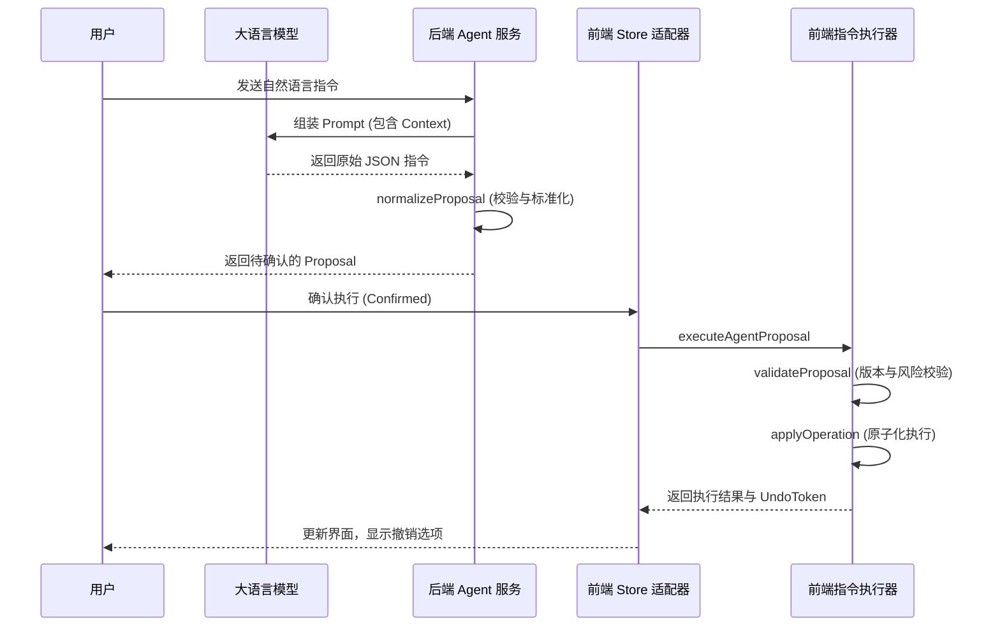
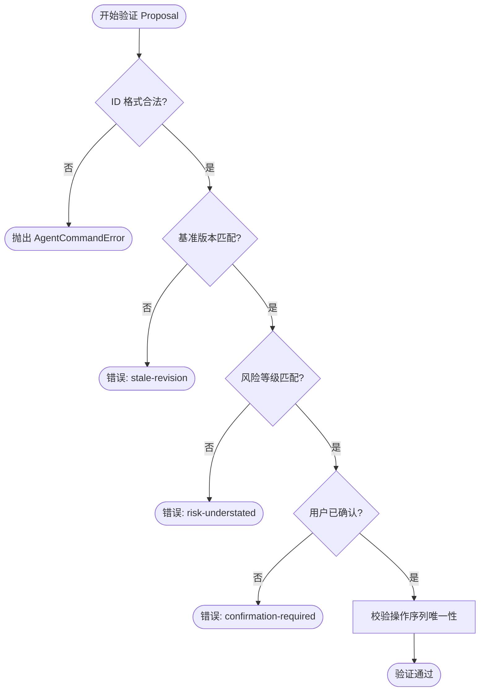
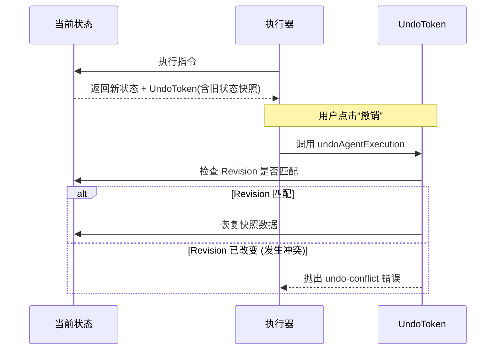

# AI 指令与 Agent 专项测试

## 目录
1. [模块概览](#模块概览)
2. [引言](#引言)
3. [系统架构与数据流](#系统架构与数据流)
4. [核心组件解析](#核心组件解析)
   - [前端指令执行器 (todoCommandExecutor)](#前端指令执行器-todocommandexecutor)
   - [后端 Agent 服务 (agent.mjs)](#后端-agent-服务-agentmjs)
5. [AI 指令解析与安全验证](#ai-指令解析与安全验证)
6. [专项测试方案](#专项测试方案)
   - [指令执行单元测试](#指令执行单元测试)
   - [存储适配器集成测试](#存储适配器集成测试)
   - [后端 Agent 逻辑测试](#后端-agent-逻辑测试)
7. [错误处理与回滚机制](#错误处理与回滚机制)
8. [性能与安全性考量](#性能与安全性考量)
9. [文件参考](#文件参考)

## 模块概览

本模块负责 LightFlux 系统中 AI 智能助手的核心逻辑及其专项测试。它涵盖了从后端大语言模型（LLM）响应的解析与标准化，到前端指令的安全执行与状态回退的完整闭环。

**统计信息**：
- 涉及核心文件：5 个
- 测试覆盖范围：前端执行逻辑、后端解析逻辑、存储适配器隔离层
- 主要子模块：
  - `lightflux/agent/`: 前端指令执行与适配层
  - `server/src/`: 后端 Agent 服务与 LLM 对接层
  - `tests/`: 针对上述逻辑的专项测试集

本页面将深入解析这些组件的实现原理及如何通过严密的测试方案确保 AI 生成内容的安全性与准确性。

## 引言

在现代任务管理系统中，AI 助手不再仅仅是一个对话框，而是能够直接操作用户数据的“代理人（Agent）”。这种能力带来了极大的便利，但也引入了严峻的安全挑战：如何确保 AI 不会误删数据？如何防止 AI 产生的指令在并发环境下破坏状态一致性？

LightFlux 的 AI Agent 测试方案旨在解决这些核心问题。通过将指令执行逻辑与 UI 隔离，并引入基于修订版本（Revision）的乐观锁机制，我们建立了一套可预测、可审计且可回滚的 AI 交互系统。本章节将详细探讨这一系统的测试策略与实现细节。

## 系统架构与数据流

AI 指令的生命周期从用户的自然语言输入开始，经过后端的理解与标准化，最终在前端执行。理解这一流程是编写有效测试的前提。

下面的序列图展示了一个典型的“创建任务”指令从生成到执行的全过程：



**架构解析**：
该流程采用了**显式确认机制**。后端 `agent.mjs` 负责将 LLM 的模糊输出转换为严格定义的 `AgentProposal`。前端 `todoCommandExecutor.ts` 则作为一个纯函数式的执行引擎，根据当前的 `TodoCommandState` 计算出变更后的新状态。这种设计使得指令执行过程变得高度可测试，因为我们可以脱离复杂的 UI 环境，仅针对状态转换进行断言。

**图表来源**：
- [server/src/agent.mjs](server/src/agent.mjs)
- [lightflux/agent/todoCommandExecutor.ts](lightflux/agent/todoCommandExecutor.ts)

## 核心组件解析

### 前端指令执行器 (todoCommandExecutor)

`todoCommandExecutor.ts` 是 AI 指令在客户端落地的核心。它不直接修改全局状态，而是接收当前状态快照，返回执行后的新状态。

```typescript
export const executeAgentProposal = (
  sourceState: TodoCommandState,
  proposal: AgentProposal,
  options: { confirmed: boolean; now?: number },
): AgentExecutionResult => {
  // 1. 严格校验：版本一致性、风险等级、确认状态
  validateProposal(sourceState, proposal, options.confirmed);
  
  const before = cloneCommandState(sourceState);
  const working = cloneCommandState(sourceState);
  const timestamp = options.now ?? Date.now();

  // 2. 顺序应用操作序列
  const operations = proposal.operations.map((operation) =>
    applyOperation(working, operation, timestamp),
  );

  // 3. 计算新版本号
  working.revision = calculateTodoCommandRevision(
    working.todos,
    working.groups,
    working.ungroupedName,
    working.milestones,
  );

  return {
    proposalId: proposal.id,
    beforeRevision: before.revision,
    afterRevision: working.revision,
    state: working,
    operations,
    undoToken: { /* 包含 snapshot 用于回滚 */ },
  };
};
```

**设计要点**：
- **原子性**：即使一个 Proposal 包含多个操作（如“创建分组并添加三个任务”），执行器也会确保它们要么全部成功，要么在出错时保持原状态不变。
- **修订版本 (Revision)**：通过 `calculateTodoCommandRevision` 生成状态哈希。如果 AI 生成指令时基于的版本与执行时的版本不一致，将拒绝执行，防止覆盖并发修改。

### 后端 Agent 服务 (agent.mjs)

后端服务负责与 LLM 通信，并对模型返回的 JSON 进行“清洗”。由于 LLM 可能会产生幻觉（Hallucination），例如引用不存在的 ID，后端必须进行严格的 ID 存在性检查。

```javascript
const normalizeProposal = ({ modelProposal, context, conversationId, turnId }) => {
  // 校验模型返回的操作列表
  if (!Array.isArray(modelProposal.operations) || modelProposal.operations.length === 0) {
    throw new Error('Model proposal has an invalid operation list.');
  }

  // 建立现有 ID 的索引，用于防幻觉校验
  const existingTaskIds = new Set(context.tasks.map(t => t.id));

  const operations = modelProposal.operations.map((op, index) => {
    // 处理引用关系：支持 clientRef (新创建项) 和 ID (现有项)
    const taskId = op.type === 'task.update' ? existingTaskId(op.taskId, 'taskId') : ...;
    
    return {
      operationId: randomUUID(),
      idempotencyKey: `${conversationId}:${turnId}:${index}`,
      ...op,
      taskId
    };
  });

  return { /* 组装成标准 Proposal */ };
};
```

**设计要点**：
- **防注入 Prompt**：在 `SYSTEM_PROMPT` 中明确规定 AI 不得修改系统指令，且必须将用户输入视为不可信数据。
- **引用处理**：引入 `clientRef` 机制，允许 AI 在同一个 Proposal 中创建父任务并立即引用它作为子任务的 `parentId`，而无需等待真实的数据库 ID 生成。

**组件来源**：
- [lightflux/agent/todoCommandExecutor.ts:L893-L926](lightflux/agent/todoCommandExecutor.ts#L893-L926)
- [server/src/agent.mjs:L266-L614](server/src/agent.mjs#L266-L614)

## AI 指令解析与安全验证

安全验证是 AI Agent 的生命线。LightFlux 采用了多层验证机制来拦截非法或高风险操作。

下面的流程图展示了 `validateProposal` 函数内部的逻辑决策过程：



**关键验证项说明**：
1. **风险降级拦截**：系统会根据操作类型自动计算风险等级（如 `task.trash` 为 `high`，`task.update` 为 `low`）。如果 AI 尝试将一个包含删除操作的 Proposal 标记为 `low` 风险，验证器将拒绝执行。
2. **幂等性校验**：每个操作都有一个 `idempotencyKey`。在执行前，系统会检查 Proposal 内部是否存在重复的 Key，防止指令重放或逻辑冲突。
3. **数据隔离**：为了保护隐私，前端适配器在生成 AI 上下文快照时，会主动剔除任务的富文本内容（`content` 字段），仅保留标题和元数据。

**验证逻辑来源**：
- [lightflux/agent/todoCommandExecutor.ts:L828-L891](lightflux/agent/todoCommandExecutor.ts#L828-L891)
- [lightflux/agent/todoCommandExecutor.ts:L283-L310](lightflux/agent/todoCommandExecutor.ts#L283-L310)

## 专项测试方案

针对 AI 指令和 Agent 逻辑，我们构建了三层测试体系，分别关注执行准确性、存储集成和后端逻辑。

### 指令执行单元测试

位于 `todoCommandExecutor.test.ts`，这些测试专注于在各种极端情况下执行器的行为。

**测试重点**：
- **原子性测试**：验证当 Proposal 中间某个操作失败时（如引用了不存在的任务），整个 Proposal 是否被完全回滚，不留下任何副作用。
- **复杂序列测试**：模拟一次性创建分组、父任务和子任务的场景，确保排序逻辑（`sortOrder`）和层级关系正确。

```typescript
it('keeps the source unchanged when a later operation fails', () => {
  const source = createTodoCommandState([todo('existing')], [], null);
  const snapshot = JSON.stringify(source);
  
  expectCommandError(() =>
    executeAgentProposal(
      source,
      proposal([
        { type: 'task.update', taskId: 'existing', changes: { title: 'Changed' } },
        { type: 'task.update', taskId: 'missing', changes: { title: 'Missing' } } // 这将失败
      ], source.revision),
      { confirmed: true }
    ),
    'target-not-found'
  );
  
  // 验证源状态未被修改
  expect(JSON.stringify(source)).toBe(snapshot);
});
```

### 存储适配器集成测试

位于 `todoCommandStoreAdapter.test.ts`，主要测试 Agent 与 Zustand 存储的交互。

**测试重点**：
- **上下文脱敏**：确保发送给 AI 的数据不包含敏感的富文本内容。
- **审计日志**：验证每次 AI 执行是否都正确记录在审计记录中，以便后续追溯。

### 后端 Agent 逻辑测试

位于 `agent.test.mjs`，通过 Mock `fetch` 来模拟各种 LLM 响应。

**测试重点**：
- **幻觉拦截**：模拟模型返回一个不存在的 `taskId`，验证后端服务是否能正确识别并抛出错误。
- **频率限制 (Rate Limiting)**：验证当用户发送请求过快时，系统是否能正确触发 429 错误。

**测试代码来源**：
- [lightflux/tests/todoCommandExecutor.test.ts](lightflux/tests/todoCommandExecutor.test.ts)
- [server/tests/agent.test.mjs](server/tests/agent.test.mjs)

## 错误处理与回滚机制

AI 指令执行可能因为网络、逻辑冲突或用户反悔而需要中断或回滚。LightFlux 提供了一套基于快照的回滚机制。



**回滚逻辑深度解析**：
回滚并非简单的撤销操作，而是一种**状态恢复**。`UndoToken` 中保存了执行前的完整 `TodoCommandState` 快照。当用户触发撤销时，执行器会首先检查当前系统的 `revision` 是否仍然等于执行后的 `afterRevision`。如果在这期间用户手动修改了任何任务，`revision` 将会改变，此时系统会拒绝回滚，以防止覆盖用户最新的手动修改。这种“冲突优先”的策略确保了数据的安全性。

**回滚代码来源**：
- [lightflux/agent/todoCommandExecutor.ts:L928-L948](lightflux/agent/todoCommandExecutor.ts#L928-L948)

## 性能与安全性考量

1. **状态克隆开销**：由于执行器是纯函数，每次执行都会克隆状态。为了优化性能，我们仅克隆受影响的数组和对象，利用不可变数据的特性减少内存占用。
2. **Prompt 注入防御**：后端在组装 Prompt 时，会将用户输入包裹在特定格式中，并在 System Prompt 中反复强调指令的权威性，防止恶意用户通过任务标题诱导 AI 执行越权操作。
3. **数据最小化原则**：`getAgentContextSnapshot` 严格限制了传输给 AI 的字段，例如不传输用户 ID、不传输详细笔记，仅传输任务结构和状态，从源头上降低了数据泄露风险。

## 文件参考

本章节内容基于以下核心文件编写，建议在深入研究时详细阅读：

**指令执行相关**：
- [lightflux/agent/todoCommandExecutor.ts](lightflux/agent/todoCommandExecutor.ts): 前端指令执行核心逻辑。
- [lightflux/agent/milestoneCommandExecutor.ts](lightflux/agent/milestoneCommandExecutor.ts): 专门处理里程碑（Milestone）相关的指令执行。
- [lightflux/agent/types.ts](lightflux/agent/types.ts): 定义了 `AgentOperation`、`AgentProposal` 等关键数据类型。

**后端 Agent 相关**：
- [server/src/agent.mjs](server/src/agent.mjs): 后端 Agent 服务，处理 LLM 交互与指令标准化。

**专项测试相关**：
- [lightflux/tests/todoCommandExecutor.test.ts](lightflux/tests/todoCommandExecutor.test.ts): 执行器单元测试。
- [lightflux/tests/todoCommandStoreAdapter.test.ts](lightflux/tests/todoCommandStoreAdapter.test.ts): 存储适配器与状态同步测试。
- [server/tests/agent.test.mjs](server/tests/agent.test.mjs): 后端 Agent 逻辑与安全性测试。
