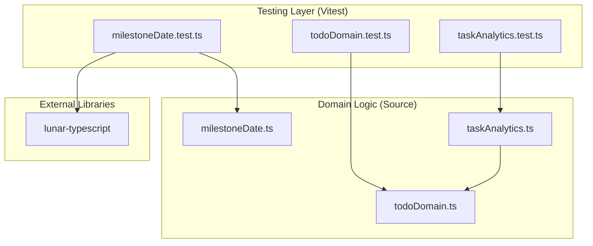
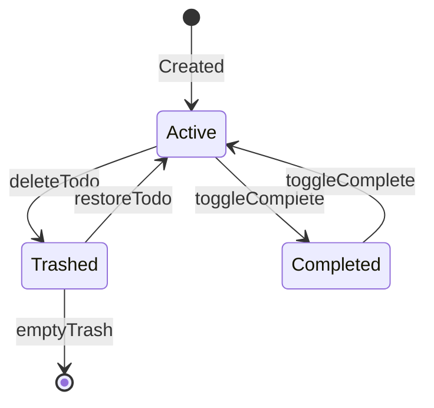
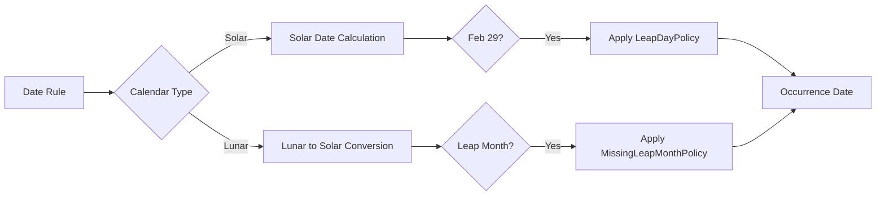
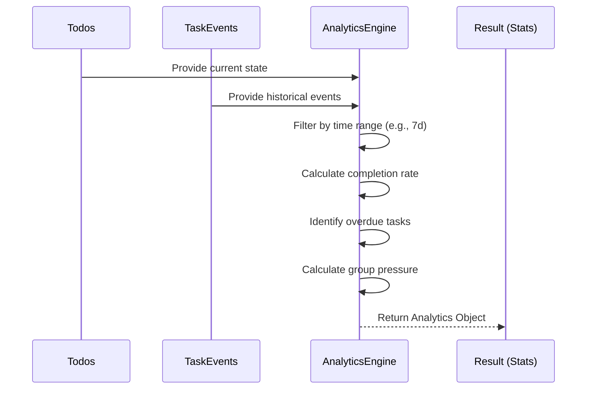
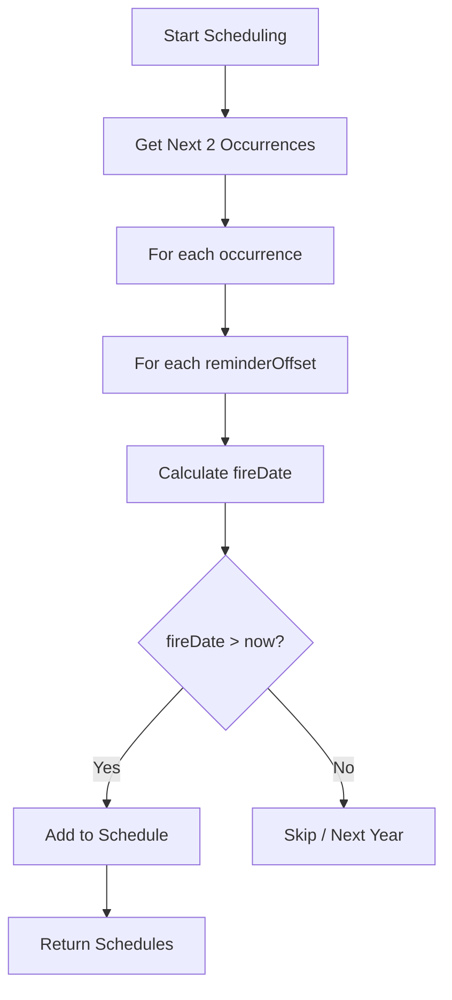

# 单元测试规范与领域逻辑测试

## 目录
1. [模块概览](#模块概览)
2. [引言](#引言)
3. [测试框架配置](#测试框架配置)
4. [任务领域逻辑测试](#任务领域逻辑测试)
5. [历法逻辑与里程碑测试](#历法逻辑与里程碑测试)
6. [任务事件与分析测试](#任务事件与分析测试)
7. [提醒调度逻辑测试](#提醒调度逻辑测试)
8. [测试模式与最佳实践](#测试模式与最佳实践)
9. [核心组件](#核心组件)
10. [文件引用](#文件引用)

## 模块概览

LightFlux 的测试模块位于 `lightflux/tests` 目录下，主要专注于核心业务逻辑（Domain Logic）的单元测试。通过对 `tests/` 目录的扫描，该模块包含以下核心内容：

- **总文件数**：9 个 TypeScript 测试文件。
- **子模块分布**：
    - **领域模型测试**：`todoDomain.test.ts`, `taskEventDomain.test.ts`。
    - **工具逻辑测试**：`milestoneDate.test.ts`, `milestoneReminder.test.ts`, `taskAnalytics.test.ts`。
    - **存储与迁移测试**：`todoStorageMigration.test.ts`, `todoCommandStoreAdapter.test.ts`。
    - **状态管理测试**：`appStateMerge.test.ts`。

本章节将深入探讨前五个核心文件，涵盖任务管理、农历转换、提醒调度及数据分析的测试实践。

## 引言

单元测试是 LightFlux 保证核心业务逻辑正确性的基石。由于应用涉及到复杂的**任务状态流转**、**多历法转换（公历/农历）**以及**多维度的任务分析**，依赖 UI 测试或手动测试无法覆盖所有边缘情况。

领域逻辑测试的主要目标是：
1.  **验证状态一致性**：确保任务在增、删、改、移（回收站）过程中的父子关系和索引正确。
2.  **确保历法准确性**：针对农历闰月、大小月等特殊日期，验证里程碑触发逻辑的精确度。
3.  **保障分析数据可靠性**：验证任务统计（如完成率、压力值）在各种复杂操作（如重新开启任务）下的准确性。

## 测试框架配置

LightFlux 采用 **Vitest** 作为测试运行器。Vitest 是一个高性能的测试框架，与 Vite 构建工具深度集成，非常适合 TypeScript 项目。

### 配置与运行

在 `package.json` 中定义了测试脚本：

```json
{
  "scripts": {
    "test": "vitest run"
  },
  "devDependencies": {
    "vitest": "^4.1.10"
  }
}
```

开发者可以通过以下命令运行测试：
- `npm test`: 运行所有测试并退出。
- `npx vitest`: 进入监听模式（Watch Mode），在文件修改时自动重新运行相关测试。
- `npx vitest --coverage`: 生成测试覆盖率报告（需安装相关插件）。

### 测试架构图

下图展示了测试模块与核心领域逻辑之间的交互关系：



该架构采用典型的单元测试模式，测试用例直接调用领域函数，不依赖于 UI 组件或持久化存储。对于复杂的日期计算，通过 `lunar-typescript` 库进行支撑，并在测试中覆盖其边界条件。

**Section sources**:
- [package.json](package.json)
- [tests/todoDomain.test.ts](tests/todoDomain.test.ts)

## 任务领域逻辑测试

`todoDomain.test.ts` 是核心测试文件之一，主要验证任务在内存中的组织结构和状态变化。

### 核心测试场景

1.  **回收站操作（Trash Operations）**：验证父子任务在移入/移出回收站时的联动逻辑。例如，当恢复一个被删除父任务的子任务时，该子任务应自动脱离父节点成为根任务。
2.  **派生索引（Derived Indexes）**：验证 `buildChildCountByParent` 和 `buildSiblingIndexById` 等函数是否能正确计算任务层级关系。
3.  **循环引用处理**：验证系统在面对遗留数据中的循环引用（如 A 是 B 的父任务，B 又是 A 的父任务）时，是否能优雅处理而不导致死循环。

### 代码示例：回收站联动测试

```typescript
it('keeps a restored child when its trashed parent is deleted', () => {
  const source = [
    todo('parent', { trashedAt: 10 }),
    todo('child', { parentId: 'parent', trashedAt: 10 }),
  ];

  // 恢复子任务
  const restored = restoreTodoBranch(source, 'child', 20);
  expect(restored.find((item) => item.id === 'child')).toMatchObject({
    parentId: null,
    trashedAt: null,
  });

  // 删除已入回收站的父任务，验证子任务依然存在
  const afterDelete = deleteTrashedTodoBranch(restored, 'parent', 30);
  expect(afterDelete.map((item) => item.id)).toEqual(['child']);
});
```

### 任务状态转换图

测试用例覆盖了任务在不同状态间的转换逻辑，确保元数据（如 `updatedAt`, `trashedAt`）更新正确：



在此流程中，测试重点在于验证每次转换后，任务的 `parentId` 是否需要重置，以及 `updatedAt` 时间戳是否准确反映了操作时间。

**Section sources**:
- [tests/todoDomain.test.ts](tests/todoDomain.test.ts)
- [store/todoDomain.ts](store/todoDomain.ts)

## 历法逻辑与里程碑测试

`milestoneDate.test.ts` 负责验证 LightFlux 最具挑战性的部分：公历与农历的混合计算。

### 农历测试策略

由于农历存在闰月和大小月（29天或30天），测试用例特别覆盖了以下边缘情况：
-   **闰月处理**：验证当里程碑设定在闰月时，在非闰年如何回退（Fallback）到普通月份。
-   **2月29日策略**：验证公历闰年在非闰年时，是回退到 2月28日 还是 3月1日。
-   **不存在的日期**：例如农历二月可能没有三十号，验证系统是否能跳过该年并寻找下一个有效日期。

### 历法转换流程



该流程图展示了 `getMilestoneOccurrence` 函数的内部决策逻辑。测试用例确保了在 `leapDayPolicy`（如 `feb-28` 或 `mar-1`）和 `missingLeapMonthPolicy`（如 `skip-year` 或 `regular-month`）生效时，计算结果符合预期。

**Section sources**:
- [tests/milestoneDate.test.ts](tests/milestoneDate.test.ts)
- [utils/milestoneDate.ts](utils/milestoneDate.ts)

## 任务事件与分析测试

`taskEventDomain.test.ts` 和 `taskAnalytics.test.ts` 验证了系统如何记录用户行为并生成统计报表。

### 任务事件派生

系统并不直接记录每个操作，而是通过对比 Todo 列表的前后差异（Diff）来派生事件。测试用例验证了：
-   **原子性**：单次操作（如同时完成并修改日期）是否能生成多个正确的事件（`completed` + `rescheduled`）。
-   **迁移历史**：验证旧版本数据在升级时，如何根据现有时间戳重建“创建”、“完成”、“删除”等历史事件。

### 任务分析数据流



分析引擎 `buildTaskAnalytics` 是一个复杂的纯函数。测试确保了：
1.  **完成率计算**：`completedCount / plannedCount`。
2.  **待办增量（Pending Delta）**：本周期内新创建与新完成任务的差值。
3.  **压力值（Pressure）**：按分组统计的逾期和待办情况。
4.  **重新开启处理**：如果任务在同一周期内被完成又被重新开启，不应计入“已完成”。

**Section sources**:
- [tests/taskEventDomain.test.ts](tests/taskEventDomain.test.ts)
- [tests/taskAnalytics.test.ts](tests/taskAnalytics.test.ts)

## 提醒调度逻辑测试

`milestoneReminder.test.ts` 验证了里程碑提醒的生成逻辑。

### 提醒生成规则

提醒不仅在里程碑当天触发，还支持提前量（如提前 7 天）。测试用例验证了：
-   **多重提醒**：一个里程碑设置多个偏移量（如 0, 7）时，是否能正确生成多条调度记录。
-   **过期过滤**：如果提醒时间已经过去，是否能自动寻找下一个年度的对应时间点。
-   **状态过滤**：已归档或已删除的里程碑不应触发提醒。



**Section sources**:
- [tests/milestoneReminder.test.ts](tests/milestoneReminder.test.ts)
- [utils/milestoneReminder.ts](utils/milestoneReminder.ts)

## 测试模式与最佳实践

在编写 LightFlux 的测试时，应遵循以下模式以保证代码的可读性和可维护性。

### 领域对象工厂函数

在每个测试文件中，都定义了一个 `todo` 或 `milestone` 的工厂函数，用于快速创建带有默认值的对象，减少样板代码：

```typescript
const todo = (
  id: string,
  overrides: Partial<Todo> = {},
): Todo => ({
  id,
  title: id,
  completed: false,
  // ... 其他默认值
  ...overrides,
});
```

### 编写测试的步骤

1.  **准备数据（Arrange）**：使用工厂函数创建初始状态。
2.  **执行操作（Act）**：调用待测试的领域函数。
3.  **验证结果（Assert）**：使用 `expect(...).toMatchObject(...)` 或 `expect(...).toEqual(...)` 进行断言。

> 💡 **建议**：对于涉及日期的测试，务必使用固定的基准时间（如 `new Date(2026, 7, 10)`），避免因运行测试时的实际时间不同而导致结果不稳定。

## 核心组件

测试模块依赖以下核心工具函数进行逻辑验证：

-   `restoreTodoBranch`: 处理任务树的恢复逻辑。
-   `getMilestoneOccurrence`: 里程碑日期计算的核心引擎。
-   `buildTaskAnalytics`: 统计分析生成的聚合函数。
-   `deriveTaskEventsFromTodoDiff`: 基于状态差异的事件回溯工具。

## 文件引用

本章节涉及的关键测试文件及其路径如下：

-   [tests/todoDomain.test.ts](tests/todoDomain.test.ts): 任务领域模型与索引测试。
-   [tests/milestoneDate.test.ts](tests/milestoneDate.test.ts): 公历与农历转换逻辑测试。
-   [tests/milestoneReminder.test.ts](tests/milestoneReminder.test.ts): 提醒调度逻辑测试。
-   [tests/taskEventDomain.test.ts](tests/taskEventDomain.test.ts): 任务事件派生测试。
-   [tests/taskAnalytics.test.ts](tests/taskAnalytics.test.ts): 任务统计分析逻辑测试。
-   [store/todoDomain.ts](store/todoDomain.ts): 被测试的任务领域逻辑实现。
-   [utils/milestoneDate.ts](utils/milestoneDate.ts): 被测试的日期计算工具。
