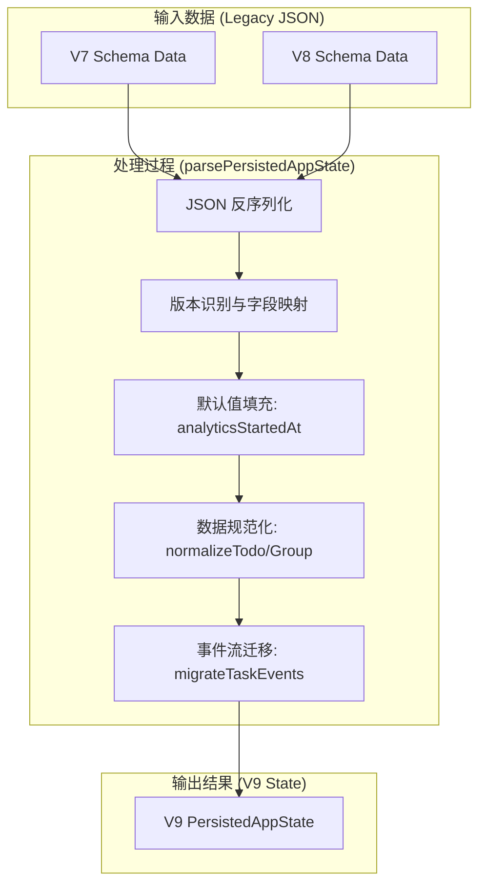
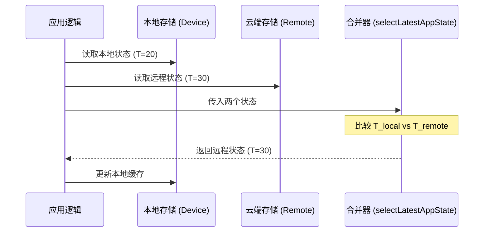
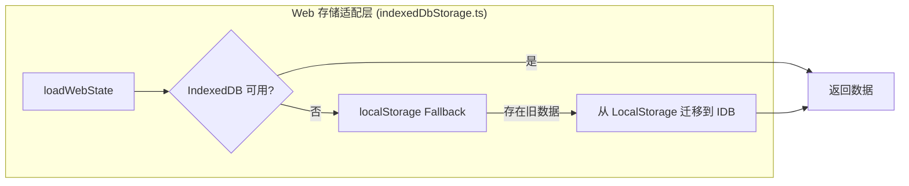
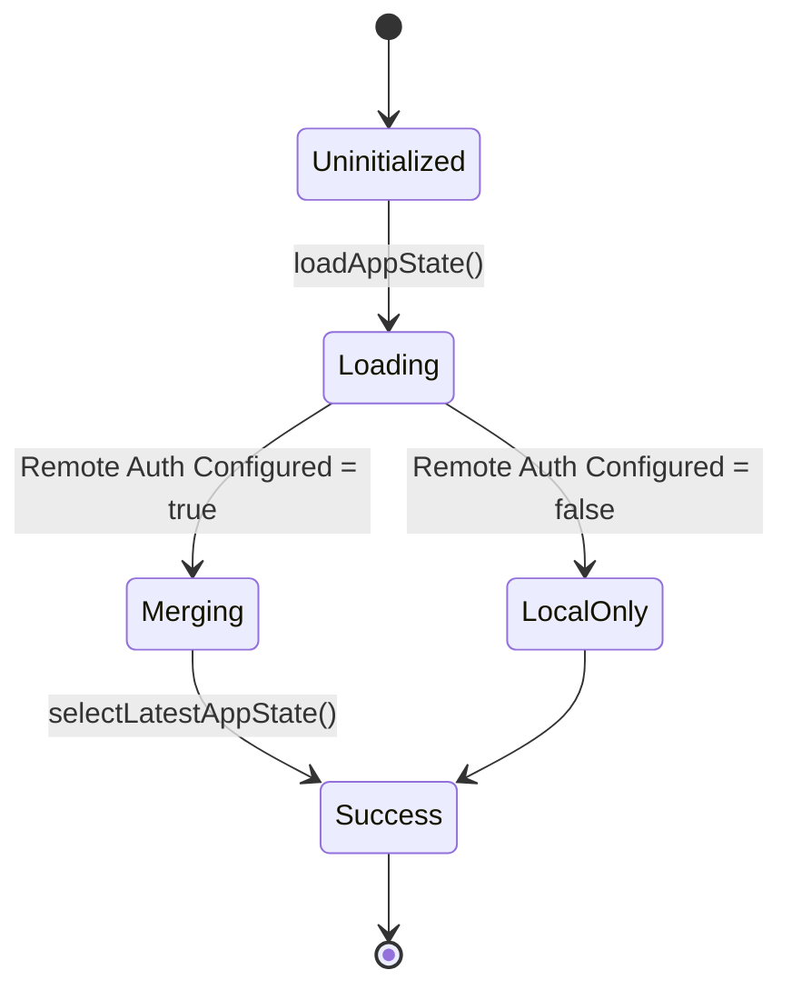

# 存储迁移与状态同步测试

## 目录
1. [模块概览](#模块概览)
2. [存储版本迁移测试](#存储版本迁移测试)
   - [迁移测试的核心逻辑](#迁移测试的核心逻辑)
   - [Schema 升级验证点](#schema-升级验证点)
3. [状态合并逻辑测试](#状态合并逻辑测试)
   - [LWW 合并策略验证](#lww-合并策略验证)
   - [时间戳派生逻辑](#时间戳派生逻辑)
4. [IndexedDB 与 Web 存储模拟](#indexeddb-与-web-存储模拟)
   - [存储层架构模拟](#存储层架构模拟)
   - [Fallback 机制验证](#fallback-机制验证)
5. [核心组件分析](#核心组件分析)
6. [测试最佳实践与 Checklist](#测试最佳实践与-checklist)
7. [文件参考](#文件参考)

## 模块概览

在 LightFlux 项目中，数据持久化层的质量保证是确保用户数据安全与一致性的核心。随着应用功能的演进（如引入里程碑、任务分析等），底层数据结构（Schema）会发生变化。同时，支持多端同步的功能要求系统能够正确处理本地数据与云端数据的冲突。

本模块主要涉及 `lightflux/tests` 下的两个关键测试文件：
- `todoStorageMigration.test.ts`: 专注于存储版本的平滑升级，确保旧版本的用户数据在应用更新后能够正确映射到新 Schema，且不丢失关键信息。
- `appStateMerge.test.ts`: 专注于多端同步时的状态合并逻辑，验证在不同时间戳下，系统如何选择最新的状态快照。

通过对这些测试文件的分析，我们可以看到 LightFlux 如何通过构造不同版本的旧数据快照进行回归测试，并利用模拟（Mocking）技术在非浏览器环境下验证 IndexedDB 的行为。

**模块规模统计**：
- **核心文件数**：约 4 个服务逻辑文件，2 个核心测试文件。
- **覆盖范围**：涵盖了从 Schema V7 到 V9 的迁移路径，以及基于 LWW（Last Write Wins）的同步合并策略。
- **子模块**：存储迁移逻辑 (`todoStorage.ts`)、状态合并算法 (`appStateMerge.ts`)、Web 存储适配层 (`indexedDbStorage.ts`)。

## 存储版本迁移测试

存储迁移测试的主要目标是验证 `parsePersistedAppState` 函数在处理不同版本的持久化数据时的健壮性。随着 `schemaVersion` 的提升，数据结构会变得更加复杂，例如从简单的任务列表演进为包含任务事件流（Task Events）和里程碑（Milestones）的复杂对象。

### 迁移测试的核心逻辑

在 `todoStorageMigration.test.ts` 中，测试用例通过手动构造包含旧版本 `schemaVersion` 的 JSON 字符串，模拟用户从旧版本升级的场景。



上图展示了存储迁移的完整流程。输入可以是 V7 或 V8 版本的旧数据，经过 `parsePersistedAppState` 的一系列处理步骤，最终输出符合 V9 标准的状态对象。测试的关键在于验证每一个处理步骤是否按预期执行，特别是默认值的填充和旧数据的转换。

### Schema 升级验证点

在从 V7/V8 升级到 V9 时，测试重点关注以下几个方面：

1.  **新增字段的默认值**：例如 `analyticsStartedAt` 必须在迁移时被初始化为当前时间戳，除非旧数据中已存在。
2.  **导航顺序的调整**：V9 移除了 `search` 导航项并新增了 `milestones`。测试会验证 `navigationOrder` 是否被正确过滤和补充。
3.  **任务事件的重构**：V9 引入了显式的任务事件流。对于旧数据，需要通过 `migrateTaskEvents` 根据现有任务的状态（如已完成、已删除）反向生成初始事件。
4.  **关联完整性**：验证任务（Todo）与里程碑（Milestone）之间的关联。如果任务引用的里程碑 ID 不存在，迁移逻辑应自动将其重置为 `null`。

**代码示例：验证 V7 到 V9 的升级**

```typescript
// lightflux/tests/todoStorageMigration.test.ts
it('upgrades V7 state with milestone and analytics defaults', () => {
  const result = parsePersistedAppState(
    JSON.stringify({
      schemaVersion: 7,
      updatedAt: 20,
      language: 'zh',
      navigationOrder: ['search', 'today', 'completed'],
      todos: [legacyTodo],
    }),
    100, // 模拟当前时间
  );

  expect(result).toMatchObject({
    schemaVersion: 9,
    analyticsStartedAt: 100,
    taskEvents: [
      expect.objectContaining({
        type: 'created',
        taskId: 'legacy-task',
      }),
    ],
  });
  expect(result?.navigationOrder).toContain('milestones');
  expect(result?.navigationOrder).not.toContain('search');
});
```

在这个测试用例中，我们不仅验证了版本号的提升，还检查了 `analyticsStartedAt` 是否正确接收了传入的 `now` 参数，以及 `navigationOrder` 的动态调整。这种回归测试确保了老用户在升级应用后，其界面配置和统计数据能够平滑过渡。

**Section sources**:
- [todoStorageMigration.test.ts](lightflux/tests/todoStorageMigration.test.ts)
- [todoStorage.ts](lightflux/services/todoStorage.ts)

## 状态合并逻辑测试

当用户在多个设备上使用 LightFlux 时，本地存储的状态可能与云端状态不一致。LightFlux 采用了基于时间戳的 LWW (Last Write Wins) 策略来解决冲突。`appStateMerge.test.ts` 专门用于验证这一核心逻辑。

### LWW 合并策略验证

合并逻辑的核心在于 `selectLatestAppState` 函数。它对比本地状态和远程状态的 `updatedAt` 字段，选择时间戳较大的那一个作为最终状态。



上述时序图描述了典型的同步合并场景。当应用启动时，它会并发读取本地和远程状态。合并器通过简单的数值比较决定胜出者。如果远程状态更新，应用会立即同步到本地，确保用户看到的是最新的数据。

### 时间戳派生逻辑

对于某些没有显式 `updatedAt` 的旧数据，系统需要能够从现有的任务、分组或里程碑中派生出一个合理的时间戳。`deriveStateUpdatedAt` 函数负责这一逻辑，它会扫描所有实体，取其中最大的 `updatedAt` 或 `createdAt` 作为整个状态的更新时间。

**代码示例：时间戳派生验证**

```typescript
// lightflux/services/appStateMerge.ts
export const deriveStateUpdatedAt = (
  todos: Todo[],
  groups: TodoGroup[],
  milestones: Milestone[],
  value: unknown,
): number => {
  if (typeof value === 'number' && Number.isFinite(value) && value >= 0) {
    return value;
  }

  return Math.max(
    0,
    ...todos.map((todo) => todo.updatedAt),
    ...groups.map((group) => group.createdAt),
    ...milestones.map((milestone) => milestone.updatedAt),
  );
};
```

测试用例会构造包含不同时间戳的实体列表，验证 `deriveStateUpdatedAt` 是否能正确找到最大值。这对于确保迁移后的数据在同步过程中不被视为“过期”数据至关重要。

**Section sources**:
- [appStateMerge.test.ts](lightflux/tests/appStateMerge.test.ts)
- [appStateMerge.ts](lightflux/services/appStateMerge.ts)

## IndexedDB 与 Web 存储模拟

在 Web 平台上，LightFlux 优先使用 IndexedDB 进行持久化，因为它提供了更大的存储空间和异步操作能力。然而，为了兼容旧版本，系统保留了从 `localStorage` 自动迁移的功能。

### 存储层架构模拟

由于测试环境通常是 Node.js（通过 Vitest 运行），真实的 `indexedDB` 环境并不存在。因此，在测试中需要对存储层进行模拟或使用内存实现。



虽然 `todoStorageMigration.test.ts` 中直接 Mock 了 `indexedDbStorage` 的导出函数，但在集成测试层面，理解这一 Fallback 路径对于编写高质量的测试用例至关重要。

### Fallback 机制验证

在 `indexedDbStorage.ts` 的实现中，如果 `indexedDB.open` 失败，系统会捕获错误并降级到 `localStorage`。这种防御性设计通过以下逻辑实现：

```typescript
// lightflux/services/indexedDbStorage.ts
export const loadWebState = async (legacyStorageKey: string): Promise<string | null> => {
  try {
    const indexedState = await readIndexedState();
    if (indexedState) return indexedState;
    
    // 自动迁移逻辑
    const legacyState = runtime.localStorage?.getItem(legacyStorageKey);
    if (legacyState) {
      await writeIndexedState(legacyState);
      // ... 备份并删除旧数据
      return legacyState;
    }
    return null;
  } catch (error) {
    console.warn('IndexedDB unavailable; using localStorage.', error);
    return runtime.localStorage?.getItem(legacyStorageKey) ?? null;
  }
};
```

在测试中，我们可以通过修改 `globalThis` 的属性来模拟 `indexedDB` 缺失的场景，从而验证降级逻辑的正确性。

**Section sources**:
- [indexedDbStorage.ts](lightflux/services/indexedDbStorage.ts)
- [todoStorageMigration.test.ts](lightflux/tests/todoStorageMigration.test.ts)

## 核心组件分析

本节详细介绍在存储迁移与同步测试中涉及的核心函数及其职责。

| 组件名称 | 定义位置 | 主要职责 |
| :--- | :--- | :--- |
| `parsePersistedAppState` | `todoStorage.ts` | 将持久化的 JSON 字符串转换为规范化的应用状态，处理版本升级。 |
| `normalizeTodo` | `todoStorage.ts` | 验证单个任务对象的完整性，填充缺失的 `content` 或 `priority` 字段。 |
| `selectLatestAppState` | `appStateMerge.ts` | 对比本地与远程状态的时间戳，执行 LWW 合并策略。 |
| `deriveStateUpdatedAt` | `appStateMerge.ts` | 从子实体中派生全局更新时间戳，用于兼容旧版本数据。 |
| `loadWebState` | `indexedDbStorage.ts` | 封装 IndexedDB 读取逻辑，并提供向后兼容的迁移路径。 |

这些组件共同构成了 LightFlux 的数据持久化防线。在编写测试时，应针对每个组件的边界条件（如非法 JSON、缺失字段、冲突的时间戳等）进行覆盖。

**Section sources**:
- [todoStorage.ts](lightflux/services/todoStorage.ts)
- [appStateMerge.ts](lightflux/services/appStateMerge.ts)
- [indexedDbStorage.ts](lightflux/services/indexedDbStorage.ts)

## 测试最佳实践与 Checklist

为了确保存储层的高质量，建议在添加新功能或修改数据结构时遵循以下测试 Checklist：

### 存储迁移测试 Checklist
- [ ] **版本号递增**：确保 `schemaVersion` 已正确更新，且 `parsePersistedAppState` 能够识别新版本。
- [ ] **字段默认值**：所有新增字段在旧数据迁移后必须有合理的默认值。
- [ ] **无效数据过滤**：测试包含非法 ID 或损坏的 JSON 字段时，系统是否能优雅处理（通常是丢弃或重置）。
- [ ] **关联一致性**：验证跨实体引用（如 `milestoneId`）在引用对象丢失时是否被正确清理。
- [ ] **回归快照**：保留一份旧版本的真实数据 JSON 快照，作为回归测试的输入。

### 状态同步测试 Checklist
- [ ] **时间戳精度**：验证毫秒级的时间戳差异是否能被正确识别。
- [ ] **空状态处理**：测试本地或远程状态为空时，合并逻辑是否能正确返回非空的一方。
- [ ] **并发冲突**：模拟本地和远程同时更新的场景，验证 LWW 策略的最终一致性。



状态机的转换展示了应用启动时数据加载的逻辑路径。测试应覆盖从 `Uninitialized` 到 `Success` 的所有可能路径，特别是 `Merging` 阶段的各种冲突情况。

## 文件参考

以下是本页面分析涉及的关键源文件：

- `lightflux/tests/todoStorageMigration.test.ts`: 存储版本迁移回归测试。
- `lightflux/tests/appStateMerge.test.ts`: 状态合并与同步逻辑测试。
- `lightflux/services/todoStorage.ts`: 核心持久化与 Schema 规范化逻辑。
- `lightflux/services/appStateMerge.ts`: 多端状态合并算法实现。
- `lightflux/services/indexedDbStorage.ts`: Web 端持久化适配层。
- `lightflux/types/todo.ts`: 数据模型定义，包括 `PersistedAppState` 结构。

**Section sources**:
- [todoStorage.ts](lightflux/services/todoStorage.ts)
- [appStateMerge.ts](lightflux/services/appStateMerge.ts)
- [indexedDbStorage.ts](lightflux/services/indexedDbStorage.ts)
- [todoStorageMigration.test.ts](lightflux/tests/todoStorageMigration.test.ts)
