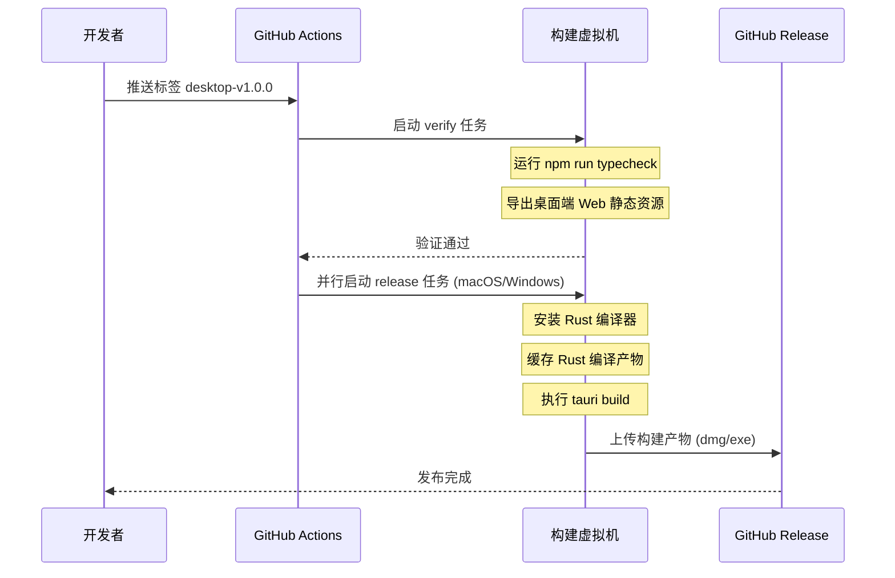
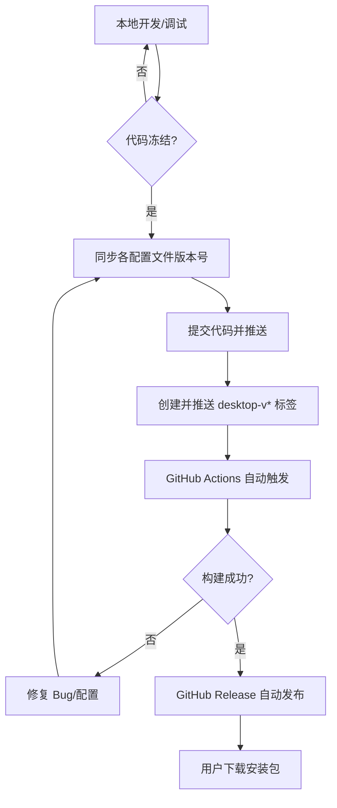
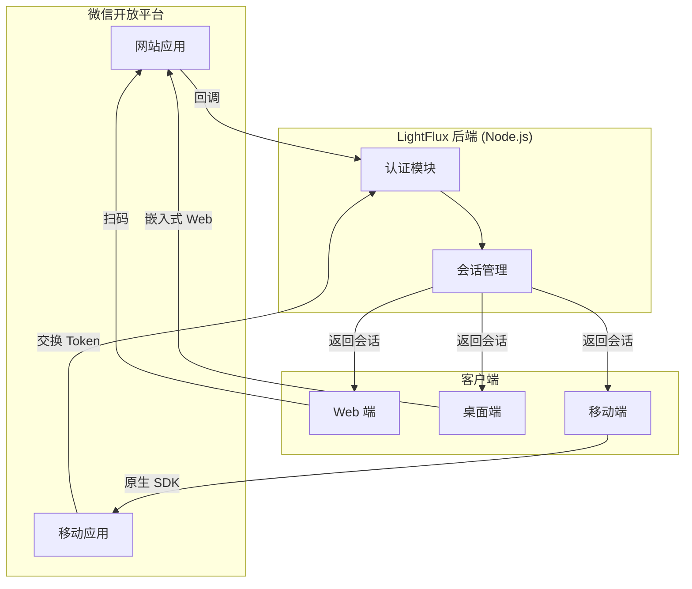

# 持续集成与桌面端发布指南

## 目录
1. [模块概览](#模块概览)
2. [简介](#简介)
3. [GitHub Actions 持续集成流程](#github-actions-持续集成流程)
   - [工作流触发机制](#工作流触发机制)
   - [自动化构建流水线](#自动化构建流水线)
4. [Tauri 构建与发布配置](#tauri-构建与发布配置)
   - [核心配置解析](#核心配置解析)
   - [版本管理机制](#版本管理机制)
5. [桌面端打包与发布实践](#桌面端打包与发布实践)
   - [常用打包命令](#常用打包命令)
   - [发布版本步骤](#发布版本步骤)
6. [后端服务生产环境部署](#后端服务生产环境部署)
   - [部署环境要求](#部署环境要求)
   - [生产环境配置模板](#生产环境配置模板)
7. [发布前置要求与微信集成](#发布前置要求与微信集成)
   - [微信开放平台配置](#微信开放平台配置)
8. [证书签名与分发建议](#证书签名与分发建议)
   - [macOS 签名与公证](#macos-签名与公证)
   - [Windows 签名](#windows-签名)
9. [核心组件](#核心组件)
10. [文件引用](#文件引用)

## 模块概览

本模块涵盖了 LightFlux 项目从代码提交到最终发布的完整生命周期管理。通过集成 GitHub Actions、Tauri 构建工具链以及 Node.js 后端服务，实现了跨平台桌面应用的自动化构建与分发。

在本次文档生成过程中，我们对以下核心目录进行了深入调研：
- `.github/workflows/`: 包含自动化构建脚本，共 1 个核心 YAML 文件。
- `lightflux/src-tauri/`: 桌面端核心配置与 Rust 源代码，约 10 个关键文件。
- `server/`: 后端认证服务，包含部署脚本与环境配置，共 6 个文件。
- `docs/`: 项目文档，包含发布指南与微信开放平台申请流程，共 2 个核心 Markdown 文件。

**涉及的子模块及覆盖深度：**
- **GitHub Actions (深度覆盖)**：详细解析 `desktop-release.yml` 的执行逻辑。
- **Tauri 构建系统 (深度覆盖)**：基于 `tauri.conf.json` 解析桌面端打包配置。
- **后端部署 (标准覆盖)**：总结 Node.js 服务在生产环境下的部署建议。
- **微信集成 (标准覆盖)**：引用微信开放平台的发布前置要求。

总计发现并分析了约 25 个相关源文件，本指南将基于这些真实代码与配置，提供详尽的发布实践指导。

## 简介

LightFlux 的发布体系旨在降低跨平台应用的分发难度，同时确保构建过程的透明性与一致性。对于桌面端应用，我们选择了 Tauri 2.0 框架，它不仅提供了极小的安装包体积，还通过 Rust 保证了底层逻辑的高性能与安全性。

**持续集成与发布的主要目标包括：**
- **多端自动化构建**：通过 CI 工具一次性生成适用于 macOS (Intel/Apple Silicon) 和 Windows 的安装包。
- **版本一致性**：确保前端资源、Rust 核心逻辑以及后端服务在发布时版本匹配。
- **安全分发**：集成代码签名流程，减少用户安装时的系统警告。
- **快速迭代**：利用 GitHub Releases 实现版本管理与自动更新。

本指南不仅适用于开发人员进行本地调试，更是运维人员配置生产环境、执行版本发布的重要参考文档。

## GitHub Actions 持续集成流程

LightFlux 使用 GitHub Actions 作为主要的 CI/CD 平台。通过定义在 `.github/workflows/desktop-release.yml` 中的工作流，实现了从代码验证到多平台打包的全自动化。

### 工作流触发机制

工作流支持两种触发方式：
1.  **标签触发 (Push Tags)**：当推送符合 `desktop-v*` 模式的 Git 标签时，工作流会自动启动。这是正式发布的标准路径。
2.  **手动触发 (Workflow Dispatch)**：开发人员可以在 GitHub Actions 页面手动触发构建，用于测试或临时发布。

### 自动化构建流水线

整个 CI 流程分为两个主要阶段：验证 (Verify) 和发布 (Release)。

下面的序列图展示了 GitHub Actions 在接收到发布指令后的完整执行过程：



**流程解析：**
1.  **验证阶段 (`verify`)**：在 Ubuntu 环境下执行。首先进行 TypeScript 类型检查，确保前端代码无误，随后执行 `npm run desktop:web` 导出静态资源。这一步是后续所有平台构建的基础。
2.  **构建阶段 (`release`)**：利用矩阵策略 (`matrix strategy`) 并行启动多个构建任务。
    - **macOS 构建**：在 `macos-latest` 环境下运行，支持 `aarch64-apple-darwin` (Apple Silicon) 和 `x86_64-apple-darwin` (Intel) 两个目标。
    - **Windows 构建**：在 `windows-latest` 环境下运行，生成 NSIS 安装程序。
3.  **产物上传**：使用 `tauri-apps/tauri-action` 插件，自动创建 GitHub Release 并将生成的安装包作为附件上传。

**Section sources**:
- [.github/workflows/desktop-release.yml](.github/workflows/desktop-release.yml)

## Tauri 构建与发布配置

Tauri 的核心配置文件 `tauri.conf.json` 决定了桌面应用的行为、外观以及打包方式。

### 核心配置解析

在 `lightflux/src-tauri/tauri.conf.json` 中，定义了构建命令与资源路径：

```json
{
  "productName": "LightFlux",
  "version": "1.0.0",
  "identifier": "com.little1d.lightflux",
  "build": {
    "beforeDevCommand": "npm run web -- --port 1420",
    "devUrl": "http://localhost:1420",
    "beforeBuildCommand": "npm run desktop:web",
    "frontendDist": "../desktop-dist"
  },
  "bundle": {
    "active": true,
    "targets": "all",
    "icon": [
      "icons/32x32.png",
      "icons/128x128.png",
      "icons/icon.icns",
      "icons/icon.ico"
    ]
  }
}
```

**关键字段说明：**
- **`beforeBuildCommand`**：在执行 Tauri 构建前，先运行 `npm run desktop:web`。这确保了前端代码被正确编译并放置在 `frontendDist` 指定的目录中。
- **`frontendDist`**：指向 `../desktop-dist`，这是 Tauri 获取前端静态资源的入口。
- **`identifier`**：应用的唯一标识符（Bundle ID），在 macOS 签名和 Windows 注册表中至关重要。

### 版本管理机制

LightFlux 的版本信息分布在多个文件中。在发布新版本前，必须确保以下文件中的版本号同步更新：
- `lightflux/package.json`: 前端项目版本。
- `lightflux/app.json`: Expo/移动端配置版本。
- `lightflux/src-tauri/Cargo.toml`: Rust 核心包版本。
- `lightflux/src-tauri/tauri.conf.json`: Tauri 应用定义版本。

这种多处同步的机制虽然增加了手动操作，但保证了各个技术栈对当前版本的认知是一致的。

**Section sources**:
- [lightflux/src-tauri/tauri.conf.json](lightflux/src-tauri/tauri.conf.json)

## 桌面端打包与发布实践

本节提供了在本地或 CI 环境下进行桌面端打包的具体操作指南。

### 常用打包命令

以下表格总结了 LightFlux 桌面端开发与构建的常用命令：

| 命令 | 说明 | 运行环境 |
| :--- | :--- | :--- |
| `npx tauri dev` | 启动桌面端开发模式，支持热更新 | 本地开发 |
| `npx tauri build` | 按照当前系统的平台进行正式打包 | 本地构建 |
| `npx tauri build --target aarch64-apple-darwin` | 交叉编译 macOS Apple Silicon 版本 | macOS |
| `npm run desktop:web` | 仅导出桌面端所需的 Web 静态资源 | 任何环境 |

### 发布版本步骤

根据 `docs/desktop-release.md` 的建议，标准的发布流程如下：

1.  **版本同步**：更新上述提到的所有配置文件中的版本号。
2.  **提交代码**：将版本变更提交并推送到远程仓库。
3.  **打标签**：执行 `git tag desktop-v1.0.0` 并在本地确认。
4.  **推送标签**：执行 `git push origin desktop-v1.0.0`。
5.  **监控 CI**：在 GitHub Actions 页面观察构建进度，等待 Release 自动生成。

下面的流程图展示了本地开发到正式发布的生命周期：



**流程说明：**
该流程强调了“标签即发布”的原则。通过 Git 标签触发构建，可以确保发布的代码版本是可追溯的，并且构建环境是纯净的 GitHub Actions 虚拟机。

**Section sources**:
- [docs/desktop-release.md](docs/desktop-release.md)

## 后端服务生产环境部署

LightFlux 的后端服务主要负责微信认证、AI 接口转发以及用户数据同步。在生产环境下，建议使用 Node.js 20+ 版本，并通过环境变量进行严格配置。

### 部署环境要求

- **Node.js**：版本需 `>= 20`，利用其内置的 `--env-file` 功能管理环境变量。
- **持久化存储**：默认使用 JSON 文件存储，适用于单机部署。若需水平扩展，请替换为数据库。
- **网络连接**：服务器需能访问微信开放平台接口及 AI 服务提供商（如 OpenAI/DeepSeek）的 API 域名。

### 生产环境配置模板

在生产服务器上，应基于 `server/.env.example` 创建 `.env` 文件。以下是一个典型的生产环境配置示例：

```bash
# 基础服务配置
PUBLIC_BASE_URL=https://auth.yourdomain.com
CORS_ORIGIN=https://app.yourdomain.com
SESSION_SECRET=your_32_character_random_string_here

# 微信开放平台配置 (网站应用)
WECHAT_WEB_APP_ID=wx_web_appid
WECHAT_WEB_APP_SECRET=wx_web_appsecret
WECHAT_WEB_REDIRECT_URI=https://auth.yourdomain.com/api/auth/wechat/web/callback

# AI 服务配置
AI_BASE_URL=https://api.deepseek.com
AI_API_KEY=sk-xxxxxxxxxxxx
AI_MODEL=deepseek-chat
AI_RATE_LIMIT_MAX_REQUESTS=100

# 文件上传配置
UPLOAD_DIR=./uploads
UPLOAD_ALLOW_ANONYMOUS=false
```

**部署建议：**
1.  **使用 PM2 管理进程**：建议使用 PM2 进行进程守护，确保服务崩溃后能自动重启。
2.  **反向代理**：使用 Nginx 或 Caddy 作为反向代理，处理 HTTPS 证书并转发请求到 Node.js 端口。
3.  **安全加固**：务必将 `UPLOAD_ALLOW_ANONYMOUS` 设置为 `false`，并定期备份 `UPLOAD_DIR` 中的用户数据。

**Section sources**:
- [server/README.md](server/README.md)
- [server/package.json](server/package.json)

## 发布前置要求与微信集成

在正式发布 LightFlux 之前，必须完成微信开放平台的应用申请。这是实现微信扫码登录（Web）和原生登录（移动端）的前提。

### 微信开放平台配置

根据 `docs/wechat-open-platform/README.md`，开发者需要申请两类应用：

1.  **网站应用**：用于 Web 端的微信扫码登录。
    - 关键配置：授权回调域（需与后端 `PUBLIC_BASE_URL` 的域名一致）。
2.  **移动应用**：用于 iOS 和 Android 的原生微信登录。
    - 关键配置：iOS 的 Bundle ID 和 Universal Link，Android 的 Package Name 和签名指纹。

下面的架构图展示了后端服务如何协调不同平台的微信认证：



**集成要点：**
- **UnionID 机制**：确保网站应用和移动应用绑定在同一个微信开放平台账号下，这样同一用户在不同端登录时能识别为同一个 `UnionID`。
- **域名校验**：微信要求回调域名必须经过备案且支持 HTTPS。

**Section sources**:
- [docs/wechat-open-platform/README.md](docs/wechat-open-platform/README.md)

## 证书签名与分发建议

为了提供良好的用户体验，桌面应用在发布前应当进行代码签名。否则，用户在安装时会遇到“身份不明的开发者”或“不安全的下载”等系统警告。

### macOS 签名与公证

LightFlux 在 `tauri.conf.json` 中默认使用 ad-hoc 签名 (`"signingIdentity": "-"` )。这仅能保证安装包在本地运行，无法通过苹果的 Gatekeeper 验证。

**正式发布建议：**
1.  **加入 Apple Developer Program**：获取 Developer ID 证书。
2.  **配置公证 (Notarization)**：在 CI 流程中集成苹果的公证服务，确保 dmg 文件被苹果扫描并标记为安全。
3.  **环境变量**：在 GitHub Actions 中配置 `APPLE_CERTIFICATE`、`APPLE_CERTIFICATE_PASSWORD`、`APPLE_ID` 和 `APPLE_PASSWORD`。

### Windows 签名

Windows 安装包（NSIS）默认是未签名的。浏览器（如 Edge/Chrome）可能会拦截下载，SmartScreen 也会弹出警告。

**正式发布建议：**
1.  **购买 Authenticode 证书**：从受信任的证书颁发机构（如 Sectigo 或 DigiCert）购买。
2.  **使用 SignTool**：在 CI 流程中使用 Windows SDK 提供的 `signtool.exe` 对生成的 exe 文件进行签名。

> 💡 **提示**：对于开源项目或小规模分发，可以引导用户通过“仍要运行”选项手动跳过警告，或者将安装包发布到 Microsoft Store 以利用商店的信任体系。

## 核心组件

本模块涉及的核心组件及其职责如下：

- **`.github/workflows/desktop-release.yml`**：发布流程的“大脑”，定义了何时、何地、如何构建应用。
- **`lightflux/src-tauri/tauri.conf.json`**：桌面端应用的“蓝图”，包含了标识符、权限、窗口定义及构建指令。
- **`server/src/index.mjs`**：后端服务的入口，负责加载环境变量并启动认证 API。
- **`docs/desktop-release.md`**：面向开发者的操作手册，指导如何执行发布任务。
- **`docs/wechat-open-platform/README.md`**：合规性文档，记录了与第三方平台集成的必要步骤。

## 文件引用

以下是本指南参考的核心源文件列表：

- [.github/workflows/desktop-release.yml](.github/workflows/desktop-release.yml) - GitHub Actions 自动化发布脚本
- [lightflux/src-tauri/tauri.conf.json](lightflux/src-tauri/tauri.conf.json) - Tauri 桌面端核心配置
- [server/package.json](server/package.json) - 后端服务依赖与启动脚本
- [server/README.md](server/README.md) - 后端部署说明文档
- [server/.env.example](server/.env.example) - 后端环境变量配置模板
- [docs/desktop-release.md](docs/desktop-release.md) - 桌面端发布指南
- [docs/wechat-open-platform/README.md](docs/wechat-open-platform/README.md) - 微信开放平台申请清单
- [lightflux/src-tauri/Cargo.toml](lightflux/src-tauri/Cargo.toml) - Rust 后端配置与版本定义
- [lightflux/package.json](lightflux/package.json) - 前端项目配置与版本定义
