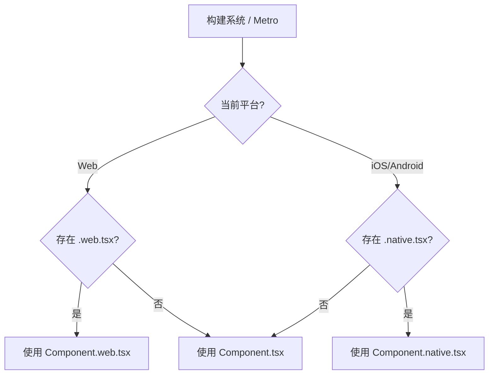
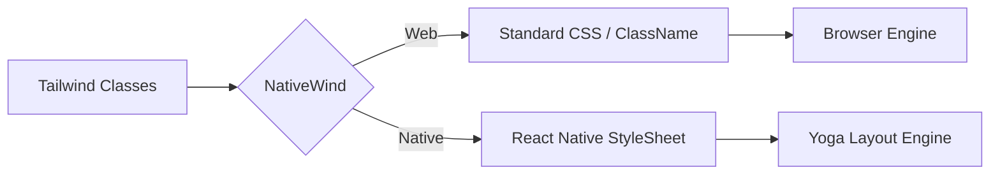
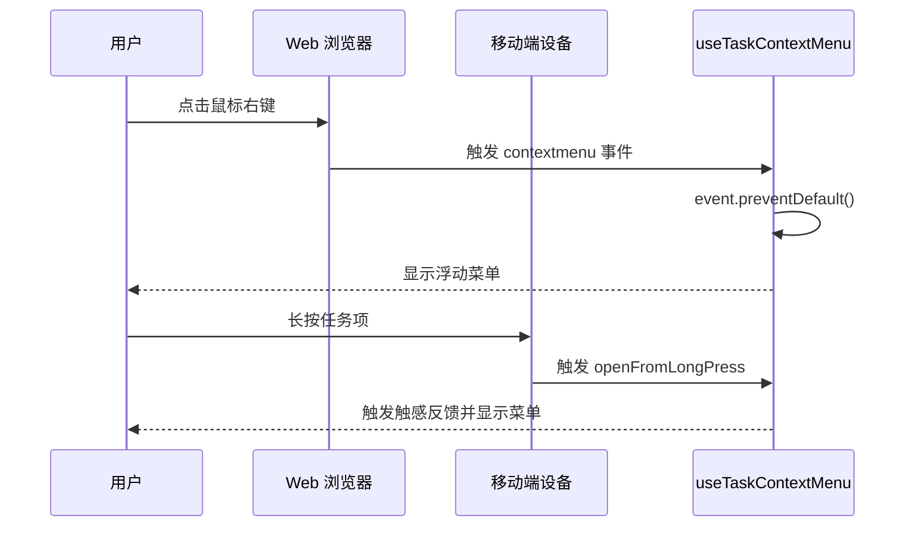
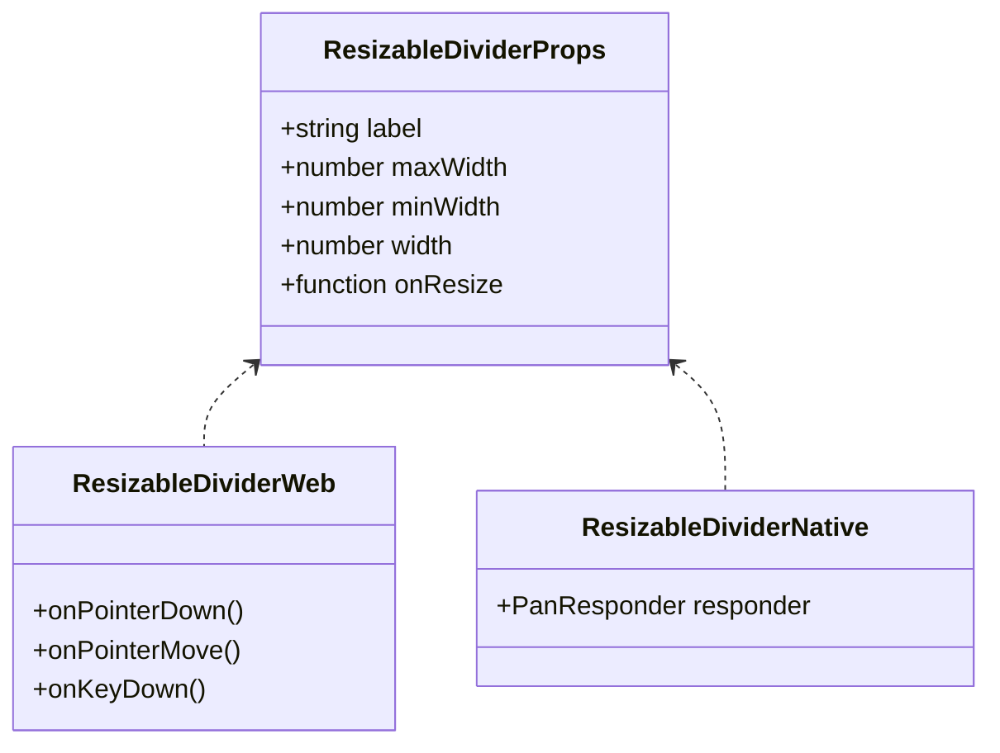

# 跨端开发与 UI 适配

## 目录
1. [引言](#引言)
2. [模块概览](#模块概览)
3. [平台差异化机制](#平台差异化机制)
   - [文件后缀自动选择](#文件后缀自动选择)
   - [条件渲染与逻辑分支](#条件渲染与逻辑分支)
4. [跨端样式开发 (NativeWind)](#跨端样式开发-nativewind)
   - [统一的 Tailwind 配置](#统一的-tailwind-配置)
   - [NativeWind 适配原理](#nativewind-适配原理)
5. [交互适配策略](#交互适配策略)
   - [桌面端特有交互：右键菜单](#桌面端特有交互右键菜单)
   - [移动端特有交互：手势与长按](#移动端特有交互手势与长按)
6. [响应式布局设计](#响应式布局设计)
   - [可调节分割组件 (ResizableDivider)](#可调节分割组件-resizabledivider)
   - [断点适配策略](#断点适配策略)
7. [核心组件实现对比](#核心组件实现对比)
   - [任务行拖拽 (DraggableTaskRow)](#任务行拖拽-draggabletaskrow)
8. [文件参考](#文件参考)

## 引言

LightFlux 是一个基于 Expo 和 React Native 构建的跨端任务管理系统，旨在提供一套统一的代码库，同时在 Web (Desktop)、iOS 和 Android 平台上提供原生的用户体验。

跨端开发的核心挑战在于如何在共享业务逻辑的同时，处理不同平台在 UI 渲染、交互模式（鼠标 vs 触摸）以及系统能力（如文件系统、通知）上的巨大差异。LightFlux 采用了“共享逻辑 + 平台特定实现”的架构模式，通过 React Native Web 和 NativeWind (Tailwind CSS for React Native) 实现了高度的 UI 复用。

## 模块概览

本章节涵盖了 `lightflux/components` 目录下的所有 UI 组件及其跨端适配策略。

- **总文件数**: 46 个源文件（包含 `.tsx` 和 `.ts`）。
- **子模块**:
  - `tasks`: 核心任务列表与交互逻辑（重点覆盖）。
  - `layout`: 包含 `ResizableDivider` 等响应式布局组件（重点覆盖）。
  - `navigation`: 侧边栏与导航项的跨端实现。
  - `editor`: 任务编辑器，包含 Web 端富文本与 Native 端适配。
  - `ui`: 基础原子组件，如 `Toast`、`Tooltip`、`MenuItem` 等。
  - `groups`, `milestones`, `agent`, `account`: 业务功能模块。

## 平台差异化机制

LightFlux 利用 Metro (Native) 和 Webpack/Next.js (Web) 的打包机制，实现了精细化的平台代码隔离。

### 文件后缀自动选择

对于差异极大的组件，我们使用文件后缀来区分实现。构建系统会根据目标平台自动选择最合适的文件：

- `ComponentName.web.tsx`: 仅用于 Web 端的实现，可以直接使用 DOM API 和 CSS 属性。
- `ComponentName.native.tsx`: 用于 iOS 和 Android，使用 React Native 原生组件和 API。
- `ComponentName.tsx`: 作为通用入口或默认实现。

下图展示了构建系统如何根据平台选择文件：



这种机制确保了在 Web 端可以使用 `div`、`onDragStart` 等标准 Web API，而在 Native 端可以使用 `PanResponder` 和 `View`。

### 条件渲染与逻辑分支

对于差异较小的逻辑，我们使用 `Platform.OS` 或 `Platform.select` 进行运行时分支处理。

**代码示例：条件分支处理**
```typescript
import { Platform } from 'react-native';

const openMenu = () => {
  if (Platform.OS === 'web') {
    // Web 特有的右键菜单逻辑
  } else {
    // Native 特有的长按反馈
  }
};
```

**Section sources**:
- [DraggableTaskRow.tsx](lightflux/components/tasks/DraggableTaskRow.tsx)
- [DraggableTaskRow.native.tsx](lightflux/components/tasks/DraggableTaskRow.native.tsx)
- [DraggableTaskRow.web.tsx](lightflux/components/tasks/DraggableTaskRow.web.tsx)

## 跨端样式开发 (NativeWind)

为了在不同平台间共享设计语言，LightFlux 使用了 **NativeWind**。它允许开发者使用标准的 Tailwind CSS 类名来编写 React Native 样式。

### 统一的 Tailwind 配置

所有的样式定义都集中在根目录的 `tailwind.config.js` 中。这确保了颜色、圆角、间距等设计变量在 Web 和 Native 上完全一致。

```javascript
// tailwind.config.js
module.exports = {
  content: ['./components/**/*.{js,jsx,ts,tsx}'],
  theme: {
    extend: {
      colors: {
        primary: '#6759E8',
        canvas: '#F5F5FA',
        ink: '#202136',
      },
    },
  },
};
```

### NativeWind 适配原理

NativeWind 在 Web 端将类名转换为标准的 CSS，而在 Native 端则将类名解析为 `StyleSheet` 对象。



NativeWind 解决了 React Native 中样式继承缺失、单位不统一等痛点，使得 UI 开发体验高度趋同。

**Section sources**:
- [tailwind.config.js](lightflux/tailwind.config.js)
- [config/nativewind.ts](lightflux/config/nativewind.ts)

## 交互适配策略

Web 端和 Native 端的交互模型存在本质区别：Web 依赖鼠标（悬停、右键、精确点击），而 Native 依赖触摸（滑动手势、长按、压力感应）。

### 桌面端特有交互：右键菜单

在 Web 端，用户习惯使用右键打开上下文菜单。LightFlux 通过 `useTaskContextMenu` 钩子统一管理这一行为。



### 移动端特有交互：手势与长按

在移动端，我们使用 `react-native` 的 `PanResponder` 来实现拖拽排序，而在 Web 端则直接使用 HTML5 的 `draggable` 属性。

**Section sources**:
- [useTaskContextMenu.ts](lightflux/components/tasks/useTaskContextMenu.ts)
- [DraggableTaskRow.native.tsx](lightflux/components/tasks/DraggableTaskRow.native.tsx)

## 响应式布局设计

LightFlux 需要适配从手机屏幕到宽屏显示器的各种尺寸。

### 可调节分割组件 (ResizableDivider)

`ResizableDivider` 是跨端布局的核心组件。在桌面端，它支持鼠标拖拽改变侧边栏宽度；在移动端，它通常表现为固定的分割线或支持简单的滑动手势。



### 断点适配策略

我们利用 Tailwind 的响应式前缀（如 `md:`, `lg:`）来处理布局变化。例如，侧边栏在 `lg` 断点以下会自动隐藏，转为抽屉式导航。

**Section sources**:
- [ResizableDivider.tsx](lightflux/components/layout/ResizableDivider.tsx)
- [ResizableDivider.web.tsx](lightflux/components/layout/ResizableDivider.web.tsx)
- [ResizableDivider.native.tsx](lightflux/components/layout/ResizableDivider.native.tsx)

## 核心组件实现对比

以 `DraggableTaskRow` 为例，展示同一功能在不同平台下的实现差异。

### 任务行拖拽 (DraggableTaskRow)

**Web 实现 (HTML5 Drag & Drop)**:
Web 端利用原生 API 实现高性能的拖拽效果，支持跨窗口拖拽（如果需要）和标准的拖拽镜像。

```typescript
// DraggableTaskRow.web.tsx
<div
  draggable
  onDragStart={(event) => {
    event.dataTransfer.setData(DRAG_TYPE, JSON.stringify({ id, scopeId }));
    // 创建自定义预览镜像
    const preview = createDragPreview(row, nested);
    event.dataTransfer.setDragImage(preview, bounds.width / 2, bounds.height / 2);
  }}
  onDrop={(event) => {
    const payload = JSON.parse(event.dataTransfer.getData(DRAG_TYPE));
    onMove(payload.id, index);
  }}
>
  {/* 内容 */}
</div>
```

**Native 实现 (PanResponder)**:
Native 端需要手动处理触摸流，计算偏移量，并通过 `Animated` 或 `setNativeProps` 更新 UI。

```typescript
// DraggableTaskRow.native.tsx
const responder = useMemo(() => PanResponder.create({
  onPanResponderMove: (_, gesture) => setDragOffset(gesture.dy),
  onPanResponderRelease: () => {
    const targetIndex = index + Math.round(latestOffset.current / rowStep);
    onMove(id, targetIndex);
  },
}), [id, index, onMove]);

return (
  <View style={{ transform: [{ translateY: dragOffset }] }}>
    <View {...responder.panHandlers}>⠿</View>
    {children}
  </View>
);
```

这种对比展示了 LightFlux 如何在保持 API 一致（相同的 Props）的前提下，针对平台特性进行深度优化。

## 文件参考

以下是本章节涉及的关键源文件：

- 跨端配置:
  - `tailwind.config.js`: 全局样式定义。
  - `config/nativewind.ts`: NativeWind 运行时配置。
- 布局组件:
  - `lightflux/components/layout/ResizableDivider.tsx`: 分割线入口。
  - `lightflux/components/layout/ResizableDivider.web.tsx`: Web 指针事件实现。
  - `lightflux/components/layout/ResizableDivider.native.tsx`: Native 手势实现。
- 任务组件:
  - `lightflux/components/tasks/DraggableTaskRow.web.tsx`: Web 拖拽逻辑。
  - `lightflux/components/tasks/DraggableTaskRow.native.tsx`: Native 拖拽逻辑。
  - `lightflux/components/tasks/useTaskContextMenu.ts`: 跨端上下文菜单钩子。
- 导航组件:
  - `lightflux/components/navigation/DraggableNavigationItem.tsx`: 导航项适配。
