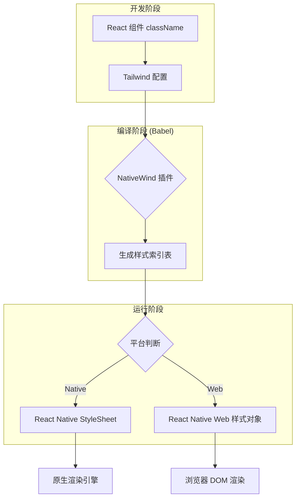
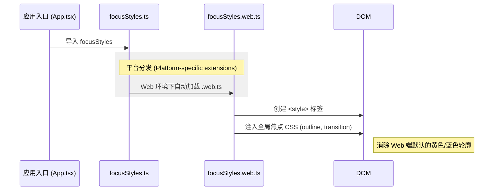
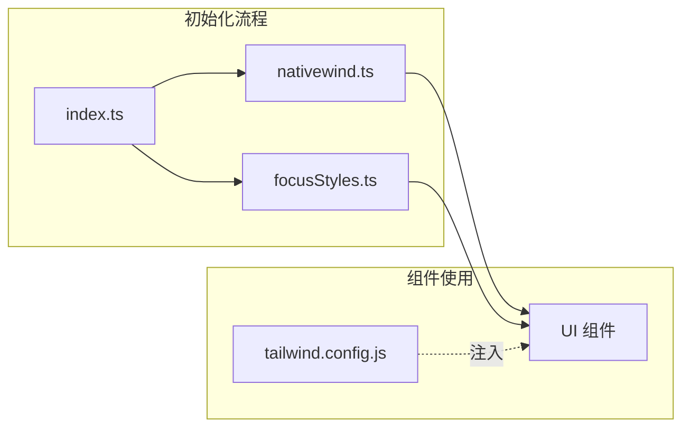

# NativeWind 样式与全局配置

## 目录
1. [模块概览](#模块概览)
2. [引言](#引言)
3. [核心组件与配置](#核心组件与配置)
   - [Tailwind 全局配置](#tailwind-全局配置)
   - [NativeWind 初始化](#nativewind-初始化)
   - [输入框全局配置](#输入框全局配置)
4. [架构设计与样式流转](#架构设计与样式流转)
   - [NativeWind 工作原理](#nativewind-工作原理)
   - [跨端焦点样式处理](#跨端焦点样式处理)
5. [平台特定样式与最佳实践](#平台特定样式与最佳实践)
   - [平台修饰符的应用](#平台修饰符的应用)
   - [交互状态处理](#交互状态处理)
6. [集成点与组件应用](#集成点与组件应用)
7. [文件引用](#文件引用)

## 模块概览

本模块涵盖了 LightFlux 项目中所有与样式系统相关的配置与辅助工具。通过集成 NativeWind（Tailwind CSS for React Native），项目实现了在 Web、iOS 和 Android 平台上使用统一的 CSS 类名进行 UI 开发的能力。

**范围与规模**：
- **核心配置文件**：共 5 个关键文件，分布在根目录及 `lightflux/config/` 目录下。
- **覆盖范围**：包括全局 Tailwind 主题定义、NativeWind 运行时初始化、Web 端特有的焦点样式注入以及跨端通用的输入框属性配置。

**涉及子目录**：
- `lightflux/config/`：存放样式初始化逻辑与平台适配脚本。
- `lightflux/` (根目录)：包含 `tailwind.config.js` 等基础配置文件。

本章节将深入探讨 NativeWind 在跨端架构中的角色，以及如何通过配置确保不同平台间的视觉一致性。

## 引言

在跨端应用开发中，维护一套既能适配 Web 端的 DOM 结构，又能兼容 Native 端的原生组件的样式系统是一项巨大的挑战。LightFlux 选择了 **NativeWind** 作为样式的核心方案。NativeWind 是 Tailwind CSS 的 React Native 实现，它允许开发者使用熟悉的原子化类名（Utility Classes）来构建界面，同时在底层自动将其映射为 React Native 的 `StyleSheet` 或 Web 端的标准 CSS。

### 为什么选择 NativeWind？
1. **开发效率**：原子化类名减少了编写冗长 `StyleSheet` 对象的需求，提高了样式的复用性。
2. **跨端一致性**：通过共享同一个 `tailwind.config.js`，可以确保颜色、间距和字体在所有平台上保持高度同步。
3. **响应式设计**：原生支持 Tailwind 的断点和修饰符，使得处理复杂的屏幕适配变得简单。
4. **性能优化**：NativeWind 在编译阶段将类名转换为静态样式，避免了运行时的性能开销。

在 LightFlux 中，样式系统不仅负责视觉呈现，还承担了处理 Web 端键盘聚焦、Native 端点击态等交互细节的任务。

## 核心组件与配置

### Tailwind 全局配置
`tailwind.config.js` 是整个样式系统的灵魂。它定义了项目的基础视觉规范，包括品牌色、背景色以及文字颜色。

```javascript
/** @type {import('tailwindcss').Config} */
module.exports = {
  content: [
    './App.{js,jsx,ts,tsx}',
    './components/**/*.{js,jsx,ts,tsx}',
  ],
  theme: {
    extend: {
      colors: {
        canvas: '#F5F5FA',
        ink: '#202136',
        primary: '#6759E8',
        surface: '#FFFFFF',
      },
    },
  },
  plugins: [],
};
```

通过 `theme.extend`，我们定义了 LightFlux 的核心调色板：
- `primary` (#6759E8)：品牌主色调，用于按钮、激活状态等。
- `canvas` (#F5F5FA)：全局背景色，呈现淡雅的灰色调。
- `ink` (#202136)：主要文字颜色，确保高对比度阅读体验。
- `surface` (#FFFFFF)：卡片、容器等组件的背景色。

**Section sources**:
- [tailwind.config.js](lightflux/tailwind.config.js)

### NativeWind 初始化
在 NativeWind 2.0+ 版本中，对于 React Native Web 的支持需要特殊的配置。`lightflux/config/nativewind.ts` 确保了即使在 Web 环境下，NativeWind 也能正确识别并应用原生样式的映射逻辑。

```typescript
import { NativeWindStyleSheet } from 'nativewind';

// NativeWind 2 misdetects React Native Web 0.19 as a precompiled CSS setup.
NativeWindStyleSheet.setOutput({
  default: 'native',
  web: 'native',
});
```

这段配置强制 NativeWind 在所有平台上使用 "native" 输出模式。这意味着在 Web 端，NativeWind 不会尝试生成全局 CSS 文件，而是将类名转换为 React Native Web 能够理解的样式对象。这对于保持 Web 和 Native 的行为一致性至关重要。

**Section sources**:
- [lightflux/config/nativewind.ts](lightflux/config/nativewind.ts)

### 输入框全局配置
为了确保跨端的 `TextInput` 组件在聚焦和选择文字时具有一致的视觉反馈，项目在 `lightflux/config/input.ts` 中定义了共享属性。

```typescript
export const inputAccentProps = {
  cursorColor: '#6759E8',
  selectionColor: '#8B7EFF',
  underlineColorAndroid: 'transparent',
} as const;
```

这些属性直接映射到 React Native 的 `TextInput` 组件属性上：
- `cursorColor`：光标颜色，使用品牌主色。
- `selectionColor`：文字选中时的背景色，使用主色的浅色变体。
- `underlineColorAndroid`：禁用 Android 原生输入框下方的横线，以实现自定义 UI。

**Section sources**:
- [lightflux/config/input.ts](lightflux/config/input.ts)

## 架构设计与样式流转

### NativeWind 工作原理
NativeWind 的核心在于其 Babel 插件和运行时引擎。它在构建时扫描代码中的 `className` 属性，并将其与 Tailwind 配置进行匹配。

下图展示了样式从编写到在不同平台渲染的流转过程：



在开发阶段，开发者只需关注 `className="bg-primary p-4"` 这样的原子类。NativeWind 插件会在编译时将其解析。对于 Native 端，它会生成类似于 `StyleSheet.create({ 'bg-primary': { backgroundColor: '#6759E8' } })` 的对象；对于 Web 端，它则适配 React Native Web 的样式注入机制。这种架构确保了开发者只需编写一次样式，即可在多端运行。

### 跨端焦点样式处理
Web 端和 Native 端在交互状态的处理上有显著差异。Web 端依赖 CSS 伪类（如 `:focus-visible`），而 Native 端通常需要通过组件状态（如 `onFocus`）手动控制样式。

LightFlux 采用了一种巧妙的平台分发机制来处理 Web 端的全局焦点样式：



在 `lightflux/config/focusStyles.web.ts` 中，我们注入了针对 Web 端特定元素的 CSS：

```typescript
const style = document.createElement('style');
style.textContent = `
  input:focus, textarea:focus {
    outline: none !important;
  }
  button:focus-visible {
    outline: 2px solid rgba(103, 89, 232, 0.72) !important;
    outline-offset: 2px;
  }
  /* ... 更多针对特定 ID 的样式 */
`;
```

而在 `lightflux/config/focusStyles.ts` 中，内容为空（`export {};`）。这意味着在 Native 环境下，不会有任何 CSS 注入动作，从而避免了在非 DOM 环境下执行 `document` 相关操作导致的崩溃。

**Section sources**:
- [lightflux/config/focusStyles.ts](lightflux/config/focusStyles.ts)
- [lightflux/config/focusStyles.web.ts](lightflux/config/focusStyles.web.ts)

## 平台特定样式与最佳实践

### 平台修饰符的应用
虽然 NativeWind 致力于抹平平台差异，但有时我们仍需针对特定平台微调样式。NativeWind 提供了平台修饰符功能。

```mermaid
flowchart TD
    A[编写类名] --> B{是否需要平台差异?}
    B -- 否 --> C[使用标准类名: flex-1 bg-white]
    B -- 是 --> D{目标平台?}
    D -- Native --> E[使用 native: 修饰符]
    D -- Web --> F[使用 web: 修饰符]
    
    E --> G[例如: native:flex-row (仅在移动端生效)]
    F --> H[例如: web:shadow-lg (仅在浏览器生效)]
```

在 LightFlux 的 `TodoScreen.tsx` 中，我们可以看到大量原子类名的使用：
```tsx
<View
  className="mb-1.5 min-h-[52px] flex-row items-center overflow-hidden rounded-[14px] border border-[#E8E5EF] bg-white px-2.5"
>
  {/* 内容 */}
</View>
```

### 交互状态处理
对于点击态（Pressed）和悬停态（Hovered），NativeWind 支持 `active:` 和 `hover:` 修饰符。但在复杂的自定义组件（如 `ActionButton`）中，项目有时会结合使用 `Pressable` 的状态反馈和 `StyleSheet` 来实现更精细的控制。

> 💡 **提示**：在编写跨端 UI 时，优先使用 NativeWind 的类名。只有当需要根据动态逻辑（如 `size` 属性）切换大量样式，或者 NativeWind 无法覆盖某些原生特有属性时，才考虑退回到 `StyleSheet`。

## 集成点与组件应用

样式系统通过 `App.tsx` 或 `index.ts` 引入，确保在应用启动时完成初始化。



在实际开发中，开发者应遵循以下模式：
1. **定义主题**：在 `tailwind.config.js` 中添加新的颜色或间距。
2. **应用样式**：在组件中使用 `className` 引用这些定义。
3. **处理交互**：使用 `inputAccentProps` 配置输入框，使用 `focusStyles` 处理 Web 端焦点。

例如，在任务列表行组件中，通过 `className` 快速实现布局和装饰：
```tsx
<View className="flex-row items-center py-2 px-3 bg-surface rounded-lg border border-ink/10">
  <Text className="text-ink font-medium">任务标题</Text>
</View>
```

## 文件引用

以下是本章节涉及的核心配置文件及其路径：

- [tailwind.config.js](lightflux/tailwind.config.js)：全局 Tailwind CSS 主题与内容配置。
- [lightflux/config/nativewind.ts](lightflux/config/nativewind.ts)：NativeWind 运行时输出模式初始化。
- [lightflux/config/focusStyles.ts](lightflux/config/focusStyles.ts)：Native 端焦点样式占位符（空实现）。
- [lightflux/config/focusStyles.web.ts](lightflux/config/focusStyles.web.ts)：Web 端全局 CSS 焦点样式注入逻辑。
- [lightflux/config/input.ts](lightflux/config/input.ts)：跨端通用的输入框高亮属性配置。
- [lightflux/babel.config.js](lightflux/babel.config.js)：包含 `nativewind/babel` 插件配置，负责样式的编译转换。
