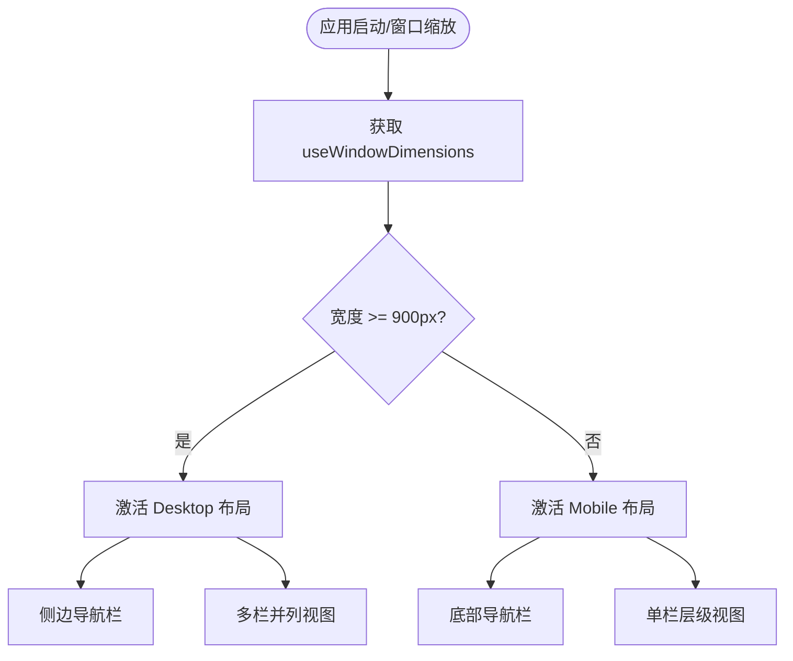
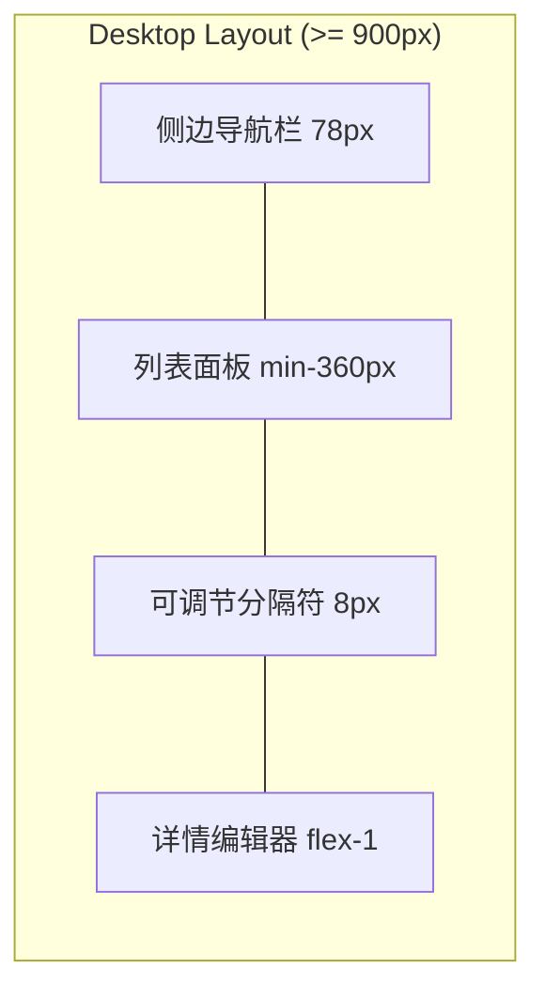
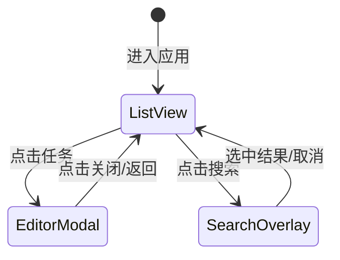
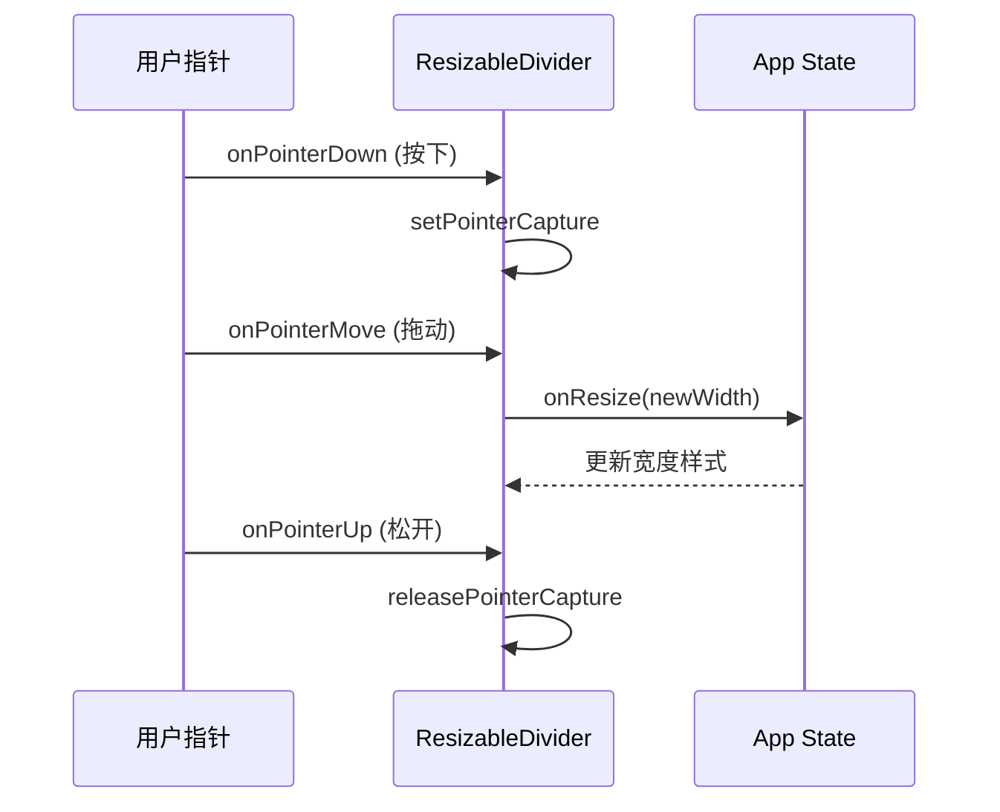

# 响应式布局与多端 UI 策略

## 目录
1. [模块概览](#模块概览)
2. [响应式设计原则与断点策略](#响应式设计原则与断点策略)
3. [桌面端多栏布局架构](#桌面端多栏布局架构)
4. [移动端单栏与手势策略](#移动端单栏与手势策略)
5. [核心交互组件的适配逻辑](#核心交互组件的适配逻辑)
6. [跨端实现细节：ResizableDivider](#跨端实现细节-resizabledivider)
7. [核心组件与文件引用](#核心组件与文件引用)

## 模块概览

LightFlux 采用了一套统一的响应式布局策略，旨在通过单一代码库（React Native + Expo + Tauri）同时支持手机、平板及桌面端。该策略不仅涵盖了屏幕尺寸的适配，还深入到了交互模式的差异化处理，如桌面端的鼠标拖拽与移动端的手势操作。

**模块统计**：
- **核心布局文件**：`lightflux/App.tsx` (根容器), `lightflux/components/layout/ResizableDivider.tsx` (可调节分隔符)
- **适配组件**：约 10 个核心组件涉及显式的响应式逻辑
- **覆盖范围**：包括导航容器、主列表视图、任务编辑详情页、搜索浮层及 AI 助手面板

本章节将重点分析 LightFlux 如何利用 `useWindowDimensions` 钩子实时响应屏幕变化，并根据 900px 断点切换完全不同的 UI 拓扑结构。

## 响应式设计原则与断点策略

LightFlux 的响应式设计基于“内容优先”的原则。在小屏幕上，应用专注于单一任务流；而在大屏幕上，则利用多余的空间展示更多上下文信息，减少层级跳转。

### 断点定义
应用定义了一个核心断点：**900px**。
- **宽屏模式 (>= 900px)**：激活桌面端布局，支持多栏并列。
- **紧凑模式 (< 900px)**：激活移动端布局，采用底部导航和全屏模态框。

以下流程图展示了应用启动及缩放时，布局模式的判定逻辑：



在 `lightflux/App.tsx` 中，这一逻辑通过简单的布尔变量驱动：

```typescript
// lightflux/App.tsx

const { width } = useWindowDimensions();
const usesDesktopLayout = width >= 900;

// 根据 usesDesktopLayout 决定渲染组件
return (
  <View className="flex-1 flex-row bg-canvas">
    {usesDesktopLayout ? <DesktopSidebar /> : null}
    <MainContent usesDesktopLayout={usesDesktopLayout} />
    {!usesDesktopLayout ? <MobileBottomNav /> : null}
  </View>
);
```

**设计分析**：
这种基于断点的显式切换比纯 CSS 媒体查询更灵活，因为它允许我们在不同模式下渲染完全不同的组件树（如侧边栏 vs 底部栏），而不仅仅是改变样式。

**Section sources**:
- [App.tsx](lightflux/App.tsx)

## 桌面端多栏布局架构

在桌面端（Tauri 环境下），LightFlux 充分利用横向空间。其核心架构由三个水平排列的区域组成。

### 布局组件结构
1. **固定侧边栏 (78px)**：包含头像、可拖拽排序的导航项及 AI 助手入口。
2. **列表面板 (动态宽度)**：展示当前选中的任务列表（如“今天”或“收集箱”）。
3. **详情面板 (弹性宽度)**：当选中某个任务时，在右侧展开编辑器。



这种布局通过 `ResizableDivider` 组件实现了列表面板宽度的动态调节，增强了桌面端用户的自定义能力。

**Section sources**:
- [App.tsx](lightflux/App.tsx)
- [components/layout/ResizableDivider.tsx](lightflux/components/layout/ResizableDivider.tsx)

## 移动端单栏与手势策略

移动端适配侧重于单手操作的便利性以及安全区域（Safe Area）的妥善处理。

### 交互模式转变
- **导航切换**：从侧边栏转为底部标签栏，方便大拇指触达。
- **任务编辑**：不再采用并列面板，而是使用 `Modal` 组件进行全屏覆盖。
- **手势支持**：列表项支持长按（Long Press）唤起上下文菜单，利用 `delayLongPress={350}` 优化触控反馈。



在移动端，`TaskEditorScreen` 的呈现方式如下：

```typescript
// lightflux/App.tsx 中的移动端编辑逻辑

{selectedTask && !usesDesktopLayout ? (
  <Modal
    animationType="none"
    onRequestClose={closeSelectedTask}
    presentationStyle="fullScreen"
    visible
  >
    <View style={styles.mobileEditorOverlay}>
      <TaskEditorScreen
        todoId={selectedTask.id}
        onClose={closeSelectedTask}
      />
    </View>
  </Modal>
) : null}
```

**Section sources**:
- [App.tsx](lightflux/App.tsx)
- [components/TodoScreen.tsx](lightflux/components/TodoScreen.tsx)

## 核心交互组件的适配逻辑

除了主布局外，搜索浮层（SearchOverlay）和 AI 指令面板（AgentCommandPanel）也针对不同端进行了深度适配。

### 搜索浮层 (SearchOverlay)
搜索框在桌面端和移动端呈现出完全不同的视觉形态：
- **桌面端**：悬浮在屏幕正上方，固定宽度（760px），模仿 Spotlight 搜索体验。
- **移动端**：底部弹出的半屏或全屏 Sheet，方便快速输入。

```typescript
// lightflux/components/SearchOverlay.tsx

const compact = width < 900;

return (
  <SafeAreaView
    style={compact ? styles.compactPosition : styles.desktopPosition}
  >
    <Animated.View
      style={[
        styles.panel,
        compact ? styles.compactPanel : styles.desktopPanel,
        // ... 动画逻辑
      ]}
    >
      {/* 搜索内容 */}
    </Animated.View>
  </SafeAreaView>
);
```

### 键盘与焦点管理
- **桌面端**：支持 `Cmd+F` (搜索) 和 `Cmd+J` (AI 助手) 快捷键。
- **移动端**：自动处理 `KeyboardAvoidingView`，确保输入框不被软键盘遮挡。

**Section sources**:
- [components/SearchOverlay.tsx](lightflux/components/SearchOverlay.tsx)
- [components/agent/AgentCommandPanel.tsx](lightflux/components/agent/AgentCommandPanel.tsx)

## 跨端实现细节：ResizableDivider

`ResizableDivider` 是 LightFlux 桌面端体验的关键。它在 Web/Tauri 环境下利用指针捕获（Pointer Capture）API 实现了流畅的拖拽体验。

### 拖拽逻辑实现
组件通过 `onPointerDown` 捕获指针，并在 `onPointerMove` 中计算偏移量，实时更新面板宽度。



核心代码实现：

```typescript
// lightflux/components/layout/ResizableDivider.web.tsx

const resizeFromPointer = (clientX: number) => {
  onResize(
    clamp(
      dragStart.current.width + clientX - dragStart.current.pointerX,
      minWidth,
      maxWidth,
    ),
  );
};

return (
  <div
    role="slider"
    onPointerDown={(e) => {
      e.currentTarget.setPointerCapture(e.pointerId);
      beginDrag(e.clientX);
    }}
    onPointerMove={(e) => {
      if (e.currentTarget.hasPointerCapture(e.pointerId)) {
        resizeFromPointer(e.clientX);
      }
    }}
    // ...
  />
);
```

**辅助功能**：
该组件还实现了 `role="slider"` 和键盘支持（左/右方向键），确保符合 Web 可访问性标准。

**Section sources**:
- [components/layout/ResizableDivider.web.tsx](lightflux/components/layout/ResizableDivider.web.tsx)

## 核心组件与文件引用

以下是涉及响应式布局与多端适配的核心文件列表：

| 文件路径 | 职责描述 |
|:---|:---|
| `lightflux/App.tsx` | 根布局容器，定义 900px 断点及主导航切换逻辑。 |
| `lightflux/components/layout/ResizableDivider.tsx` | 跨端入口，根据平台加载 `.web` 或 `.native` 实现。 |
| `lightflux/components/layout/ResizableDivider.web.tsx` | 桌面端特有的可调节面板分隔符实现。 |
| `lightflux/components/navigation/DraggableNavigationItem.tsx` | 桌面端侧边栏的可拖拽导航项。 |
| `lightflux/components/TodoScreen.tsx` | 任务列表主页面，包含最大宽度限制（760px）及移动端手势。 |
| `lightflux/components/SearchOverlay.tsx` | 响应式搜索浮层，支持桌面悬浮与移动端底部弹出。 |
| `lightflux/components/tasks/useTaskContextMenu.ts` | 封装了右键菜单（Web）与长按菜单（Native）的适配逻辑。 |
| `lightflux/components/ui/IconButton.tsx` | 通用按钮组件，支持不同端的 Tooltip 显示策略。 |

**Section sources**:
- [App.tsx](lightflux/App.tsx)
- [components/layout/ResizableDivider.tsx](lightflux/components/layout/ResizableDivider.tsx)
- [components/TodoScreen.tsx](lightflux/components/TodoScreen.tsx)
- [components/SearchOverlay.tsx](lightflux/components/SearchOverlay.tsx)
