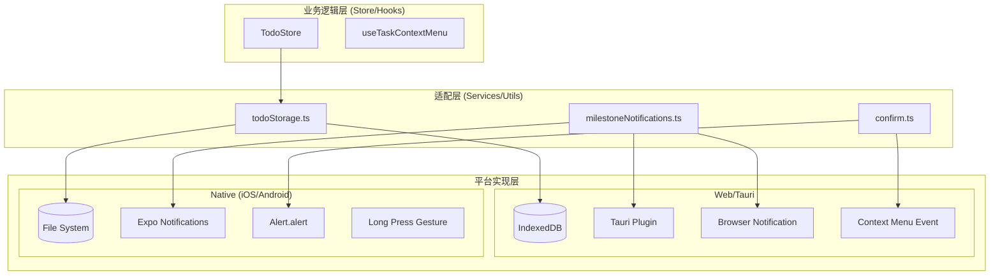
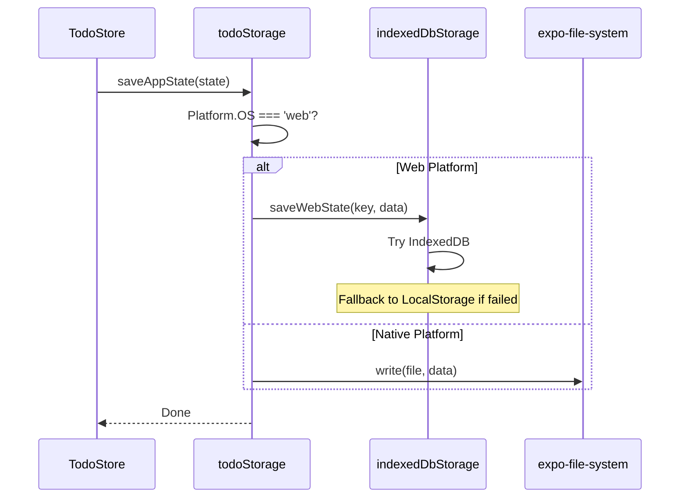
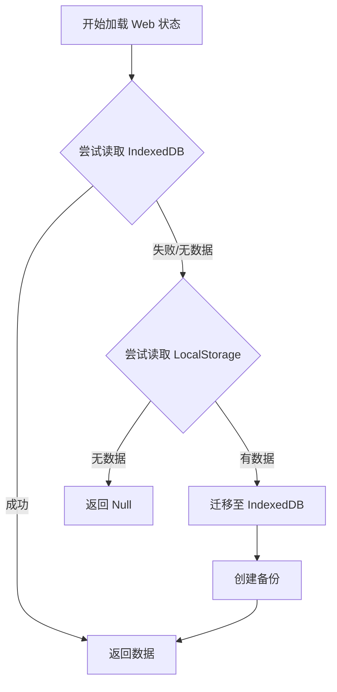
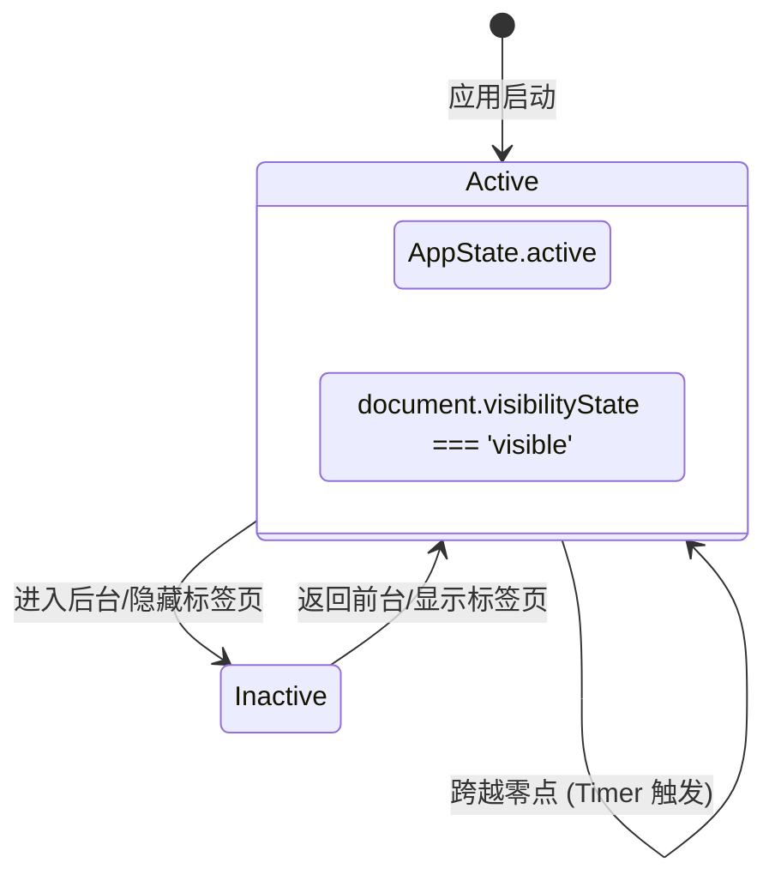

# 平台差异化逻辑处理

## 目录
1. [模块概览](#模块概览)
2. [引言](#引言)
3. [架构设计与分层](#架构设计与分层)
4. [核心组件分析](#核心组件分析)
   - [Platform 抽象模式](#platform-抽象模式)
   - [todoStorage：持久化存储适配](#todostorage持久化存储适配)
5. [存储适配深度解析](#存储适配深度解析)
   - [Native 端：基于文件系统的持久化](#native-端基于文件系统的持久化)
   - [Web 端：从 LocalStorage 到 IndexedDB 的演进](#web-端从-localstorage-到-indexeddb-的演进)
6. [通知系统差异化实现](#通知系统差异化实现)
   - [Native 推送：Expo Notifications](#native-推送expo-notifications)
   - [桌面端：Tauri 插件集成](#桌面端tauri-插件集成)
   - [浏览器：基于 Runtime Timer 的模拟调度](#浏览器基于-runtime-timer-的模拟调度)
7. [交互与事件反馈适配](#交互与事件反馈适配)
   - [右键菜单与长按手势的统一](#右键菜单与长按手势的统一)
   - [系统对话框的平台封装](#系统对话框的平台封装)
8. [生命周期与环境感知](#生命周期与环境感知)
9. [集成点与依赖关系](#集成点与依赖关系)
10. [错误处理与回退策略](#错误处理与回退策略)
11. [文件参考](#文件参考)

## 模块概览

在 LightFlux 的跨平台开发实践中，业务逻辑层（Non-UI Layer）的平台差异化处理是确保应用在 Web、iOS、Android 以及桌面端（Tauri）表现一致的关键。本模块涵盖了存储、通知、交互反馈及系统级 Hook 的适配逻辑。

通过对代码库的检索与分析，我们识别出以下核心数据：
- **涉及文件总数**：约 19 个核心逻辑文件。
- **主要分布目录**：
  - `lightflux/services/`：存储驱动、通知调度、API 适配。
  - `lightflux/utils/`：系统对话框封装、日期处理工具。
  - `lightflux/hooks/`：环境感知 Hook、生命周期管理。
  - `lightflux/components/`：交互反馈逻辑（如右键菜单）。

本章节将深入剖析这些模块如何通过 `Platform.OS` 和 `Platform.select` 实现一套代码多端运行的业务逻辑抽象。

## 引言

LightFlux 作为一个基于 React Native 和 Expo 的跨平台项目，其目标是提供无缝的用户体验。然而，不同平台在底层 API（如持久化存储、推送通知、原生 UI 组件）上存在显著差异。

平台差异化逻辑处理的核心目标是：
1. **统一接口**：为上层业务逻辑提供一致的 API，隐藏底层实现细节。
2. **性能优化**：在 Web 端利用 IndexedDB 提升大数据量处理能力，在 Native 端利用文件系统确保数据安全。
3. **功能对齐**：在浏览器缺乏后台调度能力的情况下，通过运行时计时器模拟移动端的通知调度。
4. **交互自然**：确保 Web 用户习惯的右键点击与 Native 用户习惯的长按手势触发相同的业务逻辑。

## 架构设计与分层

LightFlux 采用了典型的“适配器模式”来处理平台差异。业务逻辑层不直接调用平台特定的 API，而是通过服务层（Services）或工具类（Utils）进行中转。

下图展示了 LightFlux 平台差异化处理的整体架构：



该架构确保了 `TodoStore` 等核心业务逻辑无需关心当前运行在哪个平台。适配层通过 `Platform.OS` 进行静态或动态分支判断，选择最合适的驱动程序执行操作。

**架构说明**：
- **业务逻辑层**：保持纯净，仅依赖抽象接口。
- **适配层**：这是平台判断逻辑最集中的地方。它负责根据当前环境初始化不同的驱动程序。
- **平台实现层**：包含真正的底层调用，如 `expo-file-system` 或 `window.confirm`。

## 核心组件分析

### Platform 抽象模式

LightFlux 在处理平台差异时遵循两种主要模式：**静态分支判断**和**驱动程序注入**。

#### 静态分支判断
在简单的工具类中，直接使用 `Platform.OS` 进行判断。例如在 `lightflux/utils/confirm.ts` 中：

```typescript
export const requestConfirmation = ({
  cancelText,
  confirmText,
  message,
  onConfirm,
  title,
}: ConfirmationOptions) => {
  if (Platform.OS === 'web') {
    // Web 端直接使用浏览器原生对话框
    if (globalThis.confirm?.(`${title}\n\n${message}`)) {
      onConfirm();
    }
    return;
  }

  // Native 端使用 React Native 的 Alert 组件
  Alert.alert(title, message, [
    { text: cancelText, style: 'cancel' },
    { text: confirmText, style: 'destructive', onPress: onConfirm },
  ]);
};
```

这种模式适用于逻辑简单、依赖较少的场景。

#### 驱动程序注入
对于复杂的系统（如存储），LightFlux 倾向于将平台特定的逻辑封装在独立的驱动文件中，然后在主服务中引用。

### todoStorage：持久化存储适配

`todoStorage.ts` 是应用状态持久化的核心入口。它负责将内存中的 `PersistedAppState` 序列化并保存到物理介质中。



在 `saveDeviceState` 函数中，我们可以看到清晰的平台切换逻辑：

```typescript
const saveDeviceState = async (state: PersistedAppState): Promise<void> => {
  const serializedState = JSON.stringify(state);

  if (Platform.OS === 'web') {
    await saveWebState(STORAGE_KEY, serializedState);
    return;
  }

  stateFile().write(serializedState);
};
```

**Section sources**:
- [lightflux/services/todoStorage.ts](lightflux/services/todoStorage.ts)
- [lightflux/utils/confirm.ts](lightflux/utils/confirm.ts)

## 存储适配深度解析

存储适配是 LightFlux 中最复杂的平台差异化实践之一。它不仅涉及到 API 的不同，还涉及到数据一致性和回退机制的考量。

### Native 端：基于文件系统的持久化

在 iOS 和 Android 上，LightFlux 使用 `expo-file-system` 直接操作设备存储。相比于 `AsyncStorage`，直接使用文件系统具有更高的读写性能，尤其是在处理包含大量任务和历史事件的大型 JSON 对象时。

**实现细节**：
- 使用 `Paths.document` 获取应用的文档根目录。
- 通过 `stateFile().write()` 进行原子化写入。
- 这种方式绕过了 `AsyncStorage` 的大小限制，为未来的离线功能提供了更好的支持。

### Web 端：从 LocalStorage 到 IndexedDB 的演进

Web 端的存储逻辑位于 `lightflux/services/indexedDbStorage.ts`。这是一个非常典型的渐进式增强示例。

1. **IndexedDB 优先**：现代浏览器推荐使用 IndexedDB 处理结构化数据。它支持更大的容量和异步操作，不会阻塞主线程。
2. **LocalStorage 回退**：如果 IndexedDB 不可用（如在隐私模式下），系统会自动回退到 `localStorage`。
3. **数据迁移**：当用户从旧版本升级时，系统会自动将 `localStorage` 中的数据迁移到 IndexedDB，并保留一个备份。



这种多层级回退机制确保了 Web 端数据的极端稳健性，即使在浏览器环境受限的情况下也能正常工作。

**Section sources**:
- [lightflux/services/indexedDbStorage.ts](lightflux/services/indexedDbStorage.ts)
- [lightflux/services/todoStorage.ts](lightflux/services/todoStorage.ts)

## 通知系统差异化实现

通知系统是平台差异最大的领域。移动端拥有成熟的后台推送和本地调度机制，而 Web 端则受限于浏览器的安全策略和生命周期。

### Native 推送：Expo Notifications

在 Native 端，`milestoneNotifications.ts` 调用 `expo-notifications`。
- **注册**：在 Android 上需要显式创建通知渠道（Channel）。
- **调度**：使用 `scheduleNotificationAsync` 进行本地调度，即使应用关闭，系统也会准时触发。
- **限制**：iOS 限制每个应用的本地通知数量为 64 条，因此代码中包含了 `MAX_IOS_SCHEDULES` 的截断逻辑。

### 桌面端：Tauri 插件集成

LightFlux 支持通过 Tauri 打包为桌面应用。
- **动态导入**：使用 `await import('@tauri-apps/api/core')` 探测是否处于 Tauri 环境。
- **插件调用**：如果处于 Tauri 环境，则使用 `@tauri-apps/plugin-notification` 调用操作系统的原生通知 API。
- **ID 映射**：Tauri 通知需要数值型 ID，代码实现了一个基于哈希算法的 `tauriNotificationId` 生成器。

### 浏览器：基于 Runtime Timer 的模拟调度

这是最有趣的部分。由于标准浏览器不支持在应用关闭时触发本地通知，LightFlux 实现了一套基于运行时计时器的方案。

```typescript
const armBrowserTimer = (
  schedule: MilestoneReminderSchedule,
  state: WebTimerState,
) => {
  const delay = schedule.fireDate.getTime() - Date.now();
  if (delay <= 0) {
    showBrowserNotification(schedule);
    return;
  }
  // 使用 setTimeout 模拟调度，处理 MAX_WEB_TIMEOUT_MS 限制
  state.handle = setTimeout(
    () => armBrowserTimer(schedule, state),
    Math.min(delay, MAX_WEB_TIMEOUT_MS),
  );
};
```

**逻辑说明**：
- **计时器限制**：`setTimeout` 的最大延迟约为 24.8 天（`2^31 - 1` 毫秒）。如果提醒时间远在未来，系统会分段计时。
- **状态同步**：当用户刷新页面或关闭标签页时，计时器会销毁。下一次打开应用时，`reconcileMilestoneNotifications` 会根据当前时间重新计算并启动计时器。

**Section sources**:
- [lightflux/services/milestoneNotifications.ts](lightflux/services/milestoneNotifications.ts)

## 交互与事件反馈适配

UI 交互的平台差异主要体现在输入设备（鼠标 vs 触摸屏）上。

### 右键菜单与长按手势的统一

在任务列表项中，用户期望通过某种方式打开操作菜单。
- **Web 端**：习惯使用鼠标右键。
- **Native 端**：习惯使用长按手势。

`useTaskContextMenu.ts` 完美地抽象了这一逻辑：

```typescript
export const useTaskContextMenu = (todoId: string, onOpen: OpenTaskMenu) => {
  const targetRef = useRef<View>(null);

  useEffect(() => {
    if (Platform.OS !== 'web') return;

    const element = targetRef.current as unknown as HTMLElement | null;
    if (!element) return;

    const openMenu = (event: MouseEvent) => {
      event.preventDefault(); // 阻止浏览器原生右键菜单
      onOpen(todoId, { x: event.clientX, y: event.clientY });
    };

    element.addEventListener('contextmenu', openMenu);
    return () => element.removeEventListener('contextmenu', openMenu);
  }, [onOpen, todoId]);

  const openFromLongPress = useCallback(() => onOpen(todoId), [onOpen, todoId]);

  return { targetRef, openFromLongPress };
};
```

**实现亮点**：
- **事件拦截**：在 Web 端通过 `event.preventDefault()` 屏蔽系统菜单，代之以自定义的 `MenuSurface`。
- **位置感知**：Web 端菜单会精准出现在鼠标点击位置，而 Native 端则通常弹出底部抽屉或居中对话框。

### 系统对话框的平台封装

如前所述，`confirm.ts` 将 `window.confirm` 和 `Alert.alert` 统一为 `requestConfirmation` 接口。这使得删除任务等敏感操作的确认逻辑在全平台保持一致的调用方式。

**Section sources**:
- [lightflux/components/tasks/useTaskContextMenu.ts](lightflux/components/tasks/useTaskContextMenu.ts)
- [lightflux/utils/confirm.ts](lightflux/utils/confirm.ts)

## 生命周期与环境感知

不同平台对于“应用活跃状态”的定义不同。

在 `useCurrentDateKey.ts` 中，系统需要实时更新“今天”的日期键值，以便在跨越零点时自动切换视图。



**差异化处理**：
- **Native**：监听 `AppState` 的 `change` 事件。当状态从 `background` 变为 `active` 时，重新计算日期。
- **Web**：监听 `document` 的 `visibilitychange` 事件。当用户切换回标签页时触发更新。

这种细微的适配确保了用户在第二天早上打开手机或浏览器标签页时，看到的总是最新的任务列表，而不需要手动刷新。

**Section sources**:
- [lightflux/hooks/useCurrentDateKey.ts](lightflux/hooks/useCurrentDateKey.ts)

## 集成点与依赖关系

平台差异化逻辑并不是孤立存在的，它深深植根于应用的各个生命周期阶段。

1. **应用启动 (App.tsx)**：
   - 初始化通知权限请求。
   - 加载持久化存储中的初始状态。
2. **状态管理 (TodoStore)**：
   - 每次状态变更后调用 `saveAppState`。
   - 监听到里程碑变更后触发 `reconcileMilestoneNotifications`。
3. **UI 组件 (TodoScreen)**：
   - 使用 `useTaskContextMenu` 绑定交互事件。
   - 使用 `requestConfirmation` 处理破坏性操作。

这种高度集成的设计要求开发者在添加新功能时，必须同时考虑 Web 和 Native 的实现路径。

## 错误处理与回退策略

在处理平台 API 时，鲁棒性是第一位的。LightFlux 采用了多层级的错误处理：

| 场景 | 潜在问题 | 回退策略 |
| :--- | :--- | :--- |
| **Web 存储** | IndexedDB 被禁用 | 使用 LocalStorage 存储数据 |
| **通知权限** | 用户拒绝权限 | 捕获异常，静默失败，不影响主流程 |
| **Tauri 环境** | 插件加载失败 | 回退到标准浏览器 Notification 逻辑 |
| **Native 文件系统** | 磁盘空间不足 | 抛出 Warn 并在 UI 层提示用户 |
| **远程同步** | 网络不可用 | 优先使用 `deviceState`，待恢复后合并 |

这种“优雅降级”的思想贯穿了整个平台适配层。

**Section sources**:
- [lightflux/services/indexedDbStorage.ts](lightflux/services/indexedDbStorage.ts)
- [lightflux/services/todoStorage.ts](lightflux/services/todoStorage.ts)
- [lightflux/services/milestoneNotifications.ts](lightflux/services/milestoneNotifications.ts)

## 文件参考

以下是本章节涉及的核心源文件，建议在深入研究平台适配逻辑时参考：

- `lightflux/services/todoStorage.ts`：持久化存储的平台分发器。
- `lightflux/services/indexedDbStorage.ts`：Web 端 IndexedDB 实现及回退逻辑。
- `lightflux/services/milestoneNotifications.ts`：包含 Native、Tauri 和 Browser 三端通知逻辑的复杂实现。
- `lightflux/services/sessionStorage.ts`：用户会话状态的平台差异化存储。
- `lightflux/utils/confirm.ts`：系统确认对话框的跨平台封装。
- `lightflux/hooks/useCurrentDateKey.ts`：环境感知的日期自动更新 Hook。
- `lightflux/components/tasks/useTaskContextMenu.ts`：右键菜单与长按手势的适配器。
- `lightflux/store/todoStore.tsx`：业务逻辑层，调用上述适配服务。
