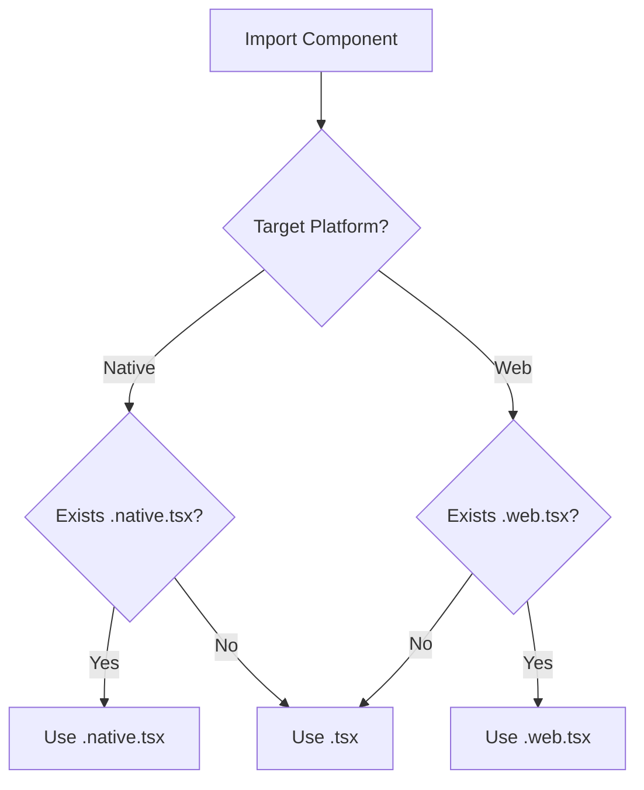
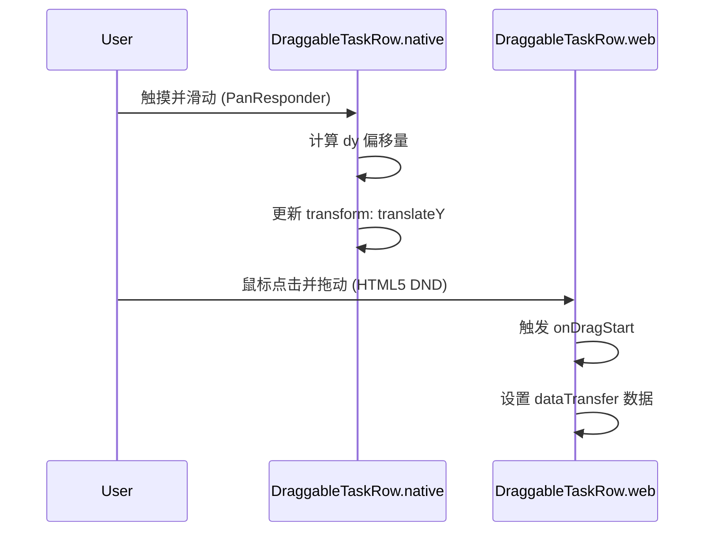
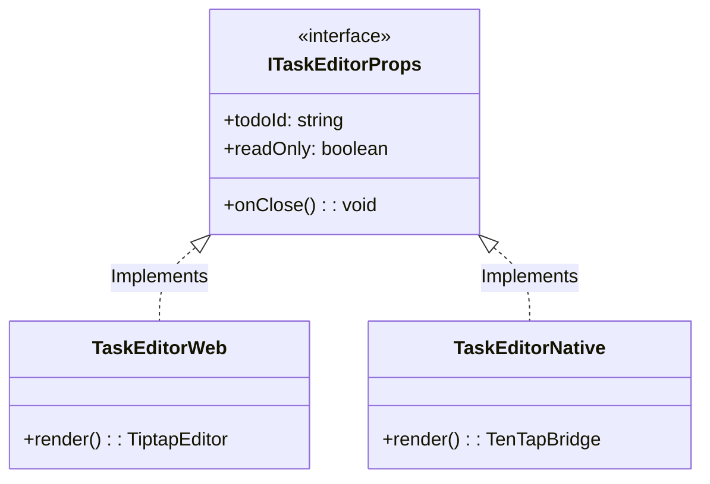

# 跨端文件命名与自动选择机制

## 目录
1. [模块概览](#模块概览)
2. [跨端适配机制简介](#跨端适配机制简介)
3. [核心组件实现对比](#核心组件实现对比)
   - [DraggableTaskRow：拖拽排序的差异化实现](#draggabletaskrow拖拽排序的差异化实现)
   - [TaskEditorScreen：富文本编辑器的平台适配](#taskeditorscreen富文本编辑器的平台适配)
   - [ResizableDivider：手势与指针事件的对齐](#resizabledivider手势与指针事件的对齐)
4. [接口对齐与类型安全](#接口对齐与类型安全)
5. [文件后缀优先级与打包逻辑](#文件后缀优先级与打包逻辑)
6. [最佳实践：后缀文件 vs Platform.OS](#最佳实践后缀文件-vs-platformos)
7. [关键文件索引](#关键文件索引)

## 模块概览

在 LightFlux 项目中，跨端适配是核心架构设计之一。为了在 Web 端和 Native 端（iOS/Android）提供最佳的用户体验，项目广泛采用了 React Native 的文件后缀机制。

**统计数据：**
- **涉及目录**：`lightflux/components/` 及其子目录。
- **文件总数**：约 46 个源文件。
- **跨端组件数**：已识别出 4 组核心跨端组件，每组包含 `.tsx`、`.native.tsx` 和 `.web.tsx` 三个版本。
- **覆盖范围**：涵盖了任务列表拖拽、富文本编辑、响应式布局分割条以及导航项等复杂交互场景。

本章节将深入探讨这些组件如何通过文件名后缀实现平台差异化逻辑，同时保持代码库的整洁与接口的一致性。

## 跨端适配机制简介

LightFlux 利用 Expo 和 React Native 的打包工具（Metro 和 Webpack/Metro-web）提供的文件自动选择机制。这种机制允许开发者为同一逻辑组件编写多个平台的特定实现，而无需在调用方进行繁琐的平台判断。

### 机制运作原理

当代码中通过 `import DraggableTaskRow from './DraggableTaskRow'` 引入组件时，打包工具会根据当前目标平台自动解析文件：
- **Native 平台 (iOS/Android)**：优先查找 `.native.tsx`，如果不存在则回退到 `.tsx`。
- **Web 平台**：优先查找 `.web.tsx`，如果不存在则回退到 `.tsx`。

这种设计使得业务逻辑层可以无感知地使用这些组件，而底层实现则可以利用各自平台的原生 API（如 Web 的 HTML5 Drag and Drop 或 Native 的 PanResponder）。

下图展示了打包工具在不同平台下的文件选择路径：



通过这种路径选择，LightFlux 确保了每个平台都能运行最适合其特性的代码。例如，Web 端可以使用标准的 DOM 事件，而 Native 端可以使用高性能的原生手势库。

**Section sources**:
- [DraggableTaskRow.tsx](lightflux/components/tasks/DraggableTaskRow.tsx)
- [ResizableDivider.tsx](lightflux/components/layout/ResizableDivider.tsx)

## 核心组件实现对比

为了理解后缀机制的实际应用，我们选取了三个具有代表性的组件进行深入分析。

### DraggableTaskRow：拖拽排序的差异化实现

`DraggableTaskRow` 是任务列表中的核心交互组件，支持通过拖拽手柄改变任务顺序。

- **Native 实现 (`.native.tsx`)**：使用了 React Native 的 `PanResponder` API。它通过监听手指的滑动轨迹（`dy` 偏移量），实时更新组件的 `translateY` 变换，从而实现平滑的拖拽效果。
- **Web 实现 (`.web.tsx`)**：利用了 HTML5 标准的 `draggable` 属性和 `onDragStart` / `onDrop` 事件。它通过 `dataTransfer` 传递任务 ID，并使用自定义的 `createDragPreview` 生成跟随鼠标的预览图。



在 Native 端，由于没有 DOM 的 Drag and Drop API，必须手动处理手势逻辑；而在 Web 端，使用标准 API 可以获得更好的浏览器兼容性和系统级集成（如跨窗口拖拽的潜力）。

### TaskEditorScreen：富文本编辑器的平台适配

富文本编辑是跨端开发中最具挑战性的部分之一。LightFlux 在这里采取了完全不同的技术栈：

- **Web 端**：集成 `tiptap` 编辑器，这是一个基于 ProseMirror 的现代 Web 富文本框架，能够提供极致的编辑体验和插件扩展能力。
- **Native 端**：使用 `@10play/tentap-editor`，它通过 WebView 桥接技术在原生环境中运行 TipTap，从而保证了 Web 和 Native 之间内容格式（JSON）的高度统一。

这种策略通过后缀文件屏蔽了底层的实现复杂度，使得 `TaskEditorScreen` 在两端看起来行为一致，但底层渲染引擎完全不同。

### ResizableDivider：手势与指针事件的对齐

`ResizableDivider` 用于侧边栏的宽度调节。
- **Native** 同样依赖 `PanResponder` 来捕获横向滑动。
- **Web** 则使用了更现代的 `Pointer Events` API（如 `setPointerCapture`），这比传统的鼠标事件更能适应触摸屏设备。

**Section sources**:
- [DraggableTaskRow.native.tsx](lightflux/components/tasks/DraggableTaskRow.native.tsx)
- [DraggableTaskRow.web.tsx](lightflux/components/tasks/DraggableTaskRow.web.tsx)
- [TaskEditorScreen.native.tsx](lightflux/components/editor/TaskEditorScreen.native.tsx)
- [TaskEditorScreen.web.tsx](lightflux/components/editor/TaskEditorScreen.web.tsx)

## 接口对齐与类型安全

为了确保不同平台的实现能够互换使用，LightFlux 采用了“接口先行”的策略。

### 使用 .types.ts 定义契约

以 `TaskEditorScreen` 为例，项目创建了一个独立的 `TaskEditorScreen.types.ts` 文件来定义 Props 接口。

```typescript
// lightflux/components/editor/TaskEditorScreen.types.ts
export interface TaskEditorScreenProps {
  todoId: string;
  onClose: () => void;
  embedded?: boolean;
  readOnly?: boolean;
}
```

`.native.tsx` 和 `.web.tsx` 都会引入这个接口：

```typescript
// lightflux/components/editor/TaskEditorScreen.web.tsx
import { TaskEditorScreenProps } from './TaskEditorScreen.types';

const TaskEditorScreen = ({ todoId, onClose, ... }: TaskEditorScreenProps) => {
  // Web 实现
};
```

这种做法保证了 TypeScript 编译器能够检查两端的实现是否满足相同的契约，防止因接口不一致导致的运行时崩溃。

### 共享逻辑提取

虽然 UI 实现不同，但业务逻辑（如 Zustand Store 的调用、数据校验）往往是通用的。LightFlux 将这些逻辑保留在后缀文件中，或者进一步提取到自定义 Hooks 中。

下图展示了接口与实现的分离结构：



通过这种结构，开发者可以确信无论在哪个平台上，组件的输入和输出都是一致的。

**Section sources**:
- [TaskEditorScreen.types.ts](lightflux/components/editor/TaskEditorScreen.types.ts)

## 文件后缀优先级与打包逻辑

理解打包工具如何处理这些后缀对于调试跨端问题至关重要。

### Metro (Native) 的解析顺序
在构建 iOS 或 Android 应用时，Metro 查找文件的顺序如下：
1. `filename.ios.tsx` 或 `filename.android.tsx`
2. `filename.native.tsx`
3. `filename.tsx`
4. `filename.js`

### Webpack/Metro-web (Web) 的解析顺序
在构建 Web 应用时：
1. `filename.web.tsx`
2. `filename.tsx`
3. `filename.js`

> 💡 **提示**：如果一个组件在 Web 和 Native 上逻辑完全一致，只需编写一个 `.tsx` 文件即可。只有当需要调用平台特有 API 或需要大幅调整 DOM 结构时，才应创建后缀文件。

## 最佳实践：后缀文件 vs Platform.OS

在 LightFlux 中，开发者需要根据逻辑的复杂程度决定使用哪种适配方式。

### 何时使用 Platform.OS (单文件)
- **微小差异**：仅在样式上微调（例如 `paddingTop: Platform.OS === 'ios' ? 20 : 0`）。
- **简单逻辑分支**：单行代码的差异。
- **维护成本**：如果逻辑 95% 相同，使用 `Platform.OS` 可以避免维护两个几乎相同的文件。

### 何时使用后缀文件 (多文件)
- **依赖库不同**：如 Web 使用 `tiptap`，Native 使用 `tentap-editor`。
- **渲染树结构迥异**：Web 使用 `<div>` / `<span>`，Native 使用 `<View>` / `<Text>`，且嵌套层次完全不同。
- **生命周期差异**：Web 需要监听 DOM 事件，而 Native 需要处理 AppState 或原生手势。
- **代码体积优化**：后缀文件可以确保 Web 端不会引入 Native 特有的库，反之亦然，从而减小最终的 Bundle 体积。

下表总结了两者的对比：

| 特性 | Platform.OS | 后缀文件 (.native / .web) |
| :--- | :--- | :--- |
| **适用场景** | 简单逻辑分支、样式微调 | 复杂交互、不同依赖库、结构差异大 |
| **代码清晰度** | 较低（充满 if/else） | 较高（各平台代码独立） |
| **包体积** | 包含所有平台的代码 | 仅包含目标平台的代码 |
| **维护难度** | 容易同步修改 | 需要在多个文件间同步接口变更 |

## 关键文件索引

以下是 LightFlux 中采用跨端后缀机制的核心组件列表：

| 组件名称 | 基础接口 / 回退实现 | Native 实现 | Web 实现 |
| :--- | :--- | :--- | :--- |
| **任务行拖拽** | [DraggableTaskRow.tsx](lightflux/components/tasks/DraggableTaskRow.tsx) | [.native.tsx](lightflux/components/tasks/DraggableTaskRow.native.tsx) | [.web.tsx](lightflux/components/tasks/DraggableTaskRow.web.tsx) |
| **任务编辑器** | [TaskEditorScreen.tsx](lightflux/components/editor/TaskEditorScreen.tsx) | [.native.tsx](lightflux/components/editor/TaskEditorScreen.native.tsx) | [.web.tsx](lightflux/components/editor/TaskEditorScreen.web.tsx) |
| **可调分隔条** | [ResizableDivider.tsx](lightflux/components/layout/ResizableDivider.tsx) | [.native.tsx](lightflux/components/layout/ResizableDivider.native.tsx) | [.web.tsx](lightflux/components/layout/ResizableDivider.web.tsx) |
| **导航项拖拽** | [DraggableNavigationItem.tsx](lightflux/components/navigation/DraggableNavigationItem.tsx) | [.native.tsx](lightflux/components/navigation/DraggableNavigationItem.native.tsx) | [.web.tsx](lightflux/components/navigation/DraggableNavigationItem.web.tsx) |

**Section sources**:
- [DraggableNavigationItem.tsx](lightflux/components/navigation/DraggableNavigationItem.tsx)
- [TaskEditorScreen.types.ts](lightflux/components/editor/TaskEditorScreen.types.ts)
