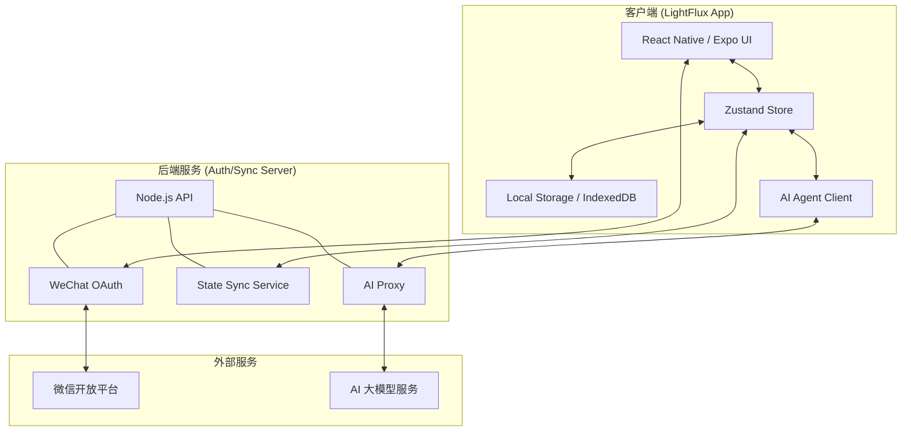
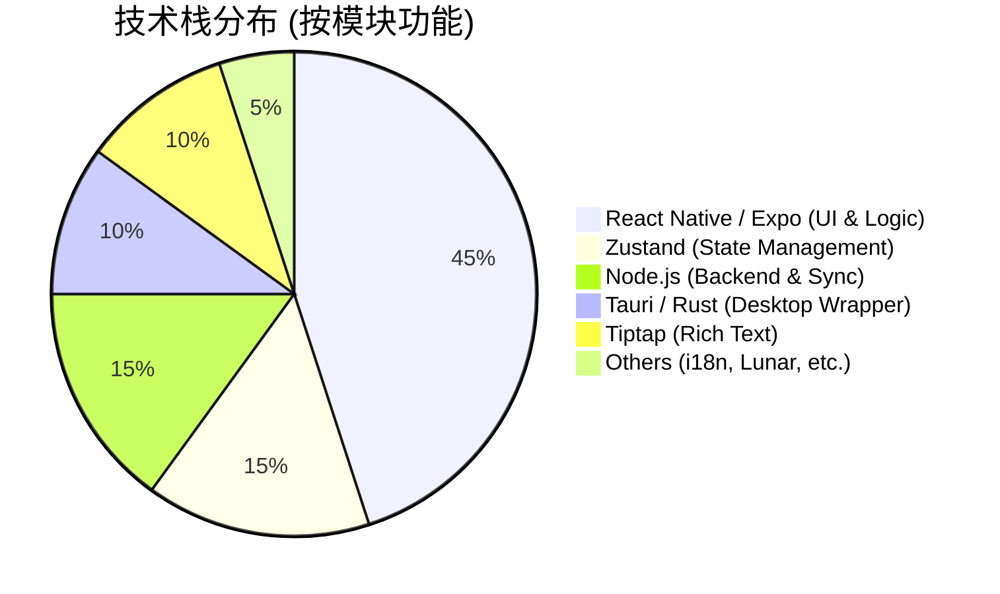
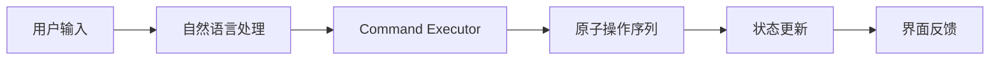
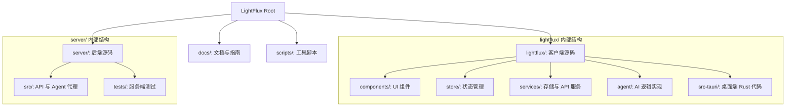
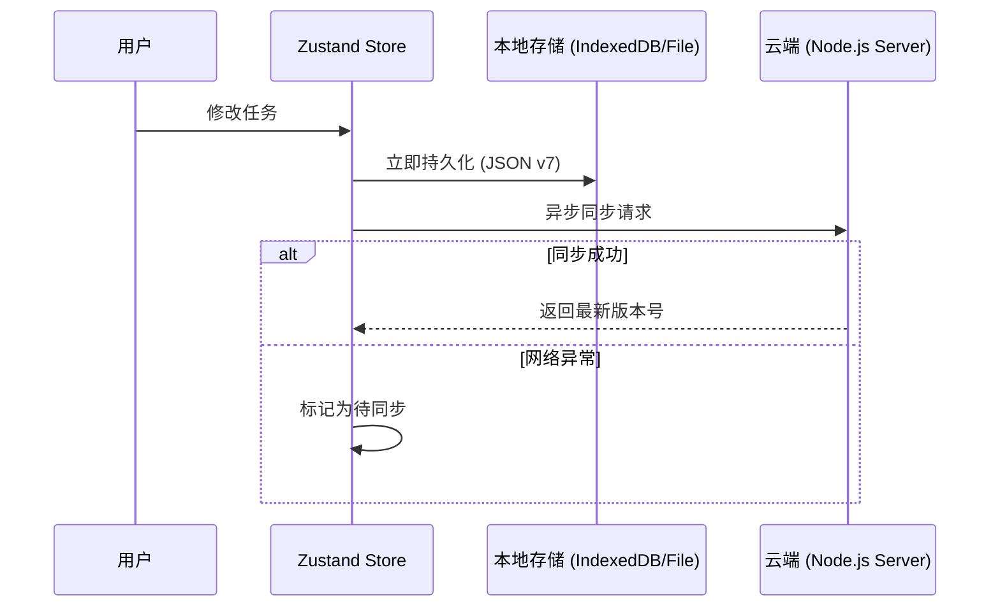
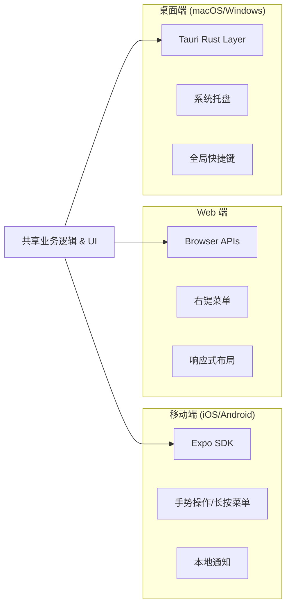

# 项目概览

## 目录
1. [模块概览](#模块概览)
2. [项目愿景与核心特性](#项目愿景与核心特性)
3. [整体架构图解](#整体架构图解)
4. [技术栈概览](#技术栈概览)
5. [核心功能亮点](#核心功能亮点)
6. [仓库目录结构](#仓库目录结构)
7. [数据持久化与同步](#数据持久化与同步)
8. [多端支持与适配](#多端支持与适配)
9. [关键文件参考](#关键文件参考)

## 模块概览

LightFlux 是一个高度集成的跨平台任务管理系统，旨在通过 AI 驱动的规划能力和本地优先的响应体验，为用户提供极致的效率工具。本项目采用 Monorepo 组织方式，涵盖了移动端、Web 端、桌面端以及后端同步服务。

在对项目的初步扫描中，我们识别出以下核心指标：
- **总文件数**：约 100 个核心源码文件（排除 `node_modules`、`dist` 和 `target` 等构建产物）。
- **主要子模块**：
  - `lightflux/`：核心应用逻辑，基于 Expo 和 React Native 构建，支持 iOS、Android 和 Web。
  - `lightflux/src-tauri/`：桌面端包装层，使用 Rust 和 Tauri 将 Web 版本转化为 macOS 和 Windows 原生应用。
  - `server/`：轻量级后端服务，处理微信认证、AI 接口代理及云端状态同步。
  - `docs/`：项目相关文档，包括微信开放平台配置指南。

本章节将对上述所有子模块进行深度覆盖，重点解析它们如何协同工作以实现无缝的跨端体验。

## 项目愿景与核心特性

LightFlux 的设计哲学围绕“流” (Flow) 展开，旨在减少用户在任务管理过程中的认知负荷。与传统的待办事项应用不同，LightFlux 不仅仅是一个记录工具，更是一个智能的行动助手。

### 核心愿景
1.  **AI 驱动的规划**：利用大语言模型 (LLM) 协助用户拆解复杂任务，自动生成里程碑，并根据优先级建议每日计划。
2.  **本地优先 (Local-first)**：所有操作首选在本地执行并持久化，确保在无网络环境下依然流畅，随后在后台静默同步。
3.  **双历支持**：深度集成公历与农历，满足中国用户对传统节气、生日及纪念日的管理需求。
4.  **极致跨端**：一套代码库覆盖 iOS、Android、Web、macOS 和 Windows，保持 UI 一致性的同时针对不同平台进行交互优化。

### 核心特性矩阵

| 特性分类 | 具体功能 | 技术实现 |
| :--- | :--- | :--- |
| **任务管理** | 任务 CRUD、子任务排序、分组归档、垃圾桶恢复 | Zustand 状态管理 + 排序算法 |
| **智能助手** | AI 任务拆解、里程碑自动生成、智能提醒 | 集成 LLM 的 Agent 架构 |
| **富文本** | Tiptap 编辑器、Markdown 支持、图片上传、代码块 | TenTap Bridge + WebView |
| **日历集成** | 月历视图、日期选取、公农历转换 | `lunar-typescript` 库 |
| **认证同步** | 微信扫码/授权登录、版本化数据同步 | Node.js + WeChat OAuth |

## 整体架构图解

LightFlux 采用了典型的客户端-服务器架构，但重点在于客户端的独立性。客户端包含完整的业务逻辑和本地存储，后端仅作为辅助的同步和认证节点。

以下图表展示了 LightFlux 各模块间的交互关系以及数据流向：

**架构解析**：
该架构的核心是 **Zustand Store**，它充当了单一事实来源。无论是用户界面的交互、本地数据库的持久化，还是与云端的同步，都通过 Store 进行调度。**AI Agent Client** 负责将用户的自然语言指令转化为具体的任务操作建议，并通过 **AI Proxy** 与大模型通信。这种设计确保了客户端在失去后端连接时，依然可以利用本地缓存的数据正常工作。

**图表来源**：
- [lightflux/store/todoStore.tsx](lightflux/store/todoStore.tsx)
- [server/src/index.mjs](server/src/index.mjs)
- [lightflux/agent/todoCommandExecutor.ts](lightflux/agent/todoCommandExecutor.ts)

## 技术栈概览

LightFlux 选择了现代且成熟的技术栈，以平衡开发效率与多端性能。

### 前端/移动端 (lightflux/)
- **框架**：[Expo 57](https://expo.dev/) & [React Native 0.86](https://reactnative.dev/)。Expo 提供了强大的开发工具链和跨平台 API，使得一套代码可以同时运行在 iOS、Android 和 Web。
- **状态管理**：[Zustand](https://github.com/pmndrs/zustand)。相比 Redux，Zustand 更加轻量且易于与 React Native 配合，特别是在处理复杂的任务嵌套结构时表现优异。
- **样式**：[Tailwind CSS](https://tailwindcss.com/) & [NativeWind](https://www.nativewind.dev/)。允许使用原子化类名编写跨端一致的样式，极大地提升了 UI 开发速度。
- **富文本**：[Tiptap](https://tiptap.dev/)。通过 WebView 桥接技术在移动端实现了强大的富文本编辑功能。

### 桌面端 (lightflux/src-tauri/)
- **框架**：[Tauri 2.0](https://tauri.app/)。使用 Rust 构建底层容器，相比 Electron 具有更小的包体积和更低的内存占用。它直接将 Expo 导出的 Web 构建产物进行原生包装。

### 后端 (server/)
- **环境**：[Node.js 20+](https://nodejs.org/)。使用原生 ESM 模块编写，未依赖大型框架，保持了极高的启动速度和部署灵活性。
- **认证**：微信 OAuth 2.0。支持 Web 端的扫码登录和移动端的 App 授权。

该饼图反映了项目在不同技术领域的投入比例，可见核心逻辑高度集中在 React Native 环境中，体现了“一次编写，处处运行”的理念。

**技术栈来源**：
- [lightflux/package.json](lightflux/package.json)
- [server/package.json](server/package.json)
- [lightflux/src-tauri/Cargo.toml](lightflux/src-tauri/Cargo.toml)

## 核心功能亮点

### 1. AI 智能规划 Agent
LightFlux 内置了一个强大的 AI Agent，它能够理解用户的意图并执行复杂操作。例如，用户输入“帮我规划下周的旅行”，Agent 会将其拆解为多个子任务（如订机票、打包行李、预订酒店），并自动分配日期和优先级。

**功能解析**：
Agent 并不直接修改数据库，而是生成一系列“操作建议” (Proposals)。用户可以预览这些建议并决定是否应用。这种“人机协作”的模式既保证了智能性，又保留了用户的最终控制权。

### 2. 双历转换与日期管理
集成了 `lunar-typescript`，使得应用能够完美支持农历。在日历视图中，用户可以同时看到公历日期和对应的农历干支、生肖及节气。

### 3. 多层级任务结构
支持无限层级的子任务，并实现了基于 `sortOrder` 的持久化拖拽排序。这在 Zustand Store 中通过递归的数据结构和高效的更新算法实现，确保了在处理大量任务时的 UI 流畅度。

**功能来源**：
- [lightflux/agent/milestoneCommandExecutor.ts](lightflux/agent/milestoneCommandExecutor.ts)
- [lightflux/utils/date.ts](lightflux/utils/date.ts)
- [lightflux/store/todoDomain.ts](lightflux/store/todoDomain.ts)

## 仓库目录结构

LightFlux 采用清晰的 Monorepo 结构，方便开发者快速定位代码。

**目录说明**：
- **`lightflux/components/`**：按照功能模块划分，如 `tasks/`、`milestones/`、`editor/` 等，便于组件复用。
- **`lightflux/services/`**：封装了与环境相关的 API，例如 `todoStorage.ts` 会根据运行平台自动选择文件系统或 IndexedDB。
- **`server/src/agent.mjs`**：包含了服务端对 AI 模型的调用封装，支持流式响应和错误处理。

**目录参考**：
- [lightflux/](lightflux/)
- [server/](server/)

## 数据持久化与同步

LightFlux 采用“本地优先”的同步策略，确保了响应速度和数据安全。

**持久化机制**：
- **Web 端**：优先使用 `IndexedDB`，如果不可用则回退到 `localStorage`。
- **移动端**：使用 `expo-file-system` 将数据以 JSON 格式写入应用的私有文档目录。
- **数据结构**：采用版本化的 JSON 格式（当前为 `schemaVersion: 7`），支持随着应用升级自动迁移旧数据。

**同步逻辑**：
应用状态包含一个全局的 `updatedAt` 时间戳。同步时，客户端会将本地状态与服务器状态进行合并，采用“最后写入者胜” (Last-Write-Wins) 的冲突解决策略，并针对任务分组的顺序进行了特殊处理，以防止排序丢失。

**持久化来源**：
- [lightflux/services/todoStorage.ts](lightflux/services/todoStorage.ts)
- [lightflux/services/appStateMerge.ts](lightflux/services/appStateMerge.ts)

## 多端支持与适配

LightFlux 致力于在不同平台上提供“原生”的感觉，而不仅仅是简单的网页包装。

**适配策略**：
1.  **交互差异**：在 Web 和桌面端，应用支持鼠标右键弹出上下文菜单；在移动端，则自动转化为长按手势触发。
2.  **布局优化**：使用响应式设计，宽屏下（如 iPad 或桌面）会显示侧边详情栏，窄屏下（如手机）则切换为全屏覆盖模式。
3.  **原生集成**：在桌面端通过 Tauri 调用 Rust 代码实现系统通知和文件系统访问；在移动端通过 Expo 插件实现推送通知。

**适配参考**：
- [lightflux/components/tasks/useTaskContextMenu.ts](lightflux/components/tasks/useTaskContextMenu.ts)
- [lightflux/components/layout/ResizableDivider.tsx](lightflux/components/layout/ResizableDivider.tsx)
- [lightflux/src-tauri/tauri.conf.json](lightflux/src-tauri/tauri.conf.json)

## 关键文件参考

为了深入理解 LightFlux 的实现，建议从以下核心文件入手：

- **项目入口**：
  - `lightflux/App.tsx`: 客户端根组件，负责 Store 初始化和路由挂载。
  - `server/src/index.mjs`: 后端入口，定义了所有 API 路由和中间件。
- **状态与领域逻辑**：
  - `lightflux/store/todoStore.tsx`: 核心状态定义。
  - `lightflux/store/todoDomain.ts`: 任务相关的业务逻辑处理函数。
- **AI 代理**：
  - `lightflux/agent/todoCommandExecutor.ts`: AI 指令执行器。
  - `server/src/agent.mjs`: 服务端 AI 代理实现。
- **存储与同步**：
  - `lightflux/services/todoStorage.ts`: 跨平台持久化抽象层。
  - `lightflux/services/appStateMerge.ts`: 客户端与云端数据合并逻辑。
- **平台配置**：
  - `lightflux/app.json`: Expo 项目配置。
  - `lightflux/src-tauri/tauri.conf.json`: Tauri 桌面端配置。

**Section sources**:
- [README.md](README.md)
- [lightflux/package.json](lightflux/package.json)
- [server/package.json](server/package.json)
- [lightflux/app.json](lightflux/app.json)
- [lightflux/src-tauri/tauri.conf.json](lightflux/src-tauri/tauri.conf.json)
