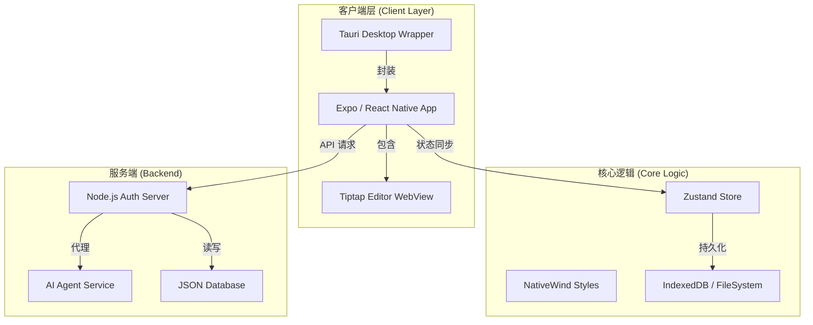
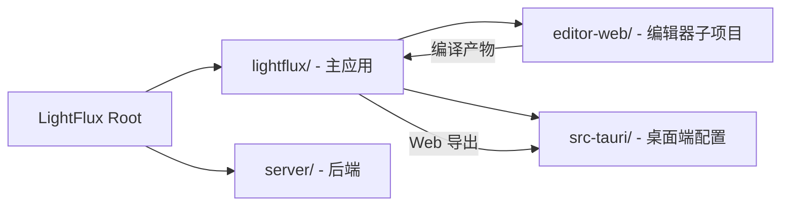
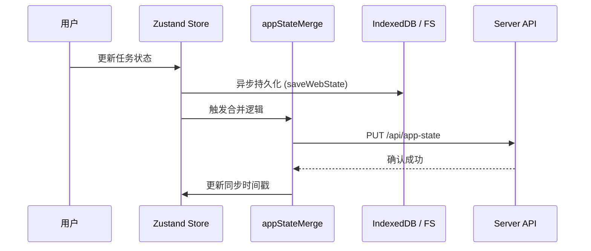

# 技术栈概览

## 目录
1. [模块概览](#模块概览)
2. [引言](#引言)
3. [跨端核心技术选型](#跨端核心技术选型)
   - [移动与 Web 端 (Expo & React Native)](#移动与-web-端-expo--react-native)
   - [桌面端 (Tauri & Rust)](#桌面端-tauri--rust)
4. [富文本编辑器引擎 (Tiptap)](#富文本编辑器引擎-tiptap)
5. [后端与云端服务 (Node.js)](#后端与云端服务-nodejs)
6. [架构设计与组件交互](#架构设计与组件交互)
7. [技术对比：为何选择 Tauri 而非 Electron](#技术对比为何选择-tauri-而非-electron)
8. [Monorepo 项目结构与依赖关系](#monorepo-项目结构与依赖关系)
9. [数据流与本地存储](#数据流与本地存储)
10. [文件参考](#文件参考)

## 模块概览

LightFlux 是一个复杂的跨端应用项目，其代码库涵盖了前端、桌面端、后端以及专门的编辑器模块。通过对工作区的系统性扫描，我们识别出以下规模和结构：

- **总文件数**：约 200+ 核心源文件（包含 TypeScript, Rust, JavaScript, JSON, TOML）。
- **子模块划分**：
    - `lightflux/`: 项目核心，包含基于 Expo/React Native 的跨端前端应用逻辑。这是业务逻辑最集中的地方，涵盖了状态管理、UI 组件和各种服务。
    - `lightflux/src-tauri/`: 桌面端核心，使用 Rust 编写。它不仅是一个简单的“壳”，还负责处理与操作系统的深度集成。
    - `lightflux/editor-web/`: 独立的富文本编辑器模块，基于 Tiptap 构建并编译为 WebView 可用的静态资源。
    - `server/`: 轻量级后端服务，采用 ES Modules 编写，处理敏感的认证逻辑和 AI 代理转发。

本章节将深入探讨这些模块背后的技术底座，解释其选型逻辑及相互之间的协作机制。

## 引言

LightFlux 旨在提供一种“轻量级但功能强大”的任务管理体验。为了实现这一目标，项目在技术选型上极度追求**跨端代码复用**与**原生性能表现**的平衡。开发者在阅读本项目代码时，会发现它并没有采用单一的“全家桶”方案，而是根据不同平台的特性进行了针对性的技术组合。

项目的技术栈可以概括为：以 **React Native (Expo)** 为核心逻辑层，以 **Tauri (Rust)** 为桌面壳程序，以 **Node.js** 为云端支撑，并辅以 **Tiptap** 作为生产力核心的编辑器引擎。这种组合使得 LightFlux 能够同时覆盖 iOS、Android、Web、macOS 和 Windows 平台，同时保持较低的维护成本和极高的运行效率。

## 跨端核心技术选型

### 移动与 Web 端 (Expo & React Native)

LightFlux 的前端核心建立在 **Expo** 生态系统之上。Expo 不仅简化了 React Native 的开发流程，还通过 `react-native-web` 提供了卓越的 Web 平台支持。

- **React Native (0.86.2)**: 提供跨平台的 UI 组件模型。通过使用原生组件的抽象，LightFlux 能够保证在 iOS 和 Android 上拥有接近原生的流畅度。
- **Expo (57.0.11)**: 处理原生能力集成。项目利用了 `expo-notifications` 处理任务提醒，`expo-file-system` 处理移动端的文件持久化，以及 `expo-splash-screen` 优化启动体验。
- **NativeWind (2.0.11)**: 这是项目的一大特色。它将 Tailwind CSS 的开发体验引入 React Native，通过原子类实现跨端样式统一。开发者可以使用熟悉的 `className` 语法同时为 Web 和 Native 端编写样式，极大地提高了 UI 开发效率。
- **Zustand (5.0.14)**: 轻量级状态管理。在 `store/` 目录下，你会看到 `todoStore.tsx` 等文件。Zustand 相比 Redux 具有更低的样板代码，其基于 Hook 的订阅机制非常适合 React Native 的性能优化需求。

### 桌面端 (Tauri & Rust)

桌面端并没有采用传统的 Electron，而是选择了 **Tauri v2**。这一决策主要基于对安装包体积和内存占用的极致追求。

- **Rust**: 作为 Tauri 的后端语言，负责处理系统级交互。在 `src-tauri/src/main.rs` 中，Rust 负责初始化应用窗口、注册系统托盘以及处理与前端的 IPC（进程间通信）。
- **Tauri 框架**: 负责将 Expo 导出的 Web 静态资源打包为桌面应用。它提供了一套安全的权限模型（Capabilities），确保前端只能调用经过授权的 Rust 函数。
- **系统 WebView**: 桌面端直接使用系统自带的渲染引擎（如 macOS 上的 WebKit，Windows 上的 WebView2），这意味着 LightFlux 桌面端不需要像 Electron 那样内置一个完整的 Chromium 浏览器。

## 富文本编辑器引擎 (Tiptap)

编辑器是 LightFlux 的核心生产力工具。为了在移动端 WebView 和桌面端 Web 环境中提供一致的编辑体验，项目采用了 **Tiptap**。

- **Tiptap Core**: 基于 Prosemirror 的无头编辑器框架。它将复杂的富文本操作抽象为结构化的文档模型，使得任务描述不仅是纯文本，还可以包含代码块、图片和待办列表。
- **@10play/tentap-editor**: 这是一个关键的桥接库。在移动端，由于原生 React Native 难以处理复杂的富文本编辑，项目将 Tiptap 运行在一个 WebView 中。Tentap 提供了 JS 桥接机制，使得原生端的 `TaskEditorScreen` 可以实时获取 WebView 中编辑器的内容变化。
- **Vite 构建**: `editor-web` 模块使用 Vite 进行独立打包。通过 `vite-plugin-singlefile` 插件，所有的 JavaScript、CSS 和 HTML 被压缩成一个体积很小的单文件，这对于提升 WebView 的加载速度至关重要。

## 后端与云端服务 (Node.js)

后端服务位于 `server/` 目录下，是一个典型的轻量级 Node.js 应用。

- **Node.js (>= 20)**: 使用现代化的 ES Modules (`.mjs`) 编写。项目充分利用了 Node.js 20+ 的原生特性，例如内置的 `--env-file` 支持和 `--test` 测试框架。
- **内置功能优先**: 开发者会发现 `server/src/index.mjs` 中很少引用第三方中间件。它直接使用 `node:http` 创建高性能服务器，使用 `node:crypto` 实现安全的会话管理和微信签名校验，使用 `node:fs/promises` 实现基于文件的简单数据库。
- **功能职责**:
    - **认证系统**: 实现了复杂的微信 OAuth 流程。支持 Web 端的扫码登录和移动端的原生 SDK 登录，通过 `upsertWechatUser` 逻辑实现用户身份的统一。
    - **AI 智能助手**: 作为 LLM（大语言模型）的代理，为前端提供任务分解、智能建议等 AI 能力。
    - **数据同步**: 提供 `app-state` 接口，支持用户在不同设备间同步任务列表和配置信息。

## 架构设计与组件交互

LightFlux 采用了一种“分层封装”的架构，确保核心逻辑在不同宿主环境下表现一致。这种架构允许开发者在 Web 环境中调试大部分业务逻辑，然后无缝部署到原生环境。

以下图表展示了项目的整体架构布局：

在上述架构中，`Expo App` 是逻辑的汇聚点。当它运行在桌面端时，被 `Tauri` 封装；当它需要编辑任务时，会唤起 `Tiptap Editor` 的 WebView 实例。所有的状态变更都通过 `Zustand` 进行管理，并根据平台不同，持久化到 `IndexedDB` (Web/Desktop) 或 `expo-file-system` (Mobile)。

**架构设计说明**：
- **解耦编辑器**：通过将编辑器打包为独立的静态 HTML，LightFlux 避免了在主应用中直接处理复杂的 Prosemirror 状态，提高了主应用的渲染性能。
- **统一 API 接口**：无论是移动端还是桌面端，都通过统一的 `agentApi.ts` 与 Node.js 后端通信，保证了业务逻辑的单一来源。这种设计使得在增加新平台（如 Linux）时，后端接口无需任何改动。

## 技术对比：为何选择 Tauri 而非 Electron

在桌面端方案的选择上，LightFlux 选择了更现代的 Tauri。这一决策不仅是为了减小体积，更是为了利用 Rust 带来的安全性和性能优势。下表对比了两者在本项目中的表现：

| 特性 | Electron | Tauri (本项目选择) | 优势说明 |
| :--- | :--- | :--- | :--- |
| **运行时** | 内置 Chromium + Node.js | 系统 WebView + Rust | Tauri 安装包仅需几 MB，Electron 动辄上百 MB |
| **内存占用** | 较高 (每个窗口一个 Chromium) | 极低 | Tauri 共享系统资源，更适合轻量级工具 |
| **安全性** | 默认权限较大 | 严格的 API 白名单 (Capabilities) | Tauri 默认禁用所有敏感接口，需手动开启 |
| **开发语言** | JavaScript / TypeScript | Rust + TS | Rust 提供了更高的系统级交互性能和安全性 |

**选择理由**：
对于 LightFlux 这样一个追求“轻量”的应用，Electron 的资源消耗过大。Tauri 允许我们复用 Expo Web 的构建产物，同时利用 Rust 处理桌面通知和文件系统，这与项目的愿景完美契合。此外，Rust 的强类型特性也为桌面端的系统集成提供了更好的稳定性保障。

## Monorepo 项目结构与依赖关系

项目虽然没有使用 Lerna 或 Turborepo 等复杂的 Monorepo 工具，但通过清晰的目录划分实现了模块化管理。这种结构既保证了各模块的独立性，又方便了跨模块的代码复用。

**依赖流转说明**：
1.  **编辑器构建**：`editor-web` 作为一个独立的 React 项目，首先被 Vite 编译成一个单文件 HTML。这个过程会处理所有的 Tiptap 插件和样式。
2.  **主应用集成**：主应用通过 `react-native-webview` 加载这个 HTML。在 `TaskEditorScreen.tsx` 中，通过 `Tentap` 提供的桥接机制，原生端可以调用编辑器的 `setContent` 或监听 `onUpdate` 事件。
3.  **桌面端打包**：当执行 `npm run desktop:web` 时，Expo 会生成 Web 静态资源，Tauri 随后读取这些资源并编译出原生安装包。这种流水线确保了桌面端始终运行的是最新的 Web 代码。

## 数据流与本地存储

LightFlux 优先保证离线可用性，因此本地存储方案至关重要。应用采用了“本地优先，云端同步”的策略。

**关键逻辑分析**：
- **状态管理**：`todoStore.tsx` 使用 Zustand 定义了应用的主状态模型，包括 `todos` 和 `groups`。状态的变更会触发所有订阅该状态的 UI 组件重新渲染。
- **持久化层**：`indexedDbStorage.ts` 封装了 Web 端的存储逻辑。它优先使用 `IndexedDB` 以获得更好的性能和容量，并在不可用时降级到 `localStorage`。在移动端，则通过 `expo-file-system` 实现类似的逻辑。
- **同步策略**：`appStateMerge.ts` 负责处理多端冲突。它采用简单的“最后写入者胜”策略，或者根据时间戳进行增量合并，确保用户在切换设备时数据的一致性。这种策略在保证用户体验的同时，也降低了后端的复杂度。

## 文件参考

以下是本项目技术栈相关的关键配置文件，开发者可以通过阅读这些文件深入了解各项技术的具体配置：

**前端与全局配置**：
- [lightflux/package.json](lightflux/package.json) - 前端核心依赖与构建脚本，定义了 Expo 和 React Native 的版本。
- [lightflux/app.json](lightflux/app.json) - Expo 应用配置，包含图标、启动页和原生插件声明。
- [lightflux/tailwind.config.js](lightflux/tailwind.config.js) - NativeWind 样式配置，定义了项目的主题色和原子类范围。

**桌面端配置**：
- [lightflux/src-tauri/Cargo.toml](lightflux/src-tauri/Cargo.toml) - Rust 依赖定义，包含 Tauri 核心库及插件。
- [lightflux/src-tauri/tauri.conf.json](lightflux/src-tauri/tauri.conf.json) - Tauri 权限与打包配置，定义了应用标识符和允许调用的系统 API。

**编辑器配置**：
- [lightflux/editor-web/package.json](lightflux/editor-web/package.json) - 编辑器子项目配置。
- [lightflux/editor-web/vite.config.ts](lightflux/editor-web/vite.config.ts) - 编辑器单文件打包配置，包含关键的桥接代码注入逻辑。

**后端配置**：
- [server/package.json](server/package.json) - Node.js 服务端依赖。
- [server/src/index.mjs](server/src/index.mjs) - 后端主入口逻辑，包含认证、存储和 AI 代理的实现。

**核心服务实现**：
- [lightflux/services/indexedDbStorage.ts](lightflux/services/indexedDbStorage.ts) - 本地存储实现，展示了如何使用原生 IndexedDB API 进行数据持久化。
- [lightflux/services/agentApi.ts](lightflux/services/agentApi.ts) - AI 代理通信封装，定义了前端如何与后端 AI 服务进行交互。
