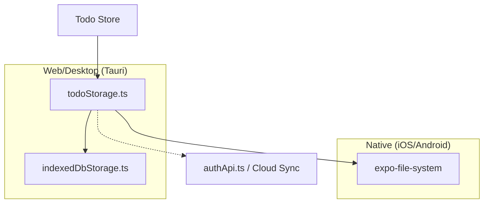
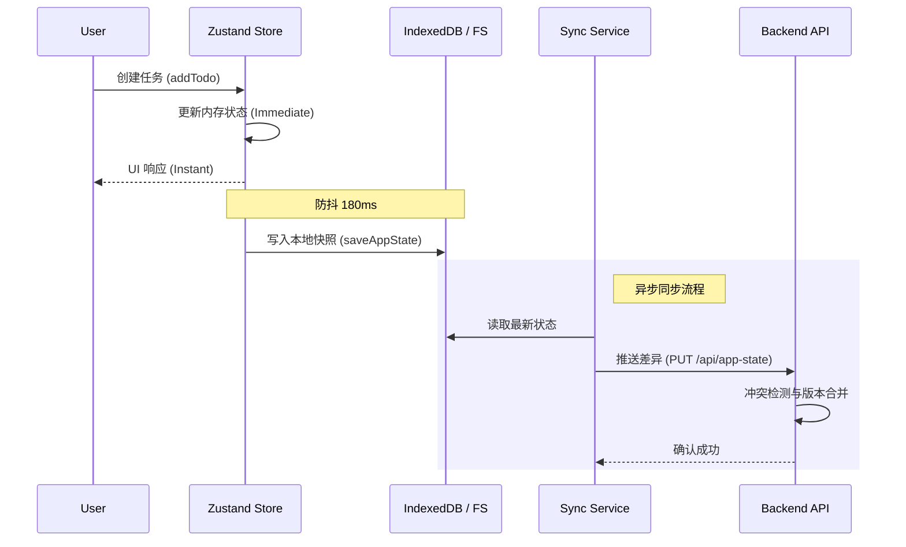
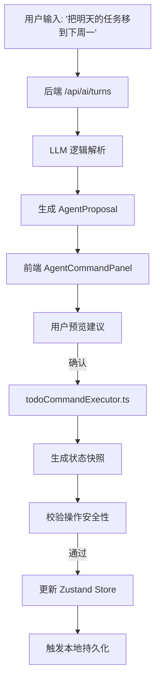
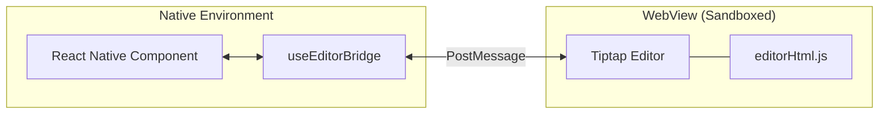
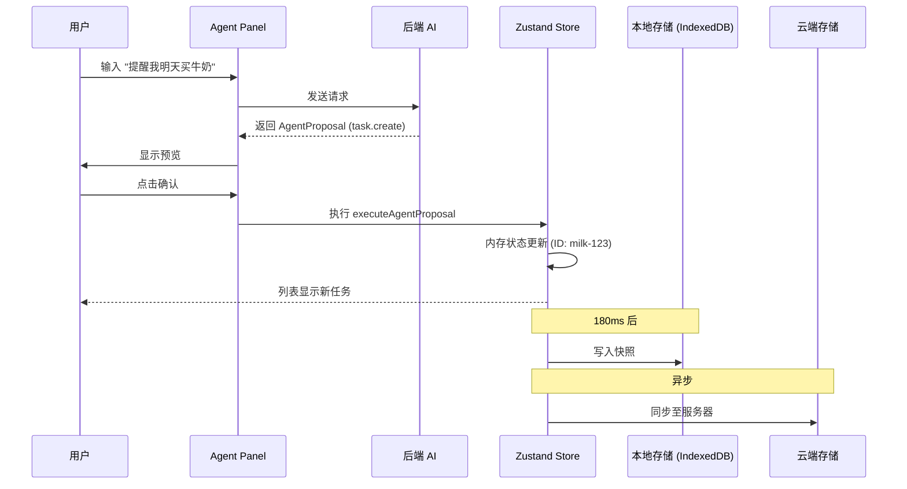

# 整体架构图解

## 目录
1. [模块概览](#模块概览)
2. [引言](#引言)
3. [核心架构组件](#核心架构组件)
   - [状态管理中心 (Zustand Store)](#状态管理中心-zustand-store)
   - [持久化与存储层 (Persistence Layer)](#持久化与存储层-persistence-layer)
   - [AI 智能代理系统 (AI Agent)](#ai-智能代理系统-ai-agent)
4. [跨端适配架构](#跨端适配架构)
5. [本地优先与数据同步模型](#本地优先与数据同步模型)
6. [AI 智能代理集成](#ai-智能代理集成)
7. [富文本编辑器桥接机制](#富文本编辑器桥接机制)
8. [典型任务生命周期](#典型任务生命周期)
9. [文件参考](#文件参考)

## 模块概览

在对 LightFlux 项目进行系统性探索后，我们识别出该项目是一个复杂的跨端应用系统。以下是该模块的规模与范围评估：

- **总文件数**：约 95 个源代码文件（包含 `.ts`, `.tsx`, `.mjs`）。
- **核心子目录**：
  - `lightflux/store/`：核心状态管理逻辑（4 个文件）。
  - `lightflux/services/`：持久化、同步与 API 交互（8 个文件）。
  - `lightflux/agent/`：AI 代理指令执行器与适配器（4 个文件）。
  - `lightflux/components/`：多端 UI 组件库（40+ 文件）。
  - `lightflux/editor-web/`：基于 Tiptap 的富文本编辑器核心（5+ 文件）。
  - `server/src/`：Node.js 后端服务，处理认证与 AI 中转（2 个核心文件）。

本章节将深入探讨前端应用、AI 代理、后端服务以及本地存储之间的协作关系，重点分析其“本地优先”架构与跨端适配实现。

## 引言

LightFlux 是一个以“本地优先”为核心理念的智能任务管理系统。其架构设计旨在提供极致的响应速度和离线工作能力，同时通过 AI 智能代理提升用户的生产力。

该系统的宏观架构由四个主要部分组成：
1. **前端应用 (LightFlux App)**：基于 React Native (Expo) 构建，支持 Web、iOS、Android，并通过 Tauri 扩展至桌面端（macOS/Windows/Linux）。
2. **状态与持久化层**：利用 Zustand 进行内存状态管理，并结合 IndexedDB (Web) 或文件系统 (Native) 实现数据的即时持久化。
3. **AI 智能代理 (Agent)**：负责解析用户自然语言指令，生成操作建议（Proposals），并安全地执行任务自动化。
4. **后端服务 (Backend)**：提供基于微信的身份认证、云端数据同步中转以及 AI 模型接口的鉴权转发。

通过这种分层架构，LightFlux 实现了数据在本地的秒级响应与云端的异步可靠同步。

## 核心架构组件

### 状态管理中心 (Zustand Store)

系统的状态中心位于 `lightflux/store/todoStore.tsx`。它不仅管理着所有的任务（Todos）、分组（Groups）和里程碑（Milestones），还负责驱动整个应用的业务逻辑。

```typescript
// lightflux/store/todoStore.tsx 核心结构简述
export const useTodoStore = create<TodoStore>((set, get) => ({
  ...todoState([]), // 任务领域状态
  ...milestoneState([]), // 里程碑领域状态
  hydrate: async () => {
    const state = await loadAppState(); // 从持久化层加载
    if (state) set({ ...state });
  },
  addTodo: (todo) => {
    // 领域逻辑处理并更新状态
    set((state) => ({ ...todoState(nextTodos), taskEvents: nextEvents }));
  },
  // ... 其他 Action
}));
```

Zustand 在这里充当了“单向数据流”的枢纽，组件通过 Hook 订阅状态，Action 触发状态变更。

### 持久化与存储层 (Persistence Layer)

LightFlux 采用了高度抽象的存储接口，以适配不同的运行环境。

The following diagram shows how the storage layer abstracts platform differences to provide a unified interface for the store.



`todoStorage.ts` 是存储层的核心，它在 Web 环境下优先使用 `IndexedDB`，而在 Native 环境下使用 `expo-file-system`。每当 Zustand 状态发生变化时，系统会通过一个 180ms 的防抖（Debounce）机制将快照写入本地存储。

### AI 智能代理系统 (AI Agent)

AI 代理系统分为“大脑”（后端 AI 模型）和“手脚”（前端执行器）。后端负责理解意图并生成 `AgentProposal`，前端 `todoCommandExecutor.ts` 则负责在受控环境下模拟执行这些操作。

**Section sources**:
- [lightflux/store/todoStore.tsx](lightflux/store/todoStore.tsx)
- [lightflux/services/todoStorage.ts](lightflux/services/todoStorage.ts)
- [lightflux/agent/types.ts](lightflux/agent/types.ts)

## 跨端适配架构

LightFlux 展示了如何通过技术栈的巧妙组合覆盖全平台。

The following architecture diagram illustrates the relationship between Expo, Tauri, and the shared React Native codebase.

```mermaid
graph TB
    subgraph "Shared Logic"
        Store[Zustand Store]
        Agent[Agent Executor]
        Domain[Domain Logic]
    end

    subgraph "Mobile (Expo)"
        iOS[iOS App]
        Android[Android App]
    end

    subgraph "Web & Desktop"
        Web[Web Browser]
        subgraph "Tauri Wrapper"
            Desktop[Desktop App]
            Rust[Rust Core]
        end
    end

    Shared Logic --> iOS
    Shared Logic --> Android
    Shared Logic --> Web
    Web --> Desktop
    Rust <--> Desktop
```

1. **Expo (React Native)**：作为核心 UI 框架，通过 `react-native-web` 将一套代码运行在移动端和浏览器中。
2. **Tauri**：在桌面端，Tauri 并不直接运行 React Native，而是包装了 Web 构建产物。它利用 Rust 提供的原生能力（如窗口控制、文件系统访问）来增强 Web 应用，使其具有原生桌面应用的体验。
3. **条件编译与适配**：通过 `Platform.OS` 和文件后缀名（`.native.tsx`, `.web.tsx`）处理平台差异，例如 `ResizableDivider` 在桌面端支持鼠标拖拽，而在移动端则表现为固定布局。

**Section sources**:
- [lightflux/App.tsx](lightflux/App.tsx)
- [lightflux/src-tauri/tauri.conf.json](lightflux/src-tauri/tauri.conf.json)

## 本地优先与数据同步模型

“本地优先”（Local-first）意味着用户的所有操作都首先在本地状态和本地存储中完成，同步是后台异步进行的。

The sequence diagram below describes the data flow when a user creates a task, highlighting the immediate local persistence and eventual cloud synchronization.



LightFlux 的同步模型具有以下特点：
- **无感持久化**：通过 `todoStore.tsx` 中的 `useEffect` 监听状态变化，自动触发 `saveAppState`。
- **冲突解决**：在 `appStateMerge.ts` 中实现，基于 `updatedAt` 时间戳进行 LWW (Last Write Wins) 策略的合并。
- **离线支持**：如果网络不可用，`saveRemoteAppState` 的失败不会影响本地操作，系统会在下次在线时重试。

**Section sources**:
- [lightflux/services/todoStorage.ts](lightflux/services/todoStorage.ts)
- [lightflux/services/appStateMerge.ts](lightflux/services/appStateMerge.ts)

## AI 智能代理集成

AI 代理不仅是一个聊天框，它是深度集成到系统指令集的执行引擎。

The following flowchart shows the lifecycle of an AI command, from natural language input to state mutation.



AI 代理的操作是**确定性**的。后端 LLM 不直接修改数据库，而是返回一组结构化的 `AgentOperation`（如 `task.move`, `task.create`）。前端执行器在应用这些操作前会进行严格的校验（如 `validateProposal`），确保不会破坏数据的一致性（例如防止循环子任务）。

**Section sources**:
- [lightflux/agent/todoCommandExecutor.ts](lightflux/agent/todoCommandExecutor.ts)
- [server/src/agent.mjs](server/src/agent.mjs)

## 富文本编辑器桥接机制

LightFlux 使用 Tiptap 作为富文本核心，但在 Native 端，由于 React Native 缺乏成熟的富文本组件，采用了 WebView 桥接方案。

The diagram below illustrates the bridge between the React Native environment and the Web-based Tiptap editor.



- **Web 端**：直接使用 `AdvancedEditor.tsx`，利用浏览器的原生 DOM 能力。
- **Native 端**：通过 `@10play/tentap-editor` 库，在 WebView 中加载预构建的 `editorHtml.js`。
- **同步机制**：`TaskEditorScreen.native.tsx` 通过 `useEditorContent` 钩子实时获取 JSON 格式的内容，并将其同步回 Zustand Store。为了性能考虑，内容同步采用了 350ms 的防抖处理。

**Section sources**:
- [lightflux/components/editor/TaskEditorScreen.native.tsx](lightflux/components/editor/TaskEditorScreen.native.tsx)
- [lightflux/editor-web/AdvancedEditor.tsx](lightflux/editor-web/AdvancedEditor.tsx)

## 典型任务生命周期

为了更好地理解整个架构，我们追踪一个任务从“自然语言输入”到“多端同步”的全过程。

The following sequence diagram tracks a task's journey through the entire system.



1. **意图解析**：用户通过 `AgentCommandPanel` 发起请求，后端 AI 将模糊的自然语言转化为精确的结构化指令。
2. **安全执行**：`todoCommandExecutor` 在前端执行这些指令，它会计算新的 `revision`（版本号），并生成 `undoToken` 以支持撤销操作。
3. **即时反馈**：Zustand 状态更新后，React 组件立即重绘，用户在毫秒级看到任务出现在列表中。
4. **延迟持久化**：系统不会在每次按键时都写入磁盘，而是等待用户操作间隙（180ms）进行快照存储，平衡了性能与数据安全性。
5. **最终一致性**：同步服务在后台将本地快照推送到后端 `/api/app-state`，确保用户在更换设备后仍能看到相同的数据。

## 文件参考

以下是构建 LightFlux 整体架构的关键源文件：

| 文件路径 | 职责描述 |
| :--- | :--- |
| `lightflux/App.tsx` | 应用根入口，处理布局适配与全局 Provider |
| `lightflux/store/todoStore.tsx` | 核心状态机，集成持久化与同步逻辑 |
| `lightflux/services/todoStorage.ts` | 存储层抽象，适配 Web 与 Native 平台 |
| `lightflux/services/indexedDbStorage.ts` | Web 端 IndexedDB 持久化实现 |
| `lightflux/services/authApi.ts` | 后端 API 通讯层，处理同步与认证 |
| `lightflux/agent/todoCommandExecutor.ts` | AI 指令执行核心，负责状态原子变更 |
| `lightflux/components/editor/TaskEditorScreen.native.tsx` | Native 端富文本编辑器 WebView 桥接实现 |
| `server/src/index.mjs` | 后端服务入口，处理同步中转与 AI 鉴权 |

**Section sources**:
- [lightflux/App.tsx](lightflux/App.tsx)
- [lightflux/store/todoStore.tsx](lightflux/store/todoStore.tsx)
- [lightflux/services/todoStorage.ts](lightflux/services/todoStorage.ts)
- [lightflux/agent/todoCommandExecutor.ts](lightflux/agent/todoCommandExecutor.ts)
