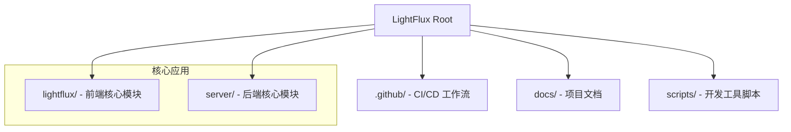
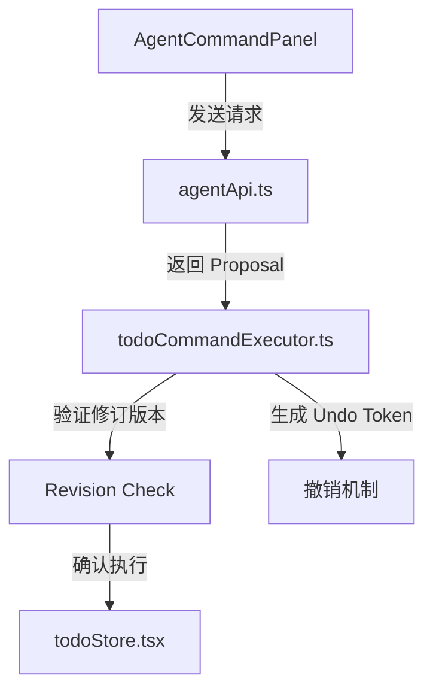
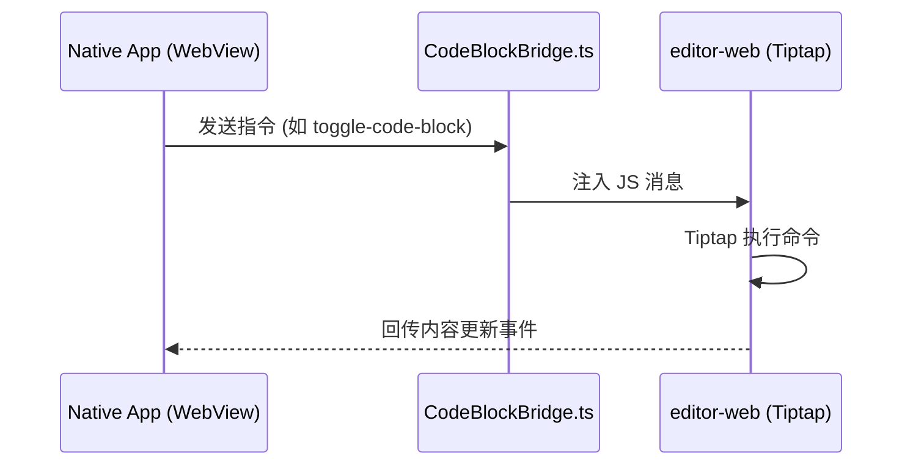
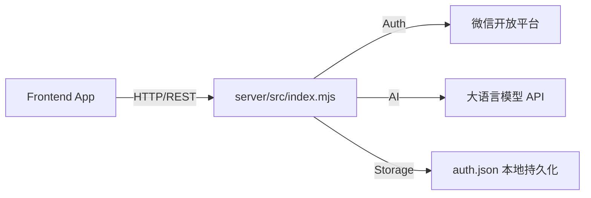
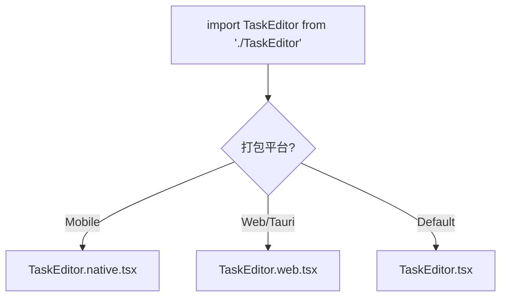

# 目录结构说明

## 目录
1. [模块概览](#模块概览)
2. [根目录结构](#根目录结构)
3. [前端核心：lightflux/](#前端核心lightflux)
   - [AI 智能助手 (agent/)](#ai-智能助手-agent)
   - [UI 组件库 (components/)](#ui-组件库-components)
   - [富文本编辑器 (editor-web/)](#富文本编辑器-editor-web)
   - [桌面端适配 (src-tauri/)](#桌面端适配-src-tauri)
   - [数据与业务层 (store/ & services/)](#数据与业务层-store--services)
4. [后端核心：server/](#后端核心server)
5. [跨端适配与命名约定](#跨端适配与命名约定)
6. [文件参考](#文件参考)

## 模块概览

LightFlux 项目采用 **Monorepo（单仓多包）** 架构，旨在通过统一的代码库管理跨多个平台的任务管理应用。该项目不仅涵盖了基于 React Native 和 Expo 的多端前端实现，还包含了一个轻量级的 Node.js 后端服务，用于处理身份验证、AI 逻辑分发以及数据同步。

在本次目录结构调研中，我们共发现了约 85 个核心源代码文件（不含配置文件和测试文件）。项目主要划分为两个顶级目录：`lightflux/`（前端核心）和 `server/`（后端服务）。前端部分是项目的重心，涉及移动端（iOS/Android）、Web 端以及通过 Tauri 实现的桌面端。后端部分则专注于为前端提供必要的云端支持，如微信登录适配和 AI 指令的中转。

本指南将深入探讨这些目录的职责分工，帮助开发者快速定位功能模块并理解各层级之间的交互逻辑。

## 根目录结构

项目的根目录主要负责 Monorepo 的全局配置、持续集成（CI/CD）流程以及通用的开发脚本。

根目录的各个子文件夹承载了不同的工程化职责：
- **.github/**：包含了 GitHub Actions 的工作流定义（如 `desktop-release.yml`），负责自动化构建桌面端发行版、签名以及发布流程。
- **docs/**：存储项目相关的技术文档和资源，例如微信开放平台的配置说明（`wechat-open-platform/`）和桌面端发布指南。
- **scripts/**：包含一些辅助开发的 Shell 脚本，例如 `use-rust-env.sh` 用于配置 Rust 开发环境，这对于构建桌面端 Tauri 应用至关重要。
- **配置文件**：根目录下还包含 `.gitignore`、`.gitattributes` 以及项目的 `README.md`，为整个仓库提供基础的 Git 配置和入门说明。

**本节参考**:
- [.github/workflows/desktop-release.yml](.github/workflows/desktop-release.yml)
- [docs/desktop-release.md](docs/desktop-release.md)
- [scripts/use-rust-env.sh](scripts/use-rust-env.sh)

## 前端核心：lightflux/

`lightflux/` 目录是整个项目的灵魂所在，它基于 Expo 框架构建，实现了“一套代码，多端运行”。该目录下的结构遵循了典型的 React Native 项目模式，并根据跨端需求进行了深度定制。

### AI 智能助手 (agent/)

`agent/` 目录实现了 LightFlux 的核心特色——AI 智能指令系统。它不仅仅是一个简单的聊天界面，而是一套完整的指令执行引擎。

该模块包含以下关键文件：
- `todoCommandExecutor.ts`：核心逻辑所在地，负责解析 AI 生成的建议（Proposal），验证数据的修订版本（Revision），并执行具体的任务操作（创建、更新、移动、删除）。
- `milestoneCommandExecutor.ts`：专门处理里程碑相关的指令逻辑。
- `todoCommandStoreAdapter.ts`：作为 Agent 与 Zustand 状态库之间的桥梁，将指令执行结果同步到本地存储。
- `types.ts`：定义了指令、建议、风险等级（Risk）和撤销令牌（UndoToken）的类型系统。

**本节参考**:
- [lightflux/agent/todoCommandExecutor.ts](lightflux/agent/todoCommandExecutor.ts)
- [lightflux/agent/types.ts](lightflux/agent/types.ts)

### UI 组件库 (components/)

`components/` 目录采用了按功能模块划分的组织方式，这使得复杂的 UI 逻辑能够保持清晰的边界。

主要的子目录包括：
- **tasks/**：任务列表的核心组件，如 `DraggableTaskRow.tsx`（支持拖拽的任务行）和 `TaskActionMenu.tsx`（右键/长按菜单）。
- **editor/**：任务详情编辑器的适配层。这里可以看到典型的跨端适配模式，例如 `TaskEditorScreen.native.tsx` 和 `TaskEditorScreen.web.tsx`。
- **milestones/**：里程碑展示与编辑组件。
- **ui/**：通用的基础 UI 组件库，如 `ActionButton`、`IconButton`、`Toast` 和 `Tooltip`。
- **layout/**：负责页面框架和响应式布局的组件，如 `ResizableDivider`（可调整大小的分隔条，常用于桌面端双栏布局）。

此外，该目录下还直接包含了一些主要的屏幕级组件，如 `TodoScreen.tsx`、`CalendarScreen.tsx` 和 `SettingsScreen.tsx`。

**本节参考**:
- [lightflux/components/tasks/DraggableTaskRow.tsx](lightflux/components/tasks/DraggableTaskRow.tsx)
- [lightflux/components/layout/ResizableDivider.tsx](lightflux/components/layout/ResizableDivider.tsx)

### 富文本编辑器 (editor-web/)

由于 React Native 原生环境对复杂的富文本支持有限，LightFlux 采用了一种混合架构：在 `editor-web/` 中构建了一个独立的基于 Tiptap 的 Web 编辑器。

- **Vite 构建**：该模块是一个独立的 Node.js 项目，使用 Vite 进行构建，最终生成一个单 HTML 文件。
- **Bridge 机制**：通过 `CodeBlockBridge.ts` 等文件，原生端与 Web 端通过 WebView 的消息机制进行双向通信。
- **独立性**：它可以独立于主应用进行开发和测试，确保了富文本编辑体验在各平台的一致性。

**本节参考**:
- [lightflux/editor-web/package.json](lightflux/editor-web/package.json)
- [lightflux/components/editor/CodeBlockBridge.ts](lightflux/components/editor/CodeBlockBridge.ts)

### 桌面端适配 (src-tauri/)

为了提供原生级别的桌面体验，项目引入了 Tauri。`src-tauri/` 目录包含了 Rust 核心代码和桌面端配置。

- **main.rs**：Tauri 应用的入口，负责处理窗口管理、系统托盘以及与 Rust 后端的通信。
- **tauri.conf.json**：定义了桌面应用的元数据、窗口属性（如最小宽高）以及构建配置。它将 Expo 导出的 Web 静态资源（`desktop-dist`）打包进原生安装包中。

**本节参考**:
- [lightflux/src-tauri/src/main.rs](lightflux/src-tauri/src/main.rs)
- [lightflux/src-tauri/tauri.conf.json](lightflux/src-tauri/tauri.conf.json)

### 数据与业务层 (store/ & services/)

这一层级负责管理应用的全局状态和外部通信。

- **store/**：使用 Zustand 管理领域模型。`todoDomain.ts` 和 `milestoneDomain.ts` 定义了业务逻辑的纯函数实现，而 `todoStore.tsx` 则提供了 React Context 和持久化支持。
- **services/**：封装了具体的 API 调用和存储适配。例如 `indexedDbStorage.ts` 为 Web 端提供持久化，`todoStorage.ts` 处理通用的存储逻辑，而 `agentApi.ts` 负责与后端 AI 服务通信。

**本节参考**:
- [lightflux/store/todoStore.tsx](lightflux/store/todoStore.tsx)
- [lightflux/services/todoStorage.ts](lightflux/services/todoStorage.ts)

## 后端核心：server/

`server/` 目录包含了一个基于 Node.js 的轻量级后端服务。它不依赖复杂的框架，而是直接使用原生 HTTP 模块构建，以追求极致的启动速度和部署灵活性。

- **src/index.mjs**：服务的主入口，包含了路由分发、微信 OAuth 流程处理、图片上传逻辑以及应用状态的云端备份。
- **src/agent.mjs**：AI Agent 的服务端实现，负责与底层大语言模型（LLM）对接，并处理对话上下文。
- **数据持久化**：默认使用本地 JSON 文件（如 `auth.json`）存储用户信息和会话，适合私有化部署或轻量级云端运行。

**本节参考**:
- [server/src/index.mjs](server/src/index.mjs)
- [server/src/agent.mjs](server/src/agent.mjs)

## 跨端适配与命名约定

LightFlux 目录结构中最具特色的部分是其跨端适配的命名约定。通过 Metro（React Native 的打包器）的配置，项目实现了自动化的平台代码选择。

| 后缀 | 适用平台 | 说明 |
| :--- | :--- | :--- |
| `.native.tsx` | Android, iOS | 使用 React Native 原生组件，优化触摸交互。 |
| `.web.tsx` | Web, Desktop (Tauri) | 使用 DOM 元素或 Web 特定库，优化鼠标和键盘操作。 |
| `.tsx` | 所有平台 | 包含共享的逻辑或跨端通用的 UI 结构。 |

例如，在 `lightflux/components/editor/` 目录下：
- `TaskEditorScreen.tsx`：定义了基础的 UI 结构。
- `TaskEditorScreen.native.tsx`：在移动端使用 `react-native-webview` 加载编辑器。
- `TaskEditorScreen.web.tsx`：在 Web 端直接渲染 Tiptap 组件以获得最佳性能。

这种命名约定不仅分布在 `components/` 目录中，也出现在 `config/`（如样式配置）和 `layout/`（如分栏逻辑）中。

**本节参考**:
- [lightflux/components/editor/TaskEditorScreen.tsx](lightflux/components/editor/TaskEditorScreen.tsx)
- [lightflux/components/layout/DraggableNavigationItem.native.tsx](lightflux/components/layout/DraggableNavigationItem.native.tsx)

## 文件参考

以下是本指南中涉及的关键源文件，按其在 Monorepo 中的位置排列：

**根目录配置**:
- [README.md](README.md)
- [.github/workflows/desktop-release.yml](.github/workflows/desktop-release.yml)

**前端核心 (lightflux/)**:
- [lightflux/index.ts](lightflux/index.ts) - 前端入口
- [lightflux/App.tsx](lightflux/App.tsx) - 根组件与路由逻辑
- [lightflux/agent/todoCommandExecutor.ts](lightflux/agent/todoCommandExecutor.ts) - AI 指令核心
- [lightflux/store/todoStore.tsx](lightflux/store/todoStore.tsx) - 状态管理
- [lightflux/editor-web/index.tsx](lightflux/editor-web/index.tsx) - Web 编辑器入口
- [lightflux/src-tauri/tauri.conf.json](lightflux/src-tauri/tauri.conf.json) - 桌面端配置

**后端核心 (server/)**:
- [server/src/index.mjs](server/src/index.mjs) - 后端主程序
- [server/src/agent.mjs](server/src/agent.mjs) - AI 服务适配
- [server/package.json](server/package.json) - 后端依赖配置
