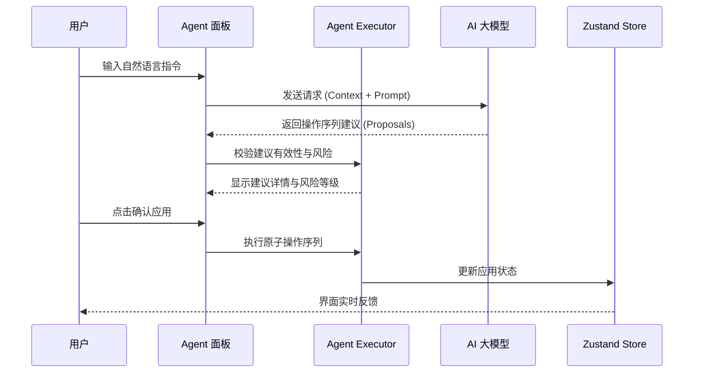
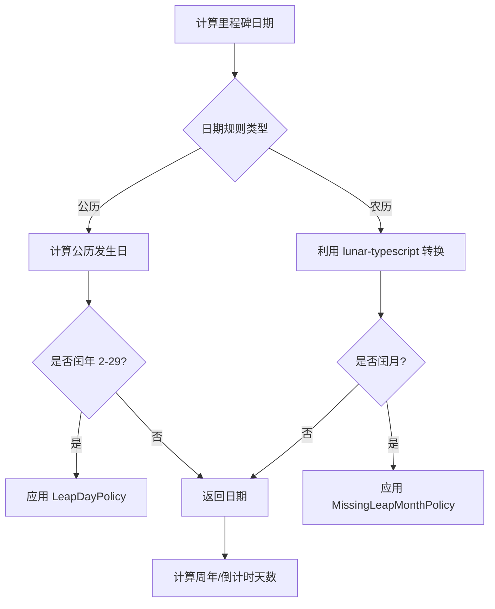

# 项目愿景与核心特性

## 目录
1. [模块概览](#模块概览)
2. [引言](#引言)
3. [核心特性矩阵](#核心特性矩阵)
4. [AI 驱动的任务规划 (Planning Agent)](#ai-驱动的任务规划-planning-agent)
5. [本地优先 (Local-First) 架构](#本地优先-local-first-架构)
6. [双历系统 (Dual Calendar) 支持](#双历系统-dual-calendar-支持)
7. [极致跨端体验与平台适配](#极致跨端体验与平台适配)
8. [核心组件解析](#核心组件解析)
9. [文件参考](#文件参考)

## 模块概览

LightFlux 是一个高度集成的跨平台任务管理系统，旨在通过 AI 驱动的规划能力和本地优先的响应体验，为用户提供极致的效率工具。在对项目的初步扫描中，我们识别出以下核心指标：

- **总文件数**：约 100 个核心源码文件（排除 `node_modules`、构建产物及测试文件）。
- **主要子模块**：
  - `lightflux/agent/`：AI 智能代理逻辑，负责指令解析与执行建议生成。
  - `lightflux/services/`：跨平台存储与 API 服务，处理 IndexedDB、文件系统及认证。
  - `lightflux/store/`：基于 Zustand 的全局状态管理与领域模型逻辑。
  - `lightflux/utils/`：包含双历转换、日期处理及任务分析等工具类。
  - `lightflux/src-tauri/`：桌面端 Rust 包装层，提供原生桌面能力。
  - `server/`：后端同步与 AI 代理服务。

本页面将重点介绍 LightFlux 的设计初衷及其核心特性，涵盖 AI 代理、本地优先架构、双历支持以及跨平台适配等关键领域。

## 引言

LightFlux 的中文名“流光”，寓意着“流动的光影”与“极致的流畅”。其设计初衷是为了解决传统任务管理工具中常见的两个痛点：**高认知负荷**与**网络依赖性**。

在传统的待办事项应用中，用户往往需要手动拆解复杂的项目，这不仅耗时，而且容易产生心理抗拒。LightFlux 通过引入 AI Planning Agent，将“记录”转变为“协作”，让 AI 辅助用户进行任务规划。同时，为了确保在任何环境下都能即时响应，LightFlux 采用了“本地优先”的设计哲学，将数据主权交还给用户，同时提供无缝的跨端同步体验。

## 核心特性矩阵

LightFlux 的核心竞争力体现在以下几个维度：

| 特性维度 | 核心价值 | 技术实现要点 |
| :--- | :--- | :--- |
| **AI 智能规划** | 降低任务拆解门槛，自动生成执行建议 | `AgentProposal` 机制 + 风险控制 |
| **本地优先** | 零延迟响应，隐私安全，离线可用 | IndexedDB/File System + 异步同步 |
| **双历系统** | 完美支持农历，覆盖传统节气与纪念日 | `lunar-typescript` 集成与递归算法 |
| **跨端一致性** | 一套代码覆盖全平台，原生交互体验 | Expo + Tauri + 响应式布局 |
| **富文本编辑** | 支持 Markdown 与多媒体内容 | Tiptap WebView 桥接技术 |

## AI 驱动的任务规划 (Planning Agent)

LightFlux 的 AI Planning Agent 是其区别于普通待办工具的核心。它不仅仅是一个简单的自然语言解析器，而是一个能够理解上下文并生成复杂操作序列的智能体。

### 指令执行流程

AI Agent 的工作流程遵循“建议-预览-确认”的模式，确保了 AI 的智能性与用户控制权之间的平衡。



**流程解析**：
当用户输入如“帮我规划下周的旅行”时，系统会将当前的任务状态与指令一同发送给 AI 服务。AI 生成一系列 `AgentOperation`（如创建分组、添加子任务、设置日期）。`AgentExecutor` 会对这些操作进行合法性校验，并根据操作类型（如删除任务为高风险）标注风险等级。用户在预览并确认后，这些操作会以原子方式应用到本地状态中。

### 风险控制与撤销机制

为了防止 AI 误操作导致数据丢失，LightFlux 实现了完善的风险评估与撤销系统。

- **风险评估**：`riskForOperations` 函数会根据操作类型评估整体风险。例如，`task.trash` 被定义为 `high` 风险，而 `task.create` 则是 `low` 风险。
- **撤销令牌**：每次 AI 执行都会生成一个 `AgentUndoToken`，其中包含了执行前的状态快照。用户可以随时一键撤销 AI 的所有更改。

**相关代码片段 (lightflux/agent/todoCommandExecutor.ts)**：
```typescript
export const executeAgentProposal = (
  sourceState: TodoCommandState,
  proposal: AgentProposal,
  options: { confirmed: boolean; now?: number },
): AgentExecutionResult => {
  validateProposal(sourceState, proposal, options.confirmed);
  const before = cloneCommandState(sourceState);
  const working = cloneCommandState(sourceState);
  const timestamp = options.now ?? Date.now();
  const operations = proposal.operations.map((operation) =>
    applyOperation(working, operation, timestamp),
  );
  // ... 生成撤销令牌并返回结果
  const undoToken: AgentUndoToken = {
    proposalId: proposal.id,
    beforeRevision: before.revision,
    afterRevision: working.revision,
    snapshot: before,
  };
  return { /* ... */, undoToken };
};
```

**Section sources**:
- [lightflux/agent/todoCommandExecutor.ts](lightflux/agent/todoCommandExecutor.ts)
- [lightflux/agent/types.ts](lightflux/agent/types.ts)
- [lightflux/components/agent/AgentCommandPanel.tsx](lightflux/components/agent/AgentCommandPanel.tsx)

## 本地优先 (Local-First) 架构

LightFlux 坚信“数据属于用户”。因此，应用采用了本地优先的架构，确保在没有网络的情况下，用户依然可以流畅地进行所有操作。

### 跨平台持久化策略

LightFlux 针对不同平台采用了最优的持久化方案，并通过统一的 Service 层进行抽象。

```mermaid
graph TB
    subgraph "持久化抽象层 (todoStorage.ts)"
        API[Storage API]
    end

    subgraph "Web 平台"
        IndexedDB[IndexedDB (Primary)]
        LocalStorage[LocalStorage (Fallback)]
        API --> IndexedDB
        IndexedDB -.-> LocalStorage
    end

    subgraph "移动端 (iOS/Android)"
        FileSystem[expo-file-system]
        API --> FileSystem
    end

    subgraph "同步机制"
        Remote[云端服务器]
        API <--> Remote
    end
```

**架构解析**：
在 Web 端，LightFlux 优先使用 `IndexedDB` 存储结构化的任务数据，因为它提供了比 `localStorage` 更大的容量和更好的性能。在移动端，则利用 `expo-file-system` 直接读写本地 JSON 文件。这种设计使得应用在启动时能够瞬间加载本地缓存，极大地提升了用户体验。

### 冲突解决与同步

同步逻辑采用异步方式在后台运行。为了解决多端编辑可能产生的冲突，LightFlux 使用了基于时间戳的“最后写入者胜”(Last-Write-Wins) 策略，并结合版本化的数据结构 (`schemaVersion`) 来确保数据迁移的安全性。

**Section sources**:
- [lightflux/services/todoStorage.ts](lightflux/services/todoStorage.ts)
- [lightflux/services/indexedDbStorage.ts](lightflux/services/indexedDbStorage.ts)
- [lightflux/services/appStateMerge.ts](lightflux/services/appStateMerge.ts)

## 双历系统 (Dual Calendar) 支持

对于中国用户而言，农历在管理生日、传统节日以及特定纪念日方面具有不可替代的作用。LightFlux 深度集成了双历系统，允许用户为里程碑设置公历或农历的日期规则。

### 日期计算逻辑

系统支持一次性里程碑和周期性里程碑（如每年农历正月初一）。



**功能亮点**：
- **闰月处理**：农历闰月的存在使得日期计算变得复杂。LightFlux 提供了 `MissingLeapMonthPolicy`，允许用户决定在没有闰月的年份是跳过还是使用普通月份。
- **周年自动计算**：通过 `startYear` 字段，系统可以自动计算并显示“第 N 周年”或“第 N 次生日”。

**Section sources**:
- [lightflux/utils/milestoneDate.ts](lightflux/utils/milestoneDate.ts)
- [lightflux/store/milestoneDomain.ts](lightflux/store/milestoneDomain.ts)

## 极致跨端体验与平台适配

LightFlux 使用 Expo 和 React Native 构建核心逻辑，通过一套代码实现了对 iOS、Android 和 Web 的支持。同时，利用 Tauri 将 Web 版本包装为原生桌面应用。

### 平台适配层设计

为了在不同平台上提供“原生”的交互感，LightFlux 在 UI 组件层做了大量适配工作。

```mermaid
graph LR
    subgraph "通用逻辑层"
        Store[Zustand Store]
        Logic[Business Logic]
    end

    subgraph "适配层 (Component.tsx / .native.tsx / .web.tsx)"
        Interaction[交互适配: 右键 vs 长按]
        Layout[布局适配: 侧边栏 vs 全屏]
        Storage[存储适配: IndexedDB vs 文件]
    end

    subgraph "目标平台"
        iOS[iOS App]
        Android[Android App]
        Web[Web Browser]
        Desktop[macOS/Windows (Tauri)]
    end

    Store --> Interaction
    Logic --> Storage
    Interaction --> iOS & Android & Web & Desktop
    Layout --> iOS & Android & Web & Desktop
```

**适配细节**：
1.  **交互差异**：在 Web 和桌面端，用户习惯使用鼠标右键；而在移动端则是长按。`useTaskContextMenu` 钩子会自动识别平台并绑定相应的事件监听器。
2.  **响应式布局**：利用 `ResizableDivider` 组件，应用在宽屏设备（如 iPad 或 PC）上会显示可拖拽的详情面板，而在窄屏手机上则自动切换为全屏覆盖模式。
3.  **原生集成**：桌面端通过 Tauri 调用 Rust 代码实现系统托盘和全局快捷键；移动端则通过 Expo 插件调用原生通知系统。

**Section sources**:
- [lightflux/components/layout/ResizableDivider.tsx](lightflux/components/layout/ResizableDivider.tsx)
- [lightflux/components/tasks/useTaskContextMenu.ts](lightflux/components/tasks/useTaskContextMenu.ts)
- [lightflux/src-tauri/tauri.conf.json](lightflux/src-tauri/tauri.conf.json)

## 核心组件解析

在实现上述特性的过程中，以下几个核心组件起到了支柱作用：

### 1. TodoStore (Zustand)
作为应用的“单一事实来源”，它管理着所有的任务、分组和里程碑数据。它不仅负责状态的更新，还集成了持久化中间件。
> **注意**：Store 中的数据结构是高度正规化的，以支持高效的递归查询（如子任务树）。

### 2. TodoCommandExecutor
AI 代理的大脑。它负责将 LLM 生成的 JSON 指令转化为对 Store 的具体操作。它实现了复杂的移动逻辑，确保在任务跨分组移动时，其子任务树能够被正确维护。

### 3. MilestoneDate 工具类
封装了所有与双历相关的复杂计算逻辑。它不直接依赖 Store，而是作为纯函数库被广泛应用于日历视图和提醒系统中。

### 4. TodoStorage Service
屏蔽了底层的平台差异。开发者只需调用 `saveAppState`，Service 会自动根据当前环境选择是写入 IndexedDB 还是移动端文件系统。

**Section sources**:
- [lightflux/store/todoStore.tsx](lightflux/store/todoStore.tsx)
- [lightflux/agent/todoCommandExecutor.ts](lightflux/agent/todoCommandExecutor.ts)
- [lightflux/services/todoStorage.ts](lightflux/services/todoStorage.ts)

## 文件参考

以下是实现项目愿景与核心特性的关键文件：

- **愿景与概览**：
  - `README.md`：项目基础介绍与功能清单。
  - `.trae/deepwiki/项目概览.md`：深入的架构与技术栈解析。
- **AI 代理实现**：
  - `lightflux/agent/todoCommandExecutor.ts`：AI 指令执行核心。
  - `lightflux/agent/types.ts`：Agent 相关的类型定义。
  - `lightflux/services/agentApi.ts`：与后端 AI 服务的通信接口。
- **本地优先与存储**：
  - `lightflux/services/todoStorage.ts`：跨平台存储抽象层。
  - `lightflux/services/indexedDbStorage.ts`：Web 端 IndexedDB 实现。
  - `lightflux/services/appStateMerge.ts`：数据合并与冲突解决逻辑。
- **双历系统**：
  - `lightflux/utils/milestoneDate.ts`：公农历转换与里程碑日期计算。
  - `lightflux/store/milestoneDomain.ts`：里程碑业务逻辑处理。
- **跨端适配**：
  - `lightflux/App.tsx`：应用入口与平台初始化。
  - `lightflux/components/layout/ResizableDivider.tsx`：响应式布局核心组件。
  - `lightflux/src-tauri/tauri.conf.json`：桌面端 Tauri 配置。
