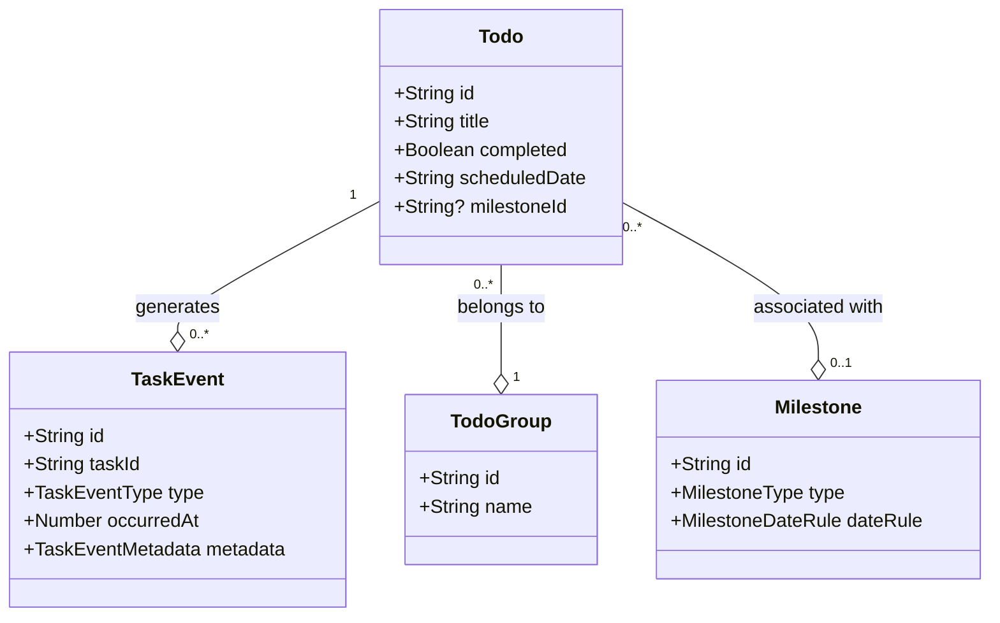
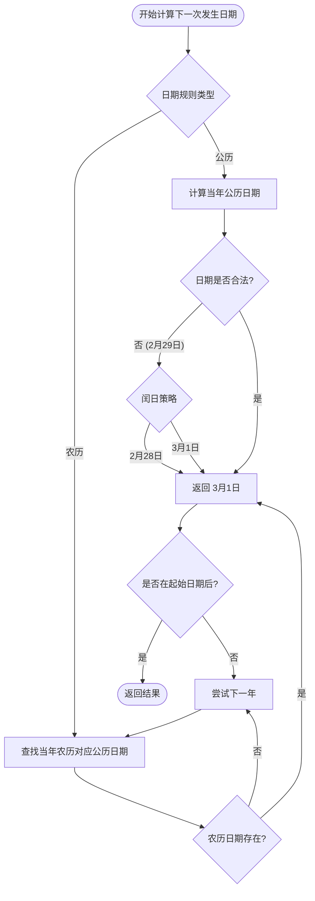
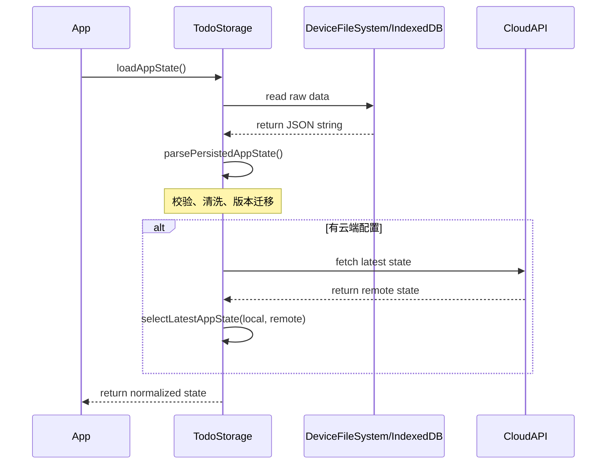
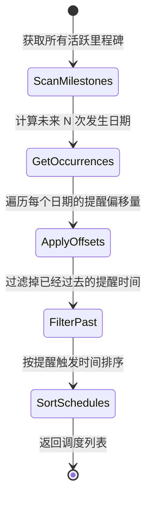

# 领域模型与存储

## 目录
1. [模块概览](#模块概览)
2. [核心领域模型定义](#核心领域模型定义)
   - [任务 (Todo) 模型](#任务-todo-模型)
   - [里程碑 (Milestone) 模型](#里程碑-milestone-模型)
   - [任务事件 (TaskEvent) 与统计回顾](#任务事件-taskevent-与统计回顾)
3. [里程碑与公农历转换逻辑](#里程碑与公农历转换逻辑)
   - [农历算法集成](#农历算法集成)
   - [重复提醒逻辑与边界处理](#重复提醒逻辑与边界处理)
4. [领域逻辑纯函数实现](#领域逻辑纯函数实现)
   - [任务树构建与排序](#任务树构建与排序)
   - [回收站管理逻辑](#回收站管理逻辑)
5. [持久化层架构与实现](#持久化层架构与实现)
   - [IndexedDB 存储实现](#indexeddb-存储实现)
   - [数据规范化与版本管理](#数据规范化与版本管理)
6. [云端同步与状态合并](#云端同步与状态合并)
7. [提醒调度系统](#提醒调度系统)
8. [性能考量与优化](#性能考量与优化)
9. [文件引用](#文件引用)

## 模块概览

LightFlux 的领域模型与存储模块是整个应用的核心心脏，负责定义业务实体、处理复杂的日期逻辑以及确保数据的持久化一致性。该模块主要分布在 `lightflux/types`、`lightflux/store`、`lightflux/services` 和 `lightflux/utils` 四个目录下，共包含约 20 个核心 TypeScript 文件。

本模块的设计遵循“领域驱动设计 (DDD)”的原则，将业务逻辑（Domain Logic）与存储逻辑（Infrastructure/Storage）分离。核心业务实体如 `Todo`、`Milestone` 和 `TaskEvent` 在 `types` 中定义，其对应的纯函数逻辑在 `store/domain` 中实现，而具体的持久化操作则由 `services` 层的存储引擎负责。

在本次深度分析中，我们将重点探讨：
- **复杂日期规则**：如何利用 `lunar-typescript` 实现公历与农历的无缝转换，并处理闰月、2月29日等边界情况。
- **任务生命周期**：通过 `TaskEvent` 记录任务从创建到完成、修改、甚至删除的每一个瞬间，为后续的统计分析提供数据基础。
- **多端存储适配**：在 Web 端使用 IndexedDB 提供高性能的大容量存储，并支持从 `localStorage` 的平滑迁移。
- **状态一致性**：在本地存储与云端同步之间，如何通过版本号和时间戳确保数据的最终一致性。

## 核心领域模型定义

LightFlux 的数据模型设计追求简洁与扩展性的平衡。所有的核心实体都拥有唯一的 `id` 和时间戳字段，确保在分布式或同步环境下能够被准确追踪。

### 任务 (Todo) 模型

`Todo` 是系统的基本工作单元。除了基础的标题和完成状态外，它还支持层级结构（`parentId`）、分组（`groupId`）以及关联里程碑（`milestoneId`）。

```typescript
export interface Todo {
  id: string;
  title: string;
  completed: boolean;
  completedAt: number | null;
  createdAt: number;
  updatedAt: number;
  scheduledDate: string; // 格式为 YYYY-MM-DD
  groupId: string | null;
  milestoneId: string | null;
  parentId: string | null;
  priority: TodoPriority;
  sortOrder: number;
  trashedAt: number | null;
  content: RichTextDocument;
}
```

任务的 `scheduledDate` 采用字符串格式存储，避免了时区转换带来的复杂性。`sortOrder` 用于在同一层级或分组内进行手动排序。

### 里程碑 (Milestone) 模型

里程碑是 LightFlux 的特色功能，支持复杂的重复规则。它不仅是一个日期提醒，更是一个具备“类型”属性的业务实体，如周年纪念、倒计时、生日等。

```typescript
export interface Milestone {
  id: string;
  title: string;
  type: MilestoneType;
  dateRule: MilestoneDateRule;
  startYear: number | null;
  reminderOffsets: number[]; // 提前提醒的天数列表，如 [0, 1, 3]
  pinned: boolean;
  archivedAt: number | null;
  trashedAt: number | null;
  // ... 其他基础字段
}
```

### 任务事件 (TaskEvent) 与统计回顾

为了支持“回顾”功能，系统并不只是简单地修改 `Todo` 的状态，而是会产生 `TaskEvent`。每一个关键操作（如修改计划日期、完成任务）都会记录一条不可变的事件。



上图展示了核心领域模型之间的关系。`Todo` 是中心实体，它与 `TaskEvent` 是一对多的关系，记录了其整个生命周期的变迁。`Milestone` 和 `TodoGroup` 则为 `Todo` 提供了多维度的组织能力。

**Section sources**:
- [lightflux/types/todo.ts](lightflux/types/todo.ts)

## 里程碑与公农历转换逻辑

LightFlux 的里程碑系统支持极其灵活的日期规则，包括公历（Solar）和农历（Lunar）。这是通过集成 `lunar-typescript` 库并封装一套自定义的调度算法实现的。

### 农历算法集成

农历的复杂性在于闰月（Leap Month）的处理。在 `MilestoneDateRule` 中，我们定义了 `isLeapMonth` 标志位。如果用户设置了一个农历闰月的提醒，而某一年并没有该闰月，系统提供了 `missingLeapMonthPolicy` 来决定是跳过该年还是使用当年的普通月份。

```typescript
const lunarOccurrence = (
  rule: LunarMilestoneDateRule,
  lunarYear: number,
): Date | null => {
  const year = LunarYear.fromYear(lunarYear);
  let month = rule.month;
  if (rule.isLeapMonth) {
    if (year.getLeapMonth() === rule.month) {
      month = -rule.month; // 负数表示闰月
    } else if (rule.missingLeapMonthPolicy === 'skip-year') {
      return null;
    }
  }
  const lunarMonth = year.getMonth(month);
  if (!lunarMonth || rule.day > lunarMonth.getDayCount()) {
    return null; // 处理该月天数不足的情况，如农历没有30号
  }
  const solar = Lunar.fromYmd(lunarYear, month, rule.day).getSolar();
  return localDate(solar.getYear(), solar.getMonth(), solar.getDay());
};
```

### 重复提醒逻辑与边界处理

系统需要根据当前日期计算出里程碑的“下一次”发生时间。对于公历，需要处理 2月29日（平年处理策略）；对于农历，则需要逐年查找符合条件的月份和日期。



在上述流程中，系统不仅要考虑日期是否存在（如农历小月没有30号），还要结合里程碑的 `startYear`。如果计算出的日期早于起始年份，则会自动寻找下一年的匹配项。这种设计保证了周年纪念类提醒的准确性。

**Section sources**:
- [lightflux/utils/milestoneDate.ts](lightflux/utils/milestoneDate.ts)
- [lightflux/types/todo.ts](lightflux/types/todo.ts)

## 领域逻辑纯函数实现

为了保证逻辑的可测试性和可维护性，LightFlux 将复杂的集合操作封装为纯函数。这些函数不依赖于任何外部状态，仅通过输入参数产生输出。

### 任务树构建与排序

任务支持父子层级。在 UI 渲染时，需要将扁平的 `Todo[]` 数组转换为带层级的列表，同时保持用户定义的排序顺序。`orderWithSubtasks` 函数实现了这一逻辑，它使用深度优先搜索（DFS）来递归地构建任务树。

```typescript
export const orderWithSubtasks = (
  todos: Todo[],
  compare: (a: Todo, b: Todo) => number = byTodoOrder,
): Todo[] => {
  const ids = new Set(todos.map((todo) => todo.id));
  const children = new Map<string, Todo[]>();

  // 预处理：建立父子关系映射
  todos.forEach((todo) => {
    if (todo.parentId && ids.has(todo.parentId)) {
      const current = children.get(todo.parentId) ?? [];
      current.push(todo);
      children.set(todo.parentId, current);
    }
  });

  const result: Todo[] = [];
  const visited = new Set<string>();
  const append = (todo: Todo) => {
    if (visited.has(todo.id)) return;
    visited.add(todo.id);
    result.push(todo);
    // 递归处理子任务
    children.get(todo.id)?.sort(compare).forEach(append);
  };

  // 从根节点开始遍历
  todos
    .filter((todo) => !todo.parentId || !ids.has(todo.parentId))
    .sort(compare)
    .forEach(append);

  return result;
};
```

### 回收站管理逻辑

当用户删除一个带有子任务的任务时，系统需要决定子任务的去向。LightFlux 的策略是：
1. **移入回收站**：如果父任务被移入回收站，其所有子任务也会被递归地标记为已删除。
2. **彻底删除**：如果从回收站彻底删除一个任务，其子任务将自动“断开连接”（`parentId` 设为 `null`），成为独立的根任务。

这种处理方式既保护了数据的完整性，又避免了误删导致的子任务永久丢失。

**Section sources**:
- [lightflux/store/todoDomain.ts](lightflux/store/todoDomain.ts)

## 持久化层架构与实现

LightFlux 采用了多级存储架构，以应对不同平台的需求。在移动端主要使用文件系统存储 JSON，而在 Web 端则优先使用 IndexedDB。

### IndexedDB 存储实现

对于 Web 平台，`indexedDbStorage.ts` 封装了标准的 IndexedDB API，提供了异步的读写接口。相比于 `localStorage`，IndexedDB 没有 5MB 的容量限制，且操作是异步的，不会阻塞主线程。

```typescript
const openDatabase = (): Promise<IDBDatabase> => {
  // ... 检查支持情况
  return new Promise((resolve, reject) => {
    const request = runtime.indexedDB?.open(DATABASE_NAME, DATABASE_VERSION);
    request.onupgradeneeded = () => {
      if (!request.result.objectStoreNames.contains(STORE_NAME)) {
        request.result.createObjectStore(STORE_NAME);
      }
    };
    request.onsuccess = () => resolve(request.result);
    // ... 错误处理
  });
};
```

系统还实现了一个优雅的迁移机制：如果检测到 `localStorage` 中存在旧数据，会先将其读入并写入 IndexedDB，然后清理旧的 `localStorage` 项，确保用户在升级后数据无损。

### 数据规范化与版本管理

由于业务逻辑在不断演进，存储的数据可能存在旧版本。`todoStorage.ts` 中的 `parsePersistedAppState` 扮演了“守门员”的角色。它负责：
1. **结构校验**：确保必填字段存在，类型正确。
2. **默认值填充**：为旧数据缺失的新字段（如 `priority`）提供默认值。
3. **数据清洗**：例如，如果一个任务关联的里程碑已被删除，则将该任务的 `milestoneId` 重置为 `null`。
4. **版本迁移**：通过 `schemaVersion` 识别数据版本，并执行必要的转换（如 `migrateTaskEvents`）。



**Section sources**:
- [lightflux/services/todoStorage.ts](lightflux/services/todoStorage.ts)
- [lightflux/services/indexedDbStorage.ts](lightflux/services/indexedDbStorage.ts)

## 云端同步与状态合并

LightFlux 支持可选的云端同步功能。同步的核心原则是“以时间戳为准的最终一致性”。

在 `appStateMerge.ts` 中，`selectLatestAppState` 函数简单而有效地解决了冲突：对比本地和远程状态的 `updatedAt` 时间戳，选择较新的那一个。

```typescript
export const selectLatestAppState = (
  deviceState: PersistedAppState | null,
  remoteState: PersistedAppState | null,
): PersistedAppState | null => {
  if (!deviceState) return remoteState;
  if (!remoteState) return deviceState;

  return remoteState.updatedAt > deviceState.updatedAt
    ? remoteState
    : deviceState;
};
```

为了确保 `updatedAt` 的准确性，系统在每次保存前都会调用 `deriveStateUpdatedAt`。它会扫描所有任务、分组和里程碑，取它们中最大的 `updatedAt` 作为整个状态的更新时间。这种“自底向上”的时间戳推导机制，避免了因为本地时钟不准导致的同步覆盖问题。

**Section sources**:
- [lightflux/services/appStateMerge.ts](lightflux/services/appStateMerge.ts)
- [lightflux/services/todoStorage.ts](lightflux/services/todoStorage.ts)

## 提醒调度系统

里程碑的提醒不仅仅是计算下一次日期，还需要根据用户设置的 `reminderOffsets`（提前提醒天数）构建出具体的调度计划。

`buildMilestoneReminderSchedules` 函数负责将里程碑规则转换为一系列可被系统通知引擎执行的“调度项”。



该系统的一个细节处理是：它会为每个里程碑的每次发生生成多个提醒（例如：提前3天提醒一次，当天再提醒一次）。同时，为了防止通知泛滥，它会对未来的提醒次数进行限制（通常只调度未来 2-4 次发生的情况）。

**Section sources**:
- [lightflux/utils/milestoneReminder.ts](lightflux/utils/milestoneReminder.ts)

## 性能考量与优化

在处理大量任务数据时，性能是不可忽视的因素。LightFlux 在领域模型层做了以下优化：

1. **缓存映射表**：在构建任务树或统计数据时，频繁使用 `Map`（如 `beforeById`）来代替数组的 `find` 操作，将查找复杂度从 O(N) 降低到 O(1)。
2. **按需计算**：里程碑的下一次日期仅在需要展示或调度提醒时计算，而不是在每次状态更新时都全量重算。
3. **批量事件处理**：`deriveTaskEventsFromTodoDiff` 通过对比前后两个状态的差异，一次性生成所有变更事件，减少了对事件日志的频繁写入。

> 💡 **提示**：当任务数量超过 1000 条时，建议定期清理回收站，以减少持久化 JSON 的体积，从而加快启动时的解析速度。

## 文件引用

以下是本章节涉及的核心源文件：

- [lightflux/types/todo.ts](lightflux/types/todo.ts): 定义了所有的核心接口和类型。
- [lightflux/store/todoDomain.ts](lightflux/store/todoDomain.ts): 包含了任务树构建、排序和回收站逻辑。
- [lightflux/store/milestoneDomain.ts](lightflux/store/milestoneDomain.ts): 处理里程碑的分类状态。
- [lightflux/store/taskEventDomain.ts](lightflux/store/taskEventDomain.ts): 负责任务事件的创建、差异推导和迁移。
- [lightflux/utils/milestoneDate.ts](lightflux/utils/milestoneDate.ts): 核心日期逻辑，包含公农历转换算法。
- [lightflux/utils/milestoneReminder.ts](lightflux/utils/milestoneReminder.ts): 提醒调度计划的生成逻辑。
- [lightflux/services/todoStorage.ts](lightflux/services/todoStorage.ts): 高层存储服务，处理规范化和云端同步。
- [lightflux/services/indexedDbStorage.ts](lightflux/services/indexedDbStorage.ts): Web 端 IndexedDB 低层实现。
- [lightflux/services/appStateMerge.ts](lightflux/services/appStateMerge.ts): 状态合并与时间戳推导逻辑。
- [lightflux/utils/date.ts](lightflux/utils/date.ts): 基础日期工具函数。
