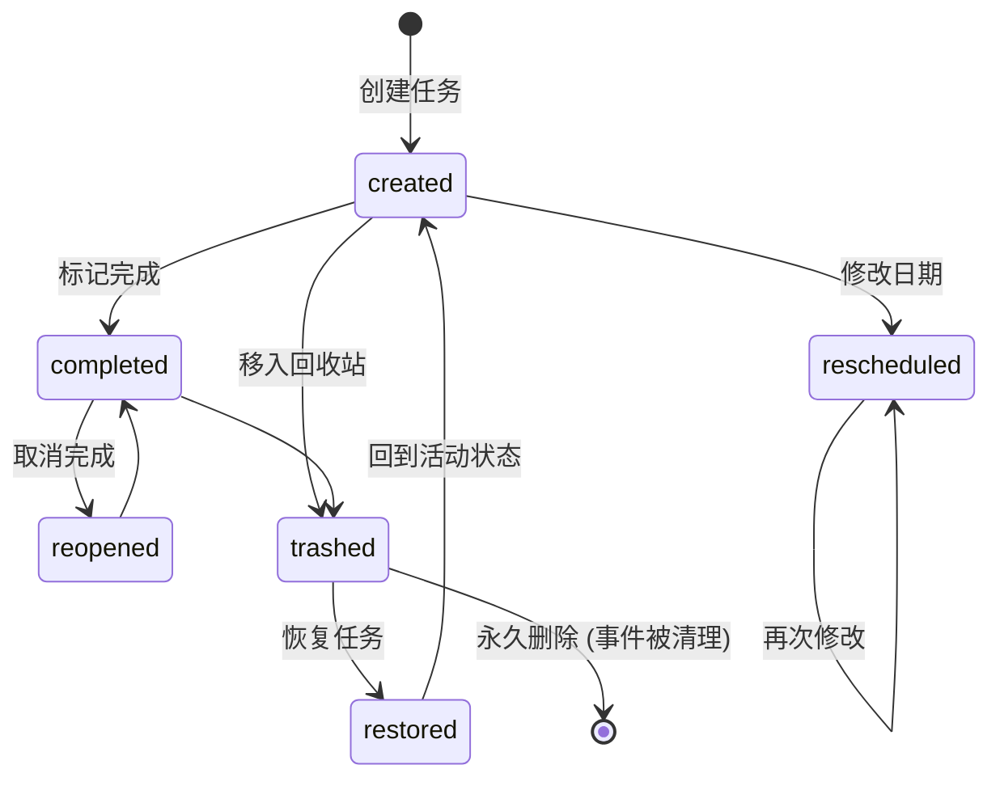
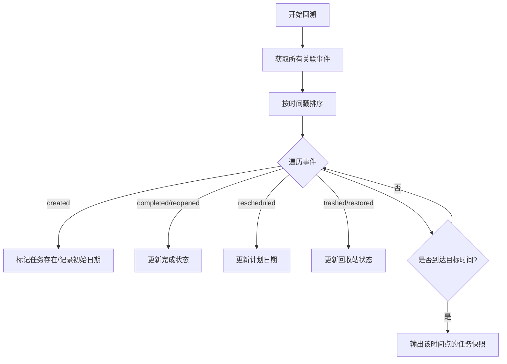
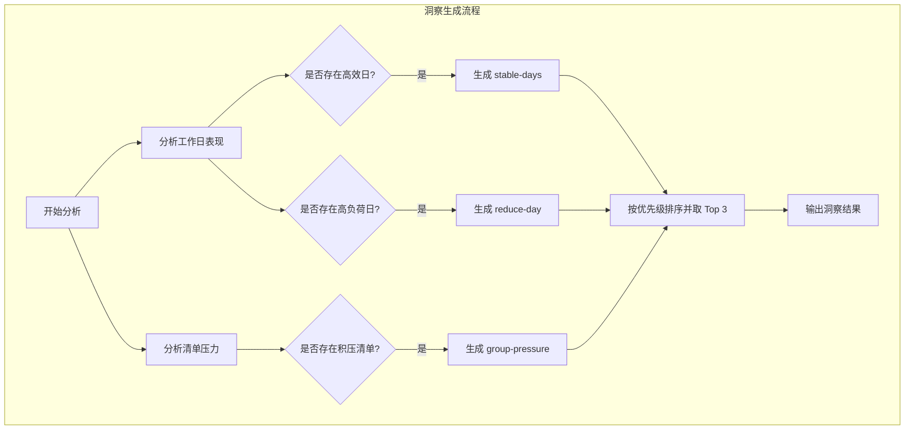

# 任务事件与统计回顾

## 目录
1. [模块概览](#模块概览)
2. [核心组件与数据模型](#核心组件与数据模型)
   - [TaskEvent 接口与事件类型](#taskevent-接口与事件类型)
   - [TaskAnalytics 接口与统计指标](#taskanalytics-接口与统计指标)
3. [事件流追踪机制](#事件流追踪机制)
   - [事件触发场景](#事件触发场景)
   - [状态派生与差异比较](#状态派生与差异比较)
4. [统计聚合算法](#统计聚合算法)
   - [状态回溯逻辑 (stateAt)](#状态回溯逻辑-stateat)
   - [完成率与趋势计算](#完成率与趋势计算)
5. [智能洞察系统](#智能洞察系统)
   - [洞察类型与触发逻辑](#洞察类型与触发逻辑)
6. [集成与持久化](#集成与持久化)
7. [测试策略](#测试策略)
8. [文件引用](#文件引用)

## 模块概览

LightFlux 的任务事件与统计模块是整个应用“回顾”功能的核心。它不仅仅记录任务的当前状态，还通过一套完整的事件溯源（Event Sourcing）机制记录了任务从创建到完成、修改、甚至删除的每一个关键节点。这种设计使得系统能够跨越时间维度，为用户提供深度的生产力分析和智能洞察。

在本次代码审计中，我们识别出以下核心文件：
- **总文件数**: 4 个核心逻辑文件及 2 个测试文件。
- **子目录**: 涉及 `store/`（数据存储与领域逻辑）和 `utils/`（通用分析工具）。
- **覆盖范围**: 深入覆盖了事件定义、事件追踪、统计聚合以及前端数据准备逻辑。

该模块的主要职责是将零散的用户操作（如点击完成、修改日期）转化为结构化的事件流，再通过复杂的聚合算法，将其提炼为直观的图表数据和文字洞察，最终呈现在应用的“统计”屏幕上。

## 核心组件与数据模型

### TaskEvent 接口与事件类型

`TaskEvent` 是系统记录行为的最小单位。它采用了一种类似于“分类账”的设计，记录了谁（`taskId`）、在什么时候（`occurredAt`）、做了什么（`type`）。

```typescript
export interface TaskEvent {
  id: string;
  taskId: string;
  type: TaskEventType;
  occurredAt: number;
  metadata?: TaskEventMetadata;
}

export type TaskEventType =
  | 'created'      // 任务创建
  | 'completed'    // 任务完成
  | 'reopened'     // 任务重新开启
  | 'rescheduled'  // 任务重排日期
  | 'trashed'      // 任务移入回收站
  | 'restored';    // 任务从回收站恢复
```

`metadata` 字段用于存储特定事件类型的附加信息。例如，当发生 `rescheduled` 事件时，它会记录 `previousScheduledDate` 和 `scheduledDate`，这对于分析用户的拖延模式或计划调整非常有用。

### TaskAnalytics 接口与统计指标

`TaskAnalytics` 是经过聚合后的数据结构，直接服务于 UI 层的图表组件。它不仅包含基础的计数（如 `completedCount`），还包含趋势（`trend`）、压力分布（`pressure`）和工作日表现（`weekdays`）。

```typescript
export interface TaskAnalytics {
  period: AnalyticsPeriod;
  completedCount: number;
  plannedCount: number;
  completionRate: number | null;
  completionRateDelta: number | null; // 与上一周期的完成率差异
  pendingDelta: number;              // 待办任务增量
  createdCount: number;
  currentOverdue: number;            // 当前逾期数
  highPriorityOverdue: number;       // 高优先级逾期数
  trend: TrendBucket[];              // 趋势图数据
  pressure: GroupPressure[];         // 任务压力分布
  weekdays: WeekdayRate[];           // 工作日表现分析
  insights: AnalyticsInsight[];      // 智能洞察
}
```

**Section sources**:
- [lightflux/store/taskEventDomain.ts](lightflux/store/taskEventDomain.ts)
- [lightflux/utils/taskAnalytics.ts](lightflux/utils/taskAnalytics.ts)

## 事件流追踪机制

### 事件触发场景

事件的产生是自动且透明的。当用户在 `todoStore` 中执行操作时，相应的领域函数会生成事件并追加到 `taskEvents` 数组中。

下面的状态机图展示了一个任务在其生命周期内可能触发的事件流向：



**图表说明**:
该状态图描述了任务从诞生到消亡的过程中，`TaskEvent` 系统是如何捕捉状态变迁的。每一个箭头代表一个用户动作，同时对应一个事件类型的产生。值得注意的是，当任务被永久删除时，系统会清理所有关联的 `taskEvents` 以节省空间并保护隐私，这在 `todoStore.deleteTodoPermanently` 中实现。

### 状态派生与差异比较

在某些复杂场景下（如批量恢复任务），手动逐个创建事件非常繁琐且易错。`taskEventDomain.ts` 提供了 `deriveTaskEventsFromTodoDiff` 工具函数，通过对比操作前后的任务列表快照，自动计算出期间发生的变更。

```typescript
export const deriveTaskEventsFromTodoDiff = (
  beforeTodos: Todo[],
  afterTodos: Todo[],
  timestamp: number,
): TaskEvent[] => {
  // ... 通过 Map 对比 before 和 after 的差异
  // 识别出：新增(created)、完成状态变更(completed/reopened)、日期变更(rescheduled)、回收站状态变更(trashed/restored)
};
```

这种“快照对比”模式确保了即使在复杂的批量操作中，事件流的完整性也能得到保障。

**Section sources**:
- [lightflux/store/taskEventDomain.ts:L60-L110](lightflux/store/taskEventDomain.ts#L60-L110)
- [lightflux/store/todoStore.tsx:L227-L340](lightflux/store/todoStore.tsx#L227-L340)

## 统计聚合算法

### 状态回溯逻辑 (stateAt)

统计分析面临的最大挑战是：如何知道一周前某个任务的状态？`taskAnalytics.ts` 通过 `stateAt` 函数解决了这个问题。它通过回放（Replay）截止到指定时间戳的所有事件，重建当时的任务状态。



**图表说明**:
`stateAt` 算法是统计模块的灵魂。它不依赖于数据库在过去某个时刻的备份，而是利用事件流的不可变性，动态地推导出历史上任何时刻的系统状态。这使得我们可以计算出“上周一有多少个逾期任务”这种即时查询无法回答的问题。

### 完成率与趋势计算

完成率的计算并非简单的 `已完成 / 总数`。LightFlux 采用了更为严谨的“计划内完成率”模型：
1. **确定范围**: 找出所有在统计周期内“计划执行”的任务（基于 `scheduledDate`）。
2. **状态验证**: 使用 `stateAt` 确保这些任务在统计周期结束时确实处于已完成状态。
3. **公式**: `完成率 = (周期内计划且已完成的任务数 / 周期内计划的任务总数) * 100%`。

趋势分析（`TrendBucket`）则将统计周期划分为若干个桶（如 7 天划分为 7 个桶，30 天划分为 5 个桶），计算每个桶内的计划数与完成数，为前端提供平滑的折线图数据。

**Section sources**:
- [lightflux/utils/taskAnalytics.ts:L153-L200](lightflux/utils/taskAnalytics.ts#L153-L200)
- [lightflux/utils/taskAnalytics.ts:L214-L238](lightflux/utils/taskAnalytics.ts#L214-L238)

## 智能洞察系统

智能洞察（Insights）是 LightFlux 的特色功能。它通过算法分析用户的历史数据，自动生成具有指导意义的建议。

### 洞察类型与触发逻辑

系统目前支持四种类型的洞察，通过 `makeInsights` 函数进行评估：

| 洞察类型 | 触发条件 | 业务价值 |
| :--- | :--- | :--- |
| `stable-days` | 某些工作日的完成率明显高于平均水平（+5%以上） | 帮助用户识别自己的“高效时段” |
| `group-pressure` | 某个清单（Group）积压了大量待办或逾期任务 | 提醒用户关注可能的项目瓶颈 |
| `reduce-day` | 某些工作日的计划量远超实际完成能力 | 建议用户在特定日子减少排程，避免挫败感 |
| `building-history` | 历史数据不足时触发 | 鼓励用户继续记录，建立数据积累 |



**图表说明**:
洞察引擎是一个并行的评估过程。它同时扫描多个维度的统计数据，识别出异常或突出的模式。最后通过一个过滤层，确保用户看到的建议是最新且最相关的，避免信息过载。

**Section sources**:
- [lightflux/utils/taskAnalytics.ts:L378-L434](lightflux/utils/taskAnalytics.ts#L378-L434)

## 集成与持久化

统计模块深度集成在 `useTodoStore` 中。为了保证性能，统计数据的重新计算是按需进行的（通常在进入统计页面时），但事件的记录是实时的。

1. **实时记录**: 所有的任务操作方法（如 `toggleTodo`）都会立即产生一个新的 `TaskEvent`。
2. **异步持久化**: `TodoProvider` 监听 `taskEvents` 的变化，并通过一个 180ms 的防抖（Debounce）机制将数据保存到本地存储。
3. **数据迁移**: 对于从旧版本升级的用户，`migrateTaskEvents` 会根据任务的 `createdAt` 和 `completedAt` 自动生成初始事件流，确保统计功能的连续性。

**Section sources**:
- [lightflux/store/todoStore.tsx:L765-L790](lightflux/store/todoStore.tsx#L765-L790)
- [lightflux/store/taskEventDomain.ts:L24-L58](lightflux/store/taskEventDomain.ts#L24-L58)

## 测试策略

该模块拥有极高的测试覆盖率，确保了核心算法的准确性。

- **领域逻辑测试 (`taskEventDomain.test.ts`)**: 验证事件产生的正确性，特别是 `deriveTaskEventsFromTodoDiff` 在各种边界条件下的表现。
- **分析算法测试 (`taskAnalytics.test.ts`)**: 模拟复杂的时间线和事件流，验证完成率计算、逾期统计以及 `estimated` 标志（当统计范围超出事件记录起点时标记为估算）的准确性。

```typescript
it('calculates completion, pending change, pressure, and overdue tasks', () => {
  // 模拟一系列跨越不同日期的创建、完成、删除事件
  // 验证 buildTaskAnalytics 输出的各项指标是否符合预期
});
```

**Section sources**:
- [lightflux/tests/taskEventDomain.test.ts](lightflux/tests/taskEventDomain.test.ts)
- [lightflux/tests/taskAnalytics.test.ts](lightflux/tests/taskAnalytics.test.ts)

## 文件引用

以下是本模块涉及的核心源文件：

- [lightflux/store/taskEventDomain.ts](lightflux/store/taskEventDomain.ts) - 事件模型定义与派生逻辑
- [lightflux/utils/taskAnalytics.ts](lightflux/utils/taskAnalytics.ts) - 统计聚合与洞察引擎
- [lightflux/store/todoStore.tsx](lightflux/store/todoStore.tsx) - 事件触发与持久化集成
- [lightflux/types/todo.ts](lightflux/types/todo.ts) - 基础类型定义
- [lightflux/tests/taskEventDomain.test.ts](lightflux/tests/taskEventDomain.test.ts) - 领域逻辑单元测试
- [lightflux/tests/taskAnalytics.test.ts](lightflux/tests/taskAnalytics.test.ts) - 分析算法集成测试
